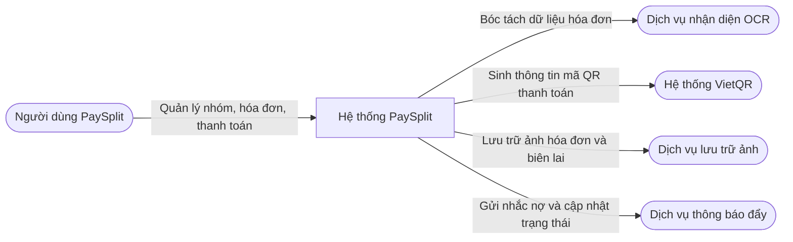
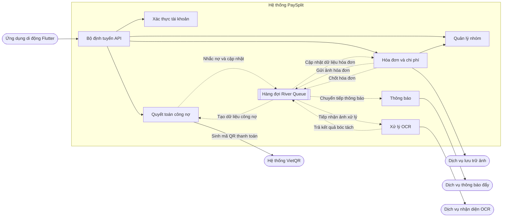
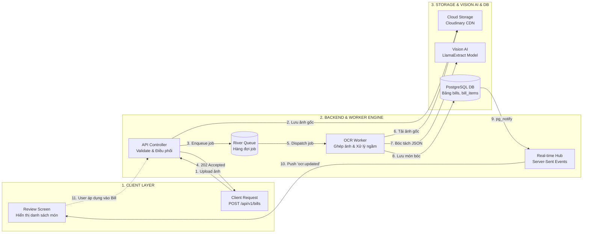
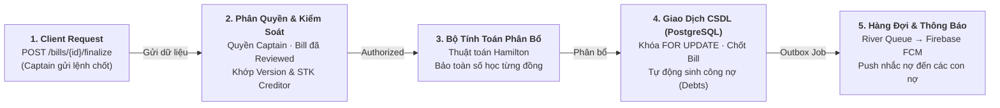
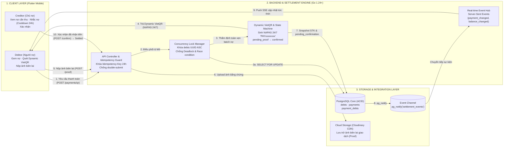
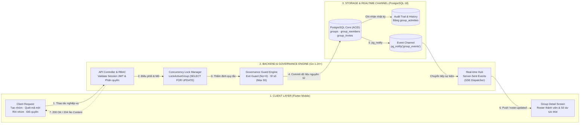

# **PAYSPLIT - HỆ THỐNG CHIA HÓA ĐƠN NHÓM VÀ NHẮC NỢ THÔNG MINH**

## **BÁO CÁO KẾT QUẢ THỬ VIỆC**

| Thông tin Dự án | Chi tiết |
| :--- | :--- |
| **Dự án** | PaySplit – Hệ thống chia hóa đơn nhóm và nhắc nợ thông minh |
| **Thành viên nhóm** | Phạm Lê Hoàng Nam<br>Phạm Thanh Lam<br>Nguyễn Trọng Tín |
| **Mentor** | Trần Quang Hiển (VSF-FINTECH-VDTDVTC)<br>Bành Quốc Danh (VSF-FINTECH&TT-PTPM)<br>Phan Công Huân (VSF-FINTECH-VDTDVTC)<br>Nguyễn Mạnh Tể (VSF-FINTECH&TT-PTPM)<br>Nguyễn Nam Trường (VSF-FINTECH-VDTDVTC) |

---

## **Mục lục**

- [I. TỔNG QUAN BÀI TOÁN](#i-tổng-quan-bài-toán)
  - [1. Bối cảnh bài toán](#1-bối-cảnh-bài-toán)
  - [2. Mục tiêu sản phẩm](#2-mục-tiêu-sản-phẩm)
  - [3. Phạm vi chức năng](#3-phạm-vi-chức-năng)
- [II. KIẾN TRÚC HỆ THỐNG](#ii-kiến-trúc-hệ-thống)
  - [1. Mô hình tổng thể](#1-mô-hình-tổng-thể)
    - [Sơ đồ ngữ cảnh hệ thống](#sơ-đồ-ngữ-cảnh-hệ-thống)
    - [Sơ đồ phân vùng kiến trúc](#sơ-đồ-phân-vùng-kiến-trúc)
    - [Chi tiết phân hệ nhận diện hóa đơn](#chi-tiết-phân-hệ-nhận-diện-hóa-đơn)
    - [Chi tiết phân hệ phân bổ chi phí](#chi-tiết-phân-hệ-phân-bổ-chi-phí)
    - [Chi tiết phân hệ quyết toán công nợ](#chi-tiết-phân-hệ-quyết-toán-công-nợ)
    - [Chi tiết phân hệ quản lý nhóm](#chi-tiết-phân-hệ-quản-lý-nhóm)
  - [2. Kiến trúc mã nguồn](#2-kiến-trúc-mã-nguồn)
  - [3. Giải pháp kỹ thuật trọng yếu](#3-giải-pháp-kỹ-thuật-trọng-yếu)
  - [4. Hạ tầng công nghệ](#4-hạ-tầng-công-nghệ)
- [III. TIẾN ĐỘ TRIỂN KHAI](#iii-tiến-độ-triển-khai)
  - [1. Phân kỳ triển khai](#1-phân-kỳ-triển-khai)
  - [2. Nhật ký tiến độ](#2-nhật-ký-tiến-độ)
  - [3. Đánh giá hoàn thành](#3-đánh-giá-hoàn-thành)
- [IV. KẾT QUẢ NGHIỆM THU](#iv-kết-quả-nghiệm-thu)
  - [1. Mức độ hoàn thành chức năng](#1-mức-độ-hoàn-thành-chức-năng)
  - [2. Kịch bản nghiệm thu thực tế](#2-kịch-bản-nghiệm-thu-thực-tế)
  - [3. Kiểm thử tự động](#3-kiểm-thử-tự-động)
  - [4. Đánh giá chất lượng phi chức năng](#4-đánh-giá-chất-lượng-phi-chức-năng)
- [V. ĐÓNG GÓP TỪNG THÀNH VIÊN](#v-đóng-góp-từng-thành-viên)
  - [1. Đóng góp chung](#1-đóng-góp-chung)
  - [2. Chi tiết đóng góp từng thành viên](#2-chi-tiết-đóng-góp-từng-thành-viên)
    - [Phạm Lê Hoàng Nam](#phạm-lê-hoàng-nam)
    - [Nguyễn Trọng Tín](#nguyễn-trọng-tín)
    - [Phạm Thanh Lam](#phạm-thanh-lam)
- [VI. KẾT LUẬN](#vi-kết-luận)
  - [1. Tổng kết kết quả đạt được](#1-tổng-kết-kết-quả-đạt-được)
  - [2. Bài học kinh nghiệm trong quá trình phát triển](#2-bài-học-kinh-nghiệm-trong-quá-trình-phát-triển)
  - [3. Định hướng phát triển tiếp theo](#3-định-hướng-phát-triển-tiếp-theo)

---

# I. TỔNG QUAN BÀI TOÁN <a id="i-tổng-quan-bài-toán"></a>

### 1. Bối cảnh bài toán <a id="1-bối-cảnh-bài-toán"></a>
Trong các hoạt động sinh hoạt nhóm như ăn uống, du lịch hay sự kiện tập thể, việc chia tiền và tất toán công nợ thường gặp nhiều bất cập do hóa đơn thực tế có cấu trúc phức tạp gồm nhiều mức thuế, phí dịch vụ và các khoản giảm giá hỗn hợp, dễ dẫn đến sai lệch tiền bạc khi tính toán thủ công. Bên cạnh đó, việc đòi nợ trực tiếp thường tạo tâm lý e ngại, quy trình chuyển khoản rời rạc qua việc gõ số tài khoản thủ công dễ gây nhầm lẫn và thiếu công cụ theo dõi minh bạch xem ai đã thanh toán, ai còn nợ. Để giải quyết các bất cập này, PaySplit được xây dựng như một hệ thống điều phối thanh toán ngang hàng không lưu ký, đóng vai trò trợ lý số hóa giúp tự động tính toán chính xác, hỗ trợ chuyển khoản trực tiếp qua mã VietQR và nhắc nợ văn minh mà không can thiệp hay giữ tiền của người dùng.

### 2. Mục tiêu sản phẩm <a id="2-mục-tiêu-sản-phẩm"></a>
PaySplit hướng đến hỗ trợ giải quyết bài toán chi tiêu nhóm thông qua 4 giá trị cốt lõi:
1. **Số hóa hóa đơn tự động:** Người dùng chỉ cần chụp hoặc tải lên nhiều ảnh hóa đơn cùng lúc, hệ thống tự động đọc và nhận diện đầy đủ tên món, số lượng, đơn giá, tiền thuế cùng các khoản giảm giá mà không cần nhập liệu thủ công.
2. **Chia tiền công bằng và chuẩn xác:** Hỗ trợ linh hoạt chia tiền theo từng món, theo phần ăn hoặc theo tỉ lệ; tự động phân bổ tiền thuế và giảm giá đến từng người, đảm bảo tổng tiền của các thành viên luôn khớp chính xác từng đồng với hóa đơn gốc, không xảy ra lệch tiền làm tròn.
3. **Thanh toán một chạm:** Tự động tổng hợp toàn bộ các khoản nợ giữa hai người thành một mã VietQR duy nhất, điền sẵn chính xác số tiền cần trả và nội dung chuyển khoản để người dùng quét và thanh toán ngay trên ứng dụng ngân hàng.
4. **Đối soát minh bạch và nhắc nợ thông minh:** Cho phép người trả nộp ảnh biên lai chuyển khoản để chủ nợ xác nhận hoàn tất; trạng thái thanh toán được cập nhật ngay lập tức cho cả nhóm và hệ thống tự động gửi thông báo nhắc nợ lịch sự, tránh cảm giác ngại ngùng khi đòi tiền.

### 3. Phạm vi chức năng <a id="3-phạm-vi-chức-năng"></a>

| Phân hệ | Chức năng chính |
| :--- | :--- |
| **Xác thực tài khoản** | Đăng ký tài khoản kèm xác minh mã OTP qua email; quản lý duy nhất một phiên trên mỗi thiết bị; cơ chế xác thực với Access Token 15 phút và Refresh Token 7 ngày có tính năng phát hiện tái sử dụng trái phép; quản lý hồ sơ cá nhân và cấu hình tài khoản nhận tiền VietQR. |
| **Quản lý nhóm** | Khởi tạo nhóm, chuyển nhượng vai trò Trưởng nhóm; mời thành viên tham gia qua liên kết động và mã QR; ma trận theo dõi công nợ nội bộ nhóm; tính năng khóa hoặc mở nhận hóa đơn mới của nhóm. |
| **Hóa đơn OCR** | Tiếp nhận hóa đơn thủ công hoặc qua ảnh chụp; luồng xử lý OCR bất đồng bộ có mã theo dõi tiến trình; giao diện rà soát và chỉnh sửa kết quả OCR hỗ trợ nhiều mức VAT, chiết khấu, phí dịch vụ; cơ chế khóa chỉnh sửa khi hóa đơn đã duyệt. |
| **Phân bổ chi phí** | Gán người dùng vào món ăn theo tỉ lệ linh hoạt (theo phần, phần trăm hoặc số lượng); thuật toán phân bổ Hamilton xử lý làm tròn không phát sinh số dư; chốt hóa đơn an toàn trong giao dịch cơ sở dữ liệu; hỗ trợ chốt sổ hàng loạt cả nhóm có kiểm tra xung đột dữ liệu. |
| **Quyết toán công nợ** | Gộp nợ và sinh mã VietQR động; nộp ảnh biên lai và quy trình duyệt đối soát hai bước; kênh truyền phát dữ liệu thời gian thực SSE kết hợp cơ chế đồng bộ bù lịch sử; trang Web Admin nhúng trực tiếp trong backend để tra cứu người dùng, nhật ký kiểm toán và giám sát hệ thống. |

---

# II. KIẾN TRÚC HỆ THỐNG <a id="ii-kiến-trúc-hệ-thống"></a>

### 1. Mô hình tổng thể <a id="1-mô-hình-tổng-thể"></a>
Hệ thống được thiết kế theo mô hình khối dịch vụ tập trung, phân tách rõ ràng ranh giới nghiệp vụ và các kênh tích hợp bên ngoài.

#### Sơ đồ ngữ cảnh hệ thống <a id="sơ-đồ-ngữ-cảnh-hệ-thống"></a>
Mô tả tương tác tổng quan giữa người dùng, hệ thống PaySplit và các dịch vụ tích hợp bên ngoài:



#### Sơ đồ phân vùng kiến trúc <a id="sơ-đồ-phân-vùng-kiến-trúc"></a>
Mô tả chi tiết các phân hệ bên trong hệ thống cùng các luồng đồng bộ trực tiếp và luồng xử lý sự kiện bất đồng bộ qua hàng đợi:



*Quy ước kết nối:*
- Mũi tên nét liền: Các yêu cầu xử lý đồng bộ trực tiếp giữa các phân hệ hoặc tới các dịch vụ bên ngoài.
- Mũi tên nét đứt: Các sự kiện bất đồng bộ được điều phối qua hàng đợi River Queue.

Trong mô hình trên:
- **Ứng dụng di động:** Đảm nhiệm thu thập hình ảnh hóa đơn, hiển thị dữ liệu chi tiêu và tiếp nhận tương tác của người dùng. Mọi giao tiếp với hệ thống đều đi qua giao thức bảo mật HTTPS và duy trì một luồng sự kiện thời gian thực duy nhất cho mỗi phiên đăng nhập.
- **Backend:** Đóng vai trò cổng điều phối trung tâm, chịu trách nhiệm xác thực người dùng, tính toán số liệu tài chính, quản lý hàng đợi tác vụ nền và phát dữ liệu tức thời.
- **Cơ sở dữ liệu:** Đóng vai trò nền tảng hợp nhất, vừa lưu trữ dữ liệu nghiệp vụ có cấu trúc, vừa vận hành hàng đợi xử lý tác vụ nền và quản lý kênh truyền tín hiệu sự kiện nội bộ.

#### Chi tiết phân hệ nhận diện hóa đơn <a id="chi-tiết-phân-hệ-nhận-diện-hóa-đơn"></a>
Phân hệ OCR được thiết kế theo kiến trúc xử lý ngầm bất đồng bộ kết hợp giữa hàng đợi tác vụ River Queue và mô hình thị giác trí tuệ nhân tạo, giải phóng luồng xử lý giao diện của ứng dụng di động:



- **Quy trình vận hành:**
  - Thiết bị người dùng nén ảnh và gửi yêu cầu tạo hóa đơn (`POST /api/v1/bills`). Bộ điều phối API xác thực dữ liệu, tải ảnh gốc lên Cloud Storage và đưa tác vụ vào hàng đợi River Queue trong cùng một giao dịch cơ sở dữ liệu.
  - API phản hồi ngay trạng thái `202 Accepted` kèm mã theo dõi để ứng dụng di động không bị nghẽn mạng.
  - Tiến trình OCR Worker nhận tác vụ từ hàng đợi, tải ảnh gốc từ bộ lưu trữ đám mây và gọi mô hình Vision AI (LlamaExtract) để trích xuất cấu trúc dữ liệu JSON gồm tên món, số lượng, đơn giá và thuế phí.
  - Dữ liệu bóc tách được lưu vào các bảng cơ sở dữ liệu `bills` và `bill_items`. Tín hiệu `pg_notify` kích hoạt Real-time Hub truyền thông điệp `ocr.updated` qua Server-Sent Events để hiển thị danh sách món lên màn hình Review Screen.

#### Chi tiết phân hệ phân bổ chi phí <a id="chi-tiết-phân-hệ-phân-bổ-chi-phí"></a>
Quy trình chốt hóa đơn và phân bổ chi tiêu được tổ chức theo đường ống xử lý tuần tự 5 chặng, bảo đảm tính toàn vẹn dữ liệu tài chính và xử lý làm tròn không phát sinh số dư:



- **Quy trình vận hành:**
  - **1. Client Request:** Trưởng nhóm gửi lệnh chốt hóa đơn qua điểm cuối `POST /bills/{id}/finalize`.
  - **2. Phân quyền và kiểm soát:** Hệ thống kiểm tra vai trò Trưởng nhóm, trạng thái hóa đơn đã được rà soát (Reviewed), tính hợp lệ của số tài khoản nhận tiền và số phiên bản dữ liệu.
  - **3. Bộ tính toán phân bổ:** Áp dụng thuật toán phân bổ Hamilton trên tập số hữu tỉ để phân chia chi phí món ăn, thuế VAT, phí dịch vụ và chiết khấu, bảo đảm tổng số tiền chia cho các thành viên khớp với hóa đơn gốc.
  - **4. Giao dịch cơ sở dữ liệu:** Mở giao dịch ACID với khóa dòng `FOR UPDATE`, chuyển trạng thái hóa đơn sang đã chốt và tự động sinh các bản ghi nghĩa vụ công nợ (`debts`).
  - **5. Hàng đợi và thông báo:** Tạo công việc thông báo theo mô hình Outbox Pattern qua hàng đợi River Queue, gửi thông báo đẩy Firebase FCM đến từng người liên quan để thông báo về khoản nợ mới.

#### Chi tiết phân hệ quyết toán công nợ <a id="chi-tiết-phân-hệ-quyết-toán-công-nợ"></a>
Phân hệ quyết toán công nợ tích hợp chặt chẽ giữa ứng dụng di động, động cơ đối soát phía máy chủ và hạ tầng thanh toán ngân hàng qua mã VietQR động:



- **Quy trình vận hành:**
  - Người nợ yêu cầu thanh toán (`POST /payments/qr`). Bộ điều phối API kích hoạt khóa bảo vệ chống gửi lặp trong 24 giờ.
  - Quản lý khóa đồng thời thực hiện khóa các dòng công nợ theo thứ tự mã định danh tăng dần (`UUID ASC`) bằng truy vấn `SELECT FOR UPDATE` để chống xung đột và khóa chết dữ liệu.
  - Động cơ sinh mã VietQR động chuẩn NAPAS 24/7 với nội dung định danh giao dịch duy nhất và trả về ứng dụng di động để người nợ quét mã chuyển tiền qua ứng dụng ngân hàng.
  - Người nợ tải ảnh biên lai chuyển tiền (`POST /proof`), ảnh được lưu trữ an toàn trên Cloud Storage và trạng thái giao dịch chuyển sang chờ xác nhận.
  - Tín hiệu `pg_notify` gửi thông báo về Real-time Event Hub để cập nhật trạng thái qua SSE. Chủ nợ mở màn hình đối soát và nhấn xác nhận (`POST /confirm`), hệ thống cập nhật gạch nợ và đồng bộ biến động số dư cho các bên liên quan.

#### Chi tiết phân hệ quản lý nhóm <a id="chi-tiết-phân-hệ-quản-lý-nhóm"></a>
Phân hệ quản trị nhóm bảo đảm tính nhất quán của danh sách thành viên và phân quyền điều hành thông qua cơ chế khóa dòng và kiểm soát phiên bản danh sách tuần tự:



- **Quy trình vận hành:**
  - Người dùng thực hiện các thao tác quản lý nhóm như tạo nhóm, tham gia qua mã mời Base62, rời nhóm hoặc chuyển giao quyền Trưởng nhóm.
  - Máy chủ kiểm tra phiên làm việc JWT và quyền hạn tương ứng (`RBAC`), sau đó thực hiện khóa dòng nhóm bằng hàm `LockActiveGroup` với mệnh đề `SELECT FOR UPDATE` để ngăn chặn tranh chấp khi nhiều người thao tác cùng lúc.
  - Bộ kiểm soát nghiệp vụ (Governance Guard Engine) kiểm tra các quy tắc an toàn: chặn rời nhóm nếu còn công nợ chưa quyết toán và giới hạn sĩ số tối đa của nhóm.
  - Dữ liệu được ghi nhận nguyên tử vào cơ sở dữ liệu, đồng thời ghi lại nhật ký kiểm toán trong bảng `group_activities` và tăng số phiên bản danh sách (`roster_version`).
  - Kênh sự kiện nội bộ `pg_notify` kích hoạt Real-time Hub phát sự kiện `roster.updated` qua luồng SSE để cập nhật tức thời danh sách thành viên và số dư trên màn hình Group Detail Screen.

### 2. Kiến trúc mã nguồn <a id="2-kiến-trúc-mã-nguồn"></a>
Mã nguồn của hệ thống được tổ chức nhất quán theo nguyên tắc phân tách trách nhiệm độc lập:

- **Backend phân tầng theo nghiệp vụ:** Áp dụng mô hình khối độc lập theo từng phân hệ. Mỗi phân hệ nghiệp vụ gồm bốn lớp riêng biệt, giúp tầng nghiệp vụ không phụ thuộc trực tiếp vào framework web hay thư viện cơ sở dữ liệu, thuận tiện cho việc kiểm thử tự động:
  ```text
  internal/modules/group/
  ├── delivery/http/        # Tiếp nhận yêu cầu HTTP, kiểm tra dữ liệu đầu vào
  ├── usecase/              # Chứa toàn bộ logic xử lý nghiệp vụ
  ├── domain/               # Định nghĩa thực thể nghiệp vụ và lỗi chuẩn
  └── repository/           # Khai báo cổng giao tiếp dữ liệu (interface)
      └── postgres/         # Triển khai truy vấn cơ sở dữ liệu bằng sqlc
  ```

- **Ứng dụng di động hướng tính năng:** Toàn bộ mã nguồn phía máy khách được phân chia theo từng tính năng cụ thể. Mỗi tính năng được phân rã thành ba lớp: dữ liệu, nghiệp vụ và giao diện. Tầng giao diện chỉ tương tác thông qua các đối tượng nghiệp vụ thuần túy, không xử lý trực tiếp các lời gọi mạng:
  ```text
  lib/features/bills/
  ├── domain/               # Thực thể nghiệp vụ, cổng giao tiếp và các ca sử dụng
  ├── data/                 # Triển khai lưu trữ, mô hình dữ liệu và gọi API Retrofit
  └── presentation/         # Quản lý trạng thái bằng Riverpod, màn hình và giao diện
  ```

- **Chuẩn hóa giao tiếp:** Toàn bộ giao diện lập trình ứng dụng được định nghĩa trước theo chuẩn OpenAPI 3.0 nhằm chốt hợp đồng dữ liệu giữa hai phía trước khi triển khai mã nguồn. Dữ liệu phản hồi được chuẩn hóa chung một cấu trúc bao đóng cho cả trường hợp thành công và báo lỗi:
  ```json
  // Phản hồi thành công:
  {
    "success": true,
    "data": { ... },
    "message": "Thành công"
  }

  // Phản hồi báo lỗi:
  {
    "success": false,
    "error": {
      "code": "VALIDATION_ERROR",
      "message": "Dữ liệu không hợp lệ",
      "details": { ... }
    }
  }
  ```

### 3. Giải pháp kỹ thuật trọng yếu <a id="3-giải-pháp-kỹ-thuật-trọng-yếu"></a>
Quá trình xây dựng hệ thống tập trung giải quyết bốn bài toán kỹ thuật cốt lõi:

| Bài toán kỹ thuật | Giải pháp triển khai |
| :--- | :--- |
| **Chia tiền lệch số lẻ khi có thuế và giảm giá** | Áp dụng thuật toán phân bổ Hamilton trên tập số hữu tỉ, đảm bảo tổng tiền chia cho từng người luôn khớp chính xác từng đồng so với hóa đơn gốc mà không phát sinh sai số làm tròn. |
| **Xử lý bóc tách hóa đơn nặng và chậm** | Xây dựng luồng xử lý bất đồng bộ qua hàng đợi River Queue tích hợp ngay trong PostgreSQL; API phản hồi ngay lập tức kèm mã theo dõi tiến trình để người dùng không phải chờ đợi. |
| **Tối ưu tài nguyên kết nối thời gian thực** | Toàn bộ hệ thống dùng chung một kết nối cơ sở dữ liệu duy nhất để lắng nghe sự kiện, truyền phát dữ liệu về ứng dụng qua một luồng sự kiện cho mỗi người dùng và có cơ chế đồng bộ bù dữ liệu khi mất mạng. |
| **An toàn giao dịch đồng thời** | Áp dụng mã định danh giao dịch để ngăn ngừa gửi trùng lặp yêu cầu, kết hợp cơ chế kiểm soát phiên làm việc duy nhất và khóa trạng thái hóa đơn khi chốt sổ để chống xung đột dữ liệu. |

### 4. Hạ tầng công nghệ <a id="4-hạ-tầng-công-nghệ"></a>
Toàn bộ hệ thống được triển khai thực tế trên môi trường máy chủ đám mây:
- **Backend:** Ngôn ngữ Go phiên bản 1.24, bộ định tuyến Chi, thư viện truy xuất pgx, công cụ sinh mã truy vấn sqlc, công cụ quản lý phiên bản cơ sở dữ liệu Goose và hàng đợi River Queue.
- **Ứng dụng di động:** Nền tảng Flutter, thư viện quản lý trạng thái Riverpod, thư viện kết nối mạng Retrofit và Dio.
- **Cơ sở dữ liệu:** PostgreSQL phiên bản 18 phục vụ đồng thời lưu trữ dữ liệu, quản lý hàng đợi và phát thông điệp sự kiện.
- **Môi trường vận hành:** Đóng gói bằng Docker Compose, triển khai trên máy chủ đám mây Oracle Cloud kiến trúc ARM64, sử dụng máy chủ web Caddy tự động cấp phát và gia hạn chứng chỉ bảo mật HTTPS.

---

# III. TIẾN ĐỘ TRIỂN KHAI <a id="iii-tiến-độ-triển-khai"></a>

### 1. Phân kỳ triển khai <a id="1-phân-kỳ-triển-khai"></a>
Dự án được triển khai trong khoảng thời gian từ ngày 30/07/2026 đến ngày 07/09/2026 (gần 6 tuần làm việc), chia thành 5 giai đoạn liên tiếp:

| Giai đoạn | Thời gian | Trọng tâm công việc | Kết quả đầu ra |
| :--- | :--- | :--- | :--- |
| **Giai đoạn 1** | 30/07 – 05/08/2026 | Khảo sát nhu cầu, tìm kiếm ý tưởng và lựa chọn đề tài | Thống nhất bài toán chia tiền nhóm không lưu ký với Mentor |
| **Giai đoạn 2** | 06/08 – 13/08/2026 | Đặc tả tài liệu yêu cầu, thiết kế cơ sở dữ liệu và dựng khung dự án | Hoàn thành tài liệu yêu cầu, kịch bản cơ sở dữ liệu và khung mã nguồn |
| **Giai đoạn 3** | 14/08 – 25/08/2026 | Phát triển các phân hệ nghiệp vụ cốt lõi trên cả hai nền tảng | Hoàn thành xác thực người dùng, quản lý nhóm và luồng chụp hóa đơn |
| **Giai đoạn 4** | 26/08 – 03/09/2026 | Tối ưu thuật toán chia tiền, cổng quản trị và kết nối thời gian thực | Hoàn thiện thuật toán Hamilton, trang Web Admin và tối ưu kết nối dữ liệu |
| **Giai đoạn 5** | 04/09 – 07/09/2026 | Kiểm thử hệ thống, đóng gói hạ tầng đám mây và chuẩn bị demo | Triển khai thực tế trên máy chủ đám mây, thực hiện buổi demo sản phẩm vào ngày 07/09/2026 |

### 2. Nhật ký tiến độ <a id="2-nhật-ký-tiến-độ"></a>
Tiến độ chi tiết được tổng hợp trực tiếp từ lịch sử phát triển thực tế của dự án:

- **Giai đoạn 1 (30/07 – 05/08/2026): Lựa chọn đề tài**
  - *Tài liệu:* Khảo sát các ý tưởng đề tài (sàn thương mại dịch vụ số, đặt lịch đánh giá, chia tiền nhóm). Nhận diện các bất cập lớn trong chia tiền thủ công: sai số làm tròn khi hóa đơn có thuế phí và rào cản tâm lý khi đòi nợ. Đề xuất xây dựng PaySplit với định vị là giải pháp điều phối thanh toán ngang hàng không lưu ký vốn, được Mentor phê duyệt.
  - *Backend:* Khởi tạo dự án Go vào ngày 05/08/2026.
  - *Frontend:* Khởi tạo dự án Flutter vào ngày 05/08/2026.
- **Giai đoạn 2 (06/08 – 13/08/2026): Thiết lập nền tảng**
  - *Tài liệu:* Soạn thảo tài liệu yêu cầu sản phẩm chi tiết; thiết kế lược đồ cơ sở dữ liệu quan hệ với các bảng nhóm, thành viên, hóa đơn, món ăn và cơ chế gộp nợ thanh toán.
  - *Backend:* Khởi tạo khung dự án Go theo kiến trúc phân tầng sạch; xây dựng hệ thống nạp cấu hình môi trường, bộ định tuyến HTTP, xử lý phân trang và cấu trúc phản hồi lỗi chuẩn.
  - *Frontend:* Khởi tạo dự án Flutter theo cấu trúc phân tầng sạch kết hợp tổ chức theo tính năng; dựng khung giao diện bảng điều khiển số dư và luồng xác thực ban đầu.
- **Giai đoạn 3 (14/08 – 25/08/2026): Phát triển tính năng cốt lõi**
  - *Backend:* Triển khai hệ thống bảo vệ với lớp kiểm soát tốc độ gửi yêu cầu và nguồn gốc truy cập; hoàn thiện cơ chế xác thực kép kèm tính năng phát hiện sử dụng lại phiên đăng nhập; phát triển nghiệp vụ quản lý nhóm, mã mời liên kết động và mã QR; tích hợp pipeline nhận diện hóa đơn bất đồng bộ qua hàng đợi.
  - *Frontend:* Hoàn thiện trọn bộ giao diện người dùng gồm Đăng nhập, Đăng ký, nhập mã OTP, Bảng điều khiển trang chủ, Hồ sơ cá nhân, Chụp ảnh hóa đơn, Rà soát và phân bổ món ăn; tích hợp nhận thông báo đẩy qua Firebase.
  - *Tài liệu:* Khởi tạo tài liệu thiết kế kỹ thuật, hoàn thiện các luồng nghiệp vụ và chốt phạm vi chức năng bàn giao.
- **Giai đoạn 4 (26/08 – 03/09/2026): Tối ưu hóa và tích hợp hệ thống**
  - *Backend:* Tối ưu hóa thuật toán phân bổ chi phí Hamilton trên tập số hữu tỉ, xử lý chính xác phần tiền lẻ làm tròn đối với hóa đơn có thuế và giảm giá; bổ sung tính năng Trưởng nhóm khóa nhận hóa đơn mới để chốt sổ hàng loạt; phát triển cổng Web Admin nhúng trực tiếp trong backend với giao diện theo dõi số liệu và nhật ký kiểm toán; tối ưu hóa kết nối cơ sở dữ liệu cho các sự kiện thời gian thực.
  - *Frontend:* Tích hợp lớp bao đóng dữ liệu phản hồi, kết nối màn hình nhóm với API thực tế, xây dựng giao diện thanh toán và tìm kiếm nhóm.
- **Giai đoạn 5 (04/09 – 07/09/2026): Hoàn thiện và demo**
  - *Backend:* Hoàn thiện luồng truyền phát sự kiện thời gian thực theo từng người dùng; đóng gói toàn bộ hệ thống bằng Docker Compose và triển khai lên máy chủ đám mây Oracle Cloud với máy chủ web Caddy quản lý chứng chỉ bảo mật; dọn dẹp các tác vụ nhận diện hóa đơn bị kẹt.
  - *Frontend:* Rà soát và khắc phục các vấn đề tiềm ẩn về gửi trùng lặp yêu cầu mạng, chuyển đổi mã định danh giao dịch sang chuẩn duy nhất để chống gửi lặp biên lai chuyển khoản; hoàn thiện đồng bộ thời gian thực và kiểm thử trên thiết bị thật.
  - *Tài liệu:* Đồng bộ tài liệu thiết kế kỹ thuật, cập nhật tài liệu luồng chi tiết, xây dựng bộ dữ liệu 12 hóa đơn kiểm thử mẫu, hoàn thiện slide thuyết trình và thực hiện buổi demo chính thức vào ngày 07/09/2026.

### 3. Đánh giá hoàn thành <a id="3-đánh-giá-hoàn-thành"></a>
- **Mức độ tuân thủ tiến độ:** Toàn bộ các mốc công việc từ ngày khởi động đề tài đến ngày demo đều được thực hiện đúng thời hạn đặt ra, hoàn thành đầy đủ các hạng mục cam kết ban đầu.
- **Khối lượng sản phẩm bàn giao:** Hệ thống hoàn thành với hơn 300 commit trên toàn bộ dự án, bao gồm Backend đầy đủ chức năng, ứng dụng Frontend hoàn thiện và bộ Tài liệu kỹ thuật đồng bộ.
- **Tính ổn định của sản phẩm:** Sản phẩm được triển khai thực tế trên môi trường máy chủ đám mây, luồng nghiệp vụ khép kín từ khâu chụp hóa đơn đến thanh toán VietQR và đối soát nợ hoạt động ổn định và chính xác trong buổi demo ngày 07/09/2026.

---

# IV. KẾT QUẢ NGHIỆM THU <a id="iv-kết-quả-nghiệm-thu"></a>

### 1. Mức độ hoàn thành chức năng <a id="1-mức-độ-hoàn-thành-chức-năng"></a>
Đối chiếu với phạm vi thiết kế ban đầu, hiện trạng triển khai thực tế của 5 phân hệ cốt lõi được tổng hợp như sau:

| Phân hệ nghiệp vụ | Yêu cầu thiết kế | Hiện trạng triển khai thực tế |
| :--- | :--- | :--- |
| **Xác thực tài khoản** | Đăng ký kèm mã OTP email; kiểm soát một phiên đăng nhập; cơ chế token kép có phát hiện tái sử dụng trái phép; lưu danh bạ ngân hàng VietQR. | Hoàn thiện toàn bộ luồng đăng ký, OTP, thiết lập ngân hàng nhận tiền; tự động thu hồi phiên nếu phát hiện mã làm mới bị tái sử dụng. |
| **Quản lý nhóm** | Tạo nhóm, chuyển quyền Trưởng nhóm; mời thành viên qua liên kết và mã QR; ma trận nợ nội bộ; tính năng khóa nhận hóa đơn mới. | Vận hành ổn định, tạo mã mời và mã QR tức thời; tính năng khóa nhận hóa đơn mới phục vụ chốt sổ theo đợt hoạt động chính xác. |
| **Hóa đơn OCR** | Nhận diện nhiều ảnh hóa đơn bất đồng bộ qua hàng đợi; giao diện rà soát chỉnh sửa món ăn, thuế phí; khóa chỉnh sửa sau khi duyệt. | Hàng đợi tác vụ bóc tách xử lý ngầm trả kết quả chính xác; giao diện cho phép rà soát và hiệu chỉnh chi tiết trước khi chốt hóa đơn. |
| **Phân bổ chi phí** | Chia tiền theo món, theo phần hoặc tỷ lệ; thuật toán Hamilton xử lý làm tròn không phát sinh số dư; chốt hóa đơn an toàn; chốt sổ cả nhóm. | Tính toán chi phí chính xác từng đồng, bảo đảm số tiền chia khớp với hóa đơn gốc; luồng chốt sổ hàng loạt kiểm soát tốt xung đột dữ liệu. |
| **Quyết toán công nợ** | Gộp nợ ròng giữa hai người; sinh mã VietQR động; nộp biên lai và duyệt đối soát hai bước; đồng bộ thời gian thực; cổng Web Admin giám sát. | Tự động tổng hợp công nợ ròng và sinh mã VietQR chuẩn xác; đối soát nợ trực tiếp qua biên lai; cập nhật tức thời về ứng dụng di động. |

### 2. Kịch bản nghiệm thu thực tế <a id="2-kịch-bản-nghiệm-thu-thực-tế"></a>
Hệ thống được kiểm chứng qua bộ dữ liệu chuẩn gồm **12 hóa đơn kiểm thử** trên ma trận 3 vai trò người dùng kết hợp 4 trạng thái vòng đời hóa đơn:

| Vai trò kiểm thử | Số kịch bản | Phạm vi xác thực nghiệp vụ | Kết quả nghiệm thu thực tế |
| :--- | :---: | :--- | :--- |
| **Trưởng nhóm** *(người trả tiền)* | 4 hóa đơn | Quản lý vòng đời hóa đơn (Nháp, Review, Đã chốt, Đã hủy); kiểm soát quyền chốt sổ nhóm. | Vận hành đúng thẩm quyền: chốt hóa đơn và ghi nhận nợ chính xác, khóa chỉnh sửa sau khi chốt. |
| **Người tạo đơn** *(thành viên trả tiền)* | 4 hóa đơn | Hiệu chỉnh món ăn, gửi yêu cầu đối soát, hủy hóa đơn nháp; không thể chốt đè quyền Trưởng nhóm. | Phân quyền chuẩn xác: lưu nháp và gửi duyệt thành công; hệ thống ngăn chặn can thiệp vượt quyền. |
| **Thành viên** *(người tham gia)* | 4 hóa đơn | Xem phân bổ chi phí cá nhân, quét mã VietQR động để trả nợ; chỉ đọc dữ liệu, không can thiệp món ăn. | Hiển thị minh bạch số tiền nợ cá nhân; tạo mã VietQR chuyển khoản nhanh chóng và chính xác. |

Các trường hợp biên đặc biệt đã được kiểm chứng thành công trong buổi demo ngày 07/09/2026:
- **Hóa đơn đa thuế và giảm giá:** Xử lý chính xác hóa đơn có cùng lúc 2 mức thuế VAT (8% và 10%), phí phục vụ 5% và chiết khấu; phân bổ chi phí theo đúng tỷ trọng tiêu dùng của từng người mà không phát sinh sai lệch số học.
- **Chia tiền số lẻ:** Thuật toán Hamilton tự động phân bổ phần dư làm tròn (ví dụ chia 100.000 đ cho 3 người thành 33.334 đ và 33.333 đ $\times$ 2), bảo toàn tổng số tiền thu về đúng 100.000 đ.
- **Quy trình đối soát hai bước:** Người nợ quét mã VietQR chuyển khoản và nộp ảnh biên lai; người nhận đối chiếu ảnh và xác nhận gạch nợ tức thời qua ứng dụng.

### 3. Kiểm thử tự động <a id="3-kiểm-thử-tự-động"></a>
Để bảo đảm độ tin cậy của mã nguồn, hệ thống duy trì các bộ kiểm thử tự động trên cả hai nền tảng:
- **Backend (Go 1.24+):** Thực thi hơn **80 bộ kiểm thử tự động**, bao phủ các ca sử dụng tính toán tài chính, thuật toán Hamilton, truy vấn cơ sở dữ liệu, các lớp bảo vệ bảo mật, hàng đợi tác vụ River Queue và kênh lắng nghe sự kiện dùng chung.
- **Frontend (Flutter):** Thực thi thành công **384 bài kiểm thử tự động**, bao phủ các ca sử dụng nghiệp vụ, lưu trữ an toàn, luồng điều hướng màn hình và thuật toán nén ảnh thông minh (giảm dung lượng ảnh từ 6,38 MB xuống 1,8 MB trong 928 mili-giây).

### 4. Đánh giá chất lượng phi chức năng <a id="4-đánh-giá-chất-lượng-phi-chức-năng"></a>
Hệ thống PaySplit đáp ứng các tiêu chuẩn kỹ thuật vận hành then chốt:
- **Độ chính xác tài chính:** Tính toán trên tập số hữu tỉ kết hợp phương pháp phân bổ phần dư lớn nhất giúp bảo toàn dòng tiền: tổng số tiền chia cho các thành viên luôn khớp với số tiền ghi trên hóa đơn gốc, kiểm soát sai lệch làm tròn ở mức 0 đồng trong các ca kiểm thử.
- **Tính toàn vẹn giao dịch:** Áp dụng mã định danh giao dịch duy nhất do thiết bị di động sinh ra cho các yêu cầu nộp biên lai và duyệt gạch nợ, ngăn chặn việc xử lý trùng lặp khi người dùng bấm liên tiếp do gián đoạn mạng.
- **Tối ưu tài nguyên hệ thống:** Sử dụng một kết nối cơ sở dữ liệu duy nhất để lắng nghe các sự kiện thay đổi dữ liệu và điều phối tới thiết bị người dùng qua một luồng thời gian thực duy nhất, giữ kết nối ổn định khi quy mô người dùng tăng lên.
- **Môi trường vận hành thực tế:** Toàn bộ hệ thống được đóng gói bằng Docker Compose, triển khai ổn định trên hạ tầng đám mây Oracle Cloud kiến trúc ARM64 với chứng chỉ bảo mật HTTPS tự động từ Caddy trong suốt buổi demo ngày 07/09/2026.

---

# V. ĐÓNG GÓP TỪNG THÀNH VIÊN <a id="v-đóng-góp-từng-thành-viên"></a>

### 1. Đóng góp chung <a id="1-đóng-góp-chung"></a>
Trong suốt quá trình triển khai dự án từ ngày 30/07/2026 đến ngày 07/09/2026, các thành viên trong nhóm đã duy trì sự phối hợp chặt chẽ trên các phương diện công việc chung:
- Thảo luận định hướng sản phẩm, khảo sát các bài toán chi tiêu nhóm thực tế và thống nhất mô hình điều phối thanh toán ngang hàng không lưu ký vốn với Mentor.
- Tham gia xây dựng và chuẩn hóa tài liệu đặc tả yêu cầu sản phẩm, tài liệu thiết kế kỹ thuật và các sơ đồ kiến trúc hệ thống.
- Định nghĩa trước toàn bộ hợp đồng giao tiếp API theo chuẩn OpenAPI 3.0 nhằm bảo đảm sự nhất quán giữa phía máy chủ và ứng dụng di động trước khi viết mã nguồn.
- Thiết lập quy trình làm việc chuyên nghiệp trên GitHub: mọi tính năng đều được phát triển theo nhánh riêng và trải qua quy trình rà soát chéo mã nguồn qua các yêu cầu tích hợp nhánh (Pull Request).
- Xây dựng bộ dữ liệu 12 hóa đơn kiểm thử thực tế đa dạng vai trò và trạng thái; phối hợp kiểm thử tích hợp đầu cuối giữa máy chủ và ứng dụng di động trên thiết bị thật.
- Biên soạn tài liệu báo cáo thử việc, thiết kế slide thuyết trình và phối hợp vận hành hệ thống trong buổi demo ngày 07/09/2026.

### 2. Chi tiết đóng góp từng thành viên <a id="2-chi-tiết-đóng-góp-từng-thành-viên"></a>

#### Phạm Lê Hoàng Nam <a id="phạm-lê-hoàng-nam"></a>
- **Phạm vi phụ trách:** Phân hệ xác thực, động cơ quyết toán công nợ, hạ tầng vận hành đám mây và phân hệ quyết toán trên ứng dụng di động.
- **Đóng góp theo phân hệ:**
  - *Phân hệ xác thực tài khoản:* Xây dựng mô hình kiểm soát duy nhất một phiên đăng nhập trên mỗi thiết bị; thiết kế cơ chế bảo mật kết hợp giữa Access Token ngắn hạn (15 phút) và Refresh Token dài hạn (7 ngày) có tính năng phát hiện tái sử dụng trái phép; tích hợp thuật toán băm mật khẩu bcrypt và xây dựng lớp kiểm soát xác thực người dùng.
  - *Phân hệ quyết toán công nợ:* Phát triển động cơ gộp nợ ròng giữa từng cặp thành viên; tích hợp dịch vụ sinh chuỗi dữ liệu mã VietQR động theo chuẩn NAPAS 24/7; xây dựng quy trình nộp biên lai và duyệt đối soát hai bước; áp dụng cơ chế khóa dòng dữ liệu theo thứ tự định danh tăng dần (`UUID ASC`) để chống xung đột và khóa chết dữ liệu khi có nhiều giao dịch đồng thời.
  - *Hạ tầng và nền tảng cốt lõi:* Cấu hình vùng kết nối cơ sở dữ liệu `pgxpool`, thiết lập quy trình quản lý phiên bản lược đồ dữ liệu bằng Goose và công cụ sinh mã truy vấn an toàn sqlc; đóng gói toàn bộ hệ thống bằng Docker Compose và triển khai vận hành thực tế trên máy chủ đám mây Oracle Cloud với Caddy HTTPS.
  - *Ứng dụng di động Flutter:* Xây dựng giao diện gom nợ thanh toán, quét mã VietQR động, màn hình nộp bằng chứng chuyển khoản và trung tâm đối soát xác nhận nợ; thiết lập kênh lắng nghe sự kiện Server-Sent Events qua một kết nối duy nhất cho toàn ứng dụng kèm cơ chế kiểm soát phiên bản tài nguyên; tích hợp danh mục ngân hàng động và tối ưu hóa vòng đời camera quét mã QR nhóm.

#### Nguyễn Trọng Tín <a id="nguyễn-trọng-tín"></a>
- **Phạm vi phụ trách:** Phân hệ nhận diện hóa đơn, thuật toán phân bổ chi phí, dịch vụ thông báo và giao diện bóc tách trên ứng dụng di động.
- **Đóng góp theo phân hệ:**
  - *Phân hệ nhận diện hóa đơn:* Xây dựng đường ống bóc tách hóa đơn bất đồng bộ qua hàng đợi tác vụ River Queue trên cơ sở dữ liệu; tích hợp và chuẩn hóa cấu trúc dữ liệu JSON từ mô hình thị giác trí tuệ nhân tạo LlamaExtract; phát triển tiện ích nén ảnh thông minh phía ứng dụng di động giúp giảm dung lượng ảnh trước khi truyền tải qua mạng.
  - *Phân hệ phân bổ chi phí:* Nghiên cứu và hiện thực hóa thuật toán phân bổ Hamilton trên tập số hữu tỉ (`math/big.Rat`), phân bổ chính xác chi phí món ăn, thuế VAT nhiều mức, phí dịch vụ và chiết khấu mà không phát sinh sai số làm tròn.
  - *Phân hệ thông báo:* Tích hợp dịch vụ Firebase Cloud Messaging (FCM) ở phía máy chủ và ứng dụng di động để tự động gửi thông báo đẩy khi có hóa đơn mới, cập nhật trạng thái bóc tách và nhắc nợ lịch sự.
  - *Ứng dụng di động Flutter:* Xây dựng toàn bộ luồng xác thực tài khoản (Đăng nhập, Đăng ký, nhập mã OTP với Pinput); phát triển bảng điều khiển trang chủ với tổng quan số dư nợ, carousel nhóm và dòng thời gian hoạt động; tích hợp camera chụp hóa đơn với đèn flash và thuật toán nén ảnh nền; xây dựng màn hình rà soát món ăn, gán người dùng, chia tiền theo phần và theo tỷ lệ; phát triển trung tâm thông báo và điều hướng liên kết sâu.

#### Phạm Thanh Lam <a id="phạm-thanh-lam"></a>
- **Phạm vi phụ trách:** Phân hệ quản lý nhóm, cổng Web Admin, kiến trúc ứng dụng di động và hoàn thiện tài liệu kỹ thuật.
- **Đóng góp theo phân hệ:**
  - *Phân hệ quản lý nhóm:* Xây dựng toàn bộ nghiệp vụ nhóm gồm tạo nhóm, mã mời liên kết Base62, mã QR nhóm, phân quyền Trưởng nhóm và Thành viên; phát triển tính năng Trưởng nhóm khóa nhận hóa đơn mới để phục vụ chốt sổ theo đợt; xây dựng cơ chế quản lý phiên bản danh sách nhóm tăng tuần tự (`roster_version`) và điểm cuối API đồng bộ bù sự kiện (`/sync`).
  - *Cổng Web Admin:* Phát triển giao diện quản trị Web Admin được nhúng trực tiếp vào tệp thực thi Go (`//go:embed`), cung cấp công cụ cho quản trị viên tra cứu tài khoản, che mờ thông tin ngân hàng bảo mật, kiểm tra nhật ký kiểm toán hệ thống và theo dõi số liệu hàng đợi.
  - *Chuẩn hóa hệ thống và tài liệu:* Thiết lập khung dự án ban đầu theo kiến trúc phân tầng sạch; chuẩn hóa cấu trúc dữ liệu bao đóng phản hồi API và cơ chế xử lý phân trang; khởi tạo và cập nhật tài liệu thiết kế kỹ thuật, sơ đồ kiến trúc và đặc tả yêu cầu nghiệp vụ.
  - *Ứng dụng di động Flutter:* Khởi tạo khung mã nguồn ứng dụng ban đầu theo kiến trúc phân tầng sạch kết hợp tổ chức theo tính năng; xây dựng lớp bao đóng phản hồi mạng dùng chung (`ApiResponse`) và xử lý lỗi dữ liệu; phát triển màn hình Quản trị nhóm (Group Hub), luồng tạo nhóm và bảng mời thành viên; xây dựng tính năng tìm kiếm nhóm tiếng Việt có dấu, tìm kiếm nội tuyến dòng công nợ và cơ chế đếm ngược thời gian chờ gửi nhắc nợ duy trì qua các phiên.

---

# VI. KẾT LUẬN <a id="vi-kết-luận"></a>

### 1. Tổng kết kết quả đạt được <a id="1-tổng-kết-kết-quả-đạt-được"></a>
Qua quá trình nghiên cứu và phát triển từ ngày 30/07/2026 đến ngày 07/09/2026, nhóm đã hoàn thành việc xây dựng và đưa vào vận hành thử nghiệm hệ thống PaySplit. Dự án giải quyết hiệu quả bài toán chi tiêu nhóm thông qua việc tự động hóa bóc tách hóa đơn bằng trí tuệ nhân tạo, phân bổ chi phí chuẩn xác từng đồng với thuật toán Hamilton trên số hữu tỉ, hỗ trợ thanh toán ngang hàng không lưu ký qua mã VietQR động NAPAS 24/7 và tối ưu hóa kết nối thời gian thực qua kênh sự kiện dùng chung. Toàn bộ hệ thống đã được đóng gói Docker Compose, vận hành ổn định trên hạ tầng đám mây Oracle Cloud với chứng chỉ bảo mật HTTPS từ Caddy và hoàn thành tốt buổi demo vào ngày 07/09/2026.

### 2. Bài học kinh nghiệm trong quá trình phát triển <a id="2-bài-học-kinh-nghiệm-trong-quá-trình-phát-triển"></a>
- **Chuẩn hóa hợp đồng giao tiếp sớm:** Việc thống nhất tài liệu đặc tả OpenAPI 3.0 và tài liệu thiết kế kỹ thuật trước khi lập trình giúp các thành viên phát triển song song các phần việc máy chủ và ứng dụng di động một cách đồng bộ, giảm thiểu sự cố không tương thích khi tích hợp.
- **Xử lý số liệu tài chính thận trọng:** Việc tránh sử dụng số thực dấu phẩy động cho các phép toán chia tiền nhạy cảm và kiên định áp dụng số hữu tỉ là kinh nghiệm thực tế quý giá giúp hệ thống bảo toàn dòng tiền chính xác.
- **Quản lý tài nguyên và kết nối hiệu quả:** Thay vì để máy khách kết nối trực tiếp hoặc mở nhiều kết nối tới cơ sở dữ liệu cho các tác vụ thời gian thực, việc thiết kế một bộ lắng nghe tập trung giúp hệ thống duy trì hiệu năng tốt khi số lượng người dùng đồng thời tăng lên.
- **Phối hợp làm việc nhóm có kỷ luật:** Việc phân định ranh giới chức năng rõ ràng theo kiến trúc phân tầng sạch, kết hợp văn hóa rà soát chéo mã nguồn qua từng yêu cầu tích hợp nhánh giúp nâng cao chất lượng mã nguồn và sự am hiểu kiến trúc chung của toàn đội ngũ.

### 3. Định hướng phát triển tiếp theo <a id="3-định-hướng-phát-triển-tiếp-theo"></a>
- **Tích hợp cổng ngân hàng mở:** Nghiên cứu kết nối thêm Webhook thông báo giao dịch biến động số dư từ các cổng ngân hàng để tự động nhận diện và gạch nợ ngay khi tài khoản nhận được tiền, giúp giảm bớt thao tác kiểm tra và xác nhận thủ công của người nhận tiền.
- **Bổ sung tính năng chia hóa đơn định kỳ:** Phát triển cơ chế tự động tạo lịch phân bổ cho các khoản chi phí cố định lặp lại hàng tháng như tiền thuê nhà, tiền điện, nước hoặc các gói dịch vụ dùng chung của nhóm sinh hoạt.

