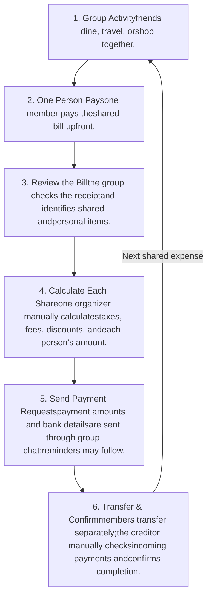
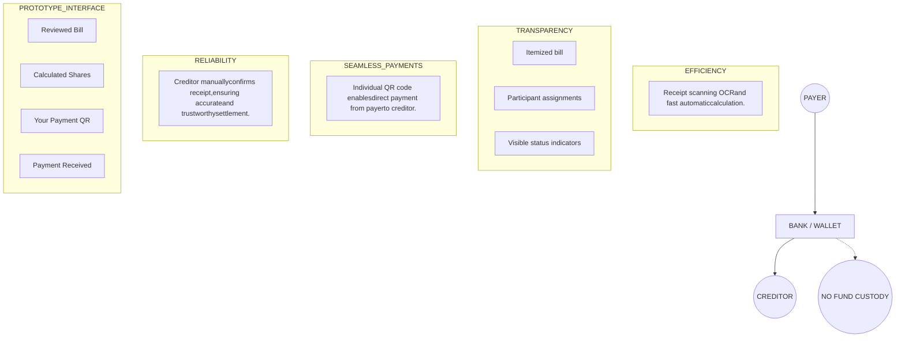
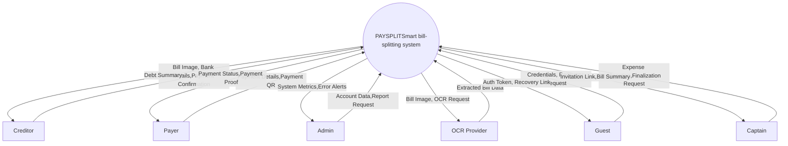
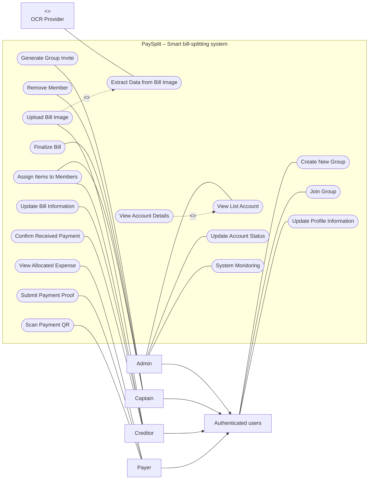
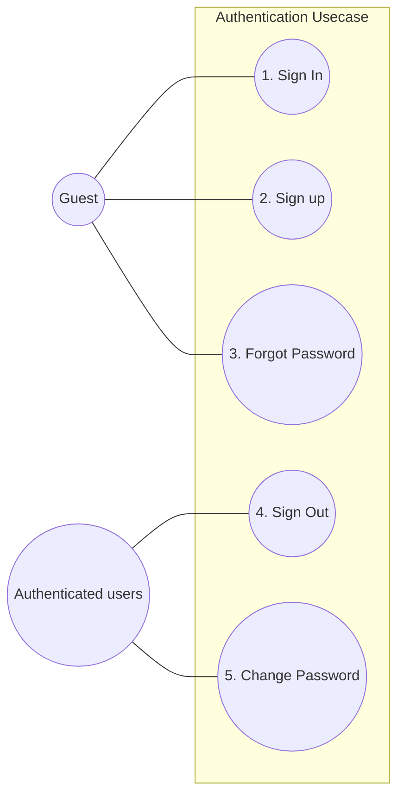

VIN SMART FUTURE logo

# PAYSPLIT - SMART BILL-SPLITTING SYSTEM

## Product Requirement Document

<table>
  <thead>
    <tr>
        <th colspan="2">PaySplit Team</th>
    </tr>
  </thead>
  <tbody>
    <tr>
        <td rowspan="3"><strong>Group members</strong></td>
        <td>Phạm Lê Hoàng Nam</td>
    </tr>
    <tr>
        <td>Phạm Thanh Lam</td>
    </tr>
    <tr>
        <td>Nguyễn Trọng Tín</td>
    </tr>
    <tr>
        <td><strong>Mentor</strong></td>
        <td>Trần Quang Hiển (VSF-FINTECH-VDTDVTC)</td>
    </tr>
    <tr>
        <td rowspan="4"><strong>Ext Mentor</strong></td>
        <td>Bành Quốc Danh (VSF-FINTECH&amp;TT-PTPM)</td>
    </tr>
    <tr>
        <td>Phan Công Huân (VSF-FINTECH-VDTDVTC)</td>
    </tr>
    <tr>
        <td>Nguyễn Mạnh Tể (VSF-FINTECH&amp;TT-PTPM)</td>
    </tr>
    <tr>
        <td>Nguyễn Nam Trường (VSF-FINTECH-VDTDVTC)</td>
    </tr>
  </tbody>
</table>

– HaNoi, Aug 2026 –

<page_number>1 | Page</page_number>

# Table of Contents

**I. Record of Changes** **4**

**II. Product Requirement Document** **5**

1. Product Introduction 5

1.1. Executive Summary 5

1.2. Background & Problem Statement 5

1.2.1 Group Expense Context 5

1.2.2 PaySplit Payment Coordination Context 6

1.2.3 Technical Challenges 6

1.2.4 Prototype Value 6

1.2.5 Scope & Objectives 7

2. Product Overview 7

3. User Requirements 9

3.1 Actors 9

3.2 Use Cases 10

3.2.1 Diagram(s) 10

3.2.2 Use Case Descriptions 11

4. Functional Requirements 14

4.1 Core System Features 14

4.1.1 - Sign In 14

4.1.2 - Sign Up 14

4.1.3 - Forgot Password 15

4.1.4 - Sign Out 15

4.1.5 - Change Password 16

4.1.6 - Update Profile Information 16

4.1.7 - Create New Group 16

4.1.8 - Generate Group Invite 17

4.1.9 - Join Group 17

4.1.10 - Remove Member 18

4.1.11 - Upload Bill Image 18

4.1.12 - Extract Data from Bill Image 19

4.1.13 - Assign Items to Members 19

4.1.14 - Update Bill Information 20

4.1.15 - Finalize Bill 21

4.1.16 - View Allocated Expense 21

4.1.17 - Scan Payment QR 22

4.1.18 - Submit Payment Proof 23

4.1.19 - Confirm Received Payment 23

4.1.20 - View List Account 24

4.1.21 - View Account Details 24

4.1.22 - Update Account Status 24

4.1.23 - System Monitoring 25

<page_number>2</page_number> | Page

5. Non-Functional Requirements 26
   5.1. External Interfaces 26
   5.1.1 User Interface 26
   5.1.2 Software Interface 26
   5.1.3 Hardware Interface 26
   5.2. Quality Attributes 26
   5.2.1 Performance & Scalability 26
   5.2.2 Reliability & Robustness 26
   5.2.3 Security & Privacy 27
   5.2.4 Explainability 27
   5.2.5 Maintainability & Reproducibility 27
6. Architecture Overview (High-Level) 27
   6.1 Components 27
   6.2 Tech Stack 28
7. Milestones & Timeline 28
8. Risks & Mitigations 29

# List of Tables

Table 1. Record of Change 4
Table 2. All Actors in the System 9
Table 3. Use Case Description 13
Table 4. Tech Stack 28
Table 5. Milestones & Timeline 29
Table 6. Risks & Mitigations 29

# List of Figures

Figure 1. Money Laundering Cycle 5
Figure 2. Core values and benefits of the PaySplit prototype. 7
Figure 3. Context Diagram 8
Figure 4. PaySplit Use Case Diagram 10
Figure 5. PaySplit Authentication Use Case Diagram 10

<page_number>3</page_number> | Page

# I. Record of Changes

\*A - Added M - Modified D - Deleted

<table>
  <thead>
    <tr>
        <th>Date</th>
        <th>A* M, D</th>
        <th>In charge</th>
        <th>Change Description</th>
    </tr>
  </thead>
  <tbody>
    <tr>
        <td>10/08/2026</td>
        <td>A</td>
        <td>NamPLH</td>
        <td>Init base document</td>
    </tr>
    <tr>
        <td>10/08/2026</td>
        <td>A</td>
        <td>All members</td>
        <td>Add Product Overview, Personas, Use case,...</td>
    </tr>
    <tr>
        <td>11/08/2026</td>
        <td>M</td>
        <td>All members</td>
        <td>Complete document</td>
    </tr>
    <tr>
        <td> </td>
        <td> </td>
        <td> </td>
        <td> </td>
    </tr>
  </tbody>
</table>

Table 1. Record of Change

<page_number>4</page_number> | Page

# II. Product Requirement Document

## 1. Product Introduction

### 1.1. Executive Summary

This document defines the product requirements for PaySplit, a group expense-splitting feature designed for integration into a digital wallet.

PaySplit enables users to create groups, enter bills, assign expenses, calculate each member’s share, and generate payment QR codes with pre-filled transaction details. Payments are transferred directly to creditors through external banking or wallet applications. PaySplit does not hold funds or automatically verify transactions; creditors manually confirm receipt.

The final prototype will demonstrate the complete flow from group creation to payment confirmation, supported by a mobile application, backend APIs, technical documentation, and a test report.

### 1.2. Background & Problem Statement

#### 1.2.1 Group Expense Context

Group expenses in activities like dining, travelling, or shared accommodation often require one or more people to pay upfront and calculate reimbursements. Currently, this relies on chats, spreadsheets, or handwritten notes, forcing the organizer to manually:

- Record each bill and identify the person who paid it.

- Determine which members participated in each expense.

- Separate shared items from individually consumed items.

- Inform every member of the exact amount they need to pay.

- Provide bank account or wallet information for payment.

- Check incoming transactions and confirm who has paid.

- Repeatedly remind members with unconfirmed payments.

Figure 1. Money Laundering Cycle

<page_number>5</page_number> | Page

Managing this manually through chats, spreadsheets, or calculators is time-consuming and prone to calculation errors, unclear payment details, and delayed confirmations—especially when groups have many members or bills.

**PaySplit** simplifies this process through a shared workflow for bill entry, expense allocation, payment QR generation, and creditor confirmation.

## 1.2.2 PaySplit Payment Coordination Context

**PaySplit** acts as a **payment coordination service**, not a financial intermediary. It does not hold funds or automatically transfer money between users. Instead, when a payment is due, it generates a QR code containing:

- The creditor’s bank or wallet details.

- The exact payment amount.

- A unique reference code and group identifier.

The payer scans this QR code using an external banking app, and the creditor manually confirms the receipt within **PaySplit**.

This approach simplifies the prototype by avoiding fund custody and automated money transfers. However, any future production deployment will still require appropriate legal, security, and payment-compliance reviews.

## 1.2.3 Technical Challenges

Developing a reliable expense-splitting system introduces several key technical hurdles:

- **Bill information extraction:** Processing diverse bill layouts and handling OCR inaccuracies that require _user verification_.

- **Multiple creditors:** Accurately calculating peer-to-peer debts when various members pay for different bills, _without_ using a centralized fund.

- **Manual payment confirmation:** Enforcing a secure workflow where payers can mark transactions as sent, but _only_ the creditor can confirm receipt.

- **Concurrent group updates:** Managing simultaneous actions (e.g., uploading bills, editing splits) to prevent data conflicts and calculation errors.

- **User participation:** Providing seamless onboarding via invitation links or QR codes for users who do not yet have the app.

- **Data privacy and security:** Securing sensitive personal and financial data through robust authentication, authorization, and access controls.

## 1.2.4 Prototype Value

The **PaySplit** prototype validates an end-to-end expense coordination workflow _without_ holding or transferring user funds. Its core value includes:

- **Efficiency:** OCR-assisted bill entry and automatic calculations minimize manual effort for group leaders.

- **Transparency:** Item-level assignments and a shared group view clarify who owes what, and track overall payment statuses.

- **Seamless Payments:** Individual QR codes with unique descriptions streamline direct, peer-to-peer transfers (avoiding common funds).

- **Reliability:** Creditor-controlled manual confirmations ensure accurate payment tracking without the system making false assumptions.

Ultimately, this prototype serves as a foundation to evaluate usability, OCR accuracy, QR reliability, and the manual confirmation workflow prior to production deployment or deeper banking integration.

6 | Page

# PAYSPLIT PROTOTYPE VALUE

Figure 2. Core values and benefits of the PaySplit prototype.

### 1.2.5 Scope & Objectives

**In-scope (Project Objectives):**

- **Group Management:** Create and join temporary groups via link/QR (including redirects for app downloads).

- **Bill Processing:** Upload bills via OCR (extracting merchant, items, taxes, totals) with manual entry/correction options.

- **Expense Allocation:** Support equal, item-based, percentage-based, and custom splitting methods.

- **Debt Calculation & QR:** Track multiple bills and creditors, calculate exact individual dues, and generate unique payment QR codes.

- **Payment Workflow:** Track statuses (Awaiting, Pending, Confirmed) where payers mark transfers as sent, but only creditors can confirm or reject. Includes basic reminders.

- **Deliverables:** Deliver a functional prototype, APIs, technical documentation

**Out-of-scope:**

- **Financial Operations:** Holding funds, acting as a payment intermediary, or executing automated transfers/collections.

- **Banking Integration:** Direct production banking integration, auto-reconciliation, or verifying real bank receipts/screenshots.

- **Advanced Finance:** Debt netting (offsetting), credit scoring, lending (BNPL), cryptocurrency, or managing disputes/refunds.

- **Production Deployment:** Processing real financial transactions, high-availability infrastructure, or full CI/CD pipelines.

## 2. Product Overview

PaySplit is a **group expense-splitting** prototype designed for digital wallet systems. It combines OCR-assisted bill extraction, flexible expense allocation, and automatic calculation to determine how much each member must pay. The system generates individual QR codes containing the exact amount, creditor information, and a unique transfer description for direct payment through an external banking or wallet application. PaySplit does not hold or transfer user funds; creditors manually confirm received payments. This proof of concept validates the end-to-end workflow—from

7 | Page

bill entry and expense splitting to QR-based payment and confirmation—while improving efficiency, transparency, and convenience for group members.

**Figure 3. Context Diagram**

8 | Page

# 3. User Requirements

## 3.1 Actors

<table>
  <thead>
    <tr>
        <th>#</th>
        <th>Actor</th>
        <th>Description</th>
    </tr>
  </thead>
  <tbody>
    <tr>
        <td>1</td>
        <td><strong>Guest</strong> <em>(Human)</em></td>
        <td>An unauthenticated user exploring the platform, registering, or recovering passwords. They expect a seamless and secure onboarding experience to quickly access the application.</td>
    </tr>
    <tr>
        <td>2</td>
        <td><strong>Authenticated User</strong> <em>(Primary Human)</em></td>
        <td>A logged-in user managing their profile, creating, or joining groups. This is the foundational role before becoming a Captain, Creditor, or Payer. They expect a clear interface and a transparent overview of their shared expenses.</td>
    </tr>
    <tr>
        <td>3</td>
        <td><strong>Captain</strong> <em>(Primary Human)</em></td>
        <td>The group administrator responsible for managing members, collaborating on expense allocation, and finalizing bills. They expect full control over group data and fast, automated calculations to ensure fair splitting.</td>
    </tr>
    <tr>
        <td>4</td>
        <td><strong>Creditor</strong> <em>(Primary Human)</em></td>
        <td>One of the users who has paid upfront for a shared bill. Holding the receipt, they upload the bill image, verify data, allocate expenses, and confirm received payments. They expect smooth OCR extraction and an accurate reconciliation system to track reimbursements.</td>
    </tr>
    <tr>
        <td>5</td>
        <td><strong>Payer</strong> <em>(Primary Human)</em></td>
        <td>A member obligated to reimburse the Creditor(s). They review their debts, scan QR codes to transfer funds, and submit payment proofs. They expect transparent itemization and a minimalist, manual-entry-free payment workflow.</td>
    </tr>
    <tr>
        <td>6</td>
        <td><strong>Admin</strong> <em>(System Administrator)</em></td>
        <td>The internal platform operator responsible for managing users, monitoring metrics, and tracking OCR system status. They expect real-time dashboards and instant alerts to maintain system stability.</td>
    </tr>
    <tr>
        <td>7</td>
        <td><strong>OCR Provider</strong> <em>(External System)</em></td>
        <td>A third-party service (e.g., Google Cloud Vision) that receives bill images and returns structured text data. It requires standard API requests and minimum-resolution images to provide accurate, automated extraction.</td>
    </tr>
  </tbody>
</table>

**Table 2. All Actors in the System**

<page_number>9</page_number> | Page

## 3.2 Use Cases

### 3.2.1 Diagram(s)

Figure 4. PaySplit Use Case Diagram

Figure 5. PaySplit Authentication Use Case Diagram

<page_number>10</page_number> | Page

### 3.2.2 Use Case Descriptions

<table>
  <thead>
    <tr>
        <th>ID</th>
        <th>Use Case</th>
        <th>Actors</th>
        <th>Use Case Description</th>
    </tr>
  </thead>
  <tbody>
    <tr>
        <td>01</td>
        <td>Sign In</td>
        <td>Guest</td>
        <td>- Allows a Guest to authenticate with email/password to obtain an access token and refresh token. On success, the Guest becomes an Authenticated User and gains access to group and bill features.</td>
    </tr>
    <tr>
        <td>02</td>
        <td>Sign Up</td>
        <td>Guest</td>
        <td>- Allows a Guest to register a new account using an email address and password. The account is created in an inactive state until email verification is completed.</td>
    </tr>
    <tr>
        <td>03</td>
        <td>Forgot Password</td>
        <td>Guest</td>
        <td>- Allows a Guest who has lost access to their account to request a time-limited, single-use password reset link sent to the registered email address</td>
    </tr>
    <tr>
        <td>04</td>
        <td>Sign Out</td>
        <td>Authenticated User</td>
        <td>- Terminates the current session by revoking the refresh token associated with the device, so that the session can no longer be renewed.</td>
    </tr>
    <tr>
        <td>05</td>
        <td>Change Password</td>
        <td>Authenticated User</td>
        <td>- Allows an Authenticated User to replace the current password after re-verifying the existing one. All other active sessions are revoked to protect the account.</td>
    </tr>
    <tr>
        <td>06</td>
        <td>Update Profile Information</td>
        <td>Authenticated User</td>
        <td>- Allows an Authenticated User to update display name, avatar, phone number, and default bank account information (bank code, account number,...) used for VietQR generation.</td>
    </tr>
    <tr>
        <td>07</td>
        <td>Create New Group</td>
        <td>Authenticated User</td>
        <td>- Creates a new expense group for a trip, meal, or shared activity. The creator automatically becomes the Captain of that group.</td>
    </tr>
    <tr>
        <td>08</td>
        <td>Join Group</td>
        <td>Authenticated User</td>
        <td>- Allows an Authenticated User to join an existing group through an invite link or invite code. Once joined, the user becomes a group member and</td>
    </tr>
  </tbody>
</table>

<page_number>11</page_number> | Page

<table>
  <tbody>
    <tr>
        <td> </td>
        <td> </td>
        <td> </td>
        <td>may act as Creditor or Payer for bills within that group.</td>
    </tr>
    <tr>
        <td>09</td>
        <td>Generate Group Invite</td>
        <td>Captain</td>
        <td>- Generates a shareable invite link or code with a configurable expiry so that other users can join the group.</td>
    </tr>
    <tr>
        <td>10</td>
        <td>Remove Member</td>
        <td>Captain</td>
        <td>- Removes a member from the group. Removal is only permitted when the member has no outstanding balance, in order to preserve the ledger invariant that the sum of all member balances equals zero.</td>
    </tr>
    <tr>
        <td>11</td>
        <td>Upload Bill Image</td>
        <td>Creditor</td>
        <td>- Upload a photograph of a receipt to the system to start the automated bill parsing flow.</td>
    </tr>
    <tr>
        <td>12</td>
        <td>Extract Data from Bill Image</td>
        <td>OCR Provider (External System)</td>
        <td>- Sends the uploaded receipt image to the OCR/Vision LLM provider, receives a structured result (including merchant details, line items, taxes, and total), and normalizes it into draft bill data for the Creditor to review.</td>
    </tr>
    <tr>
        <td>13</td>
        <td>Assign Items to Members</td>
        <td>Captain, Creditor</td>
        <td>- Allocates each extracted line item to one or more group members, or applies an equal-split rule across selected participants, thereby determining who owes what portion of the bill and to which Creditor.</td>
    </tr>
    <tr>
        <td>14</td>
        <td>Update Bill Information</td>
        <td>Creditor</td>
        <td>- Reviews and refines the draft bill before finalization to correct OCR omissions, adjust item details, and update the participant list.</td>
    </tr>
    <tr>
        <td>15</td>
        <td>Finalize Bill</td>
        <td>Captain</td>
        <td>- Locks the bill immutably, computes exact participant shares, simplifies debts, updates the ledger, and generates unique VietQR codes for each debtor.</td>
    </tr>
    <tr>
        <td>16</td>
        <td>View Allocated Expense</td>
        <td>Payer</td>
        <td>- Displays the amount the Payer owes, the breakdown of the items charged to them, the</td>
    </tr>
  </tbody>
</table>

<page_number>12</page_number> | Page

<table>
  <tbody>
    <tr>
        <td> </td>
        <td> </td>
        <td> </td>
        <td>Srounding adjustment applied, the recipient of the payment, and the reference code attached to their payment request.</td>
    </tr>
    <tr>
        <td>17</td>
        <td>Scan Payment QR</td>
        <td>Payer</td>
        <td>- Displays the individual VietQR code for the Payer's debt so that it can be scanned or opened in a banking application. The QR encodes the recipient account, the exact amount, and the unique reference code used for automatic reconciliation.</td>
    </tr>
    <tr>
        <td>18</td>
        <td>Submit Payment Proof</td>
        <td>Payer</td>
        <td>- Allows a Payer to attach evidence of a transfer (screenshot or note) and mark the debt as "paid — awaiting confirmation"</td>
    </tr>
    <tr>
        <td>19</td>
        <td>Confirm Received Payment</td>
        <td>Creditor</td>
        <td>- Allows the Creditor to manually confirm that a payment has been received, closing the debt in the ledger</td>
    </tr>
    <tr>
        <td>20</td>
        <td>View List Account</td>
        <td>Admin</td>
        <td>- Displays a paginated, searchable, and filterable list of user accounts together with their status and registration date.</td>
    </tr>
    <tr>
        <td>21</td>
        <td>View Account Details</td>
        <td>Admin</td>
        <td>- Displays the full profile of a selected account, including linked authentication providers, group membership, and recent activity history.</td>
    </tr>
    <tr>
        <td>22</td>
        <td>Update Account Status</td>
        <td>Admin</td>
        <td>- Changes an account's status (active, suspended, or locked). Suspending an account immediately revokes all active sessions of that account.</td>
    </tr>
    <tr>
        <td>23</td>
        <td>System Monitoring</td>
        <td>Admin</td>
        <td>- Monitors system health, API performance, and background tasks (OCR, queues) via endpoints and the admin dashboard.</td>
    </tr>
  </tbody>
</table>

**Table 3. Use Case Description**

<page_number>13</page_number> | Page

# 4. Functional Requirements

## 4.1 Core System Features

### 4.1.1 - Sign In

- **Function trigger**: A Guest submits credentials on the sign-in screen.

- **Function description**: Authenticates a user and issues the token pair required to access protected resources.

- **Function detail**:
  - **Data Validation**: Email must be a syntactically valid address; password must not be empty.
  - **Functionality**:
    - In Normal Cases:
      - The user submits an email and password
      - The system locates the corresponding authentication identity and verifies the password hash
      - The system issues a short-lived access token (JWT) and a long-lived refresh token bound to the device, and records the session.
      - The system returns the token pair together with the user's basic profile.

    - In Abnormal Cases:
      - _Invalid credentials_: Return HTTP 401 with a generic message that does not disclose whether the email exists.
      - _Unverified account_: Return HTTP 403 with an <mark>EMAIL_NOT_VERIFIED</mark> code and offer to resend the verification email.
      - _Suspended or locked account_: Return HTTP 403 and refuse token issuance.
      - _Repeated failed attempts_: The system applies rate limiting per IP address and per account, and returns HTTP 429 once the threshold is exceeded.

### 4.1.2 - Sign Up

- **Function trigger**: A Guest submits the registration form.

- **Function description**: Creates a new user account and initiates email verification.

- **Function detail :**
  - **Data Validation**: Email must be valid and not already registered; password must meet the minimum strength policy (length and character-class requirements); display name must not be empty.
  - **Functionality**:
    - In Normal Cases:
      - The system verifies that the email is not already associated with an existing account.
      - The system creates a user record with a UUID v7 identifier and an associated authentication identity, storing only the password hash.
      - The system sends a verification email containing a single-use, time-limited token.
      - Once the user opens the verification link, the account is marked as verified and may sign in.

    - In Abnormal Cases:

<page_number>14</page_number> | Page

- _Email already registered_: Return HTTP 409 and suggest signing in or recovering the password.

- _Weak password_: Return HTTP 400 with the specific policy rules that were not satisfied.

- _Email delivery failure_: The account is still created; the system logs the failure and exposes a "resend verification email" action.

---

# 4.1.3 - Forgot Password

- **Function trigger**: A Guest requests a password reset from the sign-in screen.

- **Function description**: Provides a secure recovery path for users who cannot access their account.

- **Function detail**:
  - **Data Validation**: The submitted email must be syntactically valid. The reset token must be unexpired, unused, and correctly bound to the account.
  - **Functionality**:
    - In Normal Cases:
      - The system generates a single-use reset token with a short expiry and stores only its hash.
      - The system sends the reset link to the registered email address.
      - The user opens the link and submits a new password.
      - The system updates the password hash, invalidates the reset token, and revokes all existing refresh tokens for that account.

    - In Abnormal Cases:
      - _Unregistered email_: The system returns the same success response as the normal case to avoid account enumeration, and sends no email.
      - _Expired or already used token_: Return HTTP 400 and invite the user to request a new reset link.

---

# 4.1.4 - Sign Out

- **Function trigger**: An Authenticated User selects the sign-out action.

- **Function description**: Ends the current session and prevents further token renewal from that device.

- **Function detail**:
  - **Data Validation**: None.
  - **Functionality**:
    - In Normal Cases:
      - The system revokes the refresh token associated with the current device and marks the session as closed.
      - The client discards the stored tokens and returns to the unauthenticated state.

    - In Abnormal Cases:
      - _Token already revoked or missing_: The system treats the operation as successful (idempotent behaviour) so that the client can always return to a clean state.

---

15 | Page

## 4.1.5 - Change Password

- **Function trigger:** An Authenticated User submits the change-password form in profile settings.

- **Function description:** Replaces the account password after re-verifying the user's identity.

- **Function detail :**
  - **Data Validation:** The current password must be correct; the new password must satisfy the strength policy and differ from the current one.
  - **Functionality:**
    - In Normal Cases:
      - The system verifies the current password hash.
      - The system stores the new password hash.
      - The system revokes all refresh tokens except the one belonging to the current device.

    - In Abnormal Cases:
      - **Incorrect current password:** Return HTTP 400 without modifying the account, and count the attempt towards the rate limit.
      - **Social-only account with no password set:** Return HTTP 409 and redirect the user to the "set password" flow instead.

## 4.1.6 - Update Profile Information

- **Function trigger:** An Authenticated User saves changes on the profile screen.

- **Function description:** Maintains the personal and banking information required for display within groups and for generating payment QR codes.

- **Function detail :**
  - **Data Validation:** Display name must not be empty; avatar must be an accepted image type within the size limit; bank code must exist in the supported NAPAS bank list; bank account number must match the format expected for that bank.
  - **Functionality:**
    - In Normal Cases:
      - The user updates the display name, avatar, phone number, and default receiving bank account.
      - The system stores the updated profile, where an avatar is uploaded, persists the file through the storage adapter and records the resulting object key.
      - Subsequent VietQR generation uses the updated bank account information.

    - In Abnormal Cases:
      - **Invalid bank account information:** Return HTTP 400 and retain the previous bank details, since an incorrect account would cause payments to be misdirected.
      - **Storage service unavailable:** The system saves the non-image fields and reports that the avatar upload must be retried.

## 4.1.7 - Create New Group

- **Function trigger:** An Authenticated User creates a group from the home screen.

- **Function description:** Establishes the shared context in which bills are recorded and debts are tracked.

<page_number>16</page_number> | Page

- **Function detail :**
  - Data Validation: Group name must not be empty and must be within the maximum length; the default currency is VND.
  - Functionality:
    - In Normal Cases:
      - The system creates the group record and adds the creator as its first member with the Captain role.
      - The system initializes an empty ledger for the group.
      - The group appears in the creator's group list, ready to receive members and bills.

    - In Abnormal Cases:
      - _Group quota exceeded:_ Return HTTP 429 or 403 with an explanation of the limit on concurrently active groups per user.

### 4.1.8 - Generate Group Invite

- **Function trigger:** The Captain selects the invite action within a group

- **Function description:** Produces a shareable link or code allowing other users to join the group.

- **Function detail :**
  - Data Validation: The requesting user must hold the Captain role in the target group; the requested expiry must be within the permitted range.
  - Functionality:
    - In Normal Cases:
      - The system generates a random, unguessable invite code with an expiry time and an optional maximum use count.
      - The system returns a deep link that can be shared through any messaging channel.
      - The Captain may revoke an active invite, after which the code can no longer be redeemed.

    - In Abnormal Cases:
      - _Requester is not the Captain:_ Return HTTP 403.
      - _An active invite already exists:_ The system returns the existing invite rather than creating a duplicate, unless regeneration is explicitly requested.

### 4.1.9 - Join Group

- **Function trigger:** An Authenticated User opens an invite link or submits an invite code.

- **Function description:** Adds the user to the group as a member.

- **Function detail :**
  - Data Validation: The invite code must exist, be unexpired, unrevoked, and below its usage limit.
  - Functionality:
    - In Normal Cases:
      - The system validates the invite and adds the user to the group with the standard member role.
      - The system increments the invite usage counter.

17 | Page

- The user gains visibility of the group's bills and of their own allocated expenses.

- In Abnormal Cases:
  - Expired, revoked, or exhausted invite: Return HTTP 410 and advise the user to request a new link from the Captain.

  - User is already a member: Return success and navigate directly to the group, without creating a duplicate membership.

# 4.1.10 - Remove Member

- **Function trigger:** The Captain removes a member from the group member list.

- **Function description:** Withdraws a member's access to the group while preserving ledger integrity.

- **Function detail :**
  - Data Validation: The requester must be the Captain; the target member must have a net balance of zero; the Captain cannot remove themselves while other members remain.

  - Functionality:
    - In Normal Cases:
      - The system verifies that the member has no outstanding debt and no outstanding credit.

      - The system marks the membership as inactive rather than deleting it, so that historical ledger entries and past bill participation records remain intact.

      - The removed member loses access to the group but their contribution to finalized bills is preserved.

    - In Abnormal Cases:
      - Member still has an outstanding balance: Return HTTP 409 with the exact amount owed or owing, and require settlement before removal.

      - Requester is not the Captain: Return HTTP 403.

# 4.1.11 - Upload Bill Image

- **Function trigger:** The Creditor photographs a receipt or selects an image from the device gallery and submits it to a group.

- **Function description:** Starts the automated bill-parsing pipeline by storing the receipt image and enqueuing an extraction job.

- **Function detail :**
  - Data Validation: The file must be an accepted image type (JPEG, PNG, HEIC,...), must not exceed the configured maximum size, and the uploader must be an active member of the target group.

  - Functionality:
    - In Normal Cases:
      - The client uploads the image, which the system persists through the storage adapter.

      - The system creates a bill record in <mark>DRAFT</mark> status and enqueues an OCR job in the background job queue.

      - The system returns a bill identifier and a progress channel (SSE) so that the client can display extraction progress.

18 | Page

- On completion, the draft bill is populated with the extracted line items and presented to the Creditor for review.

* In Abnormal Cases:
  - **Unsupported file type or oversized file**: Return HTTP 400 without creating a bill record.

  - **Storage service unavailable**: Return HTTP 503 and prompt the user to retry; no bill record is created.

  - **Network interruption during upload**: The partially uploaded object is discarded by the storage lifecycle policy and the client retries.

---

# 4.1.12 - Extract Data from Bill Image

- **Function trigger**: The OCR background job is picked up from the queue after a bill image has been uploaded.

- **Function description**: Converts a receipt photograph into structured, editable bill data using an external Vision LLM / OCR provider.

- **Function detail**:
  - **Data Validation**: The provider response must conform to the expected schema; all monetary values must be parsable into non-negative integers in VND; the sum of line items plus surcharges must be reconciled against the extracted total.

  - **Functionality**:
    - In Normal Cases:
      - The system sends the image to the OCR Provider together with a structured extraction prompt.

      - The system receives merchant name, date, line items (name, quantity, unit price, line total), service charge, VAT, discount, and grand total.

      - The system normalizes Vietnamese number formatting into `int64` VND values and stores them as draft bill items.

      - The system emits a progress event so that the client can present the parsed result for review.

    - In Abnormal Cases:
      - **Provider timeout or transient error**: The job is retried with exponential backoff up to the configured maximum attempts.

      - **Provider permanently unavailable or retries exhausted**: The bill remains in DRAFT status with an empty item list, and the Creditor is invited to enter the items manually.

      - **Extracted totals do not reconcile**: The system still stores the items but flags the bill with a mismatch warning so that the Creditor verifies the figures before finalization.

      - **Unreadable image**: The system returns an explicit "could not read this receipt" state and suggests retaking the photograph.

---

# 4.1.13 - Assign Items to Members

- **Function trigger**: The Captain or the Creditor allocates items on the bill review screen.

- **Function description**: Determines the share of the bill attributable to each participant, either per item or by an equal split across selected members. The Captain can assign items

19 | Page

for any bill within their group, whereas a Creditor can assign items for bills they have personally uploaded.

- **Function detail:**
  - **Data Validation:** Every assignee must be an active member of the group. Each item must be assigned to at least one participant before the bill can be finalized. Assignment weights must be positive.

  - **Functionality:**
    - In Normal Cases:
      - The Captain or the Creditor selects an item and chooses the participants who consumed it, optionally with different weights or quantities.

      - Alternatively, the acting user applies an "equal split" rule that distributes the whole bill evenly across the selected participants.

      - The system continuously recalculates a preview of each participant's provisional share.

      - Shared surcharges (service charge, VAT) and discounts are apportioned proportionally to each participant's subtotal.

    - In Abnormal Cases:
      - Unassigned items remain: The system blocks finalization and highlights the items still requiring an assignee.

      - Assignment to a member who has left the group: Return HTTP 409 and prompt the user to reassign the item.

# 4.1.14 - Update Bill Information

- **Function trigger:** The Creditor edits bill details before finalization.

- **Function description:** Corrects OCR inaccuracies and completes any information missing from the extracted receipt.

- **Function detail:**
  - **Data Validation:** The bill must be in <mark>DRAFT</mark> status; all monetary values must be non-negative integers; the requester must be the Creditor who created the bill or the group Captain.

  - **Functionality:**
    - In Normal Cases:
      - The Creditor edits the merchant name, bill date, item names, quantities, unit prices, service charge, VAT, and discount.

      - The Creditor may add items the OCR missed, delete spurious items, and adjust the participant list.

      - The system recomputes derived totals after every change and revalidates the reconciliation between line items and the grand total.

    - In Abnormal Cases:
      - Bill already finalized: Return HTTP 409; corrections after finalization must be made through a reversal entry rather than by editing history.

      - Requester lacks permission: Return HTTP 403.

      - Concurrent edits by two users: The system applies optimistic locking using a version field and returns HTTP 409 to the second writer, prompting a refresh before retrying.

<page_number>20</page_number> | Page

# 4.1.15 - Finalize Bill

- **Function trigger**: The Captain confirms the finalization action via the review screen.

- **Function description**: Executed exclusively by the Captain. This action locks the bill immutably, computes the definitive per-person amounts, records them in the ledger, simplifies the resulting debts, and issues an individual payment QR code for each debtor.

- **Function detail**:
  - Data Validation: The bill must be in <mark>DRAFT</mark> status with all items assigned. The respective Creditors must have valid receiving bank account information configured.
  - Functionality:
    - In Normal Cases:
      - The system takes an immutable snapshot of the participant list at the moment of execution.
      - The system globally locks the bill to prevent any further modifications.
      - The Split Controller computes each participant's share using int64 arithmetic and distributes rounding remainders through the largest-remainder (Hamilton) method, guaranteeing that the sum of all shares equals the bill total exactly.
      - The system writes balanced double-entry ledger entries so that the sum of all member balances within the group remains zero.
      - The Settlement Controller computes a simplified set of transfers that minimizes the number of transactions required to clear the outstanding balances.
      - For each resulting transfer, the system generates a VietQR payload encoding the recipient account, the exact amount, and a unique reference code for manual cross-checking.
      - The system transitions the bill to <mark>FINALIZED</mark>, notifies all participants through push notifications, and displays the rounding adjustment applied to each person for transparency.

    - In Abnormal Cases:
      - _Creditor has no valid bank account_: Return HTTP 409 and prompt the Admin to require the Creditor to complete their banking details before finalizing.
      - _Unassigned items or an empty participant list_: Return HTTP 400 identifying the specific blocking condition.
      - _Ledger transaction failure_: The entire finalization is rolled back within a single database transaction, leaving the bills in <mark>DRAFT</mark> status; no partial ledger entries are ever persisted.
      - _QR generation failure for one recipient_: Finalization still completes, and the affected debt is shown with the recipient's bank details in plain form so that a manual transfer remains possible.

# 4.1.16 - View Allocated Expense

- **Function trigger**: A Payer opens a bill or the group summary screen.

- **Function description**: Shows the Payer exactly what they owe, to whom, and why.

- **Function detail**:

<page_number>21</page_number> | Page

- Data Validation: The requester must be a participant in the bill or an active member of the group.

- Functionality:
  - In Normal Cases:
    - The system displays the Payer's total amount due, the items charged to them with the corresponding unit amounts, and the proportional share of service charge, VAT, and discount.
    - The system explicitly discloses any rounding adjustment applied to that participant.
    - The system shows the recipient of the payment, the current settlement status, and the reference code associated with the payment request.

  - In Abnormal Cases:
    - Requester is not a participant: Return HTTP 403.
    - Bill not yet finalized: The system displays the provisional calculation and marks it clearly as an estimate that may still change.

---

# 4.1.17 - Scan Payment QR

- **Function trigger**: A Payer opens the payment screen for an outstanding debt.

- **Function description**: Presents the individual VietQR code that allows the Payer to transfer the exact amount directly to the Creditor's bank account.

- **Function detail**:
  - Data Validation: The debt must exist and be unsettled; the recipient bank account must be valid; the amount must be a positive integer in VND.
  - Functionality:
    - In Normal Cases:
      - The system renders the VietQR payload as a scannable code, constructed as a TLV structure with a CRC-16/CCITT-FALSE checksum.
      - The QR encodes the recipient's account, the exact amount, and the unique reference code assigned to this specific debt.
      - The reference code is displayed in text beneath the QR so that it can be entered manually in the transfer description if the Payer types the transfer by hand.

    - In Abnormal Cases:
      - Debt already settled: The system hides the QR and shows the settlement timestamp instead.
      - QR generation error: The system falls back to displaying the recipient's bank name, account number, account holder name, and reference code as copyable text.

**Note on architecture**: PaySplit never holds user funds. Money moves peer-to-peer directly between the Payer's and the Creditor's bank accounts, which keeps the system outside the scope of the payment intermediary licensing requirements of Decree 52/2024/NĐ-CP.

---

# 4.1.18 - Submit Payment Proof

- **Function trigger**: A Payer marks a debt as paid after completing a transfer outside the automatically reconciled flow.

<page_number>22</page_number> | Page

- **Function description:** Records the Payer's claim of payment, pending confirmation by the Creditor.

- **Function detail:**
  - Data Validation: The requester must be the debtor on the selected debt; the debt must be unsettled; any attached image must be an accepted type within the size limit.
  - Functionality:
    - In Normal Cases:
      - The Payer optionally attaches a transfer screenshot and a short note.
      - The system sets the debt status to <mark>PENDING_CONFIRMATION</mark> without yet writing a settlement ledger entry.
      - The system notifies the Creditor that a confirmation is awaiting their review.
      - The system stops sending automated debt reminders to the Payer for this specific bill.

    - In Abnormal Cases:
      - _Debt already reconciled automatically:_ The system informs the Payer that the payment has already been recognized and takes no further action.
      - _Duplicate submission:_ The system updates the existing pending record rather than creating a second one.

---

# 4.1.19 - Confirm Received Payment

- **Function trigger:** The Creditor confirms receipt of a payment from the debt list or from a pending-confirmation notification.

- **Function description:** Manually closes an outstanding debt in the ledger after the Creditor verifies the fund transfer in their personal banking application.

- **Function detail:**
  - Data Validation: The requester must be the recipient of the debt; the debt must be unsettled; the confirmed amount must equal the outstanding amount unless a partial settlement is explicitly recorded.
  - Functionality:
    - In Normal Cases:
      - The Creditor reviews the pending payment (often after the Payer has marked it as "Paid") and manually confirms receipt based on their actual bank statement.
      - The system writes a balanced settlement entry to the ledger, moving the debt to <mark>SETTLED</mark> (or <mark>COMPLETED</mark>).
      - The system recomputes the group balances purely from the ledger entries — balances are always derived, never stored directly.
      - The system sends a single push notification to the Payer to confirm that the Creditor has successfully received the payment.

    - In Abnormal Cases:
      - _Requester is not the recipient:_ Return HTTP 403.
      - _Confirmation issued in error:_ The Creditor may reverse it, which creates a compensating reversal entry rather than deleting the original record.
      - _Database interruption:_ The system rolls back the transaction, shows an error message, retains the previous debt status, and asks the user to retry.

---

<page_number>23</page_number> | Page

# 4.1.20 - View List Account

- **Function trigger:** An Admin opens the account management screen.

- **Function description:** Provides an overview of all registered accounts for support and moderation purposes.

- **Function detail:**
  - Data Validation: The requester must hold the Admin role; pagination parameters must be within the permitted limits.
  - Functionality:
    - In Normal Cases:
      - The system returns a paginated list of accounts including identifier, display name, email, status, and registration date.
      - The Admin may search by email or display name and filter by status.
      - Password hashes and authentication secrets are never included in the response.

    - In Abnormal Cases:
      - Page size exceeds the maximum: The system clamps the value to the maximum and returns the result with the applied limit indicated.
      - Requester is not an Admin: Return HTTP 403.

# 4.1.21 - View Account Details

- **Function trigger:** An Admin selects an account from the list.

- **Function description:** Presents the complete record of a single account for investigation and support.

- **Function detail:**
  - Data Validation: The requester must hold the Admin role; the target account identifier must exist.
  - Functionality:
    - In Normal Cases:
      - The system displays the account profile, linked authentication providers, active session count, group membership, and recent activity history.
      - Sensitive fields such as full bank account numbers are masked by default.

    - In Abnormal Cases:
      - Account not found or soft-deleted: Return HTTP 404, or display the record in read-only form with a "deleted" marker where historical review is required.

# 4.1.22 - Update Account Status

- **Function trigger:** An Admin changes an account's status from the account details screen.

- **Function description:** Suspends, locks, or reactivates an account in response to a policy violation or a support request.

- **Function detail:**
  - Data Validation: The requester must hold the Admin role; the target status must be a valid transition from the current one; a reason must be supplied for suspension or locking.
  - Functionality:
    - In Normal Cases:

24 | Page

- The Admin selects the new status and provides a reason.

- The system updates the account status and, for suspension or locking, immediately revokes all refresh tokens belonging to that account.

- The change is written to the audit log with the acting Admin's identifier, the reason, and a timestamp.

- Reactivating an account restores access without requiring re-registration.

- ■ In Abnormal Cases:
  - Attempt to suspend an account with outstanding group debts: The system permits the action but warns the Admin that affected groups will be unable to complete settlement until the situation is resolved.

  - _Invalid status transition_: Return HTTP 400 describing the permitted transitions.

---

# 4.1.23 - System Monitoring

- **Function trigger**: An Admin opens the monitoring dashboard, or an automated monitoring system polls the `/health` and `/metrics` endpoints.

- **Function description**: Provides real-time visibility into service health and the operational quality of the bill-splitting and payment pipelines.

- **Function detail**:
  - ○ **Data Validation**: None.

  - ○ **Functionality**:
    - ■ In Normal Cases:
      - The system continuously collects operational metrics: request volume, latency histograms per endpoint, error rates by status class, background job queue depth and job failure rate, and OCR extraction success rate.

      - The system exposes a liveness and readiness endpoint reporting the status of the database, the storage service, and the OCR provider.

      - Metrics are published in a standard format (Prometheus) for visualization on the engineering dashboard.

    - ■ In Abnormal Cases:
      - A downstream dependency is unavailable: The readiness endpoint reports a degraded status while the liveness endpoint remains healthy, so that the service is not restarted unnecessarily.

      - Sustained high resource utilization: Metric collection may be delayed; the system prioritizes serving the core bill and payment APIs and raises an alert to the operations channel.

---

# 5. Non-Functional Requirements

## 5.1. External Interfaces

### 5.1.1 User Interface

- **UI-01**: The cross-platform Flutter app (Android, iOS) must default to Vietnamese and support responsive design for 5-inch to 10-inch screens without horizontal scrolling for critical components.

25 | Page
<page_number>25</page_number>

- **UI-02**: Main user flows must include Group Management, OCR Bill Scanning, inline Bill Editing, Bill Splitting (equal or per-item), and a Breakdown/Summary screen.

- **UI-03**: The payment flow must display debt details, a "Marked as Paid" button, creditor confirmation options.

- **UI-04**: UX standards require immediate action feedback, bottom navigation tabs, and QR codes rendered at a minimum of 250×250 pixels.

### 5.1.2 Software Interface

- **SI-01**: The backend RESTful API must be written in Go and communicate via HTTPS (TLS 1.2+) and JSON.

- **SI-02**: The PostgreSQL database must store core entities and connect via internal TCP.

- **SI-03**: The OCR Service must integrate with Vision LLMs via HTTPS and API Keys.

- **SI-04**: Asynchronous tasks must operate through a Postgres-backed River job queue.

### 5.1.3 Hardware Interface

- **HI-01**: The application requires a device rear camera with a minimum resolution of 5MP for OCR bill capture.

- **HI-02**: The device display must have a minimum resolution of 720×1280 pixels to render scannable QR codes.

- **HI-03**: An active Wi-Fi or 4G/5G Internet connection is required for operation.

- **HI-04**: A minimum of 100MB of free device storage is required for installation and image caching.

## 5.2. Quality Attributes

### 5.2.1 Performance & Scalability

- **PERF-01**: Standard CRUD API response times must be ≤ 200ms at the server.

- **PERF-02**: Asynchronous OCR processing must complete in ≤ 10 seconds.

- **PERF-03**: Server-side VietQR generation must be processed in ≤ 100ms per code.

- **PERF-04**: Split calculations must complete in ≤ 50ms.

- **PERF-05**: The system must support a minimum of 500 concurrent users during the MVP phase.

- **PERF-06**: System limits are set to a maximum of 50 members per group and 100 items per bill.

### 5.2.2 Reliability & Robustness

- **REL-01**: Financial calculations must strictly use 64-bit integers (int64) and Hamilton rounding algorithms to prevent errors and maintain zero-sum group balances.

- **REL-02**: Unconfirmed OCR results cannot be automatically split and must require user review and manual correction.

- **REL-03**: Bill corrections must utilize reversal ledger entries rather than data deletion to maintain an audit trail.

- **REL-04**: The system targets an uptime of ≥ 99% during peak operational hours.

### 5.2.3 Security & Privacy

- **SEC-01**: Authorization logic must be strictly enforced at the use case layer.

- **SEC-02**: Data must be protected, hashed passwords (bcrypt/argon2), and database-level encryption.

<page_number>26</page_number> | Page

- **SEC-03**: The system complies with NĐ 52/2024 by using a no-custody model where funds transfer directly between users' bank accounts.

## 5.2.4 Explainability

- **EXP-01**: OCR results and split calculations must display full, transparent breakdowns (including VAT and rounding absorbers) to the users.

- **EXP-02**: Debt statuses and historical actions must be highly visible to involved parties.

- **EXP-03**: The ledger must rely on double-entry bookkeeping to ensure complete transaction traceability.

## 5.2.5 Maintainability & Reproducibility

- **MNT-01**: The codebase must utilize a modular monolith architecture with clear Port/Adapter layer separation.

- **MNT-02**: The database schema must be managed via sequential migration files and use UUID v7 primary keys.

# 6. Architecture Overview (High-Level)

Detailed architecture is covered in the TDD (System Architecture, Level 1 & Level 2). This PRD only outlines the main components to align the scope.

## 6.1 Components

- **Client Layer**:
  - Flutter App: Cross-platform mobile client

- **API Layer**:
  - REST Router (Chi): Receives HTTP requests and routes them to the appropriate controller. Middleware handles JWT authentication, rate limiting, and structured logging.

- **Core — Domain Modules**
  - Auth/User: Manages login, registration, sessions, user profiles, and bank account details.
  - Group: Handles group creation, membership management, and invite links.
  - Bill/Expense: Orchestrates the bill upload workflow and item assignment.
  - OCR: Calls the external Vision LLM to extract text from images and normalizes it into draft bill data.
  - Split Controller: Handles the basic math for splitting the bill (equal split or per-item). It uses standard integer arithmetic (int64 for VND) to prevent rounding errors.
  - Settlement Controller: Calculates how to simplify debts among group members (e.g., A owes B, B owes C -> A owes C) to minimize the number of transfers.
  - QR Service: VietQR generation (TLV, CRC-16/CCITT-FALSE), unique reference code per debtor for manual cross-checking.
  - Notification: Dispatches push notifications (FCM) for reminders and status updates.

- **Async Workers**
  - OCR Worker: consumes OCR jobs from the queue, calls the Vision LLM provider, retries with backoff.
  - Job Queue: River (Postgres-backed), also used for QR generation and notification delivery.
  - Reminder Scheduler: cron-style jobs for payment reminders and the N-times reminder rule (transitions stale pending payments to STALLED_CONFIRMATION without auto-completing).

<page_number>27</page_number> | Page

- **Data Layer**
  - **PostgreSQL**: stores ledger entries, bills, groups, and user data (accessed via sqlc/pgx). Object Storage holds uploaded bill images.
  - **Object Storage**: Stores uploaded bill images.

- **External Systems**
  - **OCR Provider / Vision LLM**: Gemini Flash or GPT-4o (fallback: local OCR or FPT.AI Reader)
  - **VietQR / NAPAS 247**: neutral interbank QR standard.

## 6.2 Tech Stack

<table>
  <thead>
    <tr>
        <th>Category</th>
        <th>Technology</th>
    </tr>
  </thead>
  <tbody>
    <tr>
        <td>Language</td>
        <td>Go 1.22+ (backend), Dart (Flutter frontend)</td>
    </tr>
    <tr>
        <td>API Framework</td>
        <td>Chi + net/http</td>
    </tr>
    <tr>
        <td>Front-end</td>
        <td>Flutter (flutter_riverpod, go_router, dio)</td>
    </tr>
    <tr>
        <td>Database</td>
        <td>PostgreSQL, UUID v7 PKs (app layer), sqlc/pgx</td>
    </tr>
    <tr>
        <td>Job Queue</td>
        <td>River (Postgres-backed, no Redis/broker)</td>
    </tr>
    <tr>
        <td>QR Generation</td>
        <td>VietQR TLV</td>
    </tr>
    <tr>
        <td>OCR/Vision LLM</td>
        <td>Gemini Flash or GPT-4o SDK</td>
    </tr>
    <tr>
        <td>Container</td>
        <td>Docker + Docker Compose</td>
    </tr>
    <tr>
        <td>Testing</td>
        <td>Go testing + testify</td>
    </tr>
    <tr>
        <td>Observability</td>
        <td>Structured logging + Prometheus (/health, /metrics)</td>
    </tr>
    <tr>
        <td>Docs &amp; Diagrams</td>
        <td>C4 Model via draw.io; DBML via dbdiagram.io</td>
    </tr>
  </tbody>
</table>

**Table 4. Tech Stack**

## 7. Milestones & Timeline

<table>
  <thead>
    <tr>
        <th>Week</th>
        <th>Deliverables</th>
        <th>Checkpoint</th>
    </tr>
  </thead>
  <tbody>
    <tr>
        <td><strong>W1</strong></td>
        <td><strong>Design &amp; Core Backend</strong> • TDD Level 1 (system architecture, API design, DB schema overview) • TDD Level 2 per service owner • C4 Context &amp; Container diagrams • Auth/User migration (000001_user_schema) • Group module • Bill/OCR module skeleton • Split Controller with unit tests • DB schemas for remaining modules</td>
        <td><strong>TDD review (HARD gate) — end of W1</strong></td>
    </tr>
    <tr>
        <td><strong>W2</strong></td>
        <td><strong>Integration, Testing &amp; Demo</strong> • Ledger + Settlement Controller integrated • VietQR generation per debtor • Manual payment confirmation flow • Sequence diagram (photograph bill → generate QR) • Unit and integration tests • Security checklist • API contract finalized</td>
        <td><strong>Test report (HARD gate) — mid W2</strong> Demo + handover — end of W2</td>
    </tr>
  </tbody>
</table>

<page_number>28</page_number> | Page

<table>
  <thead>
    <tr>
        <th> </th>
        <th>* Final report, Docker package, demo script, presentation</th>
        <th> </th>
    </tr>
  </thead>
</table>

**Table 5. Milestones & Timeline**

# 8. Risks & Mitigations

<table>
  <thead>
    <tr>
        <th>ID</th>
        <th>Impact</th>
        <th>Priority</th>
        <th>Description &amp; Mitigation</th>
    </tr>
  </thead>
  <tbody>
    <tr>
        <td>R1</td>
        <td>HIGH</td>
        <td>MED</td>
        <td>OCR misparses Vietnamese receipts (unusual layouts, poor lighting, handwritten totals). <strong>Mitigation:</strong> User always reviews/edits before finalization; test with varied real-world receipts; manual entry as fallback.</td>
    </tr>
    <tr>
        <td>R2</td>
        <td>MED</td>
        <td>MED</td>
        <td>Vietnamese banking API for resolving account holder names may be unavailable or restricted. <strong>Mitigation:</strong> Fall back to manual entry/confirmation; flag as open question for mentor guidance.</td>
    </tr>
    <tr>
        <td>R3</td>
        <td>MED</td>
        <td>MED</td>
        <td>Manual payment confirmation depends on user diligence; users may forget, delay, or falsely confirm. <strong>Mitigation:</strong> Show reference code &amp; amount prominently; send reminder notifications; support reversal entries for corrections.</td>
    </tr>
    <tr>
        <td>R4</td>
        <td>HIGH</td>
        <td>LOW</td>
        <td>Rounding or ledger bugs break the core invariant (sum of member balances = zero). <strong>Mitigation:</strong> Enforce int64 VND arithmetic (never float64); Hamilton rounding; pure-logic controller enable 100% deterministic unit tests.</td>
    </tr>
    <tr>
        <td>R5</td>
        <td>MED</td>
        <td>HIGH</td>
        <td>Double-entry ledger and settlement-simplification logic take longer than estimated. <strong>Mitigation:</strong> Escalate to mentor if blocked &gt; 1 day (Handbook §7); pure-logic modules can be prototyped independently.</td>
    </tr>
    <tr>
        <td>R6</td>
        <td>HIGH</td>
        <td>HIGH</td>
        <td>2-week timeline is very tight; any W1 slip pushes all integration, testing, and demo into W2. <strong>Mitigation:</strong> Prioritize critical path first; secondary features only if time permits; daily updates with mentor; escalate immediately if blocked &gt; 1 day.</td>
    </tr>
  </tbody>
</table>

**Table 6. Risks & Mitigations**

<page_number>29 | Page</page_number>
