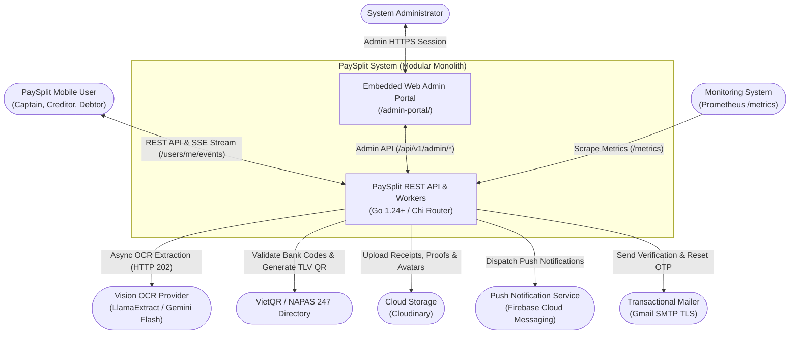
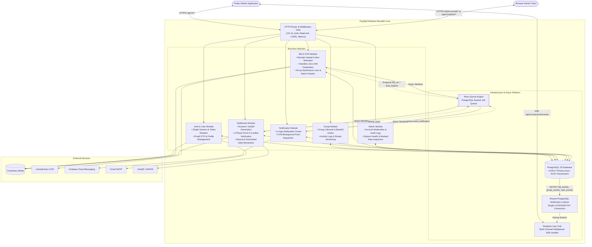
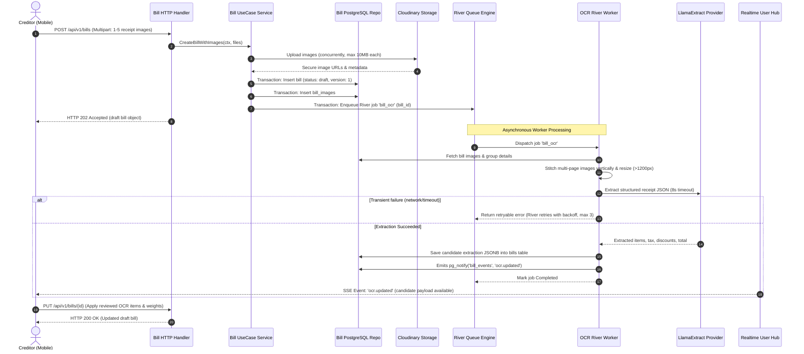
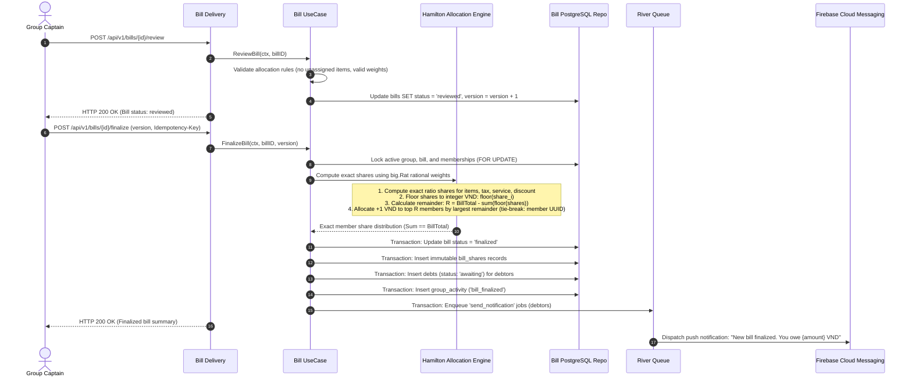
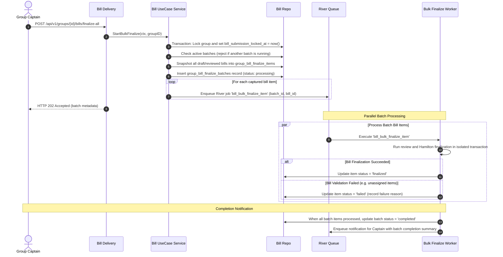
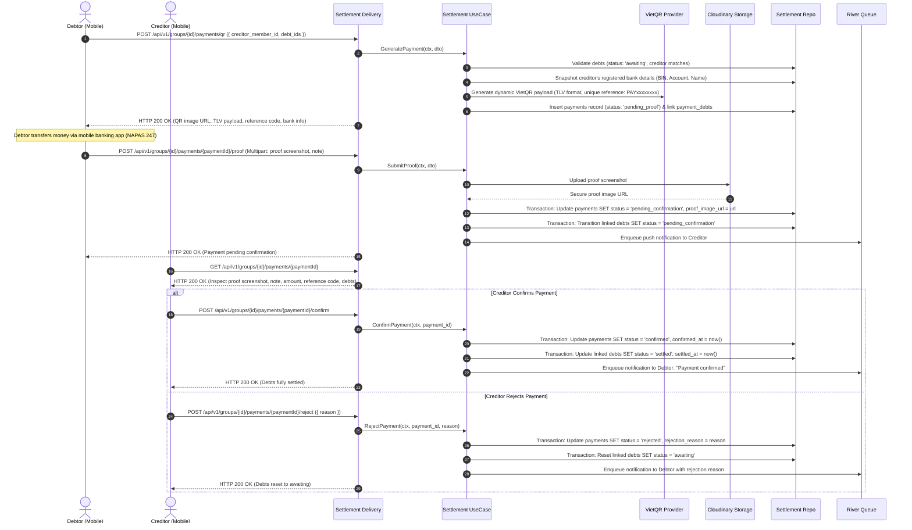
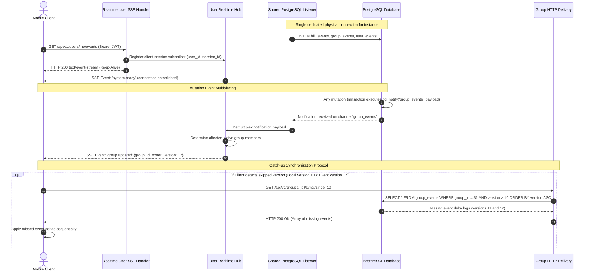
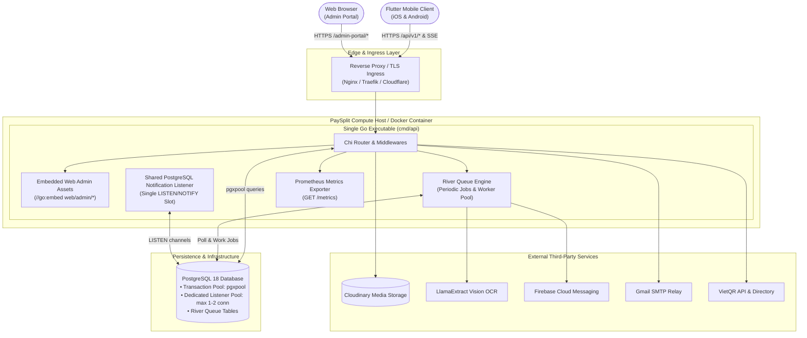
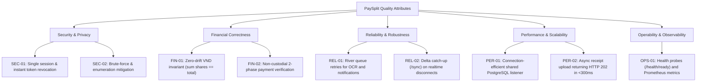

# **PAYSPLIT - SMART BILL-SPLITTING SYSTEM**

## **Technical Design Document**

| PaySplit Team | |
| :--- | :--- |
| **Group members** | Phạm Lê Hoàng Nam<br>Phạm Thanh Lam<br>Nguyễn Trọng Tín |
| **Mentor** | Trần Quang Hiển (VSF-FINTECH-VDTDVTC) |
| **Ext Mentor** | Bành Quốc Danh (VSF-FINTECH&TT-PTPM)<br>Phan Công Huân (VSF-FINTECH-VDTDVTC)<br>Nguyễn Mạnh Tể (VSF-FINTECH&TT-PTPM)<br>Nguyễn Nam Trường (VSF-FINTECH-VDTDVTC) |

<p align="center">– HaNoi, Sep 2026 –</p>

---

## **Table of Contents**

- [**I. Record of Changes**](#i-record-of-changes)
- [**II. Technical Design Document**](#ii-technical-design-document)
  - [**1. System Context**](#1-system-context)
    - [1.1 Context Diagram](#11-context-diagram)
    - [1.2 Actors and External Systems](#12-actors-and-external-systems)
  - [**2. System Architecture**](#2-system-architecture)
    - [2.1 Bounded Contexts and Integration Map](#21-bounded-contexts-and-integration-map)
    - [2.2 Data Ownership and Logical Data Model (ERD)](#22-data-ownership-and-logical-data-model-erd)
    - [2.3 Sequence Diagrams**](#23-sequence-diagrams)
      - [2.3.1 User Registration, Email OTP, and Session Rotation](#231-user-registration-email-otp-and-session-rotation)
      - [2.3.2 Receipt Upload, River Queue Async OCR, and Realtime SSE Delivery](#232-receipt-upload-river-queue-async-ocr-and-realtime-sse-delivery)
      - [2.3.3 Bill Review, Hamilton Split Calculation, and Atomic Finalization](#233-bill-review-hamilton-split-calculation-and-atomic-finalization)
      - [2.3.4 Group Bill Close: Captain Controlled Submission Lock and Bulk Finalize Batch](#234-group-bill-close-captain-controlled-submission-lock-and-bulk-finalize-batch)
      - [2.3.5 Dynamic VietQR Generation, Proof Submission, and Creditor Confirmation](#235-dynamic-vietqr-generation-proof-submission-and-creditor-confirmation)
      - [2.3.6 Unified Realtime Streaming, Shared PostgreSQL Listener, and Sync Recovery](#236-unified-realtime-streaming-shared-postgresql-listener-and-sync-recovery)
    - [2.4 Deployment & Infrastructure Architecture](#24-deployment--infrastructure-architecture)
    - [2.5 Security Architecture & Trust Boundaries](#25-security-architecture--trust-boundaries)
    - [2.6 Quality Attribute Utility Tree](#26-quality-attribute-utility-tree)
    - [2.7 Architecture Decision Records (ADRs)](#27-architecture-decision-records-adrs)

---

## **List of Tables**

- [Table 1. Record of Change](#table-1-record-of-change)
- [Table 2. Actors and External Systems](#table-2-actors-and-external-systems)
- [Table 3. Bounded Contexts](#table-3-bounded-contexts)
- [Table 4. Core Entities & Data Ownership](#table-4-core-entities--data-ownership)
- [Table 5. Trust Boundaries & Security Controls](#table-5-trust-boundaries--security-controls)
- [Table 6. Sensitive Data Protection](#table-6-sensitive-data-protection)
- [Table 7. Quality Attribute Utility Tree](#table-7-quality-attribute-utility-tree)

---

## **List of Figures**

- [Figure 1. System Context Diagram](#figure-1-system-context-diagram)
- [Figure 2. Bounded Context and Integration Map](#figure-2-bounded-context-and-integration-map)
- [Figure 3. Logical Data Model (Entity Relationship Diagram)](#figure-3-logical-data-model-entity-relationship-diagram)
- [Figure 4. Authentication, Registration, and Session Rotation Flow](#figure-4-authentication-registration-and-session-rotation-flow)
- [Figure 5. Asynchronous Receipt OCR Pipeline Flow](#figure-5-asynchronous-receipt-ocr-pipeline-flow)
- [Figure 6. Bill Allocation and Hamilton Finalization Flow](#figure-6-bill-allocation-and-hamilton-finalization-flow)
- [Figure 7. Group Bill Close and Bulk Finalization Flow](#figure-7-group-bill-close-and-bulk-finalization-flow)
- [Figure 8. Dynamic VietQR, Proof Submission, and Confirmation Flow](#figure-8-dynamic-vietqr-proof-submission-and-confirmation-flow)
- [Figure 9. Unified Realtime Event Multiplexing and Delta Catch-up Flow](#figure-9-unified-realtime-event-multiplexing-and-delta-catch-up-flow)
- [Figure 10. Deployment and Infrastructure Topology](#figure-10-deployment-and-infrastructure-topology)
- [Figure 11. Quality Attribute Utility Tree](#figure-11-quality-attribute-utility-tree)

---

# I. Record of Changes

\*A - Added M - Modified D - Deleted

| Date | A*M, D | In charge | Change Description |
| :--- | :---: | :--- | :--- |
| 14/08/2026 | A | NamPLH | Initialize TDD skeleton; import preliminary design goals from PRD. |
| 14/08/2026 | A | All members | Complete initial draft content. |
| 05/09/2026 | M | All members | **Comprehensive Architecture Overhaul:** Synchronize TDD with the production Go 1.24+ backend and Flutter companion app across 16 database migrations and 10 technical specs.<br>• Removed legacy "Trip/End trip" concepts in favor of direct bill-to-debt finalization and on-demand dynamic VietQR coordination.<br>• Added River Queue background architecture on PostgreSQL 18.<br>• Added LlamaExtract multi-image OCR async pipeline (HTTP 202 Accepted).<br>• Documented Hamilton largest-remainder splitting algorithm (`big.Rat`, zero-drift VND).<br>• Added Group Bill Close submission lock/unlock governance and bulk finalize batch processing.<br>• Detailed the Connection-Efficient Realtime architecture (Shared PostgreSQL `LISTEN/NOTIFY` listener, unified `/api/v1/users/me/events` SSE stream, and `/groups/{id}/sync` catch-up).<br>• Updated deployment topology with embedded Web Admin Portal (`//go:embed`), health probes, and Prometheus metrics.<br>• Expanded ADRs to ADR-01 through ADR-11. |

<a id="table-1-record-of-change"></a>
*Table 1. Record of Change*

---

# II. Technical Design Document

## 1. System Context

At the system boundary, **PaySplit** is an intelligent, non-custodial group expense-splitting and settlement coordination platform. Users interact with PaySplit to manage shared group expenses, digitize paper receipts via Vision LLM extraction, compute mathematically fair shares, and settle balances directly peer-to-peer via dynamic VietQR bank transfers (NAPAS 247). PaySplit coordinates transactions and payment proofs without holding custody of user funds (fully complying with Vietnamese Decree 52/2024/NĐ-CP).

### 1.1 Context Diagram



<a id="figure-1-system-context-diagram"></a>
*Figure 1. System Context Diagram*

### 1.2 Actors and External Systems

| Element | Responsibility & Interaction |
| :--- | :--- |
| **PaySplit Mobile User** | Creates groups, invites members, captures bill receipts, edits item assignments, reviews calculations, executes peer-to-peer VietQR transfers, and uploads/confirms payment proofs. |
| **System Administrator** | Moderates user accounts (`active`, `suspended`, `locked`), inspects masked financial records, monitors queue backlog and system health via the embedded Web Admin Portal. |
| **OCR / Vision Provider** | External LLM service (LlamaExtract / Gemini Flash) extracting merchant, line items, taxes, surcharges, and totals from receipt images. |
| **VietQR / NAPAS Directory** | National banking directory and EMVCo/TLV QR specification used to validate bank codes and render scannable interbank transfer codes. |
| **Object Storage (Cloudinary)** | Secure cloud storage hosting bill receipt photos, payment transfer proof screenshots, and user profile avatar images with signed URL access. |
| **Push Notification (FCM)** | Firebase Cloud Messaging delivering real-time background push alerts to Android and iOS mobile devices. |
| **Transactional Email (SMTP)** | Gmail SMTP service delivering 6-digit verification and password-reset OTP codes. |
| **Prometheus Monitoring** | Scrapes `/metrics` for HTTP request latencies, active database connection pools, River worker statuses, and SSE stream counts. |

<a id="table-2-actors-and-external-systems"></a>
*Table 2. Actors and External Systems*

---

## 2. System Architecture

### 2.1 Bounded Contexts and Integration Map

PaySplit is structured as a **Modular Monolith** organized into Clean Architecture domain modules (`internal/modules/*`). Modules communicate synchronously through typed Go interfaces and asynchronously through transactional background jobs using **River Queue** on PostgreSQL and **PostgreSQL `LISTEN/NOTIFY`** for Server-Sent Events (SSE).



<a id="figure-2-bounded-context-and-integration-map"></a>
*Figure 2. Bounded Context and Integration Map*

#### Bounded Context Descriptions

| Context | Core Responsibilities |
| :--- | :--- |
| **Auth & User** | Manages user registration, email OTP verification, credentials hashing (`bcrypt`), JWT token issuance (15m), refresh token rotation (7d) with reuse detection, single-active-session policy enforcement, bank account configuration, and Cloudinary avatar synchronization. |
| **Group & Membership** | Manages group creation, Base62 shareable invitation codes, member capacity limits (max 50), role assignments (Captain vs Member), atomic Captain transfer (`NOWAIT`), group disbandment, activity history logging, and sequential event tracking (`roster_version`, `group_events`). |
| **Bill & OCR** | Handles multipart receipt image ingestion, coordinates asynchronous OCR extraction via River Queue and LlamaExtract, manages item assignments with rational weights (`big.Rat`), provides dry-run allocation validation, executes atomic bill finalization with Hamilton largest-remainder rounding, manages bill voiding, and executes bulk finalize batches. |
| **Settlement** | Manages debts generated from finalized bills, builds on-demand dynamic VietQR transfer payloads (EMVCo/TLV) with unique reference codes (`PAY` + 8 Base32 chars), coordinates 2-phase payment proof submission, processes creditor confirmations/rejections, and operates debt reminder schedules. |
| **Notification** | Maintains transactional in-app notification center records, unread counters, and drives background push notifications via Firebase Cloud Messaging (FCM) using River worker jobs. |
| **Admin** | Exposes administrative endpoints and an embedded web dashboard (`/admin-portal/`) to moderate account statuses (`active`, `suspended`, `locked`), audit account changes, inspect masked banking information, and observe system health probes. |
| **Realtime Engine** | Maintains persistent Server-Sent Events (SSE) connections for mobile clients (`/users/me/events`), driven by a single shared PostgreSQL `LISTEN/NOTIFY` background listener, providing zero-poll data synchronization and delta catch-up endpoints. |

<a id="table-3-bounded-contexts"></a>
*Table 3. Bounded Contexts*

---

### 2.2 Data Ownership and Logical Data Model (ERD)

Each module strictly owns its database tables. Cross-module data integrity is preserved using foreign keys referencing immutable primary keys (UUID v7), while domain boundaries are guarded by domain repositories.

```mermaid
erDiagram
    users ||--o{ sessions : "has"
    sessions ||--o{ session_refresh_tokens : "rotates"
    users ||--o{ user_tokens : "receives"
    users ||--o{ group_members : "participates"
    users ||--o{ notifications : "notified"

    groups ||--o{ group_members : "contains"
    groups ||--o{ group_invites : "issues"
    groups ||--o{ group_activities : "logs"
    groups ||--o{ group_events : "publishes"
    groups ||--o{ bills : "owns"
    groups ||--o{ group_bill_finalize_batches : "executes"

    bills ||--o{ bill_images : "contains"
    bills ||--o{ bill_items : "lists"
    bills ||--o{ bill_shares : "allocates"
    bills ||--o{ debts : "generates"
    bill_items ||--o{ bill_item_assignments : "assigned_to"
    group_members ||--o{ bill_item_assignments : "assignee"

    group_bill_finalize_batches ||--o{ group_bill_finalize_items : "tracks"

    payments ||--o{ payment_debts : "settles"
    debts ||--o{ payment_debts : "linked_to"
    group_members ||--o{ debts : "owes_or_receives"

    users {
        uuid id PK
        string email UK
        string phone UK
        string password_hash
        string display_name
        string status "pending_verification | active | suspended | locked"
        string role "user | admin"
        string default_bank_code
        string default_bank_account
        string default_bank_account_name
        string avatar_url
        timestamptz created_at
    }

    sessions {
        uuid id PK
        uuid user_id FK
        string device_id
        string fcm_token
        string ip_address
        string user_agent
        timestamptz created_at
        timestamptz last_active_at
        timestamptz revoked_at
        string revoke_reason
    }

    session_refresh_tokens {
        uuid id PK
        uuid session_id FK
        string token_hash UK
        timestamptz expires_at
        timestamptz revoked_at
    }

    groups {
        uuid id PK
        string name
        uuid created_by FK
        string status "active | archived"
        int64 roster_version
        timestamptz bill_submission_locked_at
        timestamptz created_at
    }

    group_members {
        uuid id PK
        uuid group_id FK
        uuid user_id FK
        string role "captain | member"
        string status "active | left | removed"
        timestamptz joined_at
        timestamptz left_at
        string left_reason
    }

    group_events {
        uuid group_id FK
        int64 version PK
        string event_type
        jsonb payload
        timestamptz created_at
    }

    bills {
        uuid id PK
        uuid group_id FK
        uuid creditor_id FK
        string name
        int64 subtotal
        int64 service_charge
        int64 vat
        int64 general_discount
        int64 total
        string status "draft | reviewed | finalized | voided"
        int64 version
        timestamptz reviewed_at
        timestamptz finalized_at
        timestamptz voided_at
    }

    bill_items {
        uuid id PK
        uuid bill_id FK
        string name
        int64 price
        int quantity
        int64 subtotal
        int64 discount
    }

    bill_item_assignments {
        uuid id PK
        uuid bill_item_id FK
        uuid member_id FK
        int weight_numerator
        int weight_denominator
    }

    bill_shares {
        uuid id PK
        uuid bill_id FK
        uuid member_id FK
        int64 final_amount
        jsonb calculation_breakdown
    }

    debts {
        uuid id PK
        uuid bill_id FK
        uuid group_id FK
        uuid debtor_id FK
        uuid creditor_id FK
        int64 amount
        string status "awaiting | pending_confirmation | settled | voided"
        uuid payment_id FK
        timestamptz settled_at
        int reminder_count
        timestamptz last_reminded_at
    }

    payments {
        uuid id PK
        uuid group_id FK
        uuid debtor_id FK
        uuid creditor_id FK
        int64 total_amount
        string reference_code UK "PAY + 8 Base32"
        string status "pending_proof | pending_confirmation | confirmed | rejected"
        string qr_image_url
        string proof_image_url
        string note
        string rejection_reason
        timestamptz confirmed_at
        timestamptz rejected_at
    }

    payment_debts {
        uuid payment_id FK
        uuid debt_id FK
    }

    group_bill_finalize_batches {
        uuid id PK
        uuid group_id FK
        uuid requested_by_member_id FK
        string status "queued | processing | completed"
        int target_count
        int finalized_count
        int failed_count
        timestamptz started_at
        timestamptz completed_at
    }

    group_bill_finalize_items {
        uuid batch_id PK,FK
        uuid bill_id PK
        int bill_version
        boolean captured_reviewed
        string status "pending | finalized | failed"
        string error_code
        timestamptz processed_at
    }

    notifications {
        uuid id PK
        uuid user_id FK
        string type
        string title
        string body
        jsonb data
        boolean is_read
        timestamptz created_at
    }
```



<a id="figure-3-logical-data-model-entity-relationship-diagram"></a>
*Figure 3. Logical Data Model (Entity Relationship Diagram)*

#### Table Responsibilities and Key Invariants

| Table | Owning Context | Key Architectural Constraints & Invariants |
| :--- | :--- | :--- |
| `users` | Auth | Strict uniqueness on `email` and E.164 `phone`. Passwords stored strictly as `bcrypt` hashes (cost 10). Sensitive bank credentials masked on read. |
| `sessions` & `session_refresh_tokens` | Auth | Enforces **single active session** per user via partial unique index `uq_sessions_one_active_per_user (user_id) WHERE revoked_at IS NULL`. Token rotation stores SHA-256 hash in `session_refresh_tokens`. |
| `groups` & `group_members` | Group | Group membership capped at 50 active members. `roster_version` is a strictly monotonic sequential counter incremented inside `LockActiveGroup` transactions to order group mutations. |
| `group_events` | Group | Append-only event log providing delta catch-up synchronization (`GET /api/v1/groups/{id}/sync?since=N`). Primary key `(group_id, version)` ensures gapless commit ordering. |
| `bills`, `bill_items`, `bill_item_assignments` | Bill | Uses optimistic locking (`version` CAS check). All modifications to line items recalculate derived total and demote `reviewed` status back to `draft`. Rational assignment weights (`big.Rat`). |
| `bill_shares` | Bill | Immutable snapshot computed via the Hamilton method. Invariant: $\sum \text{final\_amount} = \text{bill.total}$ down to 1 VND. |
| `debts` | Settlement | Represents individual pairwise obligations. Status lifecycle: `awaiting` $\rightarrow$ `pending_confirmation` $\rightarrow$ `settled` (or `voided`). |
| `payments` & `payment_debts` | Settlement | Unique payment reference code `PAY` + 8 Base32 characters. `payment_debts` junction supports multi-debt QR aggregation. Dual-phase submission prevents double payments or conflicting QR intents. |
| `group_bill_finalize_batches` & `group_bill_finalize_items` | Bill | Tracks bulk finalization jobs. Atomic row-lock prevents overlapping batches per group (`queued` / `processing`). |
| `notifications` | Notification | In-app notification center records with optimistic read state and unread badge counters. |

<a id="table-4-core-entities--data-ownership"></a>
*Table 4. Core Entities & Data Ownership*

---

### 2.3 Sequence Diagrams

#### 2.3.1 User Registration, Email OTP, and Session Rotation

PaySplit enforces strict account verification and a **single active device session** policy. Any sign-in on a new device immediately revokes any previous active session with `replaced_by_sign_in`. Refresh token rotation incorporates reuse detection: attempting to use an already-rotated token immediately revokes the entire session family.

```mermaid
sequenceDiagram
    autonumber
    actor User as Mobile Client
    participant API as Auth Delivery / Router
    participant Svc as Auth UseCase Service
    participant Repo as Auth PostgreSQL Repo
    participant SMTP as Gmail SMTP Provider

    Note over User, SMTP: 1. Sign Up & OTP Verification Flow
    User->>API: POST /api/v1/auth/sign-up (Email, Phone, Name, Password)
    API->>Svc: SignUp(ctx, dto)
    Svc->>Repo: Check email/phone uniqueness & create user (status: pending_verification)
    Svc->>Repo: Generate 6-digit OTP, store SHA-256 hash in user_tokens (10m TTL)
    Svc-->>SMTP: Send verification email (non-blocking)
    API-->>User: HTTP 201 Created (verification_email_sent: true)

    User->>API: POST /api/v1/auth/verify-email (Email, OTP)
    API->>Svc: VerifyEmail(ctx, dto)
    Svc->>Repo: Validate OTP (max 5 attempts, supersede on 5th failure)
    Repo->>Repo: Update user status = 'active', mark token used
    API-->>User: HTTP 200 OK (Account activated; redirect to login)

    Note over User, SMTP: 2. Sign In & Session Rotation
    User->>API: POST /api/v1/auth/sign-in (Email, Password, device_id, fcm_token)
    API->>Svc: SignIn(ctx, dto)
    Svc->>Repo: Check login rate limits & verify bcrypt hash
    Svc->>Repo: Revoke existing active session (reason: 'replaced_by_sign_in')
    Svc->>Repo: Insert new session (stores SHA-256 hash of refresh_token, binds device_id)
    Svc->>Svc: Issue JWT Access Token (15m, includes sid) & Refresh Token (7d)
    API-->>User: HTTP 200 OK (access_token, refresh_token, user_profile)

    Note over User, SMTP: 3. Token Refresh with Reuse Detection
    User->>API: POST /api/v1/auth/refresh (refresh_token)
    API->>Svc: RefreshToken(ctx, token)
    Svc->>Repo: Find session by hashed token
    alt Token already used (Reuse Detected!)
        Svc->>Repo: Revoke session immediately (reason: 'reuse_detected')
        API-->>User: HTTP 401 Unauthorized (SESSION_REVOKED)
    else Valid unused token
        Svc->>Repo: Rotate token (update hash to new token, extend session)
        API-->>User: HTTP 200 OK (new access_token, new refresh_token)
    end
```

<a id="figure-4-authentication-registration-and-session-rotation-flow"></a>
*Figure 4. Authentication, Registration, and Session Rotation Flow*

---

#### 2.3.2 Receipt Upload, River Queue Async OCR, and Realtime SSE Delivery

Receipt image processing is fully asynchronous. The API persists uploaded receipt photos to Cloudinary, creates a `draft` bill record, and enqueues a `bill_ocr` job in River Queue in a single database transaction, immediately returning HTTP `202 Accepted`. Mobile clients observe extraction progress in real time via Server-Sent Events.



<a id="figure-5-asynchronous-receipt-ocr-pipeline-flow"></a>
*Figure 5. Asynchronous Receipt OCR Pipeline Flow*

---

#### 2.3.3 Bill Review, Hamilton Split Calculation, and Atomic Finalization

To guarantee zero fractional VND currency drift, PaySplit implements the **Hamilton Largest-Remainder Method** with rational `big.Rat` arithmetic. Invariant: the sum of finalized member shares and debts strictly equals the derived bill total ($\sum \text{shares} = \text{total}$).



<a id="figure-6-bill-allocation-and-hamilton-finalization-flow"></a>
*Figure 6. Bill Allocation and Hamilton Finalization Flow*

---

#### 2.3.4 Group Bill Close: Captain Controlled Submission Lock and Bulk Finalize Batch

The Captain can lock (`POST /api/v1/groups/{id}/bills/lock-submissions`) or unlock (`POST /api/v1/groups/{id}/bills/unlock-submissions`) group bill submissions to control expense entries during billing periods. When executing group close, the Captain initiates a bulk finalize operation (`POST /api/v1/groups/{id}/bills/finalize-all`) which locks submission immediately, captures every current draft bill into `group_bill_finalize_items`, and enqueues background worker jobs in River Queue to validate and finalize each bill independently.



<a id="figure-7-group-bill-close-and-bulk-finalization-flow"></a>
*Figure 7. Group Bill Close and Bulk Finalization Flow*

---

#### 2.3.5 Dynamic VietQR Generation, Proof Submission, and Creditor Confirmation

PaySplit coordinates payments directly peer-to-peer without holding custody. Debtors scan an on-demand VietQR encoding the creditor's bank account and a unique reference code (`PAY` + 8 Base32 chars). Confirmation uses a 2-phase submission model with Cloudinary-hosted transfer proofs.



<a id="figure-8-dynamic-vietqr-proof-submission-and-confirmation-flow"></a>
*Figure 8. Dynamic VietQR, Proof Submission, and Confirmation Flow*

---

#### 2.3.6 Unified Realtime Streaming, Shared PostgreSQL Listener, and Sync Recovery

To conserve database connection pool slots, PaySplit replaces individual per-resource or per-screen connections with a **single shared PostgreSQL `LISTEN/NOTIFY` listener** per backend instance. All client live updates are multiplexed over a single authenticated SSE connection per device session (`/users/me/events`). If a client drops packets or reconnects, it catches up using the `/sync` delta API.



<a id="figure-9-unified-realtime-event-multiplexing-and-delta-catch-up-flow"></a>
*Figure 9. Unified Realtime Event Multiplexing and Delta Catch-up Flow*

---

### 2.4 Deployment & Infrastructure Architecture

PaySplit is deployed as a consolidated, resource-efficient containerized binary. The Go backend directly serves both the RESTful API routes and the embedded static Web Admin Portal.



<a id="figure-10-deployment-and-infrastructure-topology"></a>
*Figure 10. Deployment and Infrastructure Topology*

---

### 2.5 Security Architecture & Trust Boundaries

PaySplit protects sensitive user credentials, payment records, bank account details, and receipt images across all communication channels.

| Boundary | Architectural Security Controls |
| :--- | :--- |
| **Mobile / Web Client to API Edge** | Enforced TLS 1.3 encryption, strict CORS whitelist policy, HTTP request timeout (30s), rate-limiting middleware (IP-based and account-based). |
| **Authentication Boundary** | Stateless 15-minute JWT Access Tokens signed with HMAC-SHA256. Validated against active database sessions (`liveAuth` middleware) to ensure immediate revocation propagation. |
| **Session & Device Security** | Enforces single active session per user. Refresh tokens rotated on every use with cryptographic SHA-256 hashing. Automatic revocation of session families upon detected token replay. |
| **Database Boundary** | Parameterized queries exclusively via `sqlc` to eliminate SQL injection. Passwords hashed using `bcrypt` (cost 10). Row-level locking (`LockActiveGroup`) prevents concurrent race conditions. |
| **Object Storage Boundary** | Private storage buckets in Cloudinary. Receipt and proof uploads authenticated via signed temporary parameters. Access limited to authenticated group members. |
| **Administrative Access** | Dedicated role-based access control (`role = 'admin'`). Sensitive banking account numbers are automatically masked on administrative inspection views. |

<a id="table-5-trust-boundaries--security-controls"></a>
*Table 5. Trust Boundaries & Security Controls*

#### Sensitive Data Classification

| Data Element | Storage Classification | Access & Masking Rules |
| :--- | :--- | :--- |
| **Account Password** | Bcrypt hash (Cost = 10) | Never logged, never returned in API responses. Plaintext discarded immediately after evaluation. |
| **Refresh Token** | SHA-256 hash | Stored exclusively as a cryptographic digest in the `sessions` table. |
| **Bank Account Number** | Plaintext in transactional database | Returned in full only to the account owner and debtors initiating VietQR transfers. Masked (e.g. `******1234`) in admin portals. |
| **Receipt & Proof Images** | Private Cloudinary Assets | Stored under randomized UUID paths. URLs generated with signed expiration parameters. |
| **Verification OTP** | SHA-256 hash | 6-digit numeric OTP (10-minute TTL). Invalidated permanently after 5 failed verification attempts. |

<a id="table-6-sensitive-data-protection"></a>
*Table 6. Sensitive Data Protection*

---

### 2.6 Quality Attribute Utility Tree



<a id="figure-11-quality-attribute-utility-tree"></a>
*Figure 11. Quality Attribute Utility Tree*

| ID | Quality Scenario | Importance | Difficulty |
| :--- | :--- | :---: | :---: |
| **SEC-01** | When a user signs in on Device B, Device A's session is revoked instantly; subsequent requests with Device A's access token fail with `401 SESSION_REVOKED`. | High | Medium |
| **SEC-02** | An attacker attempting password guessing is throttled after 5 failed attempts with a 15-minute lock; OTP verification is permanently superseded after 5 failures. | High | Low |
| **FIN-01** | Splitting any bill amount among up to 50 members with fractional weights results in integer VND allocations whose sum strictly equals the bill total with 0 VND drift. | High | High |
| **FIN-02** | Debtor payment submission creates an immutable proof snapshot; creditor confirmation transitions debt to `settled` all-or-nothing without fund custody risk. | High | Medium |
| **REL-01** | OCR extraction failure or timeout does not lose receipt drafts; River queue retries transient errors up to 3 times before falling back to manual entry. | High | Medium |
| **REL-02** | When a mobile device reconnects after network drop, it calls `/groups/{id}/sync?since=N` to fetch missed event deltas without requiring a full page refresh. | High | Medium |
| **PER-01** | Scaling to hundreds of concurrent SSE connections utilizes only 1 dedicated PostgreSQL connection for `LISTEN/NOTIFY`, preventing database connection exhaustion. | High | High |
| **PER-02** | Multipart receipt uploads return HTTP `202 Accepted` within 300ms, delegating resizing, stitching, and OCR extraction to background River workers. | High | Low |
| **OPS-01** | Kubernetes readiness probes monitor database ping via `/health/ready`; Prometheus scrapes queue depths and response latencies via `/metrics`. | Medium | Low |

<a id="table-7-quality-attribute-utility-tree"></a>
*Table 7. Quality Attribute Utility Tree*

---

### 2.7 Architecture Decision Records (ADRs)

#### ADR-01 — Modular Monolith Architecture
- **Context:** PaySplit requires rapid feature development, strict transactional consistency across group ledgers, and low operational overhead for a small engineering team.
- **Decision:** Build PaySplit as a Modular Monolith in Go 1.24+ with Clean Architecture. Modules (`auth`, `group`, `bill`, `settlement`, `notification`, `admin`) maintain private domains and repositories while running inside a single deployable process.
- **Consequences:** Eliminates distributed network hops, avoids complex 2-phase commit protocols across microservices, and enables straightforward single-binary deployments while retaining clean boundaries for future extraction.

#### ADR-02 — PostgreSQL 18 with pgx/v5 and sqlc
- **Context:** Financial applications require ACID guarantees, row-level locking, and high-performance database connectivity without ORM overhead or runtime reflection bugs.
- **Decision:** Standardize on PostgreSQL 18 with `jackc/pgx/v5` connection pooling and `sqlc` for compile-time type-safe query generation.
- **Consequences:** SQL queries remain auditable and type-safe in Go; schema changes are strictly governed by centralized Goose migrations.

#### ADR-03 — UUID v7 Primary Keys
- **Context:** Random UUIDv4 identifiers cause severe B-tree index fragmentation in high-write transactional databases, while sequential integer IDs expose business metrics to enumeration attacks.
- **Decision:** Adopt time-ordered UUID v7 primary keys generated application-side across all database tables.
- **Consequences:** Preserves natural chronological indexing locality, avoids ID collision across distributed clients, and prevents predictable sequential ID enumeration.

#### ADR-04 — River Queue on PostgreSQL for Background Jobs
- **Context:** Long-running operations (receipt OCR, push notifications, batch finalizations, reminders) must not block interactive API requests. Introducing Redis or RabbitMQ adds external infrastructure dependencies and risks dual-write anomalies.
- **Decision:** Implement **River Queue** (`github.com/riverqueue/river`), a transactional job queue running directly on PostgreSQL.
- **Consequences:** Jobs are enqueued inside the exact same ACID database transactions that modify domain entities (e.g. inserting a bill and enqueuing OCR simultaneously). If the transaction rolls back, the job is never enqueued, completely preventing orphaned jobs.

#### ADR-05 — Single Active Session & Refresh Token Rotation with Reuse Detection
- **Context:** Mobile users require persistent login, but stolen tokens must not grant perpetual access. Multiple concurrent sessions complicate security audits.
- **Decision:** Issue short-lived JWT access tokens (15m) containing a session ID (`sid`), paired with long-lived refresh tokens (7d). Enforce a single active session per user in PostgreSQL. Rotate refresh tokens on every refresh and detect reuse by revoking the entire session family if an already-rotated token is submitted.
- **Consequences:** Compromised refresh tokens are rendered useless upon first use; user session revocation takes effect across all requests within the 15-minute access token window (or immediately via `liveAuth`).

#### ADR-06 — Hamilton Largest-Remainder Method (`big.Rat`) for Zero-Drift Financial Splitting
- **Context:** Dividing bill amounts, service charges, VAT, and discounts across members with unequal weights produces fractional VND amounts. Financial systems cannot create or destroy money through floating-point rounding.
- **Decision:** Calculate participant shares using rational arithmetic (`math/big.Rat`) and distribute remaining integer VND via the **Hamilton (Largest-Remainder) method**. Distribute $+1$ VND to participants with the largest fractional remainders, breaking ties deterministically by member UUID.
- **Consequences:** Guarantees that $\sum \text{shares} = \text{bill\_total}$ down to exactly 1 VND, eliminating creditor bias and mathematical drift with 100% deterministic reproducibility.

#### ADR-07 — Shared PostgreSQL Notification Listener for Realtime SSE
- **Context:** Serving Server-Sent Events (SSE) to hundreds of mobile devices using dedicated PostgreSQL `LISTEN` connections quickly exhausts database connection limits (`max_connections`).
- **Decision:** Implement a **Shared PostgreSQL Notification Listener** that maintains exactly one physical database connection listening to `bill_events`, `group_events`, and `user_events`. Multiplex all outbound events to mobile clients through a single user SSE stream (`/api/v1/users/me/events`).
- **Consequences:** Decouples active mobile client count from database connection pool usage, ensuring stable performance with predictable connection overhead.

#### ADR-08 — Non-Custodial Direct Peer-to-Peer Settlement (VietQR & Proof Verification)
- **Context:** Holding user money or operating custodial wallet balances requires an intermediary payment license under Vietnamese Decree 52/2024/NĐ-CP and incurs significant compliance and security liabilities.
- **Decision:** PaySplit acts purely as a settlement coordinator. The system generates standardized dynamic VietQR codes for direct interbank transfers (NAPAS 247) and coordinates manual creditor verification of uploaded transfer proofs.
- **Consequences:** Zero custodial risk, no legal intermediary licensing overhead, and complete transparency for participating members.

#### ADR-09 — Captain Controlled Group Bill Submission Lock & Unlock and Bulk Finalize Batch
- **Context:** When a group activity concludes or enters billing reconciliation, the Captain needs to control expense entries (freezing or reopening submissions) and resolve all outstanding drafts without being blocked by concurrent member uploads.
- **Decision:** Implement an atomic bill submission lock (`POST /groups/{id}/bills/lock-submissions` setting `groups.bill_submission_locked_at`) with unlock capability (`POST /groups/{id}/bills/unlock-submissions`), alongside an asynchronous bulk finalize engine (`POST /groups/{id}/bills/finalize-all`) that captures all pending bills into `group_bill_finalize_items` processed by independent River worker jobs.
- **Consequences:** Provides granular governance for the Captain, ensures that draft bills are evaluated and finalized independently without one failing bill aborting the entire group batch, and allows reopening submissions if additional receipts must be filed.

#### ADR-10 — Embedded Web Admin Portal via Go Embed
- **Context:** System administrators require an interface to inspect accounts, mask banking credentials, and review queue metrics without maintaining a separate frontend deployment pipeline.
- **Decision:** Embed the static Web Admin Portal directly into the compiled Go binary using Go standard library `//go:embed web/admin/*` and serve it under `/admin-portal/`.
- **Consequences:** Single-binary deployment with zero external web server setup, zero Node.js runtime overhead on the server, and full access control guarded by backend session cookies.

#### ADR-11 — Sequential Group Event Catch-up Synchronization (`roster_version` & `/sync`)
- **Context:** Mobile clients on unreliable cellular connections may drop SSE packets or experience temporary disconnects, causing local group state to drift.
- **Decision:** Track every group mutation using a strictly monotonic `roster_version` incremented under a row-level lock. Persist every event in `group_events`. Provide a delta catch-up endpoint `GET /api/v1/groups/{id}/sync?since=N`.
- **Consequences:** If a client receives an SSE event with a version gap (e.g. receiving version 15 when at version 12), it seamlessly queries `/sync?since=12` to fetch the missing events without performing full, expensive screen re-fetches.
