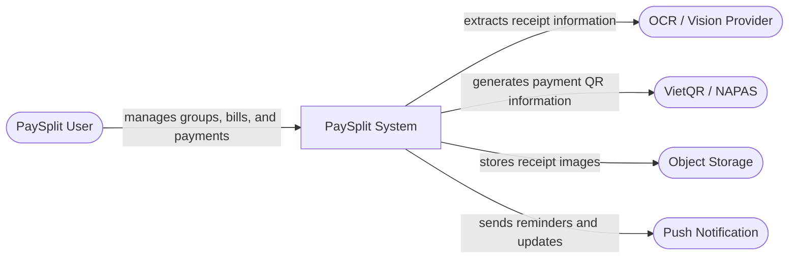
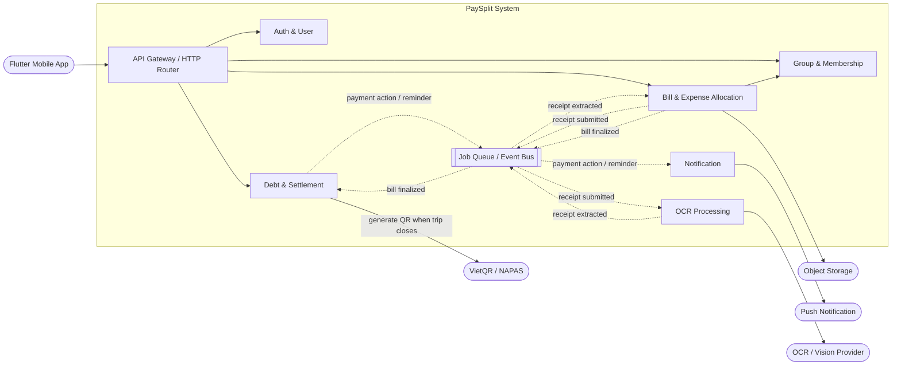
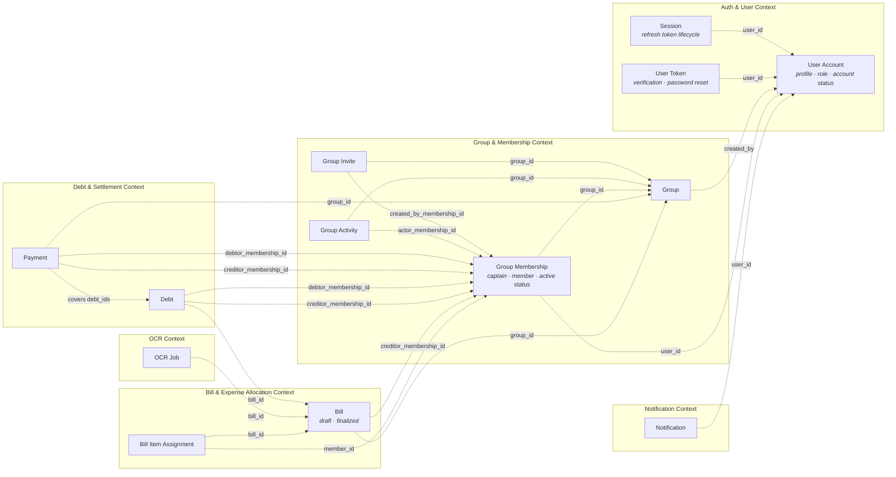
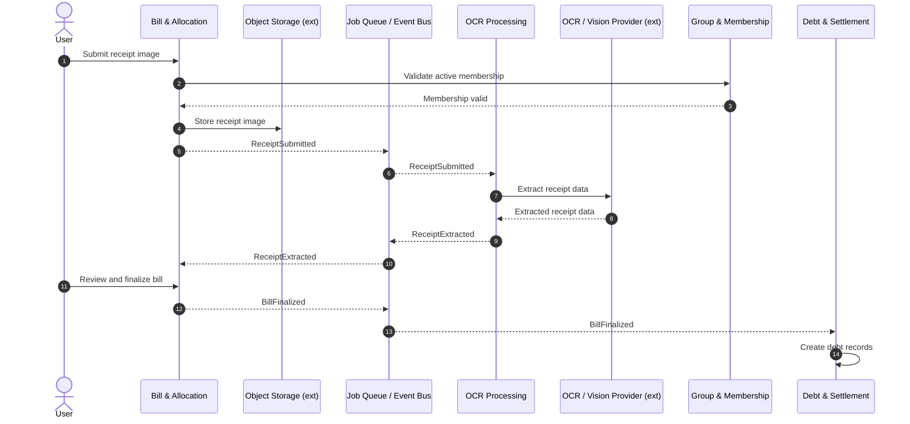
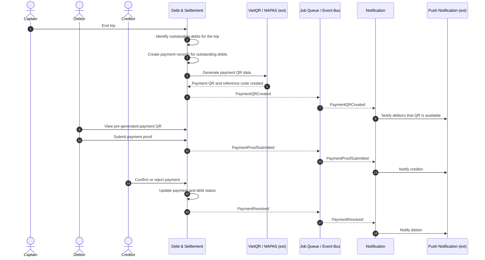
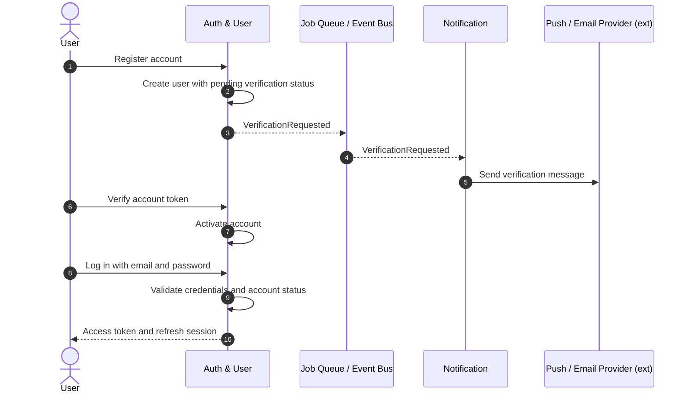
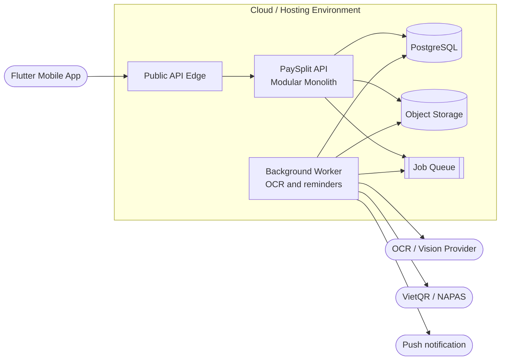
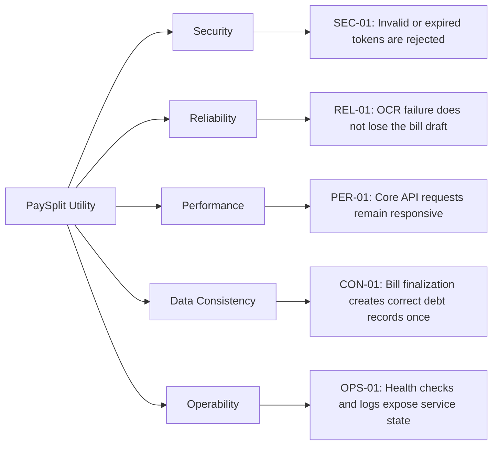

# **PAYSPLIT - SMART BILL-SPLITTING SYSTEM**

## **Technical Design Document**

| PaySplit Team | |
| :--- | :--- |
| **Group members** | Phạm Lê Hoàng Nam Phạm Thanh Lam Nguyễn Trọng Tín |
| **Mentor** | Trần Quang Hiển (VSF-FINTECH-VDTDVTC) |
| **Ext Mentor** | Bành Quốc Danh (VSF-FINTECH&TT-PTPM) Phan Công Huân (VSF-FINTECH-VDTDVTC) Nguyễn Mạnh Tể (VSF-FINTECH&TT-PTPM) Nguyễn Nam Trường (VSF-FINTECH-VDTDVTC) |

– HaNoi, Aug 2026 –

---

## **Table of Contents**

- [**I. Record of Changes**](#i-record-of-changes)
- [**II. Technical Design Document**](#ii-technical-design-document)
  - [**1. System Context**](#1-system-context)
    - [Actors and External Systems](#actors-and-external-systems)
  - [**2. System Architecture**](#2-system-architecture)
    - [2.1. Bounded Context and Integration Map](#21-bounded-context-and-integration-map)
    - [2.2. Data Ownership and Logical Data Model](#22-data-ownership-and-logical-data-model)
    - [2.3. Sequence Diagrams](#23-sequence-diagrams)
      - [2.3.1. Receipt Upload to Debt Creation](#231-receipt-upload-to-debt-creation)
      - [2.3.2. Payment QR to Settlement Confirmation](#232-payment-qr-to-settlement-confirmation)
      - [2.3.3. User Registration and Authentication](#233-user-registration-and-authentication)
    - [2.4. Deployment Architecture](#24-deployment-architecture)
    - [2.5. Security Architecture](#25-security-architecture)
    - [2.6. Quality Attribute Utility Tree](#26-quality-attribute-utility-tree)
    - [2.7. Architecture Decision Records](#27-architecture-decision-records)

---

## **List of Tables**

- [Table 1. Record of Change](#table-1-record-of-change)
- [Table 2. Actors and External Systems](#table-2-actors-and-external-systems)
- [Table 3. Bounded Contexts](#table-3-bounded-contexts)
- [Table 4. Trust Boundaries](#table-4-trust-boundaries)
- [Table 5. Sensitive Data](#table-5-sensitive-data)
- [Table 6. Quality Attribute Utility Tree](#table-6-quality-attribute-utility-tree)

---

## **List of Figures**

- [Figure 1. System Context](#figure-1-system-context)
- [Figure 2. Bounded Context and Integration Map](#figure-2-bounded-context-and-integration-map)
- [Figure 3. Data Ownership and Logical Data Model](#figure-3-data-ownership-and-logical-data-model)
- [Figure 4. Receipt Upload to Debt Creation Sequence Diagrams](#figure-4-receipt-upload-to-debt-creation-sequence-diagrams)
- [Figure 5. Payment QR to Settlement Confirmation Sequence Diagrams](#figure-5-payment-qr-to-settlement-confirmation-sequence-diagrams)
- [Figure 6. User Registration and Authentication Sequence Diagrams](#figure-6-user-registration-and-authentication-sequence-diagrams)
- [Figure 7. Deployment Architecture](#figure-7-deployment-architecture)
- [Figure 8. Quality Attribute Utility Tree](#figure-8-quality-attribute-utility-tree)

---

# I. Record of Changes

\*A - Added M - Modified D - Deleted

| Date | A*M, D | In charge | Change Description |
| :--- | :--- | :--- | :--- |
| 14/08/2026 | A | NamPLH | Initialise TDD skeleton; import design goals from PRD. |
| 14/08/2026 | A | All members | Complete the document content. |
| | | | |
| | | | |
| | | | |
| | | | |
| | | | |
| | | | |
| | | | |
| | | | |
| | | | |
| | | | |
| | | | |
| | | | |

*Table 1. Record of Change*

---

# II. Technical Design Document

## 1. System Context

At the system boundary, PaySplit is treated as one product. Users interact with PaySplit to manage group expenses and payments, while PaySplit relies on external providers for receipt extraction, QR payment information, object storage, and notifications.

*Figure 1. System Context*

### Actors and External Systems

| Element | Responsibility or Interaction |
| :--- | :--- |
| PaySplit User | Creates groups, manages bills, pays debts, and confirms relevant payment activity. |
| OCR / Vision Provider | Extracts merchant, item, and total information from receipt images. |
| VietQR / NAPAS | Provides QR-compatible payment information for bank transfers. |
| Object Storage | Stores receipt images and optional payment proof images. |
| Push Notification | Delivers reminders, confirmations, and account-related notifications. |

*Table 2. Actors and External Systems*

---

## 2. System Architecture

### 2.1. Bounded Context and Integration Map

PaySplit is implemented as a modular monolith with independently owned Bounded Contexts. Contexts expose business capabilities to one another while keeping their internal handlers, services, repositories, and schemas private. Synchronous calls are used where a caller requires an immediate decision; long-running work such as OCR and notification delivery is coordinated asynchronously.

*Figure 2. Bounded Context and Integration Map*

**Notation**
- Solid arrows: synchronous calls between contexts or external systems.
- Dashed arrows: asynchronous events delivered through the Job Queue/Event Bus.
- Components inside the PaySplit System boundary: internal system components.
- Components outside the boundary: external systems or third-party providers.

**Bounded Contexts**

| Context | Main Responsibility |
| :--- | :--- |
| Auth & User | Authentication, user accounts, profiles, roles, and sessions. |
| Group & Membership | Groups, memberships, group roles, invitations, and activity history. |
| Bill & Expense Allocation | Bills, receipt review, bill items, and allocation of shared expenses. |
| OCR Processing | Asynchronous extraction of structured data from receipt images. |
| Debt & Settlement | Creation, tracking, confirmation, rejection, and settlement of debts and payments; generates pre-created VietQR payloads when a trip closes. |
| Notification | Push notifications for events and reminders. |
| Job Queue / Event Bus | Coordination of long-running background work and asynchronous events. |

*Table 3. Bounded Contexts*

**Integration Flows**
- Users access PaySplit through the Flutter Mobile Application and the API Gateway.
- Bill & Allocation validates group membership with the Group context before performing bill operations.
- When a receipt image is submitted, Bill & Allocation publishes an event for OCR Processing. The extracted result is returned asynchronously to Bill & Allocation.
- When a bill is finalized, Bill & Allocation publishes an event for Debt & Settlement to create debt records.
- Debt & Settlement invokes the Payment context to generate VietQR payment requests.
- Payment actions and debt reminders are sent asynchronously to the Notification context.
- OCR Processing, Payment, and Notification integrate respectively with the OCR/Vision Provider, VietQR/NAPAS, and Push Notification Provider.

---

### 2.2. Data Ownership and Logical Data Model

Each Bounded Context owns the aggregates that represent its business responsibilities. Other contexts refer to those aggregates by identifier rather than modifying their data directly. This keeps transaction boundaries explicit and prevents the system from becoming tightly coupled around a shared database model.

*Figure 3. Data Ownership and Logical Data Model*

---

### 2.3. Sequence Diagrams

#### 2.3.1. Receipt Upload to Debt Creation

*Figure 4. Receipt Upload to Debt Creation Sequence Diagrams*

**Step summary:**
- The user submits a receipt and the Bill & Allocation context verifies that the user belongs to the group.
- The receipt image is stored, then a ReceiptSubmitted event starts asynchronous OCR processing.
- OCR extracts the receipt data and returns it to Bill & Allocation through ReceiptExtracted.
- The user reviews the extracted data and finalizes the bill.
- BillFinalized is consumed by Debt & Settlement, which creates the resulting debt records.

---

#### 2.3.2. Payment QR to Settlement Confirmation

*Figure 5. Payment QR to Settlement Confirmation Sequence Diagrams*

**Step summary**
- The debtor selects outstanding debts and requests a payment.
- Debt & Settlement creates a payment record, then calls VietQR / NAPAS to generate the QR payload and reference code for each outstanding debt.
- The debtor pays externally and submits payment proof to the system.
- PaymentProofSubmitted notifies the creditor that confirmation is required.
- The creditor confirms or rejects the payment; Debt & Settlement updates payment and debt status.
- PaymentResolved notifies the debtor of the final settlement result.

---

#### 2.3.3. User Registration and Authentication

*Figure 6. User Registration and Authentication Sequence Diagrams*

**Step summary**
- The user registers an account, which is created with a pending-verification status.
- VerificationRequested triggers a verification message through the Notification context.
- The user submits the verification token and Auth & User activates the account.
- The user logs in with email and password.
- Auth & User validates the credentials and account status, then returns an access token and refresh session.

---

### 2.4. Deployment Architecture

The mobile application reaches the public API edge, which forwards requests to the PaySplit modular monolith. PostgreSQL stores transactional data, object storage holds user-uploaded images, and the job queue separates background processing from interactive API work. OCR, VietQR, and notification providers remain outside the PaySplit hosting boundary.

*Figure 7. Deployment Architecture*

During local development, PostgreSQL runs through Docker Compose. A production deployment can replace local services with managed PostgreSQL, object storage, and managed OCR and notification providers without changing the Bounded Context boundaries.

---

### 2.5. Security Architecture

PaySplit protects user credentials, account data, bank details, receipt images, and payment proof. Private resources require a valid authenticated identity; group membership and group-role rules determine whether an action is permitted. The API rejects invalid tokens, abusive traffic, and requests that violate configured cross-origin rules.

| Boundary | Security Control |
| :--- | :--- |
| Mobile client to API | HTTPS, request validation, rate limiting, CORS policy, request timeout. |
| API authentication boundary | JWT signature, issuer, expiry, user identity, and role validation. |
| Private API routes | Authentication middleware and role-based authorization. |
| Database boundary | Environment-based credentials, parameterized queries, password hashes only. |
| Object storage boundary | Private object access and controlled upload/download authorization. |
| External provider boundary | Secrets stored outside source control, explicit outbound integration, input/output validation. |

*Table 4. Trust Boundaries*

| Data | Protection Requirement |
| :--- | :--- |
| Password | Store only bcrypt hashes; never return or log plaintext passwords. |
| JWT secret | Store in environment configuration; never commit it. |
| Bank account information | Restrict access to authorized users and mask it in administrative views. |
| Receipt and payment proof images | Keep private and grant access only to authorized group members. |
| Refresh tokens | Store hashed values and support revocation by session/device. |

*Table 5. Sensitive Data*

---

### 2.6. Quality Attribute Utility Tree

The architecture prioritizes security, reliability, responsiveness, data consistency, and operational visibility. The scenarios below identify the quality attributes that have the strongest influence on architectural decisions across the system.

*Figure 8. Quality Attribute Utility Tree*

| ID | Quality Scenario | Importance | Difficulty |
| :--- | :--- | :--- | :--- |
| SEC-01 | The API rejects a request with a missing, invalid, expired, or tampered JWT. | High | High |
| REL-01 | An OCR provider failure leaves the receipt image and bill draft available for manual review. | High | High |
| PER-01 | Core API requests remain responsive while long-running OCR work is processed asynchronously. | High | Medium |
| CON-01 | Finalizing a bill creates debt records exactly once and preserves the total allocation amount. | High | High |
| OPS-01 | Operators can determine API and dependency health through health checks, logs, and metrics. | Medium | Medium |

*Table 6. Quality Attribute Utility Tree*

---

### 2.7. Architecture Decision Records

#### ADR-01 — Modular Monolith Architecture
PaySplit uses a modular monolith. Bounded Contexts are separated by module boundaries while being deployed as one backend application. This reduces operational complexity while preserving a clear path for future extraction if a context requires independent scaling.

#### ADR-02 — PostgreSQL with pgx and sqlc
PostgreSQL is the primary transactional datastore. The backend uses pgx for database connectivity and sqlc for type-safe query generation after migrations are finalized.

#### ADR-03 — UUID v7 Primary Keys
Application-generated UUID v7 identifiers are used for domain records. They avoid centralized ID generation and preserve approximate creation-time ordering.

#### ADR-04 — Asynchronous OCR and Notification Processing
Receipt extraction, reminders, and notification delivery are executed asynchronously through a job queue/event mechanism. This prevents long-running external operations from blocking user-facing API requests.

#### ADR-05 — JWT Access Tokens and Refresh Sessions
PaySplit uses short-lived JWT access tokens for API authorization and longer-lived refresh sessions for device-level session management and revocation. Passwords are protected with bcrypt hashes.
