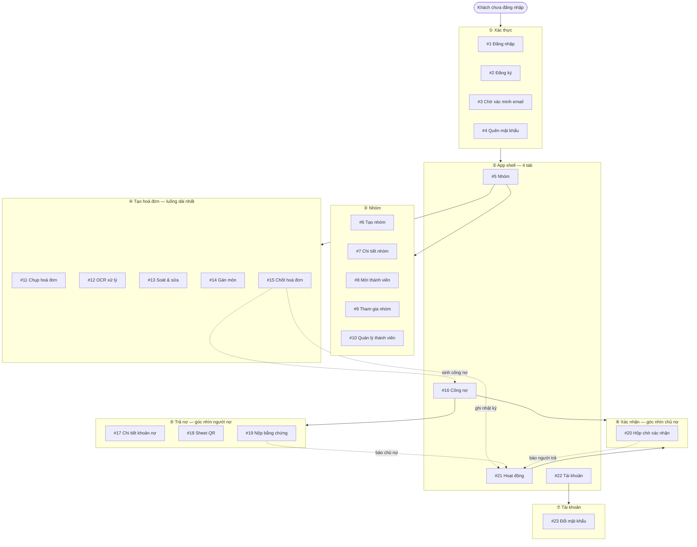
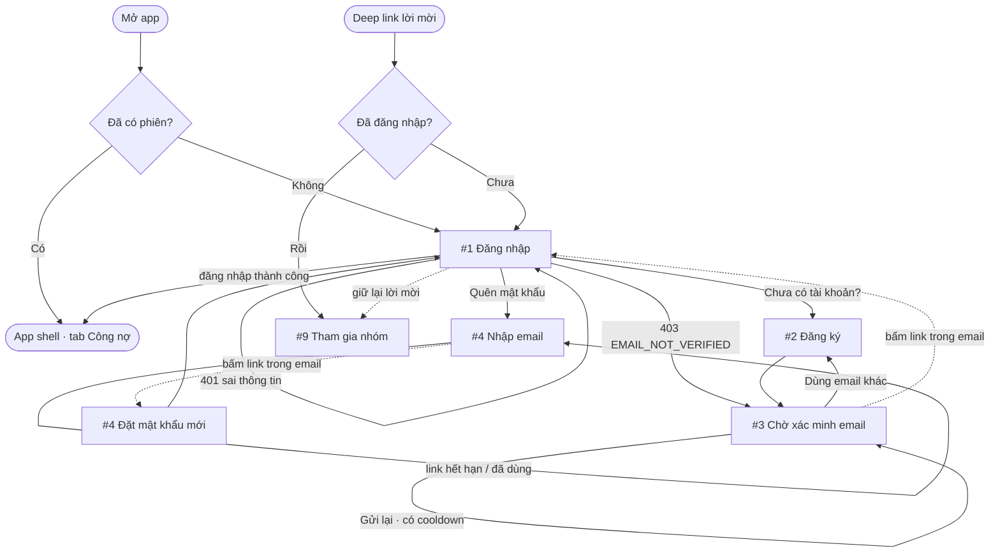
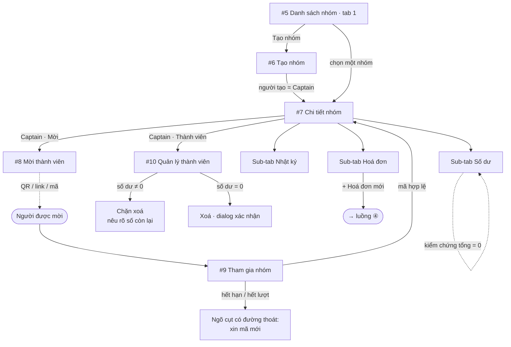
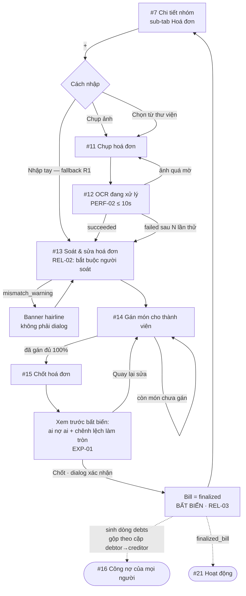
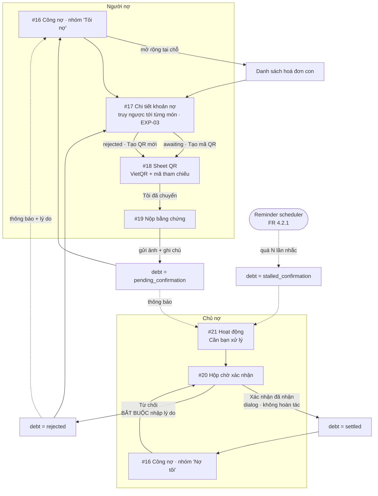
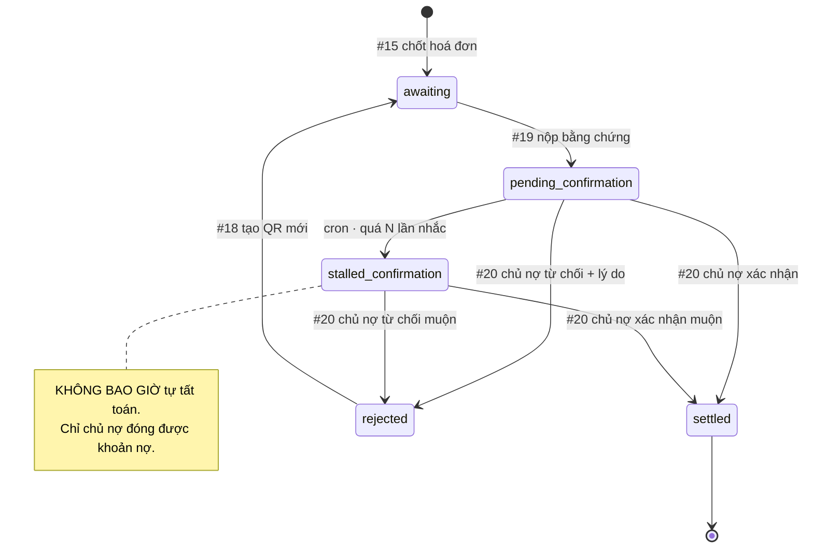
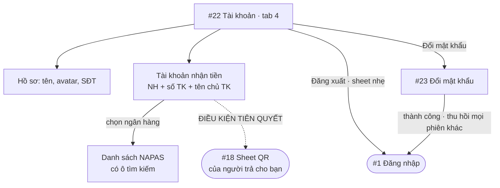

# PaySplit — Luồng màn hình

Sơ đồ điều hướng cho 23 màn ở §7 của [`design.md`](../design.md).
Số màn khớp bảng §7 và [`UI_Screen_Prompts.md`](UI_Screen_Prompts.md).

Mermaid render được trực tiếp trong VS Code (extension Markdown Preview Mermaid)
và trên GitHub.

---

## 1. Sơ đồ tổng

---

## 2. Xác thực — vào app

**Lưu ý:** deep link lời mời khi chưa đăng nhập phải **giữ lại mã mời** qua suốt
luồng đăng nhập/đăng ký rồi mới đưa tới #9. Rơi mất mã ở đây là lỗi hay gặp nhất
của luồng onboarding qua link.

---

## 3. Nhóm

---

## 4. Tạo hoá đơn — luồng dài nhất của app

Tám màn từ lúc mở app đến lúc sinh ra công nợ. Đây là đường găng của sản phẩm.

**Điểm không quay lui:** sau `Locked`, không có đường về #14. Sửa hoá đơn đã chốt
phải huỷ và tạo lại (REL-03). Vì vậy màn #15 phải cho xem trước đầy đủ — nó là
cánh cửa một chiều duy nhất trong app.

---

## 5. Trả nợ & xác nhận — trái tim của sản phẩm

Hai góc nhìn đối xứng trên cùng một khoản nợ.

**Vòng lặp từ chối** là nhánh dễ bị bỏ quên nhất: `rejected` → người nợ xem lý do ở
#17 → tạo QR mới ở #18 → quay lại #19. Nếu #17 không hiện lý do từ chối thì người
dùng bị kẹt mà không biết vì sao.

---

## 6. Máy trạng thái công nợ

Năm giá trị `debt_status` trong `dbv1.sql`, ánh xạ sang màn hình gây ra chuyển đổi.

---

## 7. Tài khoản

---

## 8. Đọc ra được gì từ sơ đồ

**Điểm vào của app chỉ có hai:** #1 (đăng nhập) và deep link lời mời → #9. Mọi màn
còn lại đều nằm sau app shell.

**Đường găng dài 8 màn:** #1 → #5 → #7 → #11 → #12 → #13 → #14 → #15. Đây là việc
một người phải làm để nhóm có khoản nợ đầu tiên. Nếu demo bị bó thời gian (PRD §7
chỉ có 2 tuần), đây là chuỗi phải chạy trơn trước mọi thứ khác.

**Đường của người trả chỉ 4 chạm:** #16 → #17 → #18 → #19. Đúng như vậy — người nợ
là người ít động lực nhất trong hệ thống, luồng của họ phải ngắn nhất.

**Cánh cửa một chiều duy nhất** là #15 → `finalized`. Mọi luồng khác đều quay lui được.

**Ba màn có thể thành ngõ cụt** nếu không thiết kế đường thoát:
- #9 khi mã mời hết hạn hoặc hết lượt
- #12 khi OCR thất bại → phải rơi về #13 dạng nhập tay, không được văng về #11
- #17 khi khoản nợ bị `rejected` → phải hiện lý do và nút tạo QR mới

---

## 9. Một lỗ hổng trong PRD mà sơ đồ làm lộ ra

**Không có gì bắt buộc chủ nợ thiết lập tài khoản ngân hàng trước khi họ ứng tiền.**

Nhìn mục 7: `#22 Bank` là **điều kiện tiên quyết** của `#18` — nhưng #22 nằm ở tab 4,
hoàn toàn tách rời luồng tạo hoá đơn ở mục 4. Kịch bản vỡ:

1. Minh Anh đăng ký, bỏ qua tab Tài khoản (không có gì ép).
2. Minh Anh tạo nhóm, ứng tiền, chụp hoá đơn, gán món, **chốt hoá đơn** (#15).
3. Hệ thống sinh 4 dòng `debts` trỏ về Minh Anh.
4. Tuấn Lâm mở #16 → #17 → bấm "Tạo mã QR" → **#18 không sinh được VietQR**, vì
   `users.default_bank_code` và `default_bank_account_number` của Minh Anh đều NULL.

Bốn người bị kẹt vì một người bỏ trống một field, và họ phát hiện ra ở bước cuối
cùng chứ không phải bước đầu. FR 4.1.17 không nói xử lý ca này thế nào.

**Ba cách chặn, theo thứ tự tôi khuyến nghị:**

1. **Chặn tại #15.** Không cho chốt hoá đơn nếu chủ nợ chưa có tài khoản nhận tiền.
   Nêu rõ và cho đi thẳng tới #22 rồi quay lại. Đây là chỗ rẻ nhất để chặn — mới
   một người bị chặn, chưa ai bị kẹt.
2. **Cảnh báo tại #11.** Banner ngay khi bắt đầu tạo hoá đơn: "Bạn chưa có tài khoản
   nhận tiền — người khác sẽ không trả được cho bạn." Nhẹ hơn, nhưng bỏ qua được.
3. **Xử lý tại #18** (bắt buộc phải có dù chọn cách nào ở trên, vì luôn còn ca
   chủ nợ xoá thông tin NH sau khi đã chốt): thay mã QR bằng thông báo + nút
   "Nhắc Minh Anh cập nhật tài khoản nhận tiền". Không được để màn trắng hay lỗi kỹ thuật.

`#22` trong `design.md` đã có banner cảnh báo cho ca "chưa thiết lập", nhưng banner
đó chỉ hiện khi người dùng **tự mở** tab Tài khoản — mà người bỏ qua nó thì đúng
là người không mở. Cần chốt cách xử lý rồi bổ sung vào PRD §4.1.15 hoặc §4.1.17.
