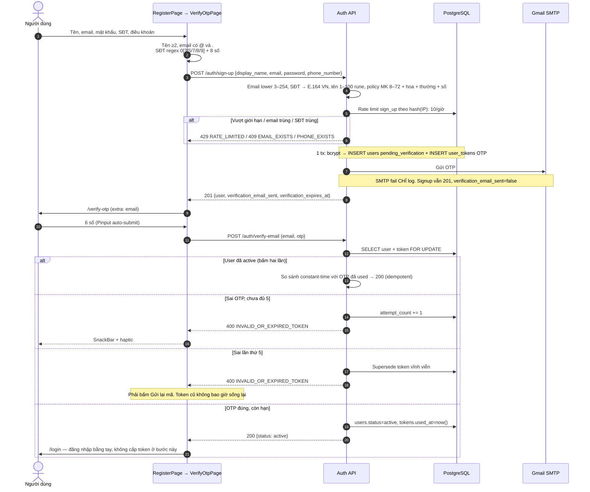
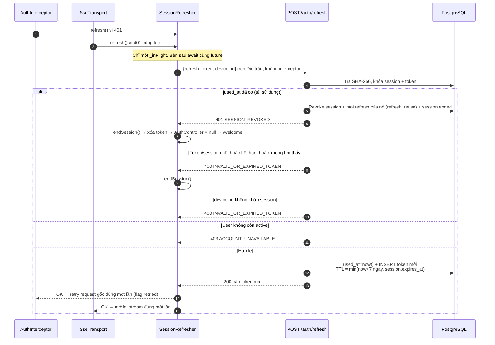
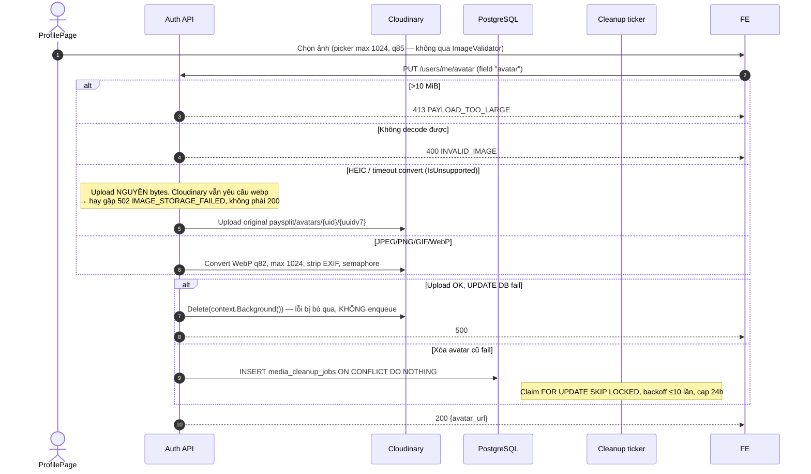
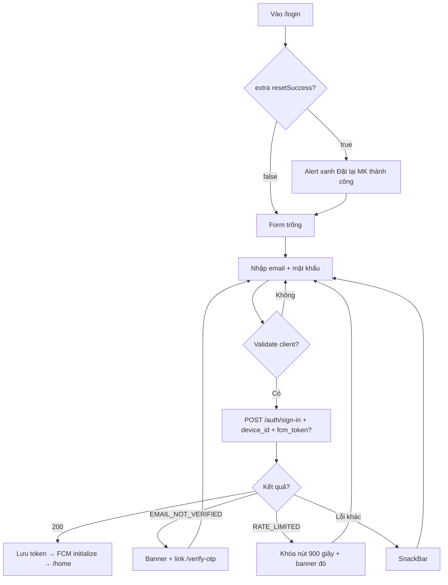
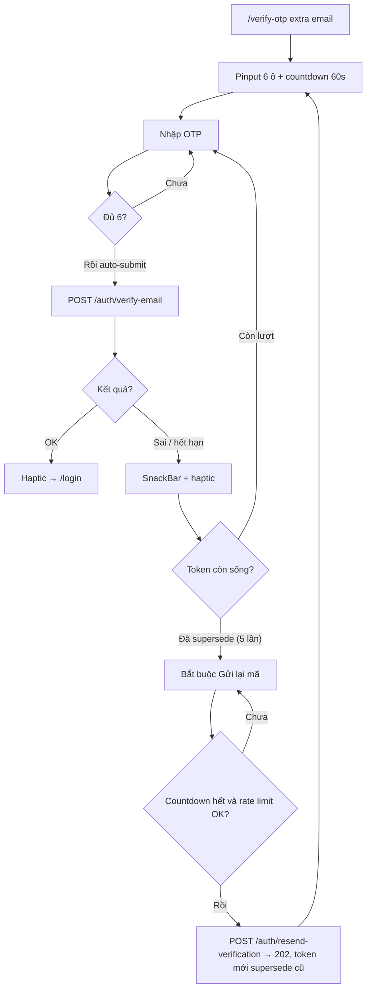
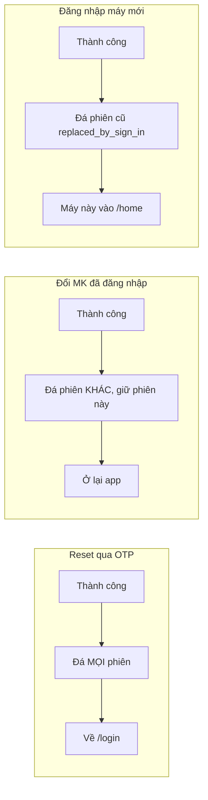

# 01 — Auth: một người, một phiên, và cửa khóa trước khi nhìn mật khẩu

> **Phạm vi**: BE module `auth` (`/api/v1/auth`, `/api/v1/users`) ↔ FE Welcome / Register / Verify OTP / Login / Forgot & Reset Password / Change Password / Profile / Bank Settings.
>
> Code tham chiếu chính: `PaySplit-BE/internal/modules/auth/**`, `PaySplit-BE/internal/transport/http/middleware/auth.go`, `PaySplit-FE/lib/features/auth/**`, `PaySplit-FE/lib/features/profile/**`, `PaySplit-FE/lib/core/network/session_refresher.dart`.
>
> Đọc cùng: [`07-app-startup-network.md`](07-app-startup-network.md) (splash, redirect, interceptor), [`08-realtime.md`](08-realtime.md) mục 5.3 và 5.5 (đóng phiên trên SSE, refresh dùng chung).

---

## 1. Vấn đề, và ý tưởng để giải quyết

### 1.1 Ba việc Auth phải làm cùng lúc

Auth không chỉ là "đăng nhập cho đúng". Nó phải:

1. **Không lộ** tài khoản nào tồn tại (dò email).
2. **Không để** hai máy cùng một tài khoản sống song song (single session).
3. **Không để** access token hết hạn 15 phút làm người dùng phải gõ lại mật khẩu, nhưng cũng **không để** kẻ đánh cắp refresh token giữ phiên mãi.

Ba việc này kéo nhau. Làm sai một cái thì hai cái kia sụp.

### 1.2 Một người, một phiên

Mỗi user chỉ có **đúng một** session `revoked_at IS NULL` (unique index `uq_sessions_one_active_per_user`). Đăng nhập máy mới thì máy cũ bị đá với lý do `replaced_by_sign_in`. JWT cũ vẫn còn hạn 15 phút, nhưng `liveAuth` hỏi DB mỗi request nên máy cũ chết ngay ở lần gọi API kế.

### 1.3 Nguyên tắc quan trọng nhất: mật khẩu sai và tài khoản chưa kích hoạt trông giống nhau từ bên ngoài, khác nhau từ bên trong

Đây là chỗ dễ hiểu nhầm:

> Thứ tự trong code: khóa brute-force **trước**, so bcrypt **tiếp**, xét `status` **sau cùng**. Sai mật khẩu không bao giờ được biết "email này chưa verify". Email không tồn tại vẫn ghi failure (no-op nếu không có row) rồi trả cùng `401 INVALID_CREDENTIALS`.

Nếu đảo thứ tự, kẻ dò email chỉ cần thử login: "chưa kích hoạt" = email có thật.

Cùng triết lý: `resend-verification` và `forgot-password` **luôn 202** nếu email hợp lệ về mặt cú pháp. Không gửi mail thì cũng không nói.

---

## 2. Bảng tổng quan

| Khái niệm | Giá trị |
|---|---|
| Access token | JWT HS256 **15 phút**, claims `sub`, `role`, `sid`, cộng `iss` / `iat` / `exp`. TTL bị validate cứng là 15 |
| Refresh token | Opaque 32 byte ngẫu nhiên, gửi dạng base64url (~43 ký tự). BE chỉ lưu SHA-256. TTL **7 ngày**, bị kẹp bởi `session.expires_at`. Session **không** được gia hạn khi xoay |
| Session | Tối đa **1** session active / user. Device gắn UUID `device_id` do app sinh, sống sót qua logout |
| OTP email | 6 chữ số, SHA-256, 10 phút, **5 lần sai thì token bị supersede vĩnh viễn** |
| Brute-force login | **5 lần sai trong 15 phút → khóa 15 phút**. Check `login_blocked_until` **trước** bcrypt |
| Rate-limit OTP (resend / forgot) | Theo hash(email) **và** hash(IP), độc lập: ≥1 lần/phút **hoặc** ≥10 lần/giờ |
| Rate-limit sign-up | Theo hash(IP): **10 lượt/giờ** (không check theo phút) |
| SĐT | Bắt buộc lúc đăng ký. Cột `users.phone_number TEXT NOT NULL UNIQUE`, chuẩn E.164 VN |
| Token phía app | `flutter_secure_storage`: `access_token`, `refresh_token`, `device_id` |
| Sign-out | `POST /auth/sign-out` dùng **TokenAuth** (chỉ verify JWT, không cần session còn sống). FE **có gọi**, nuốt lỗi mạng rồi mới xóa local |
| Cleanup | Goroutine ticker, **không phải River**. Auth 24h/lần, media 60s/lần |

---

## 3. Hai lớp xác thực trên HTTP

| Middleware | Làm gì | Dùng cho |
|---|---|---|
| `TokenAuth` | Parse Bearer, verify chữ ký / hạn / issuer / role. **Không** hỏi DB | `POST /auth/sign-out` |
| `liveAuth` | TokenAuth **cộng** `ValidateSession`: session chưa revoke, chưa hết hạn, user `status='active'`, role JWT khớp role DB | Mọi `/users/me/*` và toàn bộ API nghiệp vụ |

Fail cả hai đều ra **401 `AUTHENTICATION_REQUIRED`**, không phải `SESSION_REVOKED`. `SESSION_REVOKED` chỉ xuất hiện khi **refresh token đã `used_at` bị dùng lại** (mục 5.3).

> **Vì sao sign-out không dùng liveAuth**: người dùng bấm Đăng xuất khi access đã hết hạn, hoặc session đã bị đá. Nếu bắt session còn sống thì họ không logout được, token local kẹt mãi. TokenAuth cho phép "tôi vẫn cầm JWT hợp lệ, hãy giết sid trong đó". Session đã chết sẵn thì `RevokeSession` vẫn 204.

Chuỗi middleware toàn cục (mọi request, kể cả public): xem [`README.md`](README.md) mục 1. Rate-limit IP mặc định 300/phút. Body JSON tối đa 64 KiB.

---

## 4. Các loại frame phiên, nói ngắn

Không có "frame" như SSE. Có bốn lý do `revoked_reason` hay gặp:

| Lý do | Khi nào | Máy đang mở làm gì |
|---|---|---|
| `replaced_by_sign_in` | Đăng nhập máy khác | Request kế `401` → refresh fail → về Welcome |
| `refresh_reuse` | Refresh token cũ bị dùng lại | `401 SESSION_REVOKED` → xóa token ngay |
| `password_reset` | Đặt lại MK bằng OTP | **Mọi** phiên chết, kể cả máy đang reset |
| `password_changed` | Đổi MK khi đã đăng nhập | Chỉ đá **máy khác**, máy đang đổi được giữ |
| `sign_out` | Bấm Đăng xuất | Sid hiện tại chết |
| `admin_suspended` / `admin_locked` | Admin khóa | Mọi sid chết + `session.ended` trên SSE |
| `access_issue_failed` | Ký JWT fail ngay sau khi tạo session | Session vừa tạo bị thu hồi, tránh sid mồ côi |

Khi `USER_SSE_ENABLED`, mỗi lần revoke còn `pg_notify` `session.ended` (chia lô 100 sid). Chi tiết trọng tài và cái bẫy cắt trần 50: [`08-realtime.md`](08-realtime.md) mục 5.3.

> **App không logout từ frame `close: session_ended`.** `UserRealtimeOwner` coi mọi `close` khác `max_connection_age` là "thử kết nối lại". Máy bị đá thật sự chết ở lần REST 401 kế tiếp. Đây là chủ đích: SSE không phải nguồn sự thật của phiên.

---

## 5. Sequence Diagrams

### 5.1 Đăng ký → OTP → vào Login (không tự đăng nhập)



**Gửi lại OTP**: countdown 60 giây trên UI; `POST /auth/resend-verification`. Token mới supersede token cũ (partial unique `uq_user_tokens_one_active_per_type`). Email không tồn tại hoặc user không còn `pending_verification` → vẫn **202**, không gửi mail.

### 5.2 Đăng nhập và đá máy cũ

```mermaid
sequenceDiagram
    autonumber
    actor U as Người dùng
    participant FE as LoginPage
    participant BE as Auth API
    participant DB as PostgreSQL

    U->>FE: Email + mật khẩu
    FE->>FE: Lấy device_id (secure storage, sống sót logout) + FCM token nếu có
    FE->>BE: POST /auth/sign-in {email, password, device_id, device_name, fcm_token?}
    BE->>DB: GetByEmail; không có user vẫn RecordLoginFailure (no-op) rồi 401
    BE->>DB: login_blocked_until TRƯỚC bcrypt
    alt Đang khóa
        BE-->>FE: 429 RATE_LIMITED + Retry-After
        Note over FE: LoginPage luôn khóa nút 900 giây, KHÔNG đọc Retry-After
    else bcrypt sai
        BE->>DB: +1 failure; đủ 5 trong 15 phút → block 15 phút
        BE-->>FE: 401 INVALID_CREDENTIALS (hoặc 429 nếu vừa khóa)
    else bcrypt OK, pending_verification
        BE-->>FE: 403 EMAIL_NOT_VERIFIED
        FE-->>U: Banner + link /verify-otp
    else bcrypt OK, suspended/locked
        BE-->>FE: 403 ACCOUNT_UNAVAILABLE
    else active
        BE->>DB: Revoke session cũ (replaced_by_sign_in) + INSERT session mới + refresh SHA-256
        BE->>BE: Ký JWT 15 phút chứa sid
        alt Ký JWT thất bại
            BE->>DB: Revoke ngay session vừa tạo (access_issue_failed)
            BE-->>FE: 500 INTERNAL_ERROR
        end
        BE-->>FE: 200 {access_token, refresh_token, user, access_token_expires_at, refresh_token_expires_at}
        FE->>FE: Lưu 2 token. unawaited FCMTokenManager.initialize() → PUT /users/me/fcm-token
        FE->>U: Router → /home
    end
```

Body đăng nhập nhận `fcm_token` tùy chọn, ghi thẳng vào session (`NULLIF` rỗng). App vẫn gọi thêm `PUT /users/me/fcm-token` sau đó vì Firebase có thể chưa kịp cấp token lúc bấm Đăng nhập.

### 5.3 Xoay refresh token và phát hiện tái sử dụng

Access hết hạn là chuyện **bình thường**. Cả REST và SSE đều gặp 401. Chúng **bắt buộc** đi chung một chỗ refresh. Nếu mỗi bên xoay một vòng, vòng sau dùng lại token vòng trước vừa tiêu thụ → BE coi là gian lận → thu hồi cả phiên. Người dùng bị đá mà không hiểu vì sao.

Chỗ dùng chung: `SessionRefresher._inFlight` (`PaySplit-FE/lib/core/network/session_refresher.dart`). Interceptor **không** còn future `_refreshing` riêng.



Skip-list của interceptor (401 ở các path này **không** refresh, **không** `endSession`): `sign-in`, `register`/`sign-up`, `refresh`, `forgot-password`, `reset-password`, `verify-email`, `resend-verification`. `sign-out` **không** nằm trong list: access hết hạn lúc bấm Đăng xuất sẽ refresh trước rồi mới gọi sign-out.

### 5.4 Quên mật khẩu / đặt lại / đổi mật khẩu

Ba đường trông giống nhau, **phạm vi đá phiên khác nhau**. Đó là chỗ phải nhớ.

```mermaid
sequenceDiagram
    autonumber
    actor U as Người dùng
    participant FE as App
    participant BE as Auth API
    participant DB as PostgreSQL

    alt Quên mật khẩu
        U->>FE: Nhập email
        FE->>BE: POST /auth/forgot-password {email}
        Note over BE: Luôn 202. Rate limit email+IP. User pending vẫn nhận OTP reset;<br/>bước reset sau mới từ chối non-active
        BE-->>FE: 202
        FE->>U: /reset-password (extra: email)
        U->>FE: OTP + MK mới
        FE->>BE: POST /auth/reset-password → 204
        BE->>DB: Thu hồi TOÀN BỘ session (password_reset)
        FE->>U: /login extra=true → alert xanh
    else Đổi mật khẩu khi đã vào app
        U->>FE: MK hiện tại + MK mới
        FE->>BE: PUT /users/me/password
        alt MK hiện tại sai
            BE-->>FE: 400 INVALID_CURRENT_PASSWORD
        else MK mới trùng MK cũ
            BE-->>FE: 400 VALIDATION_FAILED
        else OK
            BE->>DB: bcrypt mới + thu hồi mọi session KHÁC (password_changed)
            Note over DB: Phiên hiện tại được GIỮ
            BE-->>FE: 204
            FE->>U: SnackBar, pop, vẫn ở trong app
        end
    end
```

Handler map `ErrInvalidInput` → JSON code `VALIDATION_FAILED` (không phải `INVALID_INPUT`).

### 5.5 Avatar: xóa bù, không đi River

Cleanup ảnh **không** phải River. Bảng `media_cleanup_jobs` + ticker `auth/jobs/workers.go`.



### 5.6 Hồ sơ ngân hàng

PATCH `/users/me`: ba trường bank phải **cùng có hoặc cùng không**. Số TK 6–19 chữ số. Bank code phải nằm trong directory VietQR, không thì `400 UNSUPPORTED_BANK`. FE chuẩn hóa chủ TK UPPERCASE không dấu (`VietnameseUtils.toBankHolderFormat`), map CTG→ICB. Thiếu bank thì Captain không chốt được hóa đơn (`422 BANK_ACCOUNT_REQUIRED`, xem [`03-bill.md`](03-bill.md)).

---

## 6. Activity Diagrams

### 6.1 Login



### 6.2 Verify OTP



### 6.3 Phạm vi đá phiên



---

## 7. Endpoint và màn hình

Prefix `/api/v1`.

| Method + Path | Middleware | Thành công | Việc |
|---|---|---|---|
| POST `/auth/sign-up` | public + RL IP + RL DB | **201** | User `pending_verification` + OTP |
| POST `/auth/verify-email` | public | **200** | Kích hoạt |
| POST `/auth/resend-verification` | public | **202** luôn (trừ validate/RL) | Chống enumeration |
| POST `/auth/sign-in` | public | **200** | Cặp token + user |
| POST `/auth/refresh` | public | **200** | Xoay cặp token, không trả user |
| POST `/auth/forgot-password` | public | **202** luôn | OTP reset |
| POST `/auth/reset-password` | public | **204** | MK mới, đá mọi phiên |
| POST `/auth/sign-out` | **TokenAuth** | **204** | Đá phiên hiện tại |
| GET/PATCH `/users/me` | liveAuth | **200** | Hồ sơ + bank |
| PUT `/users/me/password` | liveAuth | **204** | Đổi MK, giữ phiên này |
| PUT/DELETE `/users/me/avatar` | liveAuth | 200 / 204 | Cloudinary |
| PUT `/users/me/fcm-token` | liveAuth | **200** `{status:ok}` | Gắn token vào sid hiện tại |
| GET `/users/me/events` | liveAuth, chỉ khi `USER_SSE_ENABLED` | SSE | Xem [`08-realtime.md`](08-realtime.md) |

FE routes: `/welcome` (carousel 3 slide → `/login`), `/register`, `/verify-otp` (extra email), `/login` (extra bool resetSuccess), `/forgot-password`, `/reset-password` (extra email), `/profile` `/edit-profile` `/bank-settings` `/change-password` (shell tab Cài đặt). Guard: xem [`07-app-startup-network.md`](07-app-startup-network.md).

---

## 8. Edge Cases

| # | Tình huống | Xử lý | Mã | Chỗ |
|---|---|---|---|---|
| 1 | Email đã có lúc đăng ký | Unique `users_email_key` | `409 EMAIL_EXISTS` | `repository.go` mapWriteError |
| 2 | SĐT đã có | `users_phone_number_key` | `409 PHONE_EXISTS` | như trên |
| 3 | Sign-up thiếu / SĐT không parse được VN | `normalizePhone` | `400 VALIDATION_FAILED` | `service.go` |
| 4 | Spam đăng ký theo IP | 10/giờ, `pg_advisory_xact_lock` | `429 RATE_LIMITED` + Retry-After | `repository.go` CheckAndRecordRateLimit |
| 5 | OTP sai 5 lần | Supersede vĩnh viễn, phải xin mã mới | `400 INVALID_OR_EXPIRED_TOKEN` | `repository.go` Verify |
| 6 | Verify khi đã active | Constant-time với OTP đã used → vẫn 200 | `200` | idempotent replay |
| 7 | Xin lại mã / quên MK dồn | ≥1/phút hoặc ≥10/giờ theo email **và** IP | `429 RATE_LIMITED` | |
| 8 | Dò email tồn tại | Resend/forgot luôn 202 | `202` | chống enumeration |
| 9 | Brute-force MK | 5 sai / 15′ → block 15′; check block trước bcrypt | `429` | |
| 10 | Login chưa kích hoạt | bcrypt OK rồi mới `ErrEmailNotVerified` | `403 EMAIL_NOT_VERIFIED` | |
| 11 | Login suspended/locked | Cùng nhánh sau bcrypt | `403 ACCOUNT_UNAVAILABLE` | |
| 12 | Đăng nhập máy 2 | Đá session cũ | `200` phiên mới | |
| 13 | Ký JWT fail sau tạo session | Revoke `access_issue_failed` | `500` | |
| 14 | Refresh token đã used | Reuse detection | `401 SESSION_REVOKED` | **duy nhất** path refresh trả mã này |
| 15 | Refresh sai `device_id` | Từ chối | `400 INVALID_OR_EXPIRED_TOKEN` | không phải SESSION_REVOKED |
| 16 | REST và SSE cùng 401 | `SessionRefresher` single-flight | tránh reuse | `session_refresher.dart` |
| 17 | Refresh fail | `endSession` → AuthController null → `/welcome` **ngay** | | `07` mục 5 |
| 18 | Đổi MK muốn ở lại app | Giữ sid hiện tại | `204` | |
| 19 | Reset MK | Đá mọi sid | `204` | |
| 20 | Avatar >10MB / file giả | Size + decode | `413` / `400 INVALID_IMAGE` | |
| 21 | HEIC / timeout convert | Upload original; Cloudinary đòi webp | hay `502 IMAGE_STORAGE_FAILED` | `processor.go` + `avatar.go` |
| 22 | CDN OK, DB fail | Delete bù, **không enqueue** | `500` | |
| 23 | Xóa avatar cũ fail | Enqueue `media_cleanup_jobs` | `200` vẫn | |
| 24 | Bank thiếu 1 trong 3 trường | Cả 3 hoặc không | `400 VALIDATION_FAILED` / `UNSUPPORTED_BANK` | |
| 25 | PUT FCM khi session chết giữa liveAuth và UPDATE | `affected==0` → `ErrSessionRevoked` bị handler nuốt thành **500 INTERNAL_ERROR** | `500` | liveAuth thường 401 trước |
| 26 | FE logout | `POST /auth/sign-out` (TokenAuth), nuốt lỗi → `FCMTokenManager.onLogout()` → `clear()` | `204` hoặc logout cục bộ | `auth_repository_impl.dart` |
| 27 | Login 429 từ limiter IP toàn cục 300/phút | Cùng code `RATE_LIMITED` | FE vẫn khóa **900 giây** | `login_page.dart` |
| 28 | Register không ép hoa/số | Checklist chỉ trang trí | BE `400 VALIDATION_FAILED` | |
| 29 | `session.ended` trên SSE | App reconnect, **không** logout | chết ở REST 401 | `08` mục 5.3 |
| 30 | Forgot OTP cho user pending | Vẫn gửi; reset từ chối non-active | `400 INVALID_OR_EXPIRED_TOKEN` lúc reset | |
| 31 | Sign-in `device_id` không phải UUID | | `400 VALIDATION_FAILED` | Refresh sai device → mã token, **khác code** |
| 32 | PUT FCM token rỗng | | `400 INVALID_FCM_TOKEN` | không qua `writeDomainError` |
| 33 | Thiếu sid trong context lúc FCM | | `401 UNAUTHORIZED` | khác `AUTHENTICATION_REQUIRED` |

### Validate phía FE (trước API)

| Màn | Ràng buộc thật trong code |
|---|---|
| Register | Tên ≥2; email `@` và `.`; MK client chỉ check dài ≥8 (BE còn hoa/thường/số, 8–72 **byte**); SĐT bắt buộc `0[35789…]` max 11; checkbox điều khoản **mặc định đã tick** |
| Login | Email/MK bắt buộc; timer 900s khi `RATE_LIMITED` |
| Verify OTP | 6 số auto-submit; countdown 60s; hint "10 phút / 5 lần thử" |
| Reset | OTP 6 + MK ≥8 + confirm khớp |
| Change password | Gate ≥8, hoa, số — **không** thường, **không** max 72 |
| Bank | Bắt buộc chọn NH; chủ TK UPPERCASE không dấu; số TK FE min 6, **không** max 19 / digits-only |

---

## 9. Cấu hình

| Biến | Mặc định | Ý nghĩa |
|---|---|---|
| `JWT_ACCESS_TOKEN_TTL_MINUTES` | `15` | Validate **phải** 15 |
| `AUTH_REFRESH_TOKEN_TTL_HOURS` | `168` | Validate **phải** 7 ngày. Rotation trong repo đang hardcode 7 ngày rồi kẹp `session.expires_at` |
| `JWT_ISSUER` | `paysplit-backend` | |
| OTP TTL | 10 phút verify **và** reset | Validate cứng |
| `AUTH_CLEANUP_INTERVAL_HOURS` | `24` | Ticker xóa token/session hết hạn |
| `AUTH_RECORD_RETENTION_DAYS` | `30` | `rate_limit_events` xóa sau **24h cứng**, không theo retention |
| `MEDIA_CLEANUP_WORKER_INTERVAL_SECONDS` | `60` | |
| `AVATAR_MAX_CONCURRENT_CONVERSIONS` | `2` | Semaphore convert |
| `USER_SSE_ENABLED` | `false` | Tắt thì `notifySessionEnded` no-op; route events 404 |

---

## 10. Ghi chú triển khai đáng chú ý

Những chỗ trông nhỏ nhưng nếu làm sai thì hỏng lặng lẽ:

1. **Check block trước bcrypt, check status sau bcrypt.** Đảo là lộ "email chưa verify" cho kẻ không biết mật khẩu.

2. **Reuse detection chỉ trả `SESSION_REVOKED`.** Session bị đá vì đăng nhập máy khác, lúc refresh thường ra `INVALID_OR_EXPIRED_TOKEN`. FE `endSession` trên **mọi** refresh fail, nên UX giống nhau. Đừng viết client chỉ bắt `SESSION_REVOKED`.

3. **REST và SSE phải dùng chung một `SessionRefresher`.** Hai vòng rotation = một vòng bị coi là đánh cắp. Xem [`08-realtime.md`](08-realtime.md) mục 5.5.

4. **`UPDATE ... RETURNING id` lúc thu hồi phải `WHERE revoked_at IS NULL`.** Thiếu thì sid đã chết chiếm chỗ lô `session.ended`. Cùng bẫy với cắt trần 50: [`08-realtime.md`](08-realtime.md) mục 5.3.

5. **Sign-out là TokenAuth, mọi API khác là liveAuth.** Đừng "thống nhất" chúng.

6. **SMTP fail không được fail onboarding.** 201/202 vẫn về. `verification_email_sent` cho FE biết có nên hiện "kiểm tra hộp thư" hay không.

7. **Compensation CDN delete fail không enqueue.** Ảnh mồ côi. Xóa avatar **cũ** fail thì mới enqueue. Hai nhánh khác nhau có chủ đích (request đang fail vs request đã thành công).

8. **PUT FCM không đi `writeDomainError`.** Session race → 500 thay vì 401. liveAuth che hầu hết, đừng "sửa" bằng cách bắt FE parse `SESSION_REVOKED` ở đây.

9. **LoginPage bỏ qua `Retry-After`.** 429 từ limiter IP toàn cục cũng khóa UI 15 phút. Đó là bug UX đã biết, không phải hợp đồng BE.

10. **PasswordChecklist không gate submit.** BE mới là nguồn sự thật. FE change-password còn thiếu chữ thường và trần 72 byte.

11. **bcrypt cost là `DefaultCost` (10), không phải 12.** Đừng "sửa cho đúng tài liệu cũ".

12. **Log không chứa OTP thô, refresh thô, sid, số TK, mật khẩu.** Hash thì được.

---

## 11. Trạng thái hiện tại

| Hạng mục | Trạng thái | Ghi chú |
|---|---|---|
| Đăng ký / OTP / login / refresh / reset / đổi MK | ✅ Chạy | Single session, reuse detection, enumeration đã kiểm |
| Sign-out từ app | ✅ Chạy | FE gọi API, nuốt lỗi mạng |
| Avatar WebP | ✅ JPEG/PNG/GIF/WebP | HEIC hay 502 vì Cloudinary đòi webp |
| FCM gắn session | ✅ Chạy | Login body + PUT sau initialize |
| `session.ended` đẩy SSE | ✅ Khi `USER_SSE_ENABLED` | App không logout từ frame close; REST 401 mới đá |
| Admin portal auto-refresh | ⚠️ Gãy | Portal gửi refresh **không** `device_id` — xem [`06-admin.md`](06-admin.md) |
| Deep link mời | ⏸ Chưa có | Link dán tay / QR — [`02-group.md`](02-group.md) |
