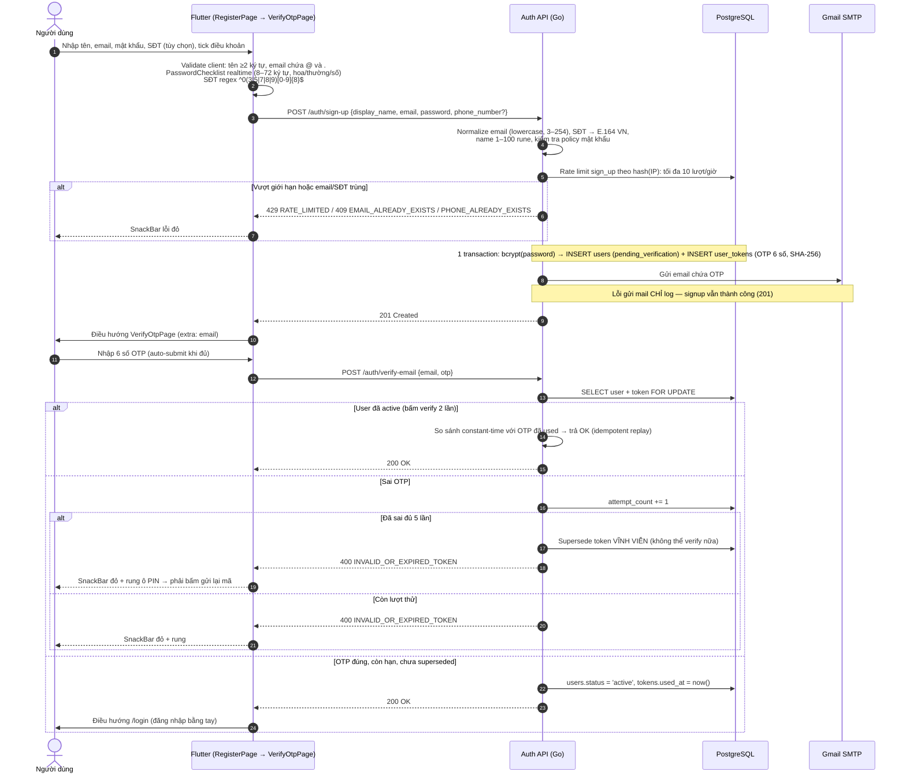
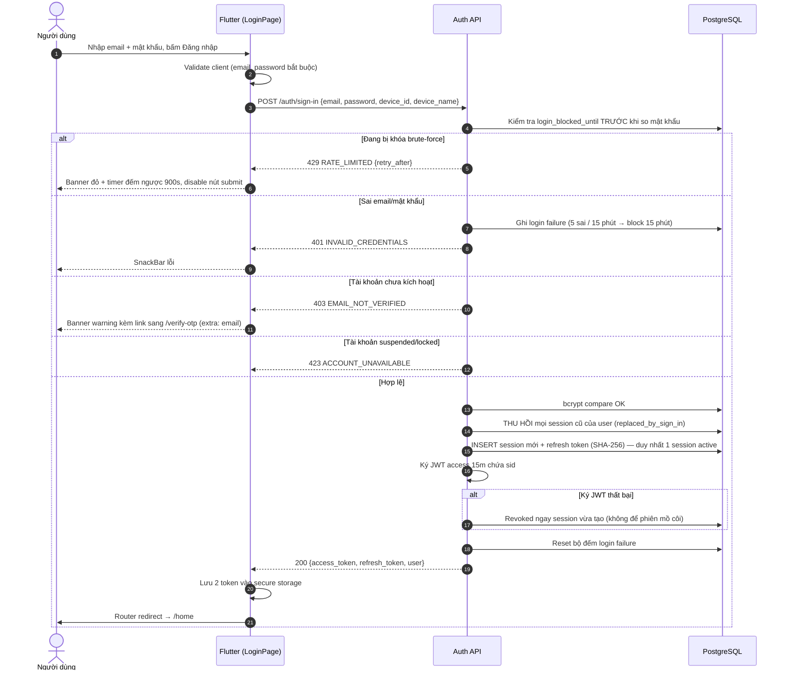
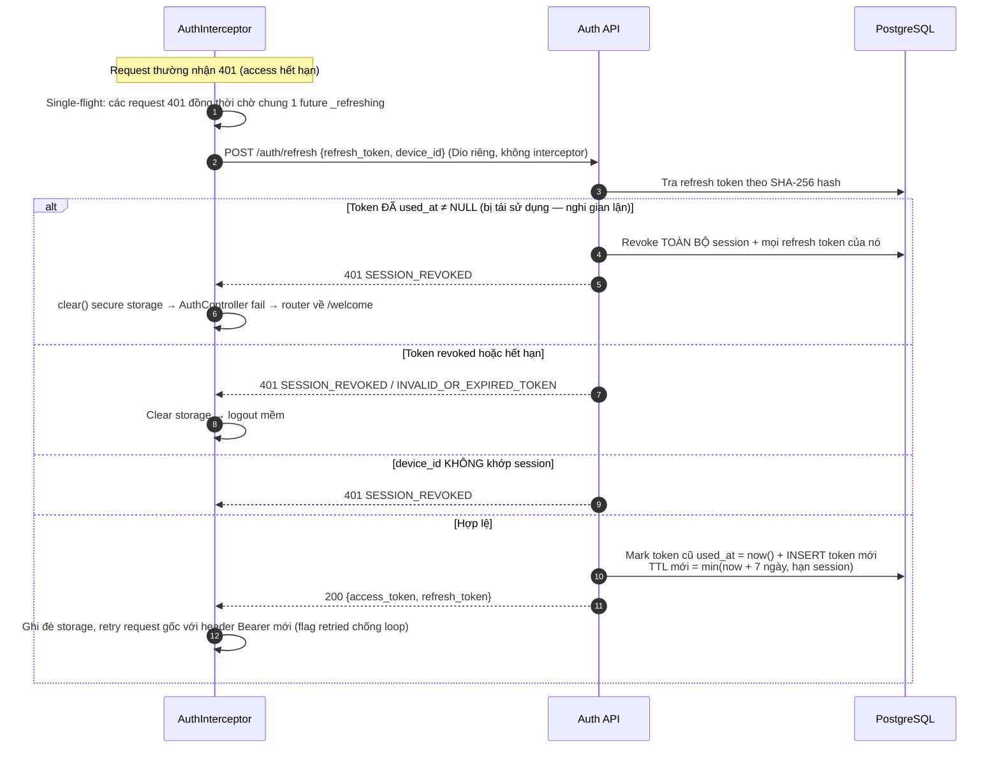
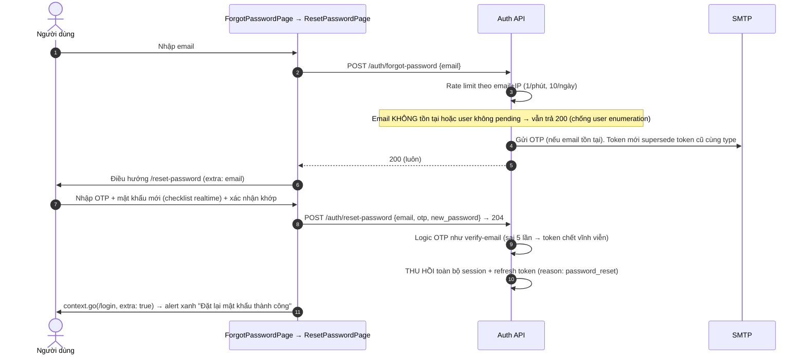
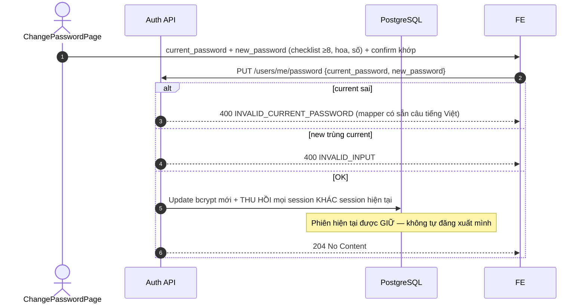
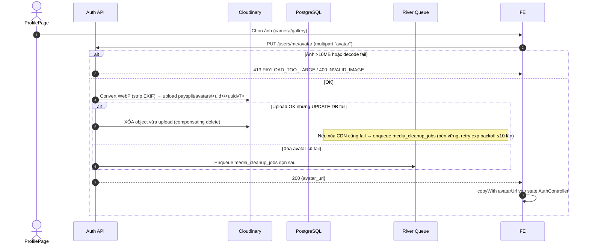
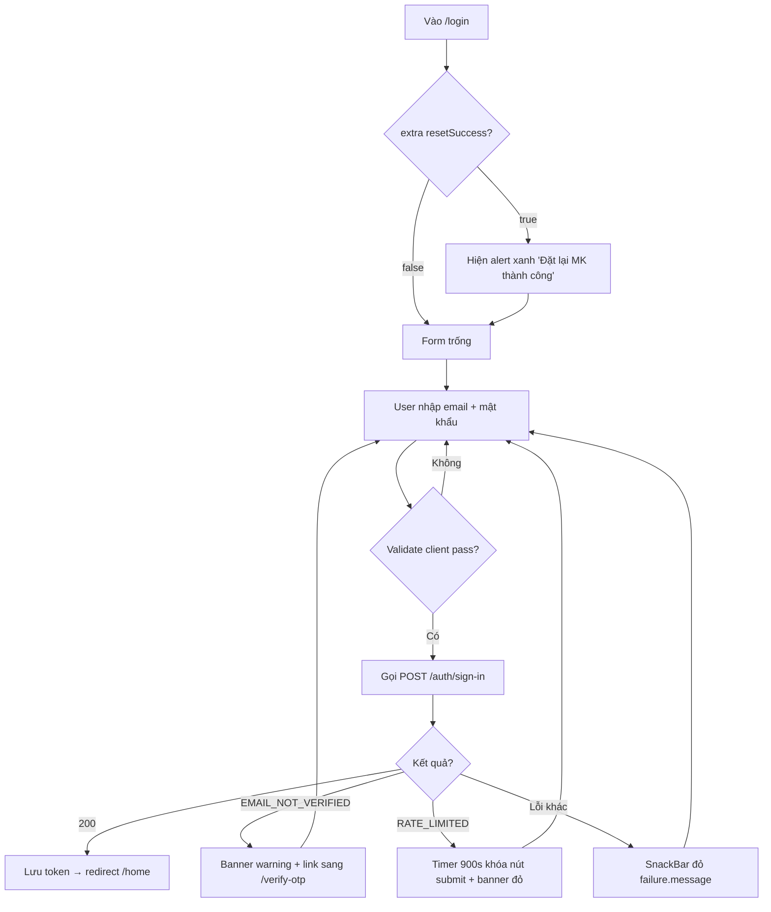
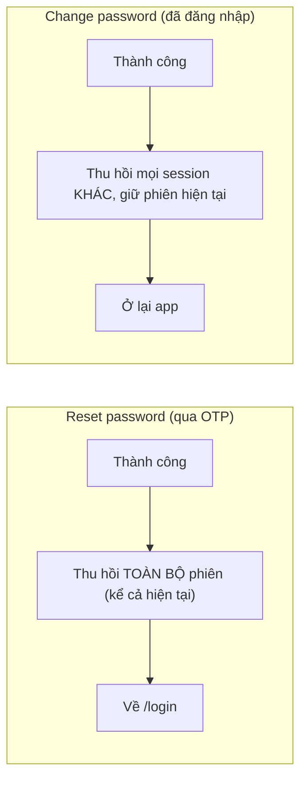

# 01 — Auth: Xác thực, Phiên đăng nhập & Hồ sơ cá nhân

> **Phạm vi**: BE module `auth` (`/api/v1/auth`, `/api/v1/users`) ↔ FE màn hình Welcome / Register / Verify OTP / Login / Forgot & Reset Password / Change Password / Profile / Bank Settings.
>
> Code tham chiếu chính: `PaySplit-BE/internal/modules/auth/**`, `PaySplit-FE/lib/features/auth/**`, `PaySplit-FE/lib/features/profile/**`.

---

## 1. Tổng quan mô hình phiên

| Khái niệm | Giá trị |
|---|---|
| Access token | JWT **15 phút**, payload chứa `sid` (session ID) |
| Refresh token | Opaque 32-byte random (base64url), BE chỉ lưu SHA-256, TTL **7 ngày** |
| Session | **Tối đa 1 session active mỗi user** (unique index `uq_sessions_one_active_per_user`). Đăng nhập thiết bị mới → thu hồi session cũ (`replaced_by_sign_in`) |
| OTP email | 6 chữ số, lưu SHA-256, hiệu lực 10 phút, **tối đa 5 lần thử sai thì token bị vô hiệu vĩnh viễn** |
| Brute-force login | **5 lần sai trong cửa sổ 15 phút → khóa đăng nhập 15 phút** |
| Mô hình token FE | `flutter_secure_storage` — keys `access_token`, `refresh_token` |

## 2. Endpoint & màn hình

### BE endpoints

| Method + Path | Handler | Middleware | Chức năng |
|---|---|---|---|
| POST `/auth/sign-up` | SignUp | — (rate limit IP toàn cục) | Đăng ký, tạo user `pending_verification` + OTP |
| POST `/auth/verify-email` | VerifyEmail | — | Kích hoạt tài khoản bằng OTP |
| POST `/auth/resend-verification` | ResendVerification | — | Gửi lại OTP |
| POST `/auth/sign-in` | SignIn | — | Đăng nhập, phát hành cặp token |
| POST `/auth/refresh` | Refresh | — | Xoay vòng refresh token (rotation) |
| POST `/auth/forgot-password` | ForgotPassword | — | Gửi OTP đặt lại mật khẩu |
| POST `/auth/reset-password` | ResetPassword | — | Đặt lại mật khẩu bằng OTP |
| POST `/auth/sign-out` | SignOut | TokenAuth (chỉ verify JWT) | Thu hồi phiên hiện tại |
| GET/PATCH `/users/me` | Profile | liveAuth | Xem/sửa hồ sơ (+ bank profile) |
| PUT `/users/me/password` | ChangePassword | liveAuth | Đổi mật khẩu |
| PUT/DELETE `/users/me/avatar` | Avatar | liveAuth | Upload/xóa avatar (Cloudinary) |
| PUT `/users/me/fcm-token` | FCMToken | liveAuth | Gắn FCM token vào session |

### FE màn hình (go_router)

| Path | Page | Ghi chú |
|---|---|---|
| `/welcome` | WelcomePage | Onboarding carousel 3 slide → đẩy sang `/login` |
| `/register` | RegisterPage | Validate client-side đầy đủ |
| `/verify-otp` | VerifyOtpPage | extra: `email`; Pinput 6 ô auto-submit |
| `/login` | LoginPage | extra: `resetSuccess` (bool) hiển thị alert sau reset |
| `/forgot-password` | ForgotPasswordPage | |
| `/reset-password` | ResetPasswordPage | extra: `email` |
| `/profile`, `/edit-profile`, `/bank-settings`, `/change-password` | Profile* pages | Shell branch "Cài đặt" |

---

## 3. Sequence Diagrams

### 3.1 Đăng ký → Kích hoạt OTP → Đăng nhập lần đầu

**Gửi lại OTP** — `VerifyOtpPage` có countdown 60s; gọi `POST /auth/resend-verification`. BE rate-limit theo `email+IP` (≥1 phút/lần, ≥10 lượt/ngày); **token mới supersede token cũ** (unique partial index: chỉ 1 token active mỗi type).

### 3.2 Đăng nhập & mô hình single-session

> Ý nghĩa single-session: người dùng đăng nhập máy mới → máy cũ bị "đá" — JWT cũ chứa `sid` đã chết, request tiếp theo của máy cũ bị `liveAuth` chặn `401`.

### 3.3 Refresh token rotation & reuse detection

### 3.4 Quên / đặt lại mật khẩu

### 3.5 Đổi mật khẩu (đã đăng nhập)

### 3.6 Upload avatar (compensating actions)

## 4. Activity Diagrams

### 4.1 Luồng màn hình Login (FE)

### 4.2 Luồng màn hình Verify OTP (FE)

### 4.3 Quyết định redirect khi đổi mật khẩu/quên mật khẩu (tổng hợp)

## 5. Edge Cases

### 5.1 Bảng edge case chi tiết

| # | Tình huống | Xử lý hệ thống | Mã lỗi / phản hồi | Vị trí code (tham chiếu) |
|---|---|---|---|---|
| 1 | Email đã tồn tại khi đăng ký | Unique constraint `users_email_key` map thành domain error | `409 EMAIL_ALREADY_EXISTS` | `auth/repository/postgres/repository.go:736-747` |
| 2 | SĐT đã tồn tại | Tương tự qua `users_phone_number_key` | `409 PHONE_ALREADY_EXISTS` | như trên |
| 3 | Spam đăng ký theo IP | Rate limit DB `sign_up`: 10 lượt/giờ, dùng `pg_advisory_xact_lock` chống race đếm | `429 RATE_LIMITED` | `auth/usecase/service.go:81-120` |
| 4 | OTP sai quá 5 lần | attempt_count chạm ngưỡng → **supersede token vĩnh viễn**, phải xin mã mới | `400 INVALID_OR_EXPIRED_TOKEN` | `auth/repository/postgres/repository.go:154-168` |
| 5 | Verify khi đã active (double-submit / replay) | So sánh constant-time với OTP đã used → vẫn trả OK (idempotent) | `200 OK` | cùng file trên |
| 6 | Xin lại mã liên tục | Rate limit resend/forgot theo email+IP: ≥1 phút/lần, ≥10/ngày; token mới supersede cái cũ | `429 RATE_LIMITED` | `repository.go:562-573` |
| 7 | Dò email tồn tại (user enumeration) qua quên mật khẩu/gửi lại OTP | Luôn trả 200 dù email không tồn tại/user không pending | `200 OK` (giả lập) | `auth/usecase/service.go:153-161` |
| 8 | Brute-force mật khẩu | 5 lần sai trong cửa sổ 15′ → block 15′; check `login_blocked_until` **trước** khi so bcrypt (tránh leak thông tin) | `429 RATE_LIMITED {retry_after}` | `repository.go:187-226` |
| 9 | Login khi chưa kích hoạt email | Chặn sớm với hướng dẫn sang màn OTP | `403 EMAIL_NOT_VERIFIED` | `service.go:190-241` |
| 10 | Login khi suspended/locked (admin khóa) | Chặn | `423 ACCOUNT_UNAVAILABLE` | như trên |
| 11 | Đăng nhập thiết bị thứ 2 | Thu hồi session cũ (`replaced_by_sign_in`); JWT cũ có `sid` chết → request kế tiếp bị 401 | `200` + phiên mới | `repository.go:250-255` |
| 12 | Ký JWT thất bại ngay sau khi tạo session | Revoke ngay session vừa tạo — không để phiên mồ côi | `500` | `service.go:236-239` |
| 13 | Refresh token đã dùng bị đưa ra dùng lại (reuse/replay) | **Reuse detection**: revoke toàn bộ session + token con | `401 SESSION_REVOKED` | `repository.go:307-314` |
| 14 | Refresh từ device_id khác | Từ chối — token gắn chặt session/device | `401 SESSION_REVOKED` | `repository.go:318-320` |
| 15 | Nhiều request 401 đồng thời bắn refresh song song | FE single-flight `_refreshing` Future chung; nếu chạy song song thật, rotation sẽ trigger reuse-detection → mất phiên | tránh bởi interceptor | `core/network/interceptors/auth_interceptor.dart:25-30` |
| 16 | Refresh fail (mạng chập chờn 1 lần) | FE clear cả 2 token → AuthController build fail → redirect `/welcome`. **Lưu ý**: chỉ clear khi refresh nhận lỗi xác thực, không retry vô hạn nhờ flag `retried` | về `/welcome` | `auth_interceptor.dart:66-88` |
| 17 | Đổi mật khẩu nhưng vẫn muốn ở lại app | Giữ phiên hiện tại, chỉ đá các phiên khác | `204` | `repository.go:442-465` |
| 18 | Reset mật khẩu khi đang đăng nhập nhiều nơi | Thu hồi **toàn bộ** session (kể cả hiện tại) → phải đăng nhập lại | `204` | `repository.go:379-440` |
| 19 | Avatar >10MB hoặc file giả đuôi ảnh | Check size + decode | `413` / `400 INVALID_IMAGE` | `service.go:310-346` |
| 20 | Upload CDN OK nhưng ghi DB lỗi | Compensating delete object; xóa tiếp fail → queue `media_cleanup_jobs` retry exp backoff ≤10 lần/cap 24h | `500` | `service.go:336-345` |
| 21 | Bank profile thiếu 1 trong 3 trường | Phải đủ cả 3 (code, số TK, chủ TK) hoặc rỗng hoàn toàn — CHECK DB tương ứng; số TK 6–19 chữ số; bank code phải nằm trong directory VietQR | `400 INVALID_INPUT` / `UNSUPPORTED_BANK` | `service.go:367-392` |
| 22 | Gắn FCM token khi session đã chết | Từ chối — token gắn vào session cụ thể | `401 SESSION_REVOKED` | `service.go:445-455` |
| 23 | FE logout | Hiện **chỉ xóa secure storage, chưa gọi** `POST /auth/sign-out` → session BE sống đến hết hạn (khoảng trống đã biết) | — | `features/auth/data/repositories/auth_repository_impl.dart:216-219` |

### 5.2 Edge case FE validation (client-side, trước khi gọi API)

| Màn hình | Ràng buộc |
|---|---|
| Register | Tên ≥2 ký tự; email chứa `@` và `.`; PasswordChecklist realtime (8–72, hoa, thường, số); SĐT regex VN `^0[3\|5\|7\|8\|9][0-9]{8}$` maxLength 11; checkbox điều khoản bắt buộc |
| Login | Email/password bắt buộc; timer 15′ khi bị rate-limited |
| Verify OTP | Pinput 6 số auto-submit; countdown 60s resend |
| Reset password | Checklist + confirm khớp |
| Change password | Checklist (≥8, chữ hoa, chữ số) phải pass hết mới enable submit |
| Bank settings | Bắt buộc chọn ngân hàng; chủ TK tự normalize UPPERCASE không dấu (`VietnameseUtils.toBankHolderFormat`) |

---

## 6. Ghi chú triển khai BE đáng chú ý

- Mọi sự kiện rate-limit/login-failure ghi DB (không chỉ in-memory) → sống sót qua restart, dùng advisory lock chống race đếm.
- Cleanup định kỳ (`auth/jobs/workers.go`): xóa token/session/rate-limit-event hết hạn (batch 500, advisory lock `paysplit_auth_cleanup` chống chạy song song).
- Response `sign-up`/`resend` luôn thành công kể cả khi SMTP lỗi — mail fail chỉ log, tránh chặn onboarding.
