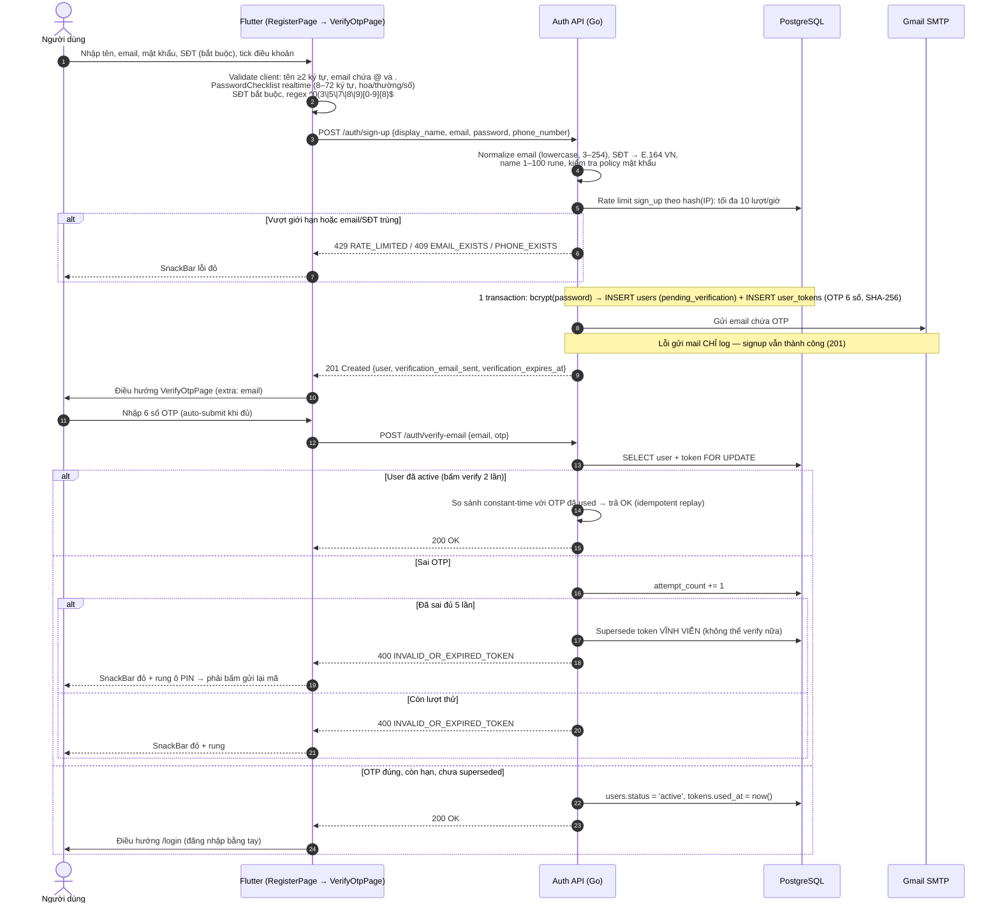
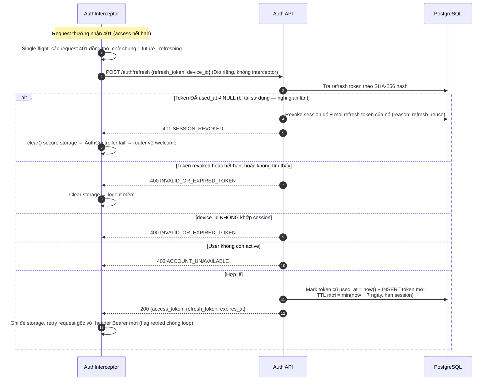
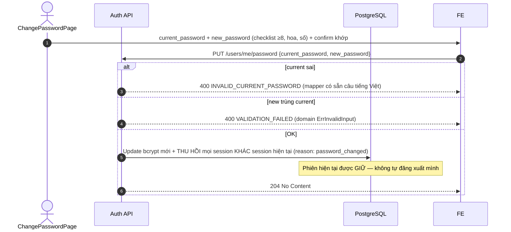
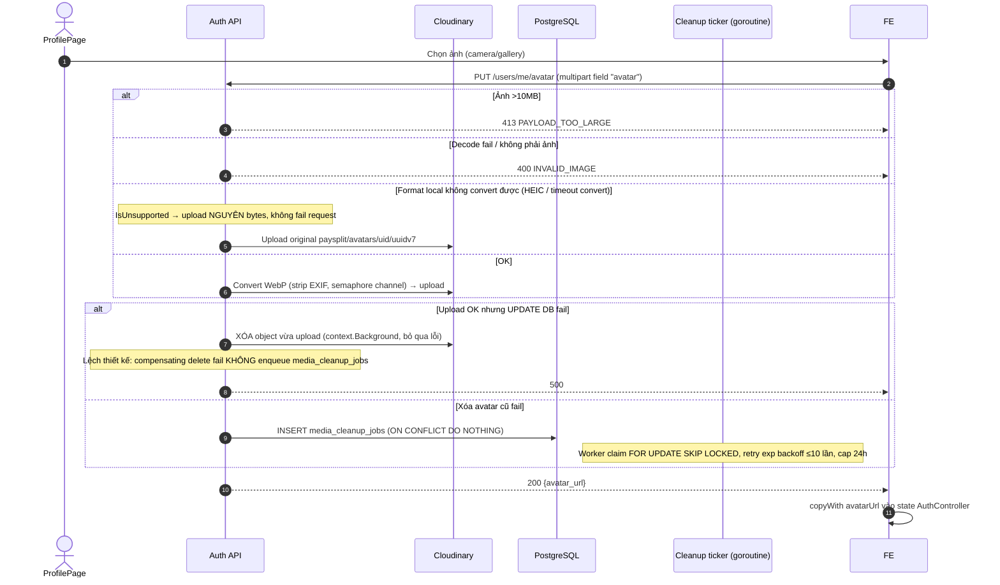
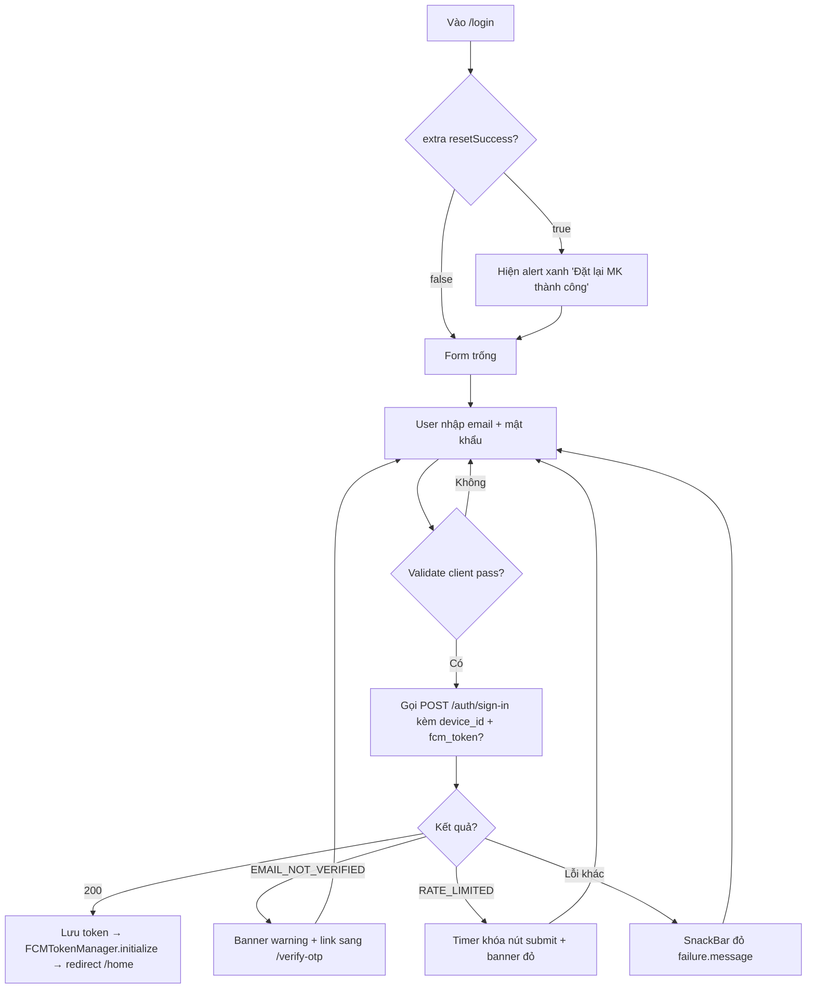
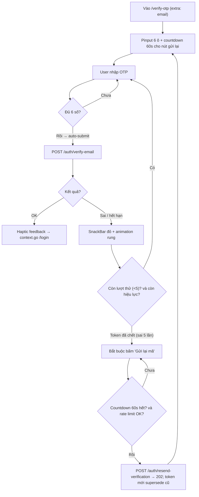
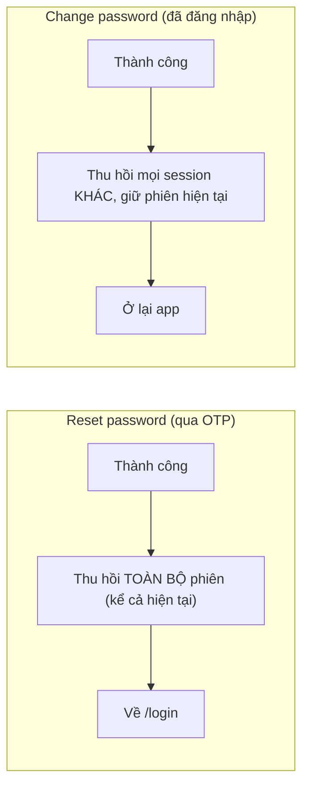

# 01 — Auth: Xác thực, Phiên đăng nhập & Hồ sơ cá nhân

> **Phạm vi**: BE module `auth` (`/api/v1/auth`, `/api/v1/users`) ↔ FE màn hình Welcome / Register / Verify OTP / Login / Forgot & Reset Password / Change Password / Profile / Bank Settings.
>
> Code tham chiếu chính: `PaySplit-BE/internal/modules/auth/**`, `PaySplit-FE/lib/features/auth/**`, `PaySplit-FE/lib/features/profile/**`.
>
> Nguồn sự thật: mã nguồn hiện tại. Các mã lỗi / HTTP status dưới đây là giá trị **handler thật sự map**, không phải tên biến domain.

---

## 1. Tổng quan mô hình phiên

| Khái niệm | Giá trị |
|---|---|
| Access token | JWT HS256 **15 phút**, payload chứa `sub` (user ID), `role`, `sid` (session ID) |
| Refresh token | Opaque 32-byte random (base64url), BE chỉ lưu SHA-256, TTL **7 ngày** (capped bởi `session.expires_at`) |
| Session | **Tối đa 1 session active mỗi user** (unique index `uq_sessions_one_active_per_user`). Đăng nhập thiết bị mới → thu hồi session cũ (`replaced_by_sign_in`) |
| OTP email | 6 chữ số, lưu SHA-256, hiệu lực 10 phút, **tối đa 5 lần thử sai thì token bị vô hiệu vĩnh viễn** (`superseded_at`) |
| Brute-force login | **5 lần sai trong cửa sổ 15 phút → khóa đăng nhập 15 phút** |
| Rate-limit OTP (resend / forgot) | Theo `email+IP`: **≥1 lần/phút** và **≥10 lần/giờ** (không phải /ngày) |
| Rate-limit sign-up | Theo hash(IP): **10 lượt/giờ** |
| SĐT | **Bắt buộc** lúc đăng ký. Cột `users.phone_number TEXT NOT NULL UNIQUE`, chuẩn E.164 VN |
| Mô hình token FE | `flutter_secure_storage` — keys `access_token`, `refresh_token` |

---

## 2. Endpoint & màn hình

### BE endpoints

Prefix thật: `/api/v1`. Bảng rút gọn path sau prefix đó.

| Method + Path | Handler | Middleware | Chức năng |
|---|---|---|---|
| POST `/auth/sign-up` | SignUp | — (rate limit IP toàn cục + rate limit DB `sign_up`) | Đăng ký, tạo user `pending_verification` + OTP. **201** |
| POST `/auth/verify-email` | VerifyEmail | — | Kích hoạt tài khoản bằng OTP. **200** |
| POST `/auth/resend-verification` | ResendVerification | — | Gửi lại OTP. Luôn **202** nếu qua validation (chống enumeration) |
| POST `/auth/sign-in` | SignIn | — | Đăng nhập, phát hành cặp token. Body nhận thêm `fcm_token` optional |
| POST `/auth/refresh` | Refresh | — | Xoay vòng refresh token (rotation) |
| POST `/auth/forgot-password` | ForgotPassword | — | Gửi OTP đặt lại mật khẩu. Luôn **202** nếu qua validation |
| POST `/auth/reset-password` | ResetPassword | — | Đặt lại mật khẩu bằng OTP. **204** |
| POST `/auth/sign-out` | SignOut | TokenAuth (chỉ verify JWT, **không** check session sống) | Thu hồi phiên hiện tại. **204** |
| GET/PATCH `/users/me` | Profile | liveAuth | Xem/sửa hồ sơ (+ bank profile) |
| PUT `/users/me/password` | ChangePassword | liveAuth | Đổi mật khẩu. **204** |
| PUT/DELETE `/users/me/avatar` | Avatar | liveAuth | Upload/xóa avatar (Cloudinary) |
| PUT `/users/me/fcm-token` | FCMToken | liveAuth | Gắn FCM token vào session |

`liveAuth` = verify JWT **và** `ValidateSession` (session chưa revoke, chưa hết hạn, user `active`, role khớp). Fail → `401 AUTHENTICATION_REQUIRED`.

### FE màn hình (go_router)

| Path | Page | Ghi chú |
|---|---|---|
| `/welcome` | WelcomePage | Onboarding carousel 3 slide → đẩy sang `/login` |
| `/register` | RegisterPage | Validate client-side đầy đủ; **SĐT bắt buộc** trên form |
| `/verify-otp` | VerifyOtpPage | extra: `email`; Pinput 6 ô auto-submit |
| `/login` | LoginPage | extra: `resetSuccess` (bool) hiển thị alert sau reset |
| `/forgot-password` | ForgotPasswordPage | |
| `/reset-password` | ResetPasswordPage | extra: `email` |
| `/profile`, `/edit-profile`, `/bank-settings`, `/change-password` | Profile* pages | Shell branch "Cài đặt" |

---

## 3. Sequence Diagrams

### 3.1 Đăng ký → Kích hoạt OTP → Đăng nhập lần đầu



**Gửi lại OTP** — `VerifyOtpPage` có countdown 60s; gọi `POST /auth/resend-verification`. BE rate-limit theo `email+IP` (**≥1 phút/lần, ≥10 lượt/giờ**); **token mới supersede token cũ** (unique partial index `uq_user_tokens_one_active_per_type`). Email không tồn tại hoặc user không còn `pending_verification` → vẫn **202**, không gửi mail (chống enumeration). SMTP fail chỉ log.

### 3.2 Đăng nhập & mô hình single-session

Thứ tự **trong code**: check block → bcrypt → rồi mới xét status trong `CreateSession`. Sai mật khẩu không lộ “chưa verify”.

```mermaid
sequenceDiagram
    autonumber
    actor U as Người dùng
    participant FE as Flutter (LoginPage)
    participant BE as Auth API
    participant DB as PostgreSQL

    U->>FE: Nhập email + mật khẩu, bấm Đăng nhập
    FE->>FE: Validate client (email, password bắt buộc)
    FE->>FE: Lấy device_id (secure storage) + FCM token nếu có
    FE->>BE: POST /auth/sign-in {email, password, device_id, device_name, fcm_token?}
    BE->>DB: GetByEmail; nếu không có user vẫn RecordLoginFailure (chống enumeration)
    BE->>DB: Kiểm tra login_blocked_until TRƯỚC khi so mật khẩu
    alt Đang bị khóa brute-force
        BE-->>FE: 429 RATE_LIMITED + header Retry-After
        FE-->>U: Banner đỏ + timer đếm ngược, disable nút submit
    else Sai email/mật khẩu (bcrypt fail)
        BE->>DB: Ghi login failure (5 sai / 15 phút → block 15 phút)
        BE-->>FE: 401 INVALID_CREDENTIALS
        FE-->>U: SnackBar lỗi
    else bcrypt OK, tài khoản chưa kích hoạt
        BE-->>FE: 403 EMAIL_NOT_VERIFIED
        FE-->>U: Banner warning kèm link sang /verify-otp (extra: email)
    else bcrypt OK, tài khoản suspended/locked
        BE-->>FE: 403 ACCOUNT_UNAVAILABLE
    else Hợp lệ (status = active)
        BE->>DB: THU HỒI mọi session cũ (replaced_by_sign_in)
        BE->>DB: INSERT session mới + refresh token (SHA-256) — duy nhất 1 session active
        BE->>BE: Ký JWT access 15m chứa sid
        alt Ký JWT thất bại
            BE->>DB: Revoke ngay session vừa tạo (reason: access_issue_failed)
        end
        BE->>DB: Reset bộ đếm login failure
        BE-->>FE: 200 {access_token, refresh_token, user, token_type, expires_at}
        FE->>FE: Lưu 2 token vào secure storage
        FE->>FE: unawaited FCMTokenManager.initialize() → PUT /users/me/fcm-token
        FE->>U: Router redirect → /home
    end
```

> Ý nghĩa single-session: người dùng đăng nhập máy mới → máy cũ bị "đá" — JWT cũ chứa `sid` đã chết, request tiếp theo của máy cũ bị `liveAuth` chặn `401 AUTHENTICATION_REQUIRED`.

### 3.3 Refresh token rotation & reuse detection



### 3.4 Quên / đặt lại mật khẩu

```mermaid
sequenceDiagram
    autonumber
    actor U as Người dùng
    participant FE as ForgotPasswordPage → ResetPasswordPage
    participant BE as Auth API
    participant Mail as SMTP

    U->>FE: Nhập email
    FE->>BE: POST /auth/forgot-password {email}
    BE->>BE: Rate limit theo email+IP (1/phút, 10/giờ)
    Note over BE: Email không tồn tại → vẫn 202, không gửi mail (chống enumeration).<br/>User tồn tại (kể cả pending) → vẫn tạo OTP reset; bước reset sau chỉ nhận user active.
    BE->>Mail: Gửi OTP nếu user tồn tại. Token mới supersede token cũ cùng type
    Note over BE,Mail: SMTP fail chỉ log — response vẫn 202
    BE-->>FE: 202 Accepted (luôn, trừ validation/rate-limit)
    FE->>U: Điều hướng /reset-password (extra: email)

    U->>FE: Nhập OTP + mật khẩu mới (checklist realtime) + xác nhận khớp
    FE->>BE: POST /auth/reset-password {email, otp, new_password} → 204
    BE->>BE: Logic OTP như verify-email (sai 5 lần → token chết vĩnh viễn)
    BE->>BE: Chỉ chấp nhận user status=active; khác → 400 INVALID_OR_EXPIRED_TOKEN
    BE->>BE: THU HỒI toàn bộ session + refresh token (reason: password_reset)
    FE->>U: context.go(/login, extra: true) → alert xanh "Đặt lại mật khẩu thành công"
```

### 3.5 Đổi mật khẩu (đã đăng nhập)



Handler map `ErrInvalidInput` → code JSON `VALIDATION_FAILED` (không phải `INVALID_INPUT`).

### 3.6 Upload avatar (compensating actions)

Cleanup **không đi River**. Bảng `media_cleanup_jobs` + goroutine ticker `auth/jobs/workers.go`.



---

## 4. Activity Diagrams

### 4.1 Luồng màn hình Login (FE)



### 4.2 Luồng màn hình Verify OTP (FE)



### 4.3 Quyết định redirect khi đổi mật khẩu/quên mật khẩu (tổng hợp)



---

## 5. Edge Cases

### 5.1 Bảng edge case chi tiết

| # | Tình huống | Xử lý hệ thống | Mã lỗi / phản hồi | Vị trí code |
|---|---|---|---|---|
| 1 | Email đã tồn tại khi đăng ký | Unique constraint `users_email_key` → `ErrEmailAlreadyExists` | `409 EMAIL_EXISTS` | `auth/repository/postgres/repository.go:736-747` |
| 2 | SĐT đã tồn tại | Tương tự `users_phone_number_key` | `409 PHONE_EXISTS` | như trên |
| 3 | Sign-up thiếu SĐT | `normalizePhone` fail; cột DB `NOT NULL` | `400 VALIDATION_FAILED` | `auth/usecase/service.go:87-90` |
| 4 | Spam đăng ký theo IP | Rate limit DB `sign_up`: 10 lượt/giờ, `pg_advisory_xact_lock` chống race đếm | `429 RATE_LIMITED` + `Retry-After` | `service.go:98-100`, `repository.go:537-584` |
| 5 | OTP sai quá 5 lần | `attempt_count` chạm ngưỡng → **supersede token vĩnh viễn**, phải xin mã mới | `400 INVALID_OR_EXPIRED_TOKEN` | `repository.go:154-168` |
| 6 | Verify khi đã active (double-submit / replay) | So sánh constant-time với OTP đã used → vẫn trả OK (idempotent) | `200 OK` | `repository.go:120-132` |
| 7 | Xin lại mã / quên MK liên tục | Rate limit resend/forgot theo email+IP: **≥1 phút/lần, ≥10/giờ**; token mới supersede cái cũ | `429 RATE_LIMITED` | `repository.go:562-573` |
| 8 | Dò email tồn tại (enumeration) | Resend/forgot luôn **202** nếu email hợp lệ; không tiết lộ user có hay không | `202 Accepted` (giả lập) | `service.go:153-161`, `handler.go:65-74` |
| 9 | Brute-force mật khẩu | 5 lần sai / 15′ → block 15′; check `login_blocked_until` **trước** bcrypt | `429 RATE_LIMITED` + `Retry-After` | `service.go:213-224`, `repository.go:187-226` |
| 10 | Login khi chưa kích hoạt | bcrypt **đã OK** rồi mới `CreateSession` trả `ErrEmailNotVerified` | `403 EMAIL_NOT_VERIFIED` | `repository.go:241-242` |
| 11 | Login khi suspended/locked | Cùng nhánh sau bcrypt | `403 ACCOUNT_UNAVAILABLE` | `repository.go:244-246` |
| 12 | Đăng nhập thiết bị thứ 2 | Thu hồi session cũ (`replaced_by_sign_in`); JWT cũ `sid` chết → request kế `401 AUTHENTICATION_REQUIRED` | `200` + phiên mới | `repository.go:250-255` |
| 13 | Ký JWT thất bại ngay sau khi tạo session | Revoke ngay session vừa tạo (`access_issue_failed`) | `500 INTERNAL_ERROR` | `service.go:236-239` |
| 14 | Refresh token đã used bị replay | **Reuse detection**: revoke session + token con (`refresh_reuse`) | `401 SESSION_REVOKED` | `repository.go:307-314` |
| 15 | Refresh từ `device_id` khác | Từ chối — token gắn chặt session/device | `400 INVALID_OR_EXPIRED_TOKEN` | `repository.go:318-320` |
| 16 | Nhiều request 401 đồng thời bắn refresh song song | FE single-flight `_refreshing`; nếu chạy song song thật, rotation trigger reuse-detection → mất phiên | tránh bởi interceptor | `core/network/interceptors/auth_interceptor.dart` |
| 17 | Refresh fail (lỗi xác thực) | FE clear cả 2 token → redirect `/welcome`. Flag `retried` chống loop | về `/welcome` | `auth_interceptor.dart` |
| 18 | Đổi mật khẩu nhưng vẫn muốn ở lại app | Giữ phiên hiện tại, chỉ đá các phiên khác | `204` | `repository.go:442-465` |
| 19 | Reset mật khẩu khi đang đăng nhập nhiều nơi | Thu hồi **toàn bộ** session (kể cả hiện tại) | `204` | `repository.go:379-440` |
| 20 | Avatar >10MB hoặc file giả đuôi ảnh | Check size + decode | `413 PAYLOAD_TOO_LARGE` / `400 INVALID_IMAGE` | `handler.go:180-219`, `service.go:310-323` |
| 21 | Convert avatar HEIC / timeout | `IsUnsupported` → upload **nguyên bytes**, không 400 | `200` nếu CDN OK | `service.go:317-323`, `platform/image/avatar/processor.go` |
| 22 | Upload CDN OK nhưng ghi DB lỗi | Compensating `Delete(context.Background())`; **lỗi delete bị bỏ qua, không enqueue** | `500` | `service.go:334-337` |
| 23 | Xóa avatar cũ fail sau khi DB đã trỏ object mới | Enqueue `media_cleanup_jobs`; worker ticker retry exp backoff ≤10 lần / cap 24h | `200` (upload vẫn thành công) | `service.go:339-343`, `jobs/workers.go` |
| 24 | Bank profile thiếu 1 trong 3 trường | Phải đủ cả 3 hoặc rỗng hoàn toàn; số TK 6–19 chữ số; bank code trong directory VietQR | `400 VALIDATION_FAILED` / `UNSUPPORTED_BANK` | `service.go:367-392` |
| 25 | Gắn FCM khi session đã chết | Repo trả `ErrSessionRevoked` (UPDATE 0 hàng: `revoked_at IS NULL`) | Handler **nuốt thành `500 INTERNAL_ERROR`** — lệch với domain | `handler.go:255-257`, `repository.go:718-733` |
| 26 | FE logout | Gọi `POST /auth/sign-out` (TokenAuth); lỗi mạng bị nuốt → vẫn `clear()` local + `FCMTokenManager.onLogout()` | `204` hoặc logout cục bộ | `auth_repository_impl.dart:245-256` |

### 5.2 Edge case FE validation (client-side, trước khi gọi API)

| Màn hình | Ràng buộc |
|---|---|
| Register | Tên ≥2 ký tự (BE chấp nhận ≥1 rune, tối đa 100); email chứa `@` và `.`; PasswordChecklist realtime (8–72, hoa, thường, số); **SĐT bắt buộc**, regex VN `^0[3\|5\|7\|8\|9][0-9]{8}$` maxLength 11; checkbox điều khoản bắt buộc |
| Login | Email/password bắt buộc; timer khi bị rate-limited |
| Verify OTP | Pinput 6 số auto-submit; countdown 60s resend |
| Reset password | Checklist + confirm khớp |
| Change password | Checklist (≥8, chữ hoa, chữ số) phải pass hết mới enable submit |
| Bank settings | Bắt buộc chọn ngân hàng; chủ TK tự normalize UPPERCASE không dấu (`VietnameseUtils.toBankHolderFormat`) |

---

## 6. Ghi chú triển khai BE đáng chú ý

- Mọi sự kiện rate-limit/login-failure ghi DB (không chỉ in-memory) → sống sót qua restart; `pg_advisory_xact_lock` chống race đếm.
- Cleanup định kỳ **không phải River**: `auth/jobs/workers.go` chạy goroutine + 2 `time.Ticker`. Xóa token/session/rate-limit-event hết hạn (batch 500, `pg_try_advisory_xact_lock('paysplit_auth_cleanup')`). Media cleanup claim `FOR UPDATE SKIP LOCKED`.
- Response `sign-up` **201** / `resend`+`forgot` **202** luôn thành công kể cả khi SMTP lỗi — mail fail chỉ log, tránh chặn onboarding.
- Concurrency trên request path: **không mutex / errgroup**. OTP–session serialize bằng `SELECT … FOR UPDATE`. Avatar convert dùng buffered `chan struct{}` (semaphore) + goroutine, timeout riêng. Compensating CDN delete dùng `context.Background()` để không bị request cancel cắt.
- Domain error → HTTP (handler `writeDomainError`): `ErrInvalidInput` → `400 VALIDATION_FAILED`; `ErrAccountUnavailable` → **`403`** (không phải 423); `ErrEmailAlreadyExists` → `409 EMAIL_EXISTS`.
- `PUT /users/me/fcm-token`: liveAuth đã chặn session chết lúc vào handler; nhánh `affected == 0` hầu như race revoke giữa chừng, nhưng hiện map nhầm `500`.
