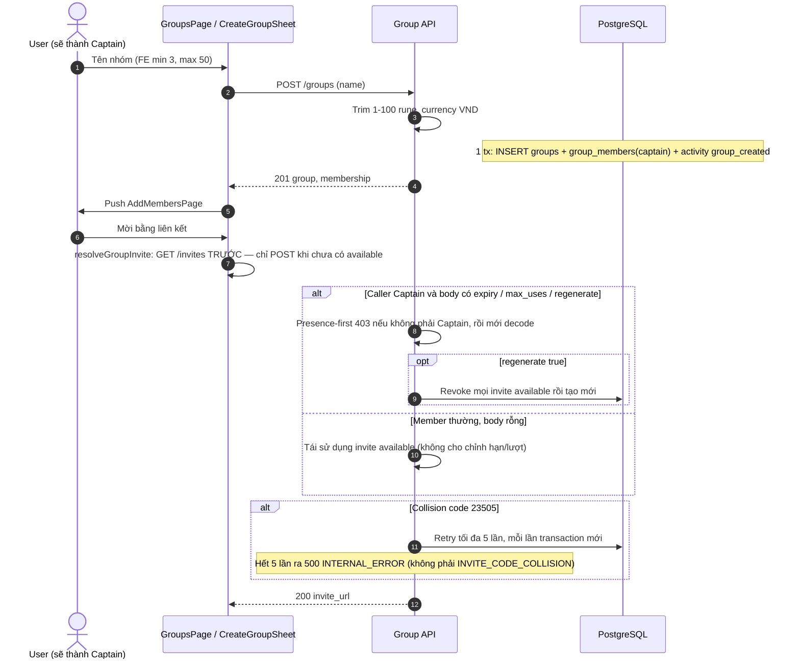
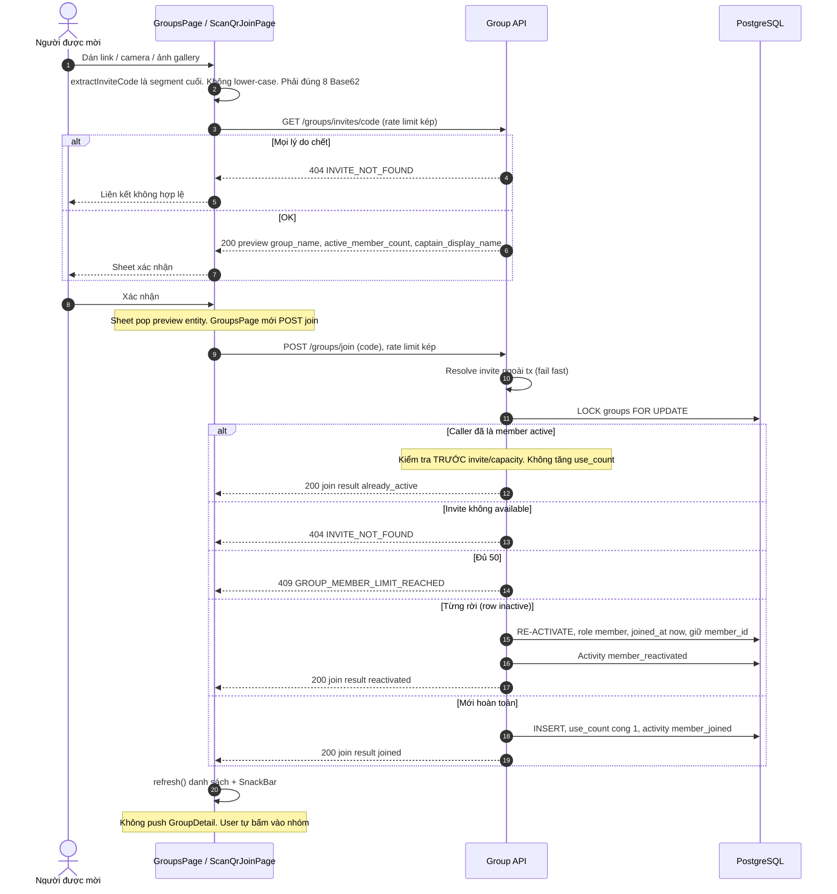
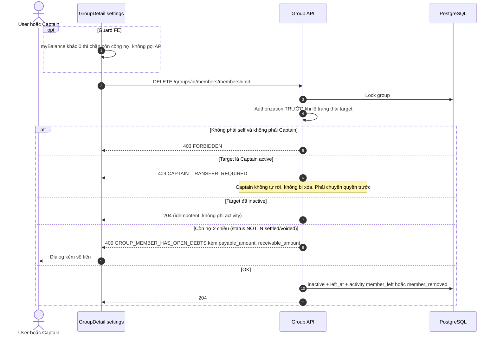
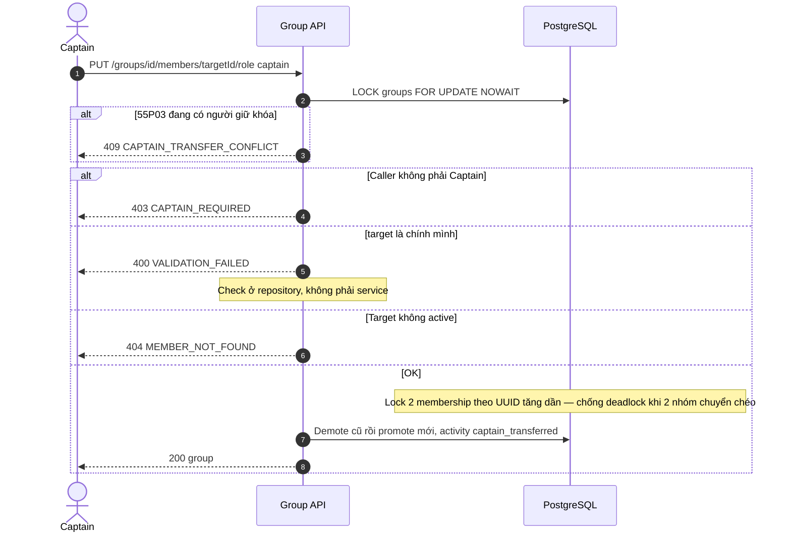
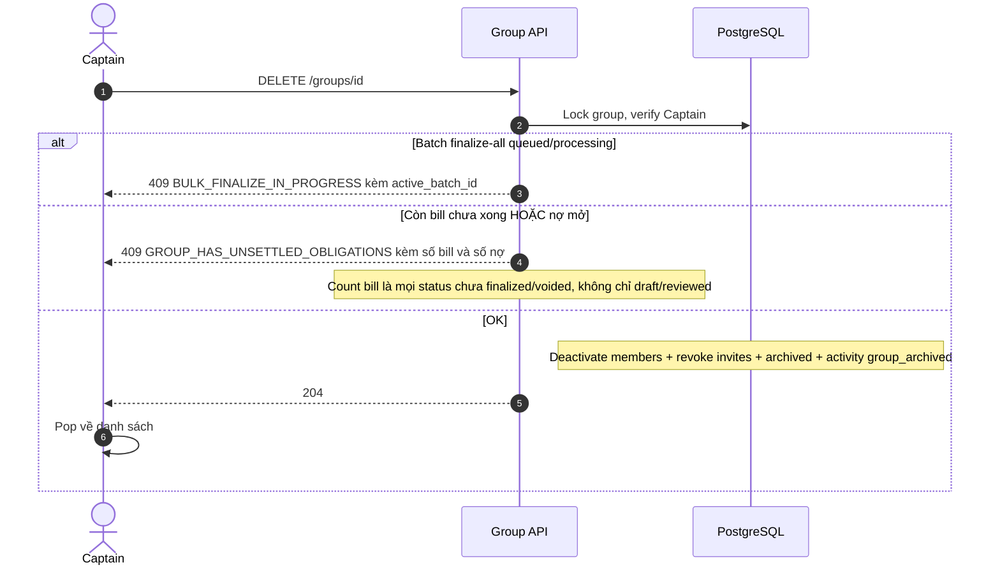
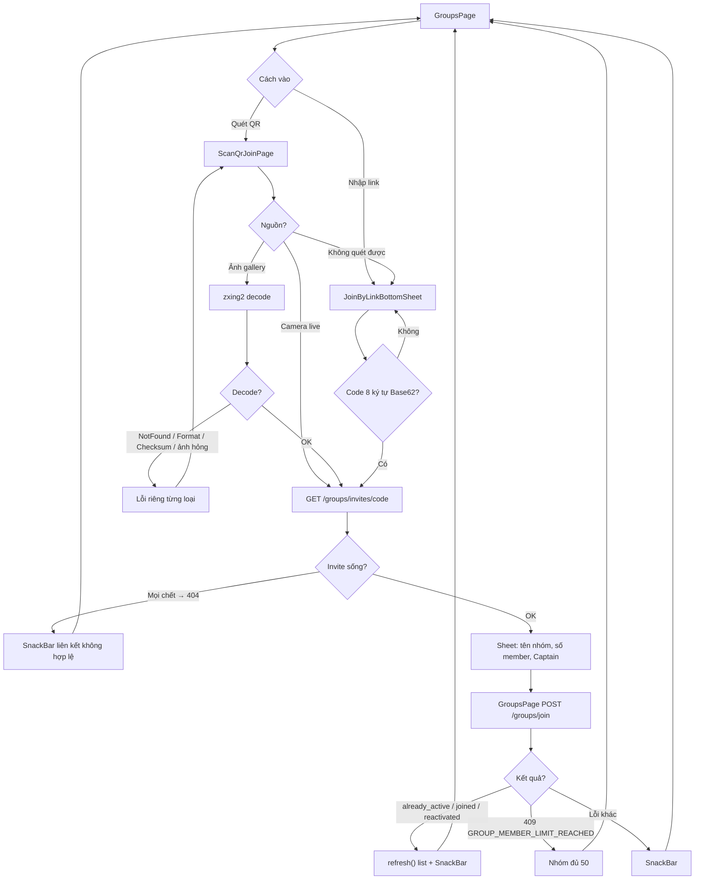
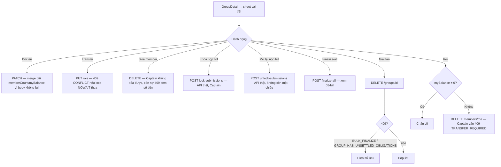

# 02 — Group: cửa nhóm, lời mời không lộ lý do, và một Captain

> **Phạm vi**: BE module `group` (`/api/v1/groups`) ↔ FE Groups / Scan QR / Join by Link / Create Group / Add Members / Group Detail Hub (4 tab).
>
> Code tham chiếu chính: `PaySplit-BE/internal/modules/group/**`, `PaySplit-BE/internal/platform/database/group_lock.go`, `PaySplit-FE/lib/features/groups/**`.
>
> Đọc cùng: [`08-realtime.md`](08-realtime.md) (kênh user + roster), [`03-bill.md`](03-bill.md) (khóa nộp bill / finalize-all gắn trên nhóm).

---

## 1. Vấn đề, và ý tưởng để giải quyết

### 1.1 Nhóm là ranh giới tiền bạc

Mọi hóa đơn, nợ, QR, thông báo đều nằm trong một nhóm. Sai một chỗ join thì người lạ nhìn thấy tiền của người khác. Sai một chỗ rời nhóm thì người còn nợ biến mất khỏi sổ.

### 1.2 Hai nguyên tắc chống dò

> **"Nhóm không tồn tại" và "bạn không phải thành viên" trả cùng `404 GROUP_NOT_FOUND`.** Không cho kẻ đoán UUID biết nhóm nào còn sống.
>
> **Mọi lý do invite chết (sai mã, hết hạn, bị thu hồi, hết lượt, nhóm đã archive) trả cùng `404 INVITE_NOT_FOUND`.** Không cho kẻ đoán mã biết mã này từng tồn tại.

Ngoại lệ đã biết: `GET /groups/{id}/activities` khi không phải member trả `403 FORBIDDEN` (không gọi `GetGroupByID`). Đừng "sửa cho đồng bộ" nếu chưa đổi luôn anti-oracle ở chỗ khác.

### 1.3 Thành viên rời đi nhưng hàng không bị xóa

`UNIQUE (group_id, user_id)`. Rời nhóm = `status='inactive'` + `left_at`. Vào lại = **UPDATE** hàng cũ, giữ nguyên `member_id`. Hóa đơn và nợ cũ không đứt tham chiếu. Role bị reset về `member` (không lấy lại Captain).

---

## 2. Bảng tổng quan

| Khái niệm | Giá trị |
|---|---|
| Vai trò | `captain` (đúng một người active / nhóm, partial unique), `member` |
| Trạng thái thành viên | `active`, `inactive` (giữ row) |
| Trạng thái nhóm | `active`, `archived` |
| Trần | **50** thành viên active. Tên BE 1–100 rune (trim). Currency chỉ `VND` |
| Lời mời | Base62 **8 ký tự, phân biệt hoa thường**. Hạn mặc định 24h, nhận 1–168h. `max_uses` tùy chọn 1–50; **NULL = không giới hạn** |
| URL invite BE | `url.JoinPath(APP_INVITE_BASE_URL, code)` — mặc định `https://paysplit.app/join/{code}` |
| URL helper FE | `https://paysplit.app/j/{code}` — extractor lấy **segment cuối**, nhận cả `/j/` và `/join/` |
| Activity | Ghi **cùng transaction** với mutation. Metadata **không** chứa invite code |
| Khóa hàng nhóm | `LockActiveGroup`: `SELECT ... FOR UPDATE` (transfer dùng `NOWAIT`) |
| Preview / Join | `liveAuth` + `RateLimitByAccountAndIP` (mặc định 30/phút, budget kép account + IP) |
| Realtime mặc định | Một kênh `GET /users/me/events`. `/groups/{id}/events` còn sống, **deprecated**, là đường lùi. `/sync` vẫn dùng cho legacy |

FE tạo nhóm: min 3 ký tự, `maxLength` 50 — chặt hơn BE. Đừng copy số FE vào tài liệu BE.

---

## 3. Endpoint và màn hình

Tất cả `liveAuth`. Preview/Join thêm limiter kép.

| Method + Path | Việc | Quyền |
|---|---|---|
| POST `/groups` | Tạo nhóm, caller thành Captain | mọi user |
| GET `/groups` | Keyset `(created_at,id)` desc; default 20 max 100; kèm net balance, **`pending_bill_count`**, last activity, lock flag | member active |
| GET `/groups/{id}` | Chi tiết + members + balances + **`pending_bill_count`** + `version` (roster). Captain thêm batch finalize id | member active; khác → `GROUP_NOT_FOUND` |
| PATCH `/groups/{id}` | Đổi tên. Trả `{group}` thôi, không full detail | Captain |
| DELETE `/groups/{id}` | Archive | Captain |
| GET/POST `/groups/{id}/invites` | Xem / tạo-tái sử dụng | xem: member; cấu hình expiry/max_uses/regenerate: Captain |
| DELETE `/groups/{id}/invites/{inviteId}` | Thu hồi, **idempotent 204** | Captain |
| GET `/groups/invites/{code}` | Preview | đã đăng nhập + RL kép |
| POST `/groups/join` | Vào nhóm | đã đăng nhập + RL kép |
| DELETE `/groups/{id}/members/{memberId}` | Tự rời / Captain xóa. `memberId` = **membership UUID** | self hoặc Captain |
| PUT `/groups/{id}/members/{memberId}/role` | Body chỉ `{role:"captain"}` | Captain |
| GET `/groups/{id}/activities` | Timeline | member; non-member → **403 FORBIDDEN** |
| GET `/groups/{id}/sync` | Catch-up roster/events theo `since` | member |
| GET `/groups/{id}/events` | SSE legacy | member; timeout HTTP được bỏ qua vì path `/events` |

Route bill-close (module bill, cùng prefix `/groups`, Captain): `POST .../bills/lock-submissions`, `POST .../bills/unlock-submissions`, `POST .../bills/finalize-all`, `GET .../bill-finalize-batches/{batchId}`. Chi tiết [`03-bill.md`](03-bill.md).

### FE

| Path | Việc |
|---|---|
| `/groups` | Cursor list, tile nhập link / quét QR, tạo nhóm → sheet, tab Đang hoạt động / Đã khóa bill (filter local) |
| `/scan-group-qr` | **Camera thật** `mobile_scanner` + gallery `zxing2`. Không còn placeholder |
| JoinByLinkBottomSheet | Dán link → extract code → preview. **POST join nằm ở GroupsPage**, không nằm trong sheet |
| CreateGroupBottomSheet → AddMembersPage | Sau tạo đi thẳng trang mời. Danh bạ mock **đã gỡ**. Mời SĐT = coming soon |
| GroupDetailPage 4 tab | Hóa đơn (`GET /bills`), Công nợ (`GET /groups/{id}/debts`), Thành viên (roster + SSE/user stream), Hoạt động. **Không còn mock** |

Deep link / App Link: **chưa có**. Manifest chỉ MAIN/LAUNCHER. Người dùng dán tay hoặc quét QR.

---

## 4. Đường đi của một lời mời

### 4.1 Tạo nhóm rồi mới nghĩ tới mã

Cách đọc:

Tạo nhóm và lấy mã mời là hai API. `POST /groups` trong một transaction: INSERT nhóm, INSERT caller là Captain, ghi activity `group_created`. App nhận `201` rồi **push** `AddMembersPage`, không ở lại list.

Trên trang mời, `resolveGroupInvite` **GET** danh sách invite trước. Đã có mã `available` thì tái sử dụng, tránh spam mã rác mỗi lần bấm chia sẻ. Chỉ POST tạo mới khi chưa có mã sống, hoặc Captain gửi `regenerate true`.

Quyền theo **sự có mặt của field**, không theo "ai bấm nút": body có `expires_in_hours` / `max_uses` / `regenerate` thì phải là Captain (403 trước khi decode). Body rỗng thì member thường cũng xin được mã đang có, nhưng không chỉnh hạn hay số lượt.

`max_uses` để trống (NULL) nghĩa là không giới hạn, không phải mặc định 50. Code Base62 8 ký tự phân biệt hoa thường. Trùng unique `code` thì thử tối đa 5 transaction mới. Hết 5 lần ra `500 INTERNAL_ERROR`, không có mã public `INVITE_CODE_COLLISION`. URL trả về lấy từ `APP_INVITE_BASE_URL` + code (mặc định `/join/{code}`).

Access log **che** path `/api/v1/groups/invites/{code}`. Activity chỉ ghi `invite_id`, không ghi code.

### 4.2 Preview rồi Join — serialize bằng khóa nhóm

Hai người bấm join khi nhóm còn đúng một chỗ. Không khóa hàng thì cả hai cùng thấy 49, cả hai cùng vào, thành 51.

Cách đọc:

Hai bước cố ý tách. Preview (`GET /groups/invites/code`) chỉ trả tên nhóm, số member, tên Captain. Join (`POST /groups/join`) mới đổi dữ liệu. Sheet xác nhận **pop** entity về `GroupsPage`, chính page đó mới gọi join. Comment cũ "sheet cũng POST join" là sai.

Mọi invite chết (sai format, hết hạn, bị thu hồi, hết lượt, nhóm archive) cùng `404 INVITE_NOT_FOUND`. Không tiết lộ lý do, kẻ đoán mã không biết mã từng tồn tại.

Sau khi xác nhận, backend `LOCK groups FOR UPDATE` rồi mới xét. Thứ tự trong hình quan trọng: **đã là member active thì 200 ngay**, không kiểm tra invite, không tăng `use_count`. Không thì Captain bấm lại link của chính nhóm mình có thể bị 404 vì mã đã hết lượt.

Trần 50 đếm dưới khóa hàng: hai người bấm cùng lúc khi còn 1 chỗ, chỉ một người thắng. Người từng rời nhóm được **reactivate** hàng cũ (`UNIQUE group_id, user_id`), giữ `member_id` để hóa đơn/nợ không đứt, role reset về `member`.

Join xong chỉ `refresh()` list + SnackBar. **Không** tự mở Group Detail.

Limiter kép: mỗi lần preview/join tăng **cả** `account:<uid>` và `ip:<TCP IP>` (không đọc `X-Forwarded-For`). Vượt → `429` + `Retry-After` đến phút epoch kế.

### 4.3 Rời / xóa — quyền trước, trạng thái sau

Cách đọc:

`memberId` trên URL là **UUID membership**, không phải user id.

**Anti-oracle:** kiểm tra caller là chính target hoặc Captain **trước** khi nói target đang inactive hay còn nợ. Member thường xóa người khác, hoặc đoán UUID không tồn tại, đều `403 FORBIDDEN`. Nếu trả 404 khi target không có, kẻ đoán được ai còn trong nhóm.

Captain active không tự rời cũng không bị xóa (`409 CAPTAIN_TRANSFER_REQUIRED`). Phải chuyển quyền trước. Target đã inactive rồi thì `204` im lặng, không ghi activity trùng.

Nợ mở là **hai chiều**: mình nợ người khác (`payable`) và người khác nợ mình (`receivable`), status không thuộc `settled`/`voided`. 409 kèm đúng số tiền để UI hiện dialog.

Guard FE `myBalance khác 0` chỉ chặn sớm. Captain số dư 0 vẫn gọi API và ăn 409 chuyển quyền. BE là nguồn sự thật.

Guard FE chỉ nhìn `myBalance`. Captain còn số dư 0 vẫn gọi API và ăn 409 `CAPTAIN_TRANSFER_REQUIRED`. BE là nguồn sự thật.

### 4.4 Chuyển Captain — không xếp hàng

Hai lệnh transfer cùng lúc nếu `FOR UPDATE` thường sẽ xếp hàng, dễ timeout. `NOWAIT` trả conflict ngay.

Cách đọc:

Body chỉ nhận `{role: captain}`. Không có API "tự giáng cấp thành member".

`FOR UPDATE NOWAIT` trên hàng nhóm: đang có mutation khác giữ khóa thì SQLSTATE `55P03`, trả `409 CAPTAIN_TRANSFER_CONFLICT` ngay. Không xếp hàng chờ, tránh timeout 15 giây rồi 500 khó hiểu.

Hai membership (Captain cũ và người được chọn) được khóa theo **UUID tăng dần**. Nếu nhóm A chuyển Captain cho user X đồng thời nhóm B chuyển cho user Y, mà X và Y là membership chéo, khóa không theo thứ tự cố định sẽ deadlock. Check "chuyển cho chính mình" nằm ở **repository**, ra `400 VALIDATION_FAILED`.

Non-captain → `403 CAPTAIN_REQUIRED`. Target không active → `404 MEMBER_NOT_FOUND`. Thành công: demote cũ, promote mới, activity `captain_transferred` trong cùng tx.

### 4.5 Giải tán

Cách đọc:

Giải tán là `DELETE /groups/id` nhưng dữ liệu **không xóa cứng**. Status nhóm thành `archived`, member inactive, invite bị revoke, activity `group_archived`. Lần GET detail sau ra `404 GROUP_NOT_FOUND` (anti-enumeration: archived trông giống không tồn tại).

Hai cửa chặn trước khi archive:
- Batch finalize-all đang `queued`/`processing` → `409 BULK_FINALIZE_IN_PROGRESS` kèm `active_batch_id` để Captain theo dõi, đừng giải tán giữa chừng.
- Còn bill chưa `finalized`/`voided` **hoặc** còn nợ mở → `409 GROUP_HAS_UNSETTLED_OBLIGATIONS` kèm số lượng. Tên field `draft_or_reviewed_bill_count` hơi hẹp: count là mọi bill chưa xong, không chỉ draft/reviewed.

204 thì app pop về danh sách nhóm.

Lịch sử không xóa. Nhóm archived: detail → `GROUP_NOT_FOUND`.

### 4.6 Thu hồi invite

`DELETE .../invites/{id}`: đã revoked rồi vẫn **204**. Activity không chứa code.

---

## 5. Realtime trên màn nhóm

Mặc định **không** mở SSE theo nhóm. Một kết nối `GET /users/me/events` phục vụ cả app. Chi tiết frame và sổ đăng ký: [`08-realtime.md`](08-realtime.md) mục 3 và 6.

| Surface | Provider |
|---|---|
| `home.groups` | Home, `GET /groups?limit=3` |
| `groups.index` | Danh sách đầy đủ, có `patchGroup` vá tại chỗ |
| `group.detail:<gid>` | Snapshot: balances, lock |
| `group.roster:<gid>` | Delta `roster` áp thẳng; overflow → `/sync` |
| `group.bills:<gid>` | Tab Hóa đơn |
| `group.debts:<gid>` | Tab Công nợ |
| `group.activities:<gid>` | Tab Hoạt động |

`home.groups` và `groups.index` **luôn làm mới cùng nhau** (cùng `GET /groups`, khác `limit`). Vá tại chỗ: [`08-realtime.md`](08-realtime.md) mục 7. `GET /groups/{id}` **phải** trả `pending_bill_count` — không thì vá một dòng sẽ ghi đè chip "bill mở" thành 0.

`REALTIME_MODE=legacy` (hoặc `auto` gặp 404/501 trước `ready`): mở `GET /groups/{id}/events`, hàn gap bằng `GET /groups/{id}/sync?since=`. **Không bao giờ mở hai cơ chế cùng lúc.**

---

## 6. Activity Diagrams

### 6.1 Vào nhóm qua link / QR

Cách đọc:

Hai cửa vào, một điểm hội tụ. Nhập link lấy **segment cuối** của URL (nhận cả `/j/code` và `/join/code`). Quét QR: camera sống (`mobile_scanner`) hoặc ảnh gallery (`zxing2`). Decode lỗi tách NotFound / Format / Checksum / ảnh hỏng để hiện đúng câu. Không quét được thì quay lại sheet dán link.

Code phải đúng 8 ký tự Base62, **không** lower-case. Sai hoa thường là mã khác, 404.

Mọi invite chết cùng 404, SnackBar "liên kết không hợp lệ". Preview OK thì sheet tên nhóm / số member / Captain. Xác nhận xong `GroupsPage` mới POST join. `already_active`, `joined`, `reactivated` đều chỉ refresh list + SnackBar. User tự bấm vào nhóm. Trần 50 hiện câu riêng.

### 6.2 Cài đặt nhóm

Cách đọc:

Sheet cài đặt là nơi Captain (và member với "Rời") gọi API thật. Không còn mock.

Đổi tên: `PATCH` chỉ trả `{group}`, thiếu `memberCount` / `myBalance`. App **merge** giữ số cũ. Đừng dùng hàm merge này để vá realtime (hàm đó cố ý giữ `pendingBillCount` lúc đổi tên). Vá số bill mở phải hàm khác, xem [`08-realtime.md`](08-realtime.md).

Khóa nộp / mở lại / finalize-all là route module bill trên prefix `/groups`. `markGroupClosedLocally` chỉ cache sau HTTP 200, không phải chỗ khóa. Unlock **có** trong V hiện tại.

Rời: UI chặn `myBalance khác 0`. Captain số dư 0 vẫn 409 chuyển quyền. Giải tán 409 thì hiện số liệu BE trả, không pop.

`markGroupClosedLocally` chỉ là **cache sau 200**, không phải chỗ khóa. Comment cũ "khóa một chiều V1" trong provider **stale**.

---

## 7. Edge Cases

| # | Tình huống | Xử lý | Mã | Chỗ |
|---|---|---|---|---|
| 1 | Dò nhóm bằng UUID | Non-member / archived / không có → cùng lỗi | `404 GROUP_NOT_FOUND` | GetGroupDetail |
| 2 | Activities khi không phải member | Không đi GetGroupByID | `403 FORBIDDEN` | ngoại lệ anti-enum |
| 3 | 2 join cùng lúc, còn 1 chỗ | `FOR UPDATE` serialize | `409 GROUP_MEMBER_LIMIT_REACHED` kẻ thua | RedeemInvite |
| 4 | Join khi đã ở trong | Idempotent, không tăng use_count | `200 already_active` | check trước invite |
| 5 | Join lại sau khi rời | Reactivate, role=member, giữ member_id | `200 reactivated` | UNIQUE (group_id,user_id) |
| 6 | Rời khi còn nợ 2 chiều | Kèm số tiền | `409 GROUP_MEMBER_HAS_OPEN_DEBTS` | |
| 7 | Captain tự rời / bị xóa | | `409 CAPTAIN_TRANSFER_REQUIRED` | |
| 8 | Member xóa người khác | Auth trước, không lộ target | `403 FORBIDDEN` | target missing cũng 403 |
| 9 | 2 transfer cùng lúc | NOWAIT | `409 CAPTAIN_TRANSFER_CONFLICT` | |
| 10 | Transfer chéo 2 nhóm | Lock membership UUID tăng dần | không deadlock | |
| 11 | Transfer cho mình | | `400 VALIDATION_FAILED` | repository |
| 12 | Collision code hết 5 lần | | `500 INTERNAL_ERROR` | **không** public `INVITE_CODE_COLLISION` |
| 13 | Invite chết mọi lý do | | `404 INVITE_NOT_FOUND` | |
| 14 | Spam preview/join | Budget kép 30/phút mặc định | `429 RATE_LIMITED` | không X-Forwarded-For |
| 15 | Revoke đã revoke | | `204` | |
| 16 | Activity chứa code | Bị chặn lúc insert | — | insertInviteActivity |
| 17 | Disband khi batch chạy | Kèm `active_batch_id` | `409 BULK_FINALIZE_IN_PROGRESS` | |
| 18 | Disband còn bill/nợ | | `409 GROUP_HAS_UNSETTLED_OBLIGATIONS` | |
| 19 | Cursor hỏng / limit lạ | Clamp 1–100 | `400 INVALID_CURSOR` | |
| 20 | Dán code sai hoa thường | FE không fold case | `404` | `invite_code.dart` |
| 21 | FE rời khi myBalance ≠ 0 | Chặn UI; BE vẫn là nguồn | | `group_detail_page.dart` |
| 22 | Listener PG đứt | Đóng SSE local; user stream `ready` hàn; legacy dùng `/sync` | | [`08`](08-realtime.md) |
| 23 | Vá nhóm đã rời khỏi list | Bỏ qua | | [`08`](08-realtime.md) mục 7 |
| 24 | PATCH đổi tên rồi vá list bằng hàm merge cũ | Hàm cũ giữ `pendingBillCount` cố ý (đúng cho rename). Vá realtime phải hàm khác | chip bill mở đứng im | [`08`](08-realtime.md) ghi chú 6 |
| 25 | `max_uses` bỏ trống | NULL = không giới hạn | | không ép 1–50 |

---

## 8. Cấu hình

| Biến | Mặc định | Ý nghĩa |
|---|---|---|
| `APP_INVITE_BASE_URL` | `https://paysplit.app/join` | JoinPath + code |
| `HTTP_INVITE_ATTEMPTS_PER_MINUTE` | `30` | Limiter kép preview/join |
| `USER_SSE_ENABLED` / `REALTIME_MODE` | xem [`08`](08-realtime.md) | |

---

## 9. Ghi chú triển khai đáng chú ý

1. **Khóa hàng nhóm là biên dịch race của cả hệ.** Join, finalize, void, payment đều đi `LockActiveGroup`. Đừng thêm mutation nhóm mà bỏ khóa.

2. **Anti-enumeration không phải trang trí.** Đổi activities sang `GROUP_NOT_FOUND` thì phải đổi luôn chỗ DELETE member (target missing đang 403 có chủ đích anti-oracle).

3. **`already_active` không phải `already_member`.** Comment FE stale. Join path không nhánh theo `result`.

4. **Collision hết retry là `INTERNAL_ERROR`.** Đừng dạy client bắt `INVITE_CODE_COLLISION`.

5. **`GET /groups/{id}` phải có `pending_bill_count`.** Vá list từ detail thiếu field này = chip "1 bill mở" thành 0, và lúc xóa bill trông **vẫn đúng**.

6. **Khóa nộp bill có unlock.** Tài liệu V1 "một chiều" đã sai so với code. FE gọi API thật rồi mới `markGroupClosedLocally`.

7. **Chia sẻ link phải dùng `invite_url` từ API**, không dùng helper `/j/` nếu base BE là `/join/`. Extractor chấp nhận cả hai vì lấy segment cuối.

8. **Limiter invite không tin `X-Forwarded-For`.** Sau proxy, mọi user có thể dính chung một IP TCP.

9. **Không mở user stream và group SSE cùng lúc.** Mỗi invalidate sẽ refresh hai lần, số nhấp nháy.

10. **Metadata activity không bao giờ chứa invite code.** Invariant có integration test. Đừng "thêm code cho dễ debug".

---

## 10. Trạng thái hiện tại

| Hạng mục | Trạng thái | Ghi chú |
|---|---|---|
| Tạo / mời / preview / join / rời / transfer / disband | ✅ | Anti-enum, row lock, reactivate |
| Tab Hóa đơn / Công nợ / Thành viên / Hoạt động | ✅ API thật | Không còn mock |
| Camera QR | ✅ `mobile_scanner` + gallery zxing2 | |
| Khóa / mở nộp bill | ✅ API thật | Unlock có |
| Realtime user stream trên list/detail | ✅ | Vá tại chỗ đã kiểm |
| SSE `/groups/{id}/events` | ⚠️ Deprecated, còn chạy | Cổng 410 chưa bật |
| Deep link | ⏸ | Dán tay / QR |
| Mời bằng SĐT / danh bạ | ⏸ Coming soon | |
