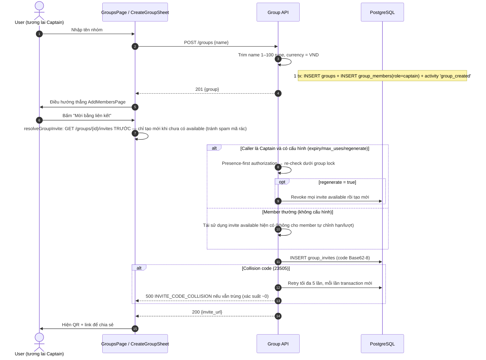
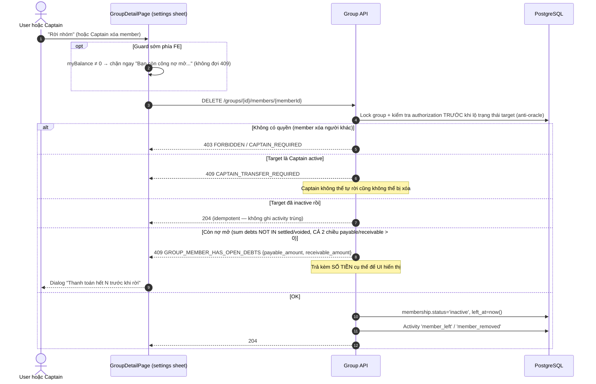
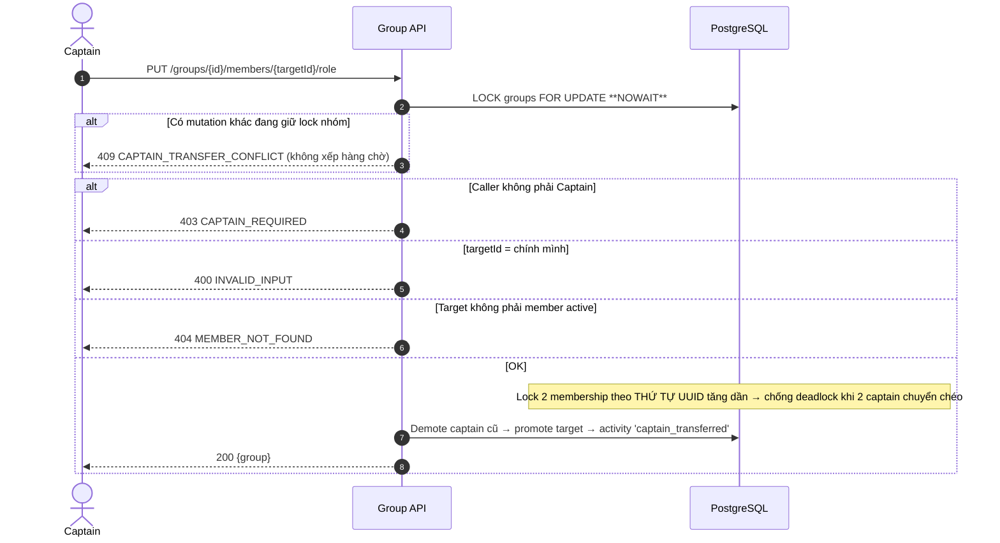
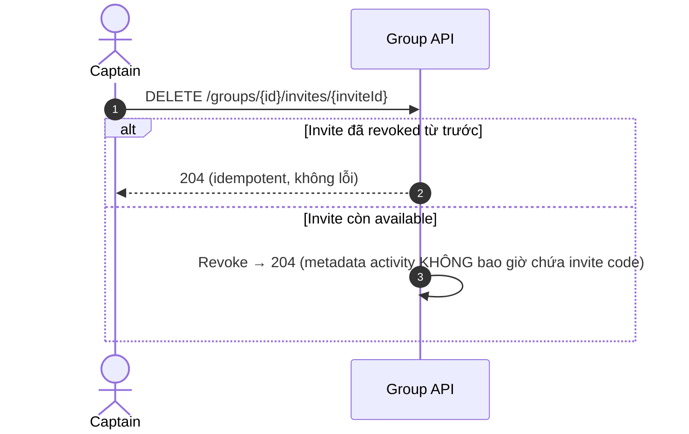
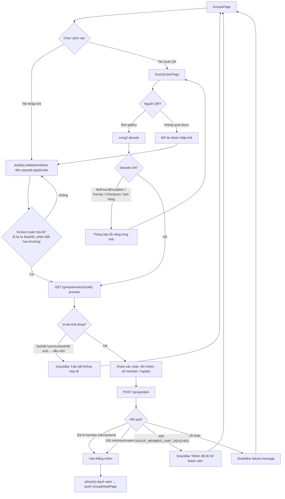
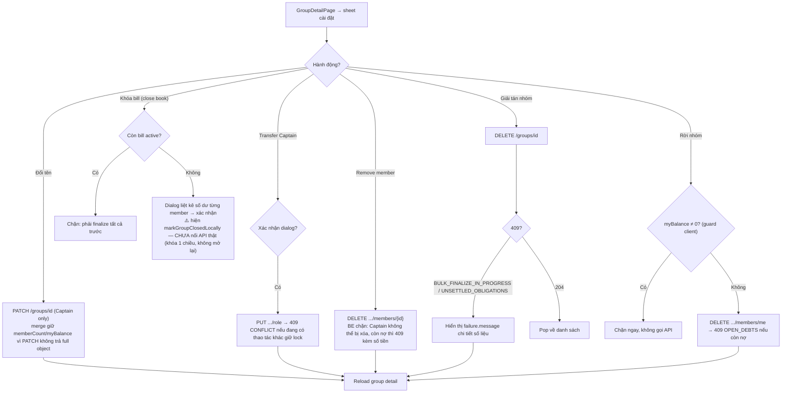

# 02 — Group: Nhóm, Lời mời & Thành viên

> **Phạm vi**: BE module `group` (`/api/v1/groups`) ↔ FE màn hình Groups / Scan QR Join / Join by Link / Create Group / Add Members / Group Detail Hub (4 tab).
>
> Code tham chiếu chính: `PaySplit-BE/internal/modules/group/**`, `PaySplit-FE/lib/features/groups/**`.

---

## 1. Tổng quan mô hình

| Khái niệm | Giá trị |
|---|---|
| Vai trò trong nhóm | `captain` (độc nhất — unique 1 Captain active/nhóm), `member` |
| Trạng thái thành viên | `active`, `inactive` (rời nhóm nhưng **giữ row** — join lại là UPDATE, không INSERT) |
| Giới hạn | Tối đa **50 thành viên active/nhóm**; tên nhóm 1–100 ký tự (trim); currency chỉ `VND` |
| Lời mời | Code Base62 **8 ký tự, phân biệt hoa/thường**; expiry mặc định 24h (chấp nhận 1–168h); max_uses 1–50; URL dạng `https://<base>/<code>` |
| Activity log | Mọi mutation ghi `group_activities` **ATOMIC trong cùng transaction** (`member_joined`, `captain_transferred`, `group_archived`, ...) |
| Anti-enumeration | "Nhóm không tồn tại" và "bạn không phải thành viên" trả **cùng một** lỗi `GROUP_NOT_FOUND` |

## 2. Endpoint & màn hình

### BE endpoints (tất cả `liveAuth`; Preview/Join có thêm RateLimitByAccountAndIP)

| Method + Path | Chức năng | Quyền |
|---|---|---|
| POST `/groups` | Tạo nhóm (caller thành Captain) | mọi user |
| GET `/groups` | Danh sách nhóm (keyset cursor `(created_at,id)`; default 20, max 100; kèm net balance, pending bills, last activity) | member |
| GET `/groups/{id}` | Chi tiết (Captain được thêm batch finalize đang chạy) | member active |
| PATCH `/groups/{id}` | Đổi tên | Captain |
| DELETE `/groups/{id}` | Giải tán nhóm (archive) | Captain |
| GET/POST `/groups/{id}/invites` | Xem / tạo lời mời | xem: member; cấu hình: Captain |
| DELETE `/groups/{id}/invites/{inviteId}` | Thu hồi invite (**idempotent**) | Captain |
| GET `/groups/invites/{code}` | Preview nhóm trước khi join | mọi user đã đăng nhập (rate-limit kép) |
| POST `/groups/join` | Vào nhóm bằng code | mọi user đã đăng nhập (rate-limit kép) |
| DELETE `/groups/{id}/members/{memberId}` | Tự rời / Captain xóa member | self hoặc Captain |
| PUT `/groups/{id}/members/{memberId}/role` | Chuyển quyền Captain | Captain |
| GET `/groups/{id}/activities` | Timeline hoạt động | member active |

### FE màn hình

| Path/Page | Nội dung |
|---|---|
| `/groups` (GroupsPage) | Danh sách nhóm (cursor pagination), 2 tile "Nhập link"/"Quét QR", tạo nhóm → sheet, tabs Đang hoạt động / Đã khóa bill (filter cục bộ), empty/error state |
| ScanQrJoinPage | Camera placeholder; chọn ảnh QR từ gallery → decode `zxing2`; validate code đúng 8 ký tự Base62 (phân biệt hoa thường); hoặc chuyển sang nhập link |
| JoinByLinkBottomSheet | Dán link `paysplit.app/j/<code>` → extract code → preview → confirm join |
| CreateGroupBottomSheet → AddMembersPage | Sau tạo nhóm đi thẳng trang mời thêm |
| GroupDetailPage (4 tab) | Hóa đơn / Công nợ / Thành viên / Hoạt động + sheet cài đặt nhóm (rename, transfer captain, remove member, disband, leave, khóa bill, mã mời) |

> ⚠️ Khoảng trống hiện tại: panels Hóa đơn/Công nợ trong Group Detail dùng **mock in-memory**; camera QR là placeholder; danh bạ contacts mock; khóa bill FE mới đổi state local. Các thao tác quản trị (rename/transfer/remove/disband/invite) gọi API thật.

---

## 3. Sequence Diagrams

### 3.1 Tạo nhóm & sinh lời mời



### 3.2 Preview lời mời & Join nhóm (link/QR)

```mermaid
sequenceDiagram
    autonumber
    actor U as Người được mời
    participant FE as GroupsPage / ScanQrJoinPage
    participant BE as Group API
    participant DB as PostgreSQL

    U->>FE: Dán link / decode ảnh QR
    FE->>FE: Extract code; validate đúng 8 ký tự Base62 (phân biệt hoa thường — KHÔNG chuẩn hóa case)
    FE->>BE: GET /groups/invites/{code}   [rate limit kép account+IP]
    alt Sai format / hết hạn / revoked / hết lượt dùng
        BE-->>FE: 404 INVITE_NOT_FOUND (mọi trường hợp cùng một mã — không leak lý do)
        FE-->>U: Thông báo link không hợp lệ
    else OK
        BE-->>FE: 200 {group_name, active_member_count, captain_name}
        FE-->>U: Sheet xác nhận "Vào nhóm X?"
    end
    U->>FE: Xác nhận
    FE->>BE: POST /groups/join {code}   [rate limit kép]
    BE->>BE: Resolve invite ngoài tx (fail fast)
    BE->>DB: LOCK groups FOR UPDATE (serialize mọi redemption đồng thời)
    alt Caller ĐÃ là member active
        Note over BE: Idempotent — kiểm tra TRƯỚC cả check invite/capacity
        BE-->>FE: 200 OK (không tăng use_count)
    else Invite không available (revoked/expired/use_count ≥ max_uses)
        BE-->>FE: 404 INVITE_NOT_FOUND
    else Nhóm đủ 50 member active
        BE-->>FE: 409 GROUP_MEMBER_LIMIT_REACHED
        Note over BE: Row lock đảm bảo 2 join đồng thời không vượt cap
    else OK
        BE->>DB: use_count += 1
        alt Đã từng rời nhóm (membership inactive tồn tại do UNIQUE(group_id,user_id))
            BE->>DB: RE-ACTIVATE membership cũ (giữ member_id → lịch sử bill/nợ không đứt)
            BE->>DB: Activity 'member_reactivated'
        else Member hoàn toàn mới
            BE->>DB: INSERT membership active
            BE->>DB: Activity 'member_joined'
        end
        BE-->>FE: 200 {group}
        FE->>U: refresh() danh sách nhóm
    end
```

### 3.3 Rời nhóm / Xóa thành viên



### 3.4 Chuyển quyền Captain



### 3.5 Giải tán nhóm (Disband)

```mermaid
sequenceDiagram
    autonumber
    actor C as Captain
    participant BE as Group API
    participant DB as PostgreSQL

    C->>BE: DELETE /groups/{id}
    BE->>DB: Lock group; verify Captain
    alt Đang có batch finalize-all queued/processing
        BE-->>C: 409 BULK_FINALIZE_IN_PROGRESS {active_batch_id}
    else Còn bill draft/reviewed HOẶC còn nợ mở
        BE-->>C: 409 UNSETTLED_OBLIGATIONS {draft_or_reviewed_bill_count, open_debt_count}
    else OK
        Note over DB: 1 tx: deactivate toàn bộ members + revoke invites + status='archived' + activity 'group_archived'
        BE-->>C: 204
        FE-->>U: Pop về danh sách nhóm
    end
```

### 3.6 Thu hồi lời mời (idempotent)



## 4. Activity Diagrams

### 4.1 Luồng vào nhóm qua Link / QR (FE GroupsPage)



### 4.2 Luồng quản trị nhóm (Group Detail settings sheet)



---

## 5. Edge Cases

| # | Tình huống | Xử lý hệ thống | Mã lỗi / phản hồi | Vị trí code (tham chiếu) |
|---|---|---|---|---|
| 1 | Dò sự tồn tại nhóm (enumeration) | Get detail / mutation: "nhóm không có" và "không phải member" trả cùng lỗi | `404 GROUP_NOT_FOUND` | `group/repository/postgres/repository.go:183-191` |
| 2 | 2 người join cùng lúc khi nhóm còn đúng 1 chỗ | Group row lock serialize redemption → chỉ 1 thắng, cap 50 không vượt | `409 GROUP_MEMBER_LIMIT_REACHED` | `repository.go:572-624` |
| 3 | Bấm join khi đã ở trong nhóm | Idempotent success, kiểm tra **trước cả** check invite/capacity, không tăng use_count | `200 OK` | `repository.go:590-604` |
| 4 | Join lại nhóm đã từng rời | Reactivate membership cũ (UNIQUE(group_id,user_id) cấm INSERT) — giữ nguyên member_id để lịch sử hóa đơn/nợ không đứt; activity riêng `member_reactivated` | `200 OK` | migration 000001, `repository.go` RedeemInvite |
| 5 | Rời nhóm khi còn nợ (cả 2 chiều) | Sum debts `NOT IN ('settled','voided')` > 0 → chặn kèm **số tiền payable/receivable** trong error fields | `409 GROUP_MEMBER_HAS_OPEN_DEBTS` | `repository.go:741-751` |
| 6 | Captain muốn rời nhóm / bị member khác xóa | Chặn bắt buộc transfer Captain trước | `409 CAPTAIN_TRANSFER_REQUIRED` | `repository.go:737-739` |
| 7 | Member cố xóa người khác / sửa invite | Authorization check **trước khi** lộ trạng thái target (anti-oracle) | `403 FORBIDDEN` / `CAPTAIN_REQUIRED` | `repository.go:705-726` |
| 8 | 2 lệnh transfer captain đồng thời | `FOR UPDATE NOWAIT` → trả conflict ngay thay vì xếp hàng | `409 CAPTAIN_TRANSFER_CONFLICT` | `repository.go:804-813` |
| 9 | Transfer captain chéo giữa 2 nhóm song song | Lock 2 membership theo thứ tự UUID tăng dần → không deadlock | — | `repository.go:830-852` |
| 10 | Transfer cho chính mình | Từ chối | `400 INVALID_INPUT` | `service.go:322-330` |
| 11 | Invite code trùng (collision) | Retry tạo ≤5 lần với transaction mới | `500 INVITE_CODE_COLLISION` (hiếm) | `service.go:188-208` |
| 12 | Invite hết hạn / revoked / hết max_uses | Mọi trường hợp trả chung một lỗi (không leak lý do) | `404 INVITE_NOT_FOUND` | `usecase/service.go:286-291` |
| 13 | Spam preview/join theo user hoặc IP | Budget kép `account:<uid>` + `ip:<IP>` | `429 RATE_LIMITED` | `bootstrap/app.go:234` |
| 14 | Revoke invite đã revoke | Idempotent 204 | `204` | `repository.go:496-499` |
| 15 | Metadata activity lộ invite code | Bị chặn theo thiết kế — metadata JSONB không chứa code | — (invariant 10) | `repository.go:385-398` |
| 16 | Disband khi batch finalize-all đang chạy | Chặn kèm `active_batch_id` để Captain chờ/chỉ theo dõi | `409 BULK_FINALIZE_IN_PROGRESS` | `repository.go:972-980` |
| 17 | Disband khi còn bill draft/reviewed hoặc nợ mở | Chặn kèm số lượng cụ thể | `409 UNSETTLED_OBLIGATIONS` | `repository.go:982-995` |
| 18 | Cursor pagination sai định dạng / quá giới hạn | Validate cursor keyset `(created_at,id)`; limit clamp [1..100] | `400 INVALID_CURSOR` | `repository.go:85-163` |
| 19 | FE dán link sai hoa/thường code | FE **không** chuẩn hóa case — code Base62 phân biệt hoa thường → 404 nếu gõ sai | `404 INVITE_NOT_FOUND` | `features/groups/.../invite_code.dart:2` |
| 20 | FE bấm "Rời nhóm" khi còn công nợ | Client guard sớm bằng `myBalance ≠ 0` trước khi gọi API (vẫn có lớp 409 của BE làm nguồn sự thật) | chặn tại UI | `group_detail_page.dart:459-481` |
