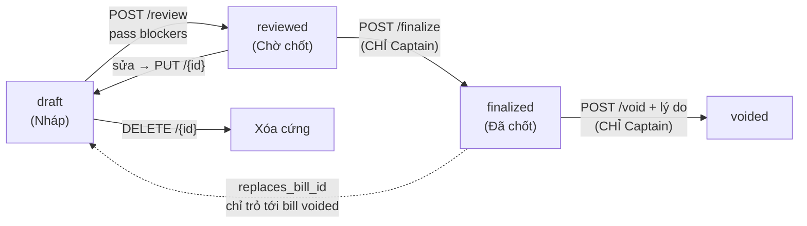
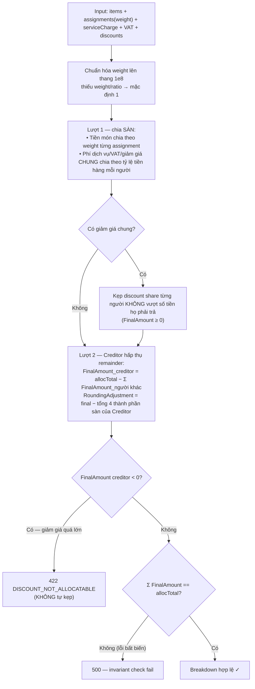
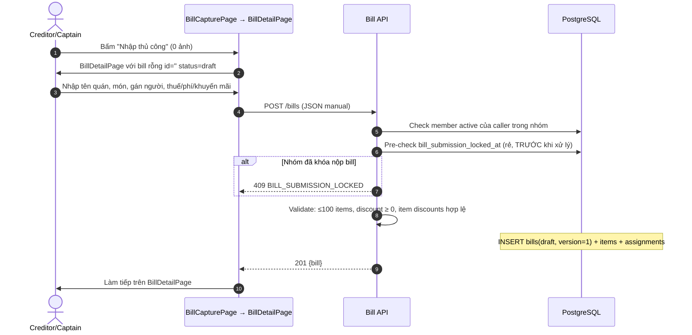
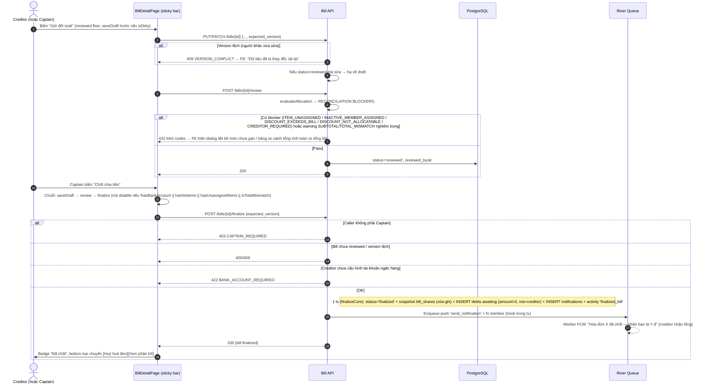
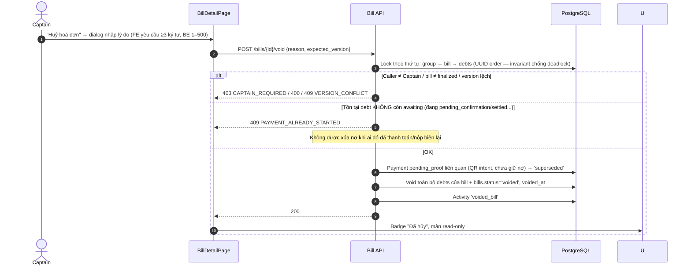
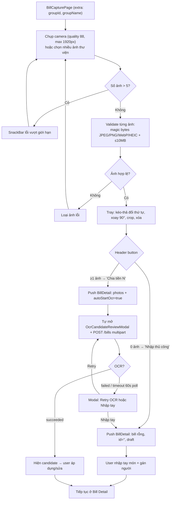
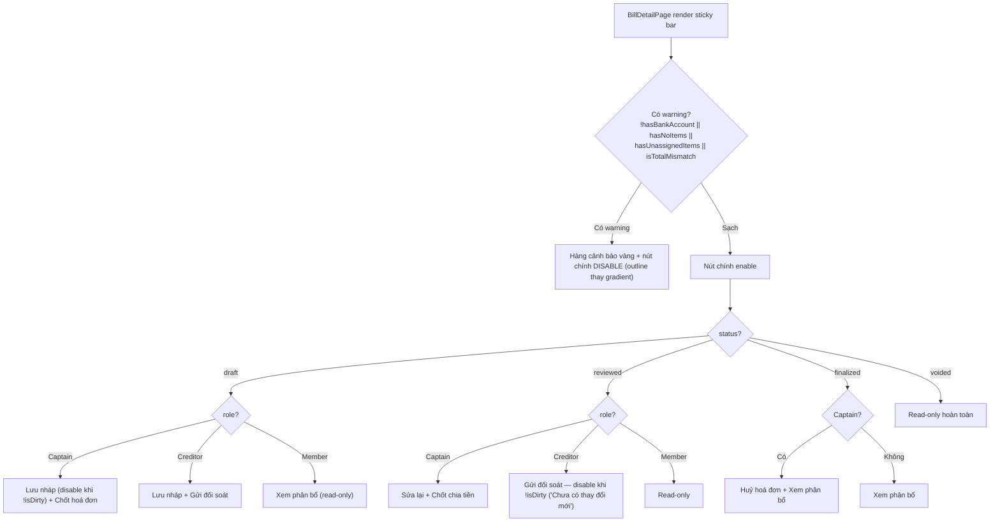

# 03 — Bill: Hóa đơn, OCR & Chia tiền

> **Phạm vi**: BE module `bill` (`/api/v1/bills` + group close routes) ↔ FE màn hình Bill Capture (camera) và Bill Detail (chia tiền).
>
> Code tham chiếu chính: `PaySplit-BE/internal/modules/bill/**`, `PaySplit-FE/lib/features/bills/**`.

---

## 1. Tổng quan mô hình

### 1.1 Vòng đời hóa đơn (optimistic locking bằng `version`)



- Mọi mutation phải gửi `expected_version` — lệch → `409 VERSION_CONFLICT` ("Dữ liệu đã bị thay đổi").
- Sửa bill `reviewed` → tự hạ về `draft`.

### 1.2 Quyền thao tác

| Hành động | Ai được làm |
|---|---|
| Tạo bill, sửa draft, xóa draft, retry OCR, apply candidate | **Creditor** (người trả) hoặc **Captain** |
| Review | Creditor/Captain |
| **Finalize, Void, khóa nộp bill, finalize-all, xem batch finalize** | **CHỈ Captain** |
| Xem chi tiết/SSE | Member active của nhóm |

### 1.3 Thuật toán chia tiền (Floor Allocation 2 lượt)

Nguyên tắc: tổng tiền phân bổ luôn khớp **tuyệt đối**, phần lẻ dồn về Creditor; `allocTotal` tính từ **tổng các thành phần** chứ không tin field `total` client khai (tránh OCR sai đẩy chênh lệch lên người dùng).



Giảm giá 2 lớp: `final_price = line_total − discount_amount` (từng món); chỉ phần `general_discount = discount − total_item_discount` được chia tỷ lệ. Server tự tính, **không nhận** `final_price` từ client (DB CHECK `check_bills_discount_composition`).

## 2. Endpoint & màn hình

### BE endpoints (tất cả `liveAuth`, mount `/api/v1/bills`)

| Method + Path | Chức năng |
|---|---|
| POST `/bills` | Tạo bill — multipart 1–5 ảnh (OCR) hoặc JSON thủ công |
| GET `/bills` · GET `/bills/{id}` | Danh sách (offset legacy) / chi tiết (signed URL ảnh 5 phút + preview breakdown + mismatch_codes) |
| GET `/bills/{id}/events` | **SSE** realtime OCR events |
| POST `/bills/{id}/ocr-retry` | Chạy lại OCR (≤5 lần thủ công/24h; 1 job active/bill) |
| POST `/bills/{id}/apply-candidate` | Áp kết quả OCR (check version kép) |
| POST `/bills/calculate` · POST `/bills/{id}/calculate` | Tính breakdown stateless (yêu cầu creditor_member_id) |
| PUT/PATCH `/bills/{id}` | Sửa draft (version conflict qua expected_version) |
| POST `/bills/{id}/review` | draft → reviewed (chạy blocker check) |
| POST `/bills/{id}/finalize` | reviewed → finalized (**Captain**) |
| POST `/bills/{id}/void` | finalized → voided + lý do bắt buộc (**Captain**) |
| DELETE `/bills/{id}` | Xóa draft |

**Group close routes** (mount `/api/v1/groups`, Captain only):
`POST /{groupId}/bills/lock-submissions` (khóa 1 chiều) · `POST /{groupId}/bills/finalize-all` (batch) · `GET /{groupId}/bill-finalize-batches/{batchId}`.

### FE màn hình

| Page | Nội dung |
|---|---|
| BillCapturePage (`/scan-bill`) | Camera tối; chụp/chọn ≤5 ảnh; tray kéo-thả sắp xếp, xoay, crop, xóa; header button động: 0 ảnh → "Nhập thủ công", ≥1 ảnh → "Chia tiền (N)" |
| BillDetailPage (`/bill-detail`) | Danh sách món (gán người per-item, assign-all), switch Chia đều + chọn người, Thuế/Phí/Khuyến mãi, badge trạng thái, sticky bottom bar gating theo role × status |
| OcrCandidateReviewModal | Hiện tiến trình OCR, kết quả candidate, Retry khi fail |

---

## 3. Sequence Diagrams

### 3.1 Tạo hóa đơn thủ công (không ảnh)



### 3.2 Quét ảnh OCR (async job + SSE + polling fallback)

```mermaid
sequenceDiagram
    autonumber
    actor U as User
    participant FE as BillCapturePage → BillDetailPage
    participant BE as Bill API + SSE Hub
    participant DB as PostgreSQL
    participant Q as River Queue
    participant W as OCRWorker
    participant AI as LlamaExtract
    participant CDN as Cloudinary

    U->>FE: Chụp/chọn 1–5 ảnh → "Chia tiền (N)"
    FE->>FE: ImageValidator từng ảnh: magic bytes JPEG/PNG/WebP/HEIC (chống đổi đuôi file), ≤10MB
    FE->>BE: POST /bills (multipart: group_id, merchant_name, files=images[])
    BE->>DB: Pre-check submission lock + member active
    BE->>CDN: Upload ảnh (rollback xóa nếu fail sau đó)
    alt Bị chặn lock GIỮA chừng (sau khi upload)
        BE->>Q: Enqueue media_cleanup bền vững cho ảnh đã upload (fallback direct delete)
        BE-->>FE: 409 BILL_SUBMISSION_LOCKED
    end
    BE->>BE: Validate ≤5 ảnh, ≤100 items
    Note over DB: INSERT bill(draft) + images + OCRJob(queued) + ENQUEUE River job 'bill_ocr' trong cùng tx (BeforeCommit hook)
    BE-->>FE: 201 {bill chưa có items}
    FE->>BE: Mở SSE GET /bills/{id}/events (auth: member active)
    
    par Worker xử lý nền
        Q-->>W: Deliver job 'bill_ocr'
        W->>DB: Idempotent skip nếu succeeded/failed; CAS queued→processing (worker khác nhận thì thoát)
        W->>CDN: Download ảnh private → ghép DỌC 1–5 trang thành JPEG 90% (resize >1200px)
        W->>AI: Gọi extract (timeout riêng)
        alt Lỗi schema/tạm thời
            W->>Q: Retry exp backoff base×2^(attempt−1), cap attempt 20
            alt Hết MaxAttempts
                W->>DB: Job failed với mã đóng: provider_timeout/provider_unavailable/provider_error/download_failed/no_images/bill_not_found/schema_invalid
                W->>BE: SSE 'ocr.updated' failed
            end
        else Thành công
            W->>DB: Lưu candidate JSONB + version bill lúc OCR
            W->>BE: SSE 'ocr.updated' succeeded
        end
    and FE nhận kết quả
        alt SSE hoạt động (heartbeat 15s; đa replica qua Postgres LISTEN/NOTIFY; max age connection 15 phút)
            BE-->>FE: event ocr.updated
        else SSE hỏng/mất mạng
            FE->>BE: Poll GET /bills/{id} mỗi 1.5s, tối đa 40 lần (~60s)<br/>dừng sớm khi thấy job failed; lỗi poll từng lần bị bỏ qua
        end
    end
    
    FE->>U: Modal candidate: món đọc được + mismatch warnings (SUBTOTAL_MISMATCH/TOTAL_MISMATCH nếu có)
    alt Apply candidate
        FE->>BE: POST /bills/{id}/apply-candidate {candidate_id, client_version}
        BE->>BE: Check kép: client_version == version hiện tại AND == version lúc chạy OCR
        BE-->>FE: 200 — items mới, mặc định gán đều weight 1.0 cho mọi member active (hoặc bỏ gán nếu item_ratio)
    else User bấm "Nhập tay" / hết 60s không có kết quả
        FE->>U: Cho nhập thủ công trên bill rỗng
    else User bấm Retry
        FE->>BE: POST /bills/{id}/ocr-retry
        BE-->>FE: 202 hoặc 409 OCR_ALREADY_RUNNING hoặc 429 OCR_LIMIT_REACHED (>5 lần/24h)
    end
```

### 3.3 Lưu nháp → Review → Finalize (kèm fan-out thông báo)



### 3.4 Void hóa đơn (Captain)



### 3.5 Khóa nộp bill & Finalize-all hàng loạt (Spec Group Bill Close)

```mermaid
sequenceDiagram
    autonumber
    actor C as Captain
    participant FE as Group Detail
    participant BE as Bill Close API
    participant DB as PostgreSQL
    participant Q as River Queue

    C->>BE: POST /groups/{gid}/bills/lock-submissions
    BE->>DB: Lock group → verify Captain → COALESCE set bill_submission_locked_at
    Note over BE: Khóa MỘT CHIỀU trong V1 (không có unlock). Idempotent: đã khóa → 200 cùng mốc, không ghi activity trùng

    C->>BE: POST /groups/{gid}/bills/finalize-all (Idempotency-Key tùy chọn, complete trong cùng tx)
    BE->>DB: 1 tx: lock group → verify Captain → bật khóa submissions
    alt Đã có batch active (partial unique 1 batch/group)
        BE-->>C: 409 BULK_FINALIZE_IN_PROGRESS {active_batch_id}
    else OK
        BE->>DB: Capture mọi bill draft/reviewed KÈM version hiện tại → tạo batch + items
        BE->>Q: Enqueue 'bill_bulk_finalize_item' × N (hook beforeCommit — không giữ lock khi gọi mạng)
        alt Batch rỗng
            BE-->>C: Batch completed ngay + notification Captain
        end
    end

    loop Mỗi bill = 1 transaction RIÊNG (1 bill fail không rollback bill khác)
        Q-->>Q: Worker: lock group → batch → item → bill
        alt Item không còn pending (River giao lại — at-least-once)
            Note over Q: Skip an toàn, no-op
        else Bill đã bị xóa giữa chừng (bill_id cố ý KHÔNG có FK)
            BE->>DB: Item failed DELETED (commit ngay)
        else Bill đã finalized với captured_version+1 (ai đó finalize tay)
            BE->>DB: Đánh dấu finalized, KHÔNG ghi trùng
        else Version lệch / voided / thiếu bank / discount lỗi
            BE->>DB: Item failed ổn định (commit ngay, không retry vô ích)
        else draft → review + finalize trong cùng tx OK
            BE->>DB: Item finalized; thử TryCompleteBatch → completed + notification Captain
        end
    end
    C->>BE: GET /groups/{gid}/bill-finalize-batches/{batchId}   [CHỈ Captain được đọc]
    BE-->>C: Trạng thái từng bill
```

## 4. Activity Diagrams

### 4.1 Luồng màn hình Bill Capture (FE)



### 4.2 Gating sticky bottom bar theo trạng thái × vai trò (FE)



> Quy quyền FE: `isEditable = !readOnly && (isCaptain || isCreditor || members empty)`; khi chưa rõ role thì **mặc định true** để tránh khóa nhầm UI (BE vẫn là nguồn sự thật cuối).

---

## 5. Edge Cases

### 5.1 Chia tiền & dữ liệu

| # | Tình huống | Xử lý | Mã lỗi | Vị trí |
|---|---|---|---|---|
| 1 | Tổng tiền lẻ không chia đều (VD 100k / 3 người) | Floor allocation 2 lượt — phần dư Creditor hấp thụ, ghi `RoundingAdjustment`; invariant Σ = allocTotal kiểm tra cấu trúc | — | `usecase/allocation.go:93-230` |
| 2 | Field `total` client khai sai (do OCR) | Bỏ qua — `allocTotal` tính từ tổng thành phần | tránh chênh lệch oan cho Creditor | `allocation.go:160-167` |
| 3 | Giảm giá lớn hơn khả năng hấp thụ | Trần per-member ở lượt 1; nếu Creditor vẫn âm → lỗi, **không tự kẹp** | `422 DISCOUNT_NOT_ALLOCATABLE` | `allocation.go:192-210` |
| 4 | Discount > tổng bill | Blocker chặn review/finalize | `DISCOUNT_EXCEEDS_BILL` | `reconciliation.go:14-114` |
| 5 | Còn món chưa gán ai | Blocker + FE dialog liệt kê cụ thể món nào | `ITEM_UNASSIGNED` | như trên |
| 6 | Gán món cho member đã rời nhóm | Blocker | `INACTIVE_MEMBER_ASSIGNED` | như trên |
| 7 | Thiếu creditor_member_id khi calculate | Từ chối | `422 CREDITOR_REQUIRED` | `service.go:476-563` |
| 8 | Warning tổng phụ/tổng không khớp OCR | Không chặn review nhưng lưu `mismatch_codes`, FE hiện bảng so sánh và disable nút chính | `SUBTOTAL_MISMATCH` / `TOTAL_MISMATCH` | FE `_showMismatchDetailDialog` |

### 5.2 Đồng thời & phiên bản

| # | Tình huống | Xử lý | Mã lỗi |
|---|---|---|---|
| 9 | 2 thiết bị sửa cùng draft | Optimistic locking `expected_version` | `409 VERSION_CONFLICT` |
| 10 | Apply candidate khi bill đã đổi sau khi OCR chạy | Check kép: version hiện tại **và** version lúc OCR (stale apply có metric riêng) | `409 VERSION_CONFLICT` / `OCR_RESULT_STALE` |
| 11 | 2 lệnh retry OCR đồng thời | Partial unique index `uq_ocr_jobs_active_bill` — chỉ 1 job active/bill + CAS processing trong worker | `409 OCR_ALREADY_RUNNING` |
| 12 | Spam retry OCR | Giới hạn 5 lần thủ công/24h (configurable `BILL_OCR_MANUAL_LIMIT`) | `429 OCR_LIMIT_REACHED` |
| 13 | Nộp bill khi Captain đã khóa submissions | Pre-check rẻ trước upload; re-check trong tx là nguồn sự thật cuối; ảnh upload lỡ dâng → queue media cleanup | `409 BILL_SUBMISSION_LOCKED` |
| 14 | Void bill khi có người đang thanh toán | Debts phải toàn awaiting; QR intent (pending_proof) mới được superseded | `409 PAYMENT_ALREADY_STARTED` |
| 15 | Idempotency-Key tái sử dụng với payload khác | So hash payload | `409 IDEMPOTENCY_KEY_REUSED` |
| 16 | Key đang in_progress của op khác | Từ chối | `409 IDEMPOTENCY_IN_PROGRESS` |
| 17 | Mutation fail sau khi reserve key | Release key để lần retry không kẹt 409 | — |
| 18 | Bill bị xóa giữa chừng batch finalize-all | Item failed DELETED (bill_id cố ý không FK để xóa được); batch vẫn chạy tiếp bill khác | — |

### 5.3 OCR worker

| # | Tình huống | Xử lý |
|---|---|---|
| 19 | Provider timeout/lỗi tạm thời | Retry exp backoff `base × 2^(attempt−1)`, cap attempt 20 |
| 20 | Lỗi vĩnh viễn (schema invalid, bill not found...) | Failed ngay với mã đóng `provider_timeout/provider_unavailable/provider_error/download_failed/no_images/bill_not_found/schema_invalid` — không retry |
| 21 | River giao job trùng (at-least-once) | Idempotent skip nếu succeeded/failed; CAS `queued→processing` |
| 22 | FE mất SSE | Polling fallback 1.5s × 40 (~60s), stop sớm khi thấy failed, lỗi poll từng lần ignore |
| 23 | Camera unavailable (desktop/web test) | FE chèn ảnh dummy PNG fallback để luồng vẫn chạy được |
| 24 | File giả đuôi `.jpg` | FE `ImageValidator` check magic bytes trước khi upload |

### 5.4 Finalize / Void

| # | Tình huống | Xử lý | Mã lỗi |
|---|---|---|---|
| 25 | Finalize khi Creditor chưa có STK | Chặn cả FE (warning vàng disable nút) lẫn BE | `422 BANK_ACCOUNT_REQUIRED` |
| 26 | Non-Captain bấm finalize | BE từ chối dù FE có thể render nút | `403 CAPTAIN_REQUIRED` |
| 27 | Void không có lý do | BE bắt buộc 1–500 ký tự (FE dialog ép ≥3) | `400 INVALID_INPUT` |
| 28 | Finalize-all khi đang có batch chạy | Partial unique 1 active batch/group | `409 BULK_FINALIZE_IN_PROGRESS` |
| 29 | Member thường đoán ID batch để xem kết quả | GetFinalizeBatch chỉ Captain | `403` |
