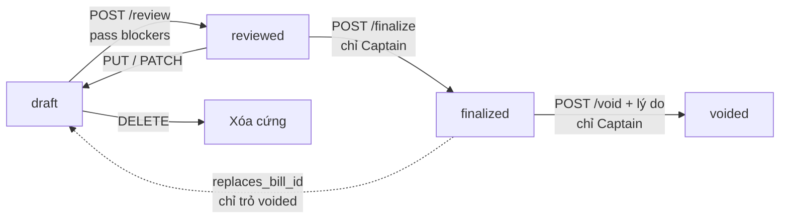
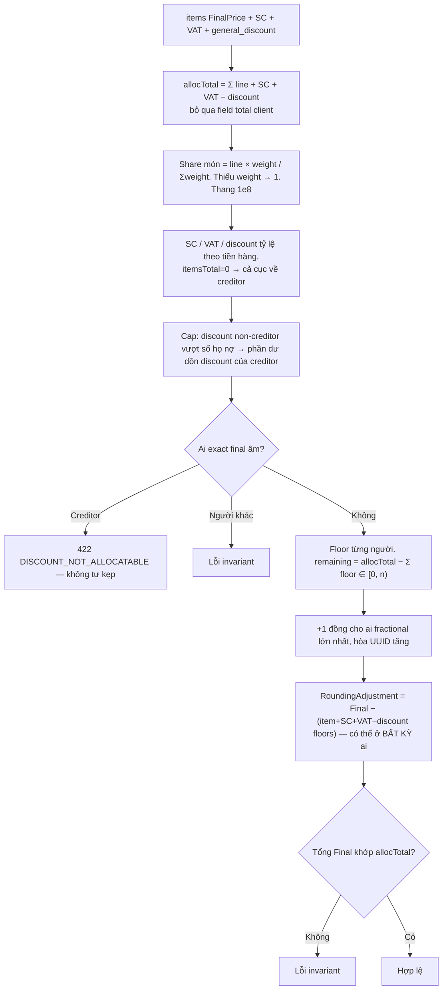
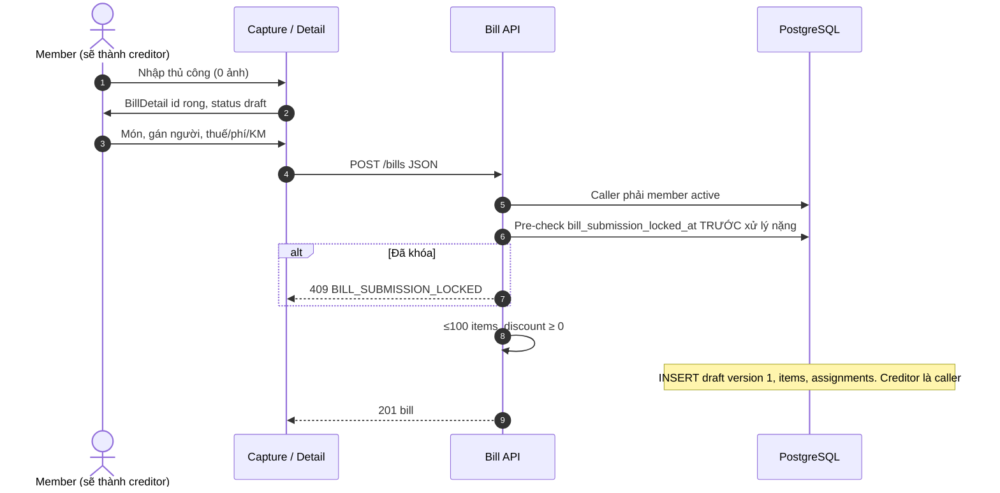
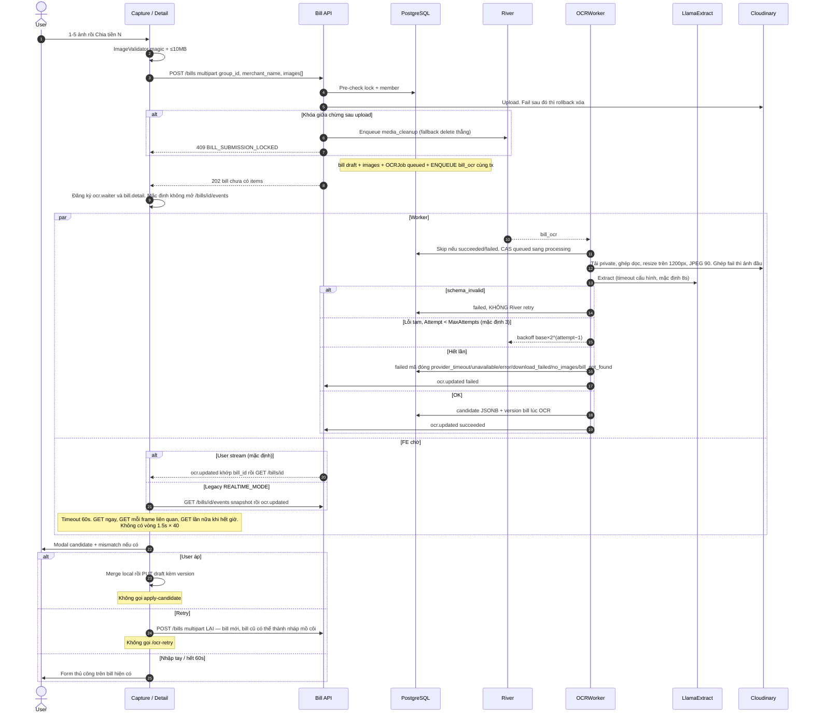
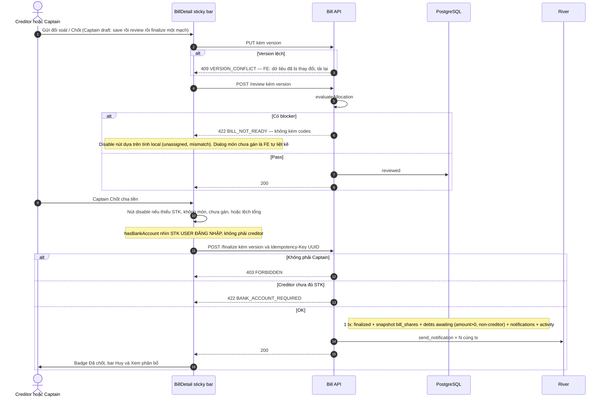
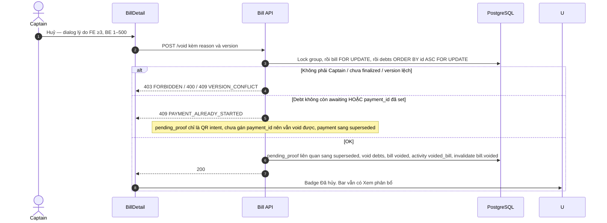
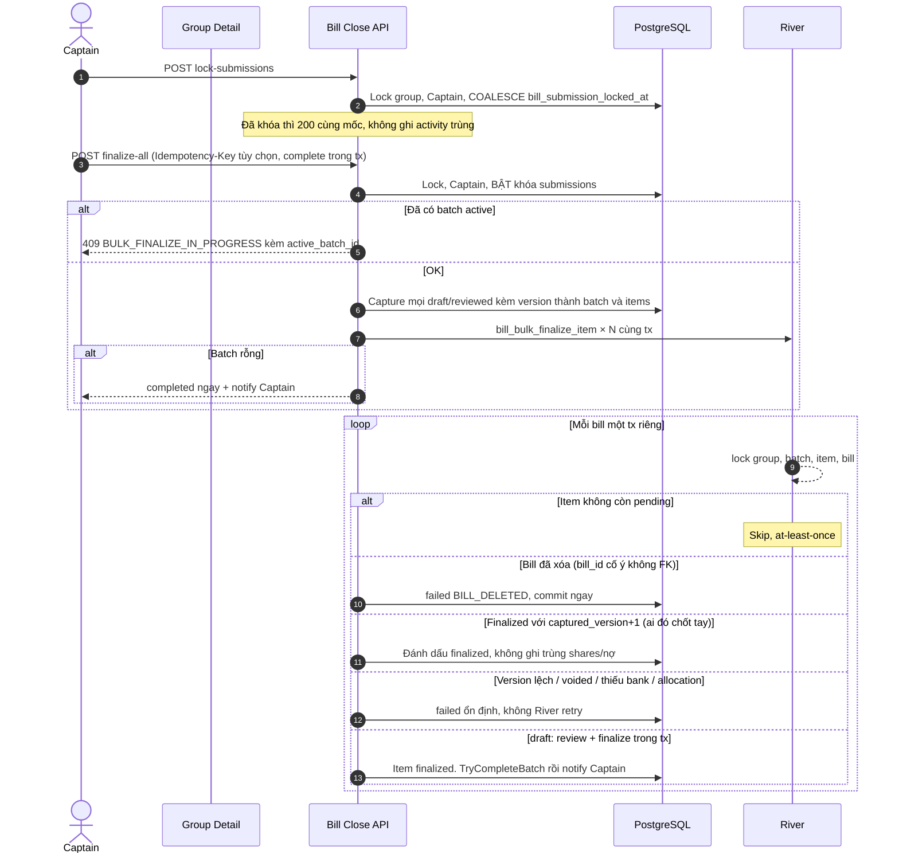
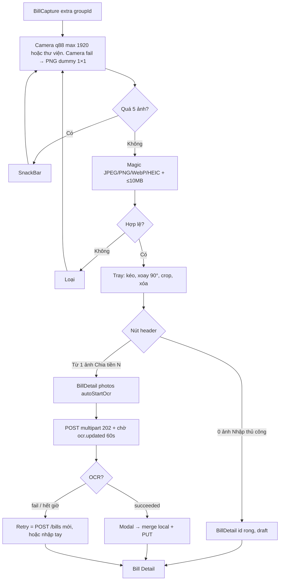
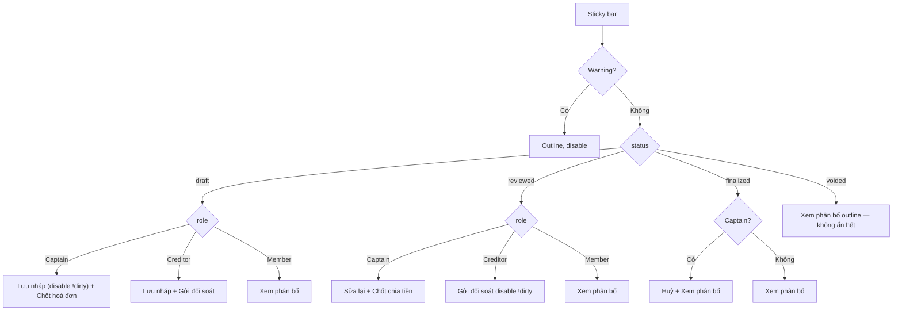

# 03 — Bill: chia tiền khớp từng đồng, OCR chạy nền, và khóa phiên bản

> Đối chiếu mã nguồn local ngày **06/09/2026** — BE `7f2b2a7`, FE `fb0cf0b`. [Phạm vi, bằng chứng và kiểm chứng](reports/2026-09-06-flow-sync.md). Các ghi chú AC/runtime cũ không có nghĩa đã chạy lại E2E trong lần này.

> **Phạm vi**: BE module `bill` (`/api/v1/bills` + group close) ↔ FE Bill Capture / Bill Detail / modal OCR.
>
> Code tham chiếu chính: `PaySplit-BE/internal/modules/bill/**`, `PaySplit-FE/lib/features/bills/**`.
>
> Đọc cùng: [`08-realtime.md`](08-realtime.md) (`ocr.updated`, `bill.*` invalidate), [`02-group.md`](02-group.md) (lock/unlock nộp bill trên Group Detail), [`04-settlement.md`](04-settlement.md) (void vs QR intent).

---

## 1. Vấn đề, và ý tưởng để giải quyết

### 1.1 Ba người sửa một hóa đơn

Hai máy mở cùng nháp, một người chốt, một người còn gõ. Nếu không có số phiên bản, người gõ đè mất bản đã chốt, hoặc chốt đè mất món vừa thêm.

> Mọi mutation gửi `version` (không phải `expected_version`). Lệch → `409 VERSION_CONFLICT`. Sửa bill `reviewed` thì SQL **hạ về `draft`** và xóa mốc review.

### 1.2 Tổng tiền phải khớp tuyệt đối, không tin field `total` từ client

OCR hay khai sai tổng. Nếu chia theo `total` client gửi, phần lệch dồn lên người trả. Server tính `allocTotal` từ **tổng thành phần**: `Σ line_total + phí + VAT − giảm giá`.

### 1.3 OCR không được giữ request HTTP

Ghép ảnh, gọi LlamaExtract, timeout nhà cung cấp — nếu nằm trong request thì 15 giây middleware cắt. Tạo bill có ảnh trả **202**, job `bill_ocr` nằm **cùng transaction** (BeforeCommit). App chờ trên kênh realtime, không poll 1.5 giây.

### 1.4 Nguyên tắc quyền

Tạo bill: **mọi member active** — người tạo thành creditor. Sửa / xóa nháp / review / OCR: **Captain hoặc creditor**. Finalize / void / khóa nộp / finalize-all: **chỉ Captain**. Xem: member active.

Single-bill finalize/void khi không phải Captain → `403 FORBIDDEN` (không phải `CAPTAIN_REQUIRED`). `CAPTAIN_REQUIRED` chỉ đi với group-close.

---

## 2. Bảng tổng quan

| Khái niệm | Giá trị |
|---|---|
| Vòng đời | `draft` → `reviewed` → `finalized` → `voided`. Xóa cứng chỉ `draft` |
| Khóa lạc quan | Cột `version`, CAS trong SQL |
| Ảnh | 1–5, ≤10MB. FE magic JPEG/PNG/WebP/HEIC. BE processor **jpeg/png/HEIC** (WebP FE nhận, BE không) |
| Tạo bill | Có ảnh: **202**. JSON không ảnh: **201** |
| OCR | LlamaExtract. 1 job active / bill. Retry tay mặc định **5 / 24h** (đếm **mọi** job trong cửa sổ, kể cả job lúc tạo). River `BILL_OCR_MAX_ATTEMPTS` mặc định **3** (20 chỉ là trần bit-shift backoff) |
| Chia tiền | Số hữu tỷ `big.Rat` + **largest remainder**, hòa UUID tăng dần. **Không** dồn phần lẻ cho creditor |
| Review/finalize lệch số | `422 BILL_NOT_READY` — **không** kèm danh sách code. GET detail mới nhét code vào `mismatch_codes` |
| Idempotency | Bảng `bill_idempotency_keys`, TTL 24h. Unlock submissions **không** dùng key |
| Khóa nộp bill | Có **unlock**. Finalize-all tự bật khóa |
| `replaces_bill_id` | Tạo bill mới trỏ bill **voided** cùng nhóm. FE chưa gửi |
| Realtime mặc định | `invalidate` + `ocr.updated` trên user stream. `GET /bills/{id}/events` là legacy |

---

## 3. Vòng đời

Cách đọc:

Bốn trạng thái, mũi tên là API thật. Mọi mũi tên đặc (trừ xóa) gửi kèm `version`. Lệch version → `409 VERSION_CONFLICT` ("dữ liệu đã bị thay đổi"). Không có khóa bi quan trên từng bill, chỉ CAS số nguyên.

Sửa bill `reviewed` (PUT/PATCH) thì SQL **ép** `status` về `draft` và xóa mốc review. Ý nghĩa: đã gửi đối soát rồi sửa lại thì phải review lần nữa, không chốt bản đã cũ.

Finalize và void **chỉ Captain**. Creditor (người trả) chỉ đi tới `reviewed`. Member thường xem. Xóa cứng (`DELETE`) chỉ khi còn `draft`. Bill `finalized` không xóa, chỉ void.

Nét đứt `replaces_bill_id`: tạo bill mới có thể trỏ tới một bill **voided** cùng nhóm (unique). FE hiện không gửi field này. Dùng khi Captain hủy hóa đơn sai rồi nhập lại, giữ liên kết lịch sử.

Review đã `reviewed` và `version` khớp → trả nguyên (idempotent). `version` lệch trên bill reviewed → `BILL_IMMUTABLE`.

---

## 4. Thuật toán chia tiền (largest remainder)

Đây là chỗ tài liệu cũ sai, nên nói thẳng.

> **Không** phải "lượt 2 creditor hấp thụ remainder". Code hiện tại: tính **đúng số hữu tỷ**, floor từng người, phần lẻ +1 đồng chia theo **phần thập phân lớn nhất**. Hòa → UUID membership **tăng dần**. Creditor không được ưu tiên. Test `100_000 / 3`: remainder có thể về member khác, creditor adjustment = 0.

Cách đọc:

Đây là chỗ tài liệu cũ sai. **Không** phải "phần lẻ dồn cho người trả (creditor)".

`allocTotal` tính từ thành phần: tổng `line_total` (sau giảm giá từng món) + phí dịch vụ + VAT − giảm giá chung. Field `total` client/OCR gửi **bị bỏ**. OCR hay khai sai tổng; nếu chia theo số đó, lệch dồn lên người trả oan.

Tiền món chia theo `weight` (thiếu thì 1, thang 1e8). Phí/VAT/giảm giá chung chia tỷ lệ theo tiền hàng mỗi người. `itemsTotal = 0` thì cả cục về creditor.

Cap giảm giá: phần discount của người không phải creditor không được vượt số họ nợ. Phần dư dồn sang discount của creditor (đây là hòa giảm giá, không phải chia đồng lẻ).

Sau khi có số **hữu tỷ** đúng, mới floor từng người. Đồng lẻ còn lại (`remaining`, luôn nhỏ hơn số người) cộng 1 đồng cho ai **phần thập phân lớn nhất**. Hòa thì UUID membership tăng dần. Creditor không được ưu tiên. Test `100000 / 3` cho remainder về member khác.

`RoundingAdjustment` có thể nằm ở **bất kỳ** ai, bằng `Final − (các thành phần đã floor)`. Tổng `Final` phải khớp `allocTotal`. Creditor exact âm → `DISCOUNT_NOT_ALLOCATABLE`, **không** tự kẹp về 0 (kẹp sẽ làm tổng sai).

Giảm giá 2 lớp: `final_price = line_total − discount_amount` do **server** tính, client gửi `final_price` bị bỏ. `general_discount = discount − total_item_discount`. DB CHECK `check_bills_discount_composition`.

`/bills/calculate` parse weight **nghiêm** (không default 1). Thiếu `creditor_member_id` → `ErrCreditorRequired`. Trên HTTP review/finalize, lỗi này bị gói thành `BILL_NOT_READY`.

---

## 5. Endpoint và màn hình

Tất cả `liveAuth`, mount `/api/v1/bills`.

| Method + Path | Việc |
|---|---|
| POST `/bills` | Multipart `images[]` hoặc JSON. Có ảnh → **202** |
| GET `/bills` | `group_id` bắt buộc. Cursor + `status` là đường chính. Offset legacy **cấm** kèm status |
| GET `/bills/{id}` | `group_id` query. Signed URL 5 phút. Preview breakdown chỉ draft/reviewed. `mismatch_codes` |
| GET `/bills/{id}/events` | SSE legacy OCR |
| POST `/bills/{id}/ocr-retry` | **202**. FE **không gọi** |
| POST `/bills/{id}/apply-candidate` | Body `{job_id, version}` — **không** `candidate_id` / `client_version`. FE **không gọi**; apply = merge local + PUT draft |
| POST `/bills/calculate` và `/{id}/calculate` | Cùng handler; `{id}` không dùng |
| PUT/PATCH `/bills/{id}` | Body `version` |
| POST `/bills/{id}/review` | `{version}` |
| POST `/bills/{id}/finalize` | `{version}` — Captain, 403 FORBIDDEN nếu không |
| POST `/bills/{id}/void` | `{version, reason}` 1–500 |
| DELETE `/bills/{id}` | **204**, chỉ draft |

Group close (`/api/v1/groups`, Captain; non-member → `GROUP_NOT_FOUND`):

| Method | Path |
|---|---|
| POST | `/{groupId}/bills/lock-submissions` (Idempotency-Key tùy chọn) |
| POST | `/{groupId}/bills/unlock-submissions` (**không** idempotency) |
| POST | `/{groupId}/bills/finalize-all` → **202** |
| GET | `/{groupId}/bill-finalize-batches/{batchId}` |

FE: `/scan-bill` (extra groupId, groupName) — thiếu groupId redirect `/bills`. `/bill-detail` extra entity hoặc Map.

---

## 6. Sequence Diagrams

### 6.1 Tạo thủ công

Cách đọc:

Nút "Nhập thủ công" (0 ảnh) mở Bill Detail với `id` rỗng, `draft`. Người dùng gõ món, gán người, thuế/phí rồi mới `POST /bills` JSON.

Caller phải là member active của nhóm. Người tạo **trở thành creditor** (người đã trả tiền quán). Không cần sẵn vai trò Captain.

`bill_submission_locked_at` được kiểm tra **trước** validate nặng. Captain đã khóa sổ thì 409 ngay, không tốn xử lý. Re-check lần nữa trong transaction (sau `LockActiveGroup`) mới là nguồn sự thật, vì giữa pre-check và commit Captain có thể vừa khóa.

Trần 100 món, giảm giá không âm. Thành công `201` (khác nhánh có ảnh: `202`). Version bắt đầu từ 1.

### 6.2 OCR: 202, worker, user stream — không poll 1.5s

Cách đọc:

Có ảnh thì HTTP **202 Accepted**, không 201. Ý nghĩa: bill nháp đã có, items chưa có, OCR chạy nền. Job `bill_ocr` được enqueue **trong cùng transaction** tạo bill (BeforeCommit). Rollback thì không có job mồ côi.

Nhánh trái (par Worker): CAS `queued` → `processing` để hai worker không chạy trùng. Ảnh ghép dọc, resize nếu rộng hơn 1200px, JPEG 90. LlamaExtract timeout mặc định 8 giây. Worker `ocr_stale_job_reaper` quét mỗi 2 phút + RunOnStart, đánh `failed`/`stale_timeout` cho job queued/processing không cập nhật quá `BILL_OCR_STALE_JOB_AGE_MINUTES` (mặc định 15). Dựa `updated_at`, không phải tuổi bill. Reaper phát `ocr.updated` trong transaction để Bill Detail và tab Hóa đơn nhóm thoát spinner. `schema_invalid` fail ngay, không River retry. Lỗi tạm retry theo `BILL_OCR_MAX_ATTEMPTS` (mặc định **3**, không phải 20). 20 chỉ là trần bit-shift của công thức backoff.

Nhánh phải (FE chờ): mặc định **không** mở `GET /bills/id/events`. Đăng ký surface `ocr.waiter` + `bill.detail` trên user stream. Mỗi frame `ocr.updated` khớp `bill_id` thì GET lại chi tiết. Timeout 60 giây, GET lần nữa khi hết giờ. Không còn vòng poll 1.5s × 40.

User bấm Áp: merge local rồi PUT draft. **Không** gọi `apply-candidate`. User bấm Retry: `POST /bills` multipart **lần nữa** = bill mới, bill cũ có thể thành nháp mồ côi. **Không** gọi `/ocr-retry`.

Apply-candidate phía BE (nếu client khác gọi): Captain/creditor; job succeeded; **kép version**: `bill.Version == request.version` không thì `VERSION_CONFLICT`; `bill.Version == ocrJob.Version` không thì `OCR_RESULT_STALE`. Gán **mọi** member active weight `1.0000` — không bỏ qua khi `item_ratio`.

### 6.3 Lưu → Review → Finalize

Cách đọc:

Captain ở `draft` bấm "Chốt hoá đơn" chạy một mạch: save (PUT) → review → finalize. Creditor bấm "Gửi đối soát" chỉ tới review.

PUT lệch `version` → 409, app hiện "dữ liệu đã bị thay đổi, tải lại". Review chạy `evaluateAllocation`. Có blocker thì **422 `BILL_NOT_READY` trần**, không kèm danh sách code trong body. App disable nút dựa trên tính **local** (món chưa gán, lệch tổng). Dialog liệt kê món chưa gán là FE tự làm, không parse 422.

`SUBTOTAL_MISMATCH` / `TOTAL_MISMATCH` **chặn review**, không còn là warning. GET chi tiết mới nhét code vào `mismatch_codes`.

Nút chính disable khi thiếu STK / không món / chưa gán / lệch tổng. `hasBankAccount` nhìn **user đang login**. BE finalize nhìn **creditor**. Captain không phải người trả có thể thấy nút khác với 422 `BANK_ACCOUNT_REQUIRED`.

Non-captain gọi finalize → `403 FORBIDDEN` (không phải `CAPTAIN_REQUIRED`). `CAPTAIN_REQUIRED` chỉ đi với khóa nộp / finalize-all.

Khi **gửi đối soát** thành công, BE ghi `bill_review_requested` cho Captain nếu khác người gửi; ghi `new_bill` cho member active được gán món, loại creditor/người gửi/Captain và dedupe. Insert notification, enqueue push và `notification.created` nằm cùng transaction review. Replay bill đã reviewed với version khớp không gửi lại. Sửa reviewed đưa về draft, nên lần review tiếp theo có thể tạo lượt thông báo mới; không được hiểu là chỉ một lần suốt đời bill. FE hiển thị reviewed là **chờ chốt sổ**, chưa tạo nợ cho tới finalize.

Tx finalize: status `finalized`, snapshot `bill_shares`, INSERT debts `awaiting` (số > 0, không phải creditor), notification, activity, job FCM. Cùng một transaction.

Blockers thu thập **trước** allocation: `ITEM_UNASSIGNED`, `INACTIVE_MEMBER_ASSIGNED`, `CREDITOR_REQUIRED`, `DISCOUNT_EXCEEDS_BILL`, `SUBTOTAL_MISMATCH` (subtotal ≠ Σ LineTotal), `TOTAL_MISMATCH`. **Mismatch chặn review** — không còn là warning. GET detail mới merge chúng vào `mismatch_codes`.

### 6.4 Void — QR intent không giữ nợ

Cách đọc:

Chỉ Captain, lý do bắt buộc 1–500 ký tự (dialog FE ép tối thiểu 3).

Khóa theo thứ tự cố định: nhóm → bill `FOR UPDATE` → debts `ORDER BY id ASC`. Cùng thứ tự với settlement, tránh deadlock khi một người void bill lúc người khác nộp proof.

Cửa `PAYMENT_ALREADY_STARTED`: bất kỳ debt nào **không còn** `awaiting` **hoặc** đã có `payment_id`. Tạo QR (`pending_proof`) **không** gắn `payment_id`, nợ vẫn awaiting → void được, payment sang `superseded`. Đã nộp biên lai thì nợ `pending_confirmation` + `payment_id` → void thua.

Thành công: supersede QR liên quan, void debts, bill `voided`, activity, invalidate `bill.voided`. UI badge "Đã hủy", vẫn còn nút Xem phân bổ (không ẩn hết).

### 6.5 Khóa nộp và finalize-all

Khóa **không còn một chiều**. Unlock: `POST .../unlock-submissions`.

Cách đọc:

Khóa nộp **không còn một chiều**. `POST unlock-submissions` xóa mốc `bill_submission_locked_at`. Đã khóa rồi bấm khóa lại: 200 cùng timestamp, không ghi activity trùng (`COALESCE`).

**Mở khóa nộp bill:** migration `000017_bill_submission_unlocked_activity.sql` bổ sung enum activity `bill_submission_unlocked`. Cần schema này để INSERT activity không làm rollback thao tác mở khóa. Down giữ enum để bảo toàn lịch sử.

`finalize-all` trong cùng tx: khóa nhóm, xác Captain, **tự bật** khóa nộp, bắt mọi bill `draft`/`reviewed` kèm version lúc đó. Đã có batch active (partial unique 1 batch/nhóm) → 409 kèm `active_batch_id`. Batch rỗng (không còn bill) hoàn thành ngay + notify Captain.

Vòng `loop`: mỗi bill là **một transaction riêng**. Một hóa đơn fail không rollback hóa đơn khác. Worker lock group → batch → item → bill.

- Item không còn `pending`: River giao lại (at-least-once) → skip.
- Bill đã xóa: `bill_id` **cố ý không FK** để xóa draft vẫn được → item `BILL_DELETED`, commit ngay.
- Ai đó chốt tay đúng `captured_version + 1`: đánh dấu finalized, không ghi trùng shares/nợ.
- Version lệch / voided / thiếu STK / allocation: fail ổn định, **không** River retry.
- Draft: review + finalize trong tx đó, rồi `TryCompleteBatch`.

---

## 7. Activity Diagrams

### 7.1 Capture

Cách đọc:

Màn tối, chụp (quality 88, max 1920px) hoặc chọn thư viện. Trần 5 ảnh. Từng ảnh qua `ImageValidator`: magic bytes JPEG/PNG/WebP/HEIC, tối đa 10MB. BE processor **không** nhận WebP (chỉ jpeg/png/HEIC) — ảnh WebP FE nhận, lúc upload có thể bị BE từ chối.

Camera hỏng (desktop/web test) chèn PNG 1×1 dummy để luồng không kẹt, không phải ảnh user.

Nút header đổi theo số ảnh: 0 → "Nhập thủ công" (Bill Detail rỗng). Từ 1 → "Chia tiền N" (`autoStartOcr`). OCR 202, chờ `ocr.updated` 60s. Thành công thì modal, merge local + PUT. Fail hoặc hết giờ: Retry = POST `/bills` **mới**, hoặc nhập tay trên bill hiện có.

### 7.2 Sticky bar theo status × role

Cảnh báo vàng disable nút chính: `!hasBankAccount || hasNoItems || hasUnassignedItems || isTotalMismatch`.

Cách đọc:

Hàng cảnh báo vàng (`hasWarnings`) đổi nút chính sang outline và disable. Bốn cờ: thiếu STK user đang login, không món, còn món chưa gán, lệch tổng.

Sạch rồi mới phân nhánh status × role:
- `draft` Captain: Lưu nháp (disable nếu chưa sửa) + **Chốt hoá đơn** (cả mạch save-review-finalize).
- `draft` Creditor: Lưu nháp + Gửi đối soát.
- `reviewed` Captain: Sửa lại + Chốt chia tiền.
- `reviewed` Creditor: Gửi đối soát, disable nếu chưa dirty ("Chưa có thay đổi mới").
- `finalized` Captain: Huỷ + Xem phân bổ. Người khác chỉ Xem.
- `voided`: vẫn **Xem phân bổ** outline, không ẩn hết như tài liệu cũ.

`isCaptain` / `isCreditor` mặc định `true` khi chưa có `currentUserId` hoặc `members` rỗng, tránh khóa UI lúc đang tải. BE vẫn chặn.

`isCaptain` / `isCreditor` **mặc định true** khi chưa có `currentUserId` hoặc `members` rỗng — tránh khóa UI nhầm. BE vẫn chặn.

---

## 8. Realtime

| Loại | Khi | Surface đánh thức |
|---|---|---|
| `bill.created` / `content_changed` / `reviewed` | create / PUT / review | `bill.detail`, `group.bills`, hai list nhóm, `home.activities` |
| `bill.deleted` / `finalized` / `voided` | | thêm `group.debts`, `group.detail`, `settlement.overview` |
| `bill.settlement_changed` | proof/confirm/reject | `bill.detail`, `group.bills` |
| `ocr.updated` | worker | `ocr.waiter`, `bill.detail` khớp đúng id |
| `group.bill_submission_locked` | lock/unlock | `group.detail`, `group.roster`, hai list nhóm |

Không có event `bill.updated`. FE đăng ký `ocr.waiter` cạnh `bill.detail` trong notifier.

---

## 9. Edge Cases

### 9.1 Chia tiền

| # | Tình huống | Xử lý | Mã |
|---|---|---|---|
| 1 | 100k / 3 người | Largest remainder + UUID tie, không dồn creditor | — |
| 2 | `total` OCR sai | Bỏ qua, dùng allocTotal thành phần | — |
| 3 | Discount lớn quá | Cap non-creditor; creditor vẫn âm → không kẹp | `DISCOUNT_NOT_ALLOCATABLE` (review: gói `BILL_NOT_READY`) |
| 4 | Discount > bill | Blocker | `DISCOUNT_EXCEEDS_BILL` → `BILL_NOT_READY` |
| 5 | Món chưa gán | Blocker; FE tự liệt kê | `ITEM_UNASSIGNED` chỉ trên GET `mismatch_codes` |
| 6 | Gán member đã rời | Blocker | `INACTIVE_MEMBER_ASSIGNED` |
| 7 | Calculate thiếu creditor | | usecase `CREDITOR_REQUIRED`; HTTP review `BILL_NOT_READY` |
| 8 | SUBTOTAL/TOTAL_MISMATCH | **Chặn review**, không còn warning | `BILL_NOT_READY` |

### 9.2 Đồng thời

| # | Tình huống | Xử lý | Mã |
|---|---|---|---|
| 9 | 2 máy sửa nháp | CAS version | `409 VERSION_CONFLICT` |
| 10 | Apply-candidate stale | Kép version | `VERSION_CONFLICT` / `OCR_RESULT_STALE` |
| 11 | 2 retry OCR | Unique active job + CAS | `409 OCR_ALREADY_RUNNING` |
| 12 | Spam retry tay | 5 / 24h kể cả job lúc tạo | `429 OCR_LIMIT_REACHED` |
| 13 | Nộp khi đã khóa | Pre-check + re-check trong tx; ảnh lỡ → cleanup | `409 BILL_SUBMISSION_LOCKED` |
| 14 | Void khi đã nộp proof | `payment_id` set hoặc không awaiting | `409 PAYMENT_ALREADY_STARTED` |
| 15 | Void khi mới có QR | Debts còn awaiting, payment_id NULL → void được, QR superseded | `200` |
| 16 | Key tái sử dụng payload khác | | `409 IDEMPOTENCY_KEY_REUSED` |
| 17 | Key in_progress | | `409 IDEMPOTENCY_IN_PROGRESS` |
| 18 | Mutation fail sau reserve | Release key | — |
| 19 | Bill xóa giữa bulk | Item BILL_DELETED, batch chạy tiếp | — |

### 9.3 OCR / FE

| # | Tình huống | Xử lý |
|---|---|---|
| 20 | Provider tạm | River retry đến MaxAttempts (mặc định 3) |
| 21 | schema_invalid | Fail ngay, không retry |
| 22 | Job giao trùng | Skip terminal; CAS processing |
| 23 | Mất SSE | User stream reconnect + `ready` hàn; waiter GET lại |
| 24 | Camera desktop | PNG dummy |
| 25 | File giả đuôi jpg | FE magic bytes |
| 26 | WebP | FE nhận, BE processor từ chối |
| 27 | FE Retry OCR | Tạo **bill mới**, không `/ocr-retry` |
| 28 | FE Apply OCR | PUT draft, không `/apply-candidate` |
| 29 | Finalize thiếu STK | BE nhìn **creditor**; FE nhìn **user đang login** — Captain không phải creditor có thể thấy nút khác BE |
| 30 | Non-Captain finalize | `403 FORBIDDEN` |
| 31 | Void không lý do | BE 1–500; FE ≥3; `VALIDATION_FAILED` |
| 32 | Finalize-all trùng batch | `409 BULK_FINALIZE_IN_PROGRESS` |
| 33 | Member đoán batch id | `403 CAPTAIN_REQUIRED` |
| 34 | Tạo bill | Mọi member active, không chỉ Captain/creditor |

---

## 10. Cấu hình

| Biến | Mặc định | Ý nghĩa |
|---|---|---|
| `BILL_OCR_STALE_JOB_AGE_MINUTES` | `15` | Reaper mỗi 2 phút thu dọn queued/processing mắc kẹt |
| `BILL_OCR_MAX_ATTEMPTS` | `3` | River, không phải 20 |
| `BILL_OCR_MANUAL_LIMIT` / `WINDOW_HOURS` | `5` / `24` | Retry tay |
| `BILL_IMAGE_MAX_BYTES` / `COUNT` | 10MiB / 5 | |
| OCR provider timeout | `8s` | LlamaExtract |
| Signed URL ảnh / proof | 5 phút | |

---

## 11. Ghi chú triển khai đáng chú ý

1. **`version` trong JSON, không `expected_version`.** Client cũ gửi sai tên field = validate fail, không phải conflict.

2. **Largest remainder, không remainder-to-creditor.** Đổi "cho công bằng người trả" là đổi invariant đã có test.

3. **Review trả `BILL_NOT_READY` trần.** Đừng vẽ sequence FE hiện code từ body 422. Code nằm ở GET `mismatch_codes` và tính local.

4. **FE không gọi apply-candidate / ocr-retry.** Tài liệu endpoint vẫn đúng cho client khác. Mô tả app thì nói PUT và POST `/bills` lại.

5. **Khóa nộp có unlock.** Migration comment V1 "một chiều" stale.

6. **QR `pending_proof` không chặn void.** Chỉ proof (debts `pending_confirmation` + `payment_id`) mới `PAYMENT_ALREADY_STARTED`. Xem [`04-settlement.md`](04-settlement.md).

7. **`hasBankAccount` FE ≠ creditor BE.** Nút Captain có thể enable rồi ăn 422, hoặc disable oan.

8. **Idempotency fail phải Release.** Không thì retry kẹt 409 mãi.

9. **Bulk: mỗi bill một tx.** Một bill fail không rollback bill khác. `bill_id` không FK để xóa draft vẫn được.

10. **Job OCR enqueue cùng tx tạo bill.** Rollback → không có job mồ côi. Worker skip terminal vì River at-least-once.

11. **Log OCR nhà cung cấp:** chỉ mã đã phân loại + mô tả cắt 120 ký tự. Không dump candidate, không dump ảnh.

---

## 12. Trạng thái hiện tại

| Hạng mục | Trạng thái | Ghi chú |
|---|---|---|
| Thủ công / review / finalize / void | ✅ | Version CAS |
| OCR LlamaExtract + user stream | ⚠️ Unit test đủ; runtime phụ thuộc nhà cung cấp thật | AC-21 |
| Khóa / mở nộp bill | ✅ | FE Group Detail gọi API |
| Finalize-all | ✅ | |
| Apply-candidate / ocr-retry HTTP | ✅ BE | FE chưa dùng |
| `replaces_bill_id` | ✅ BE | FE chưa gửi |
| SSE `/bills/{id}/events` | ⚠️ Legacy | Cổng 410 chưa bật |
