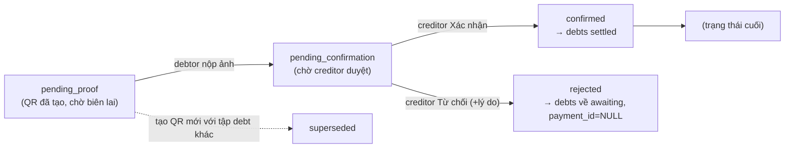
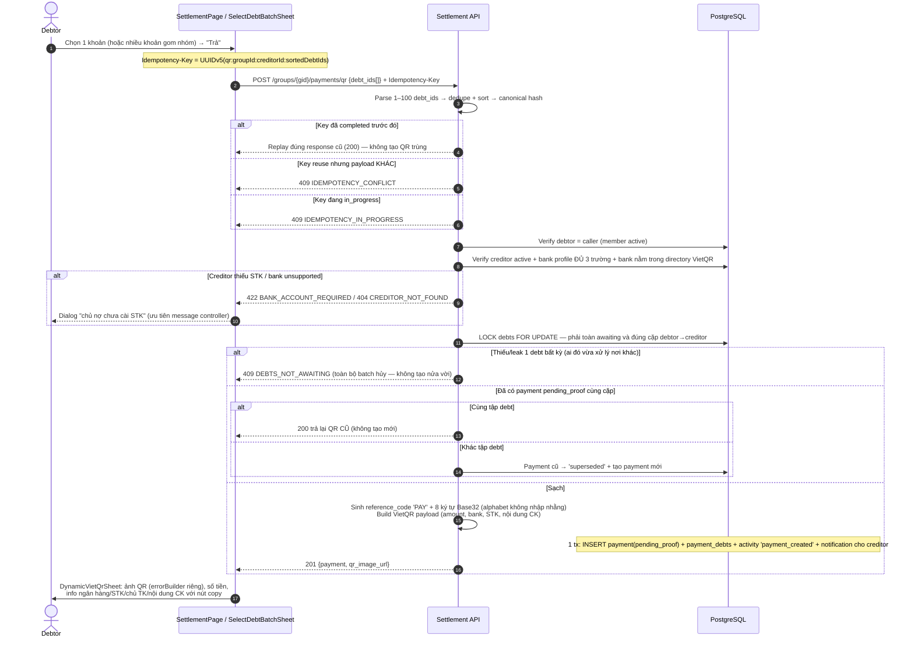
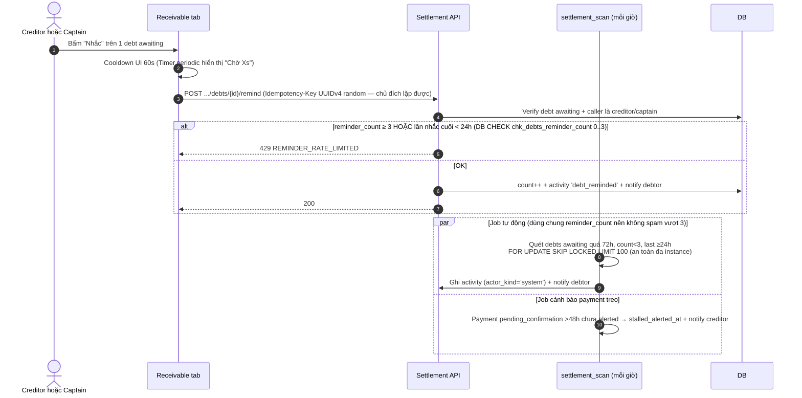
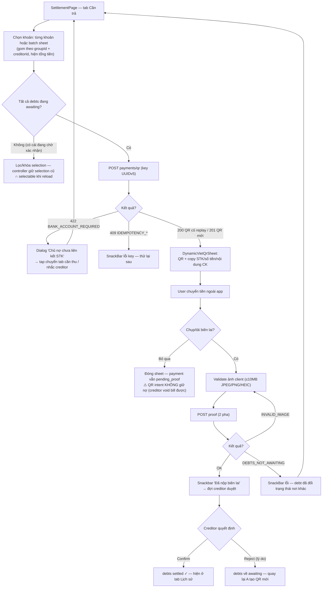
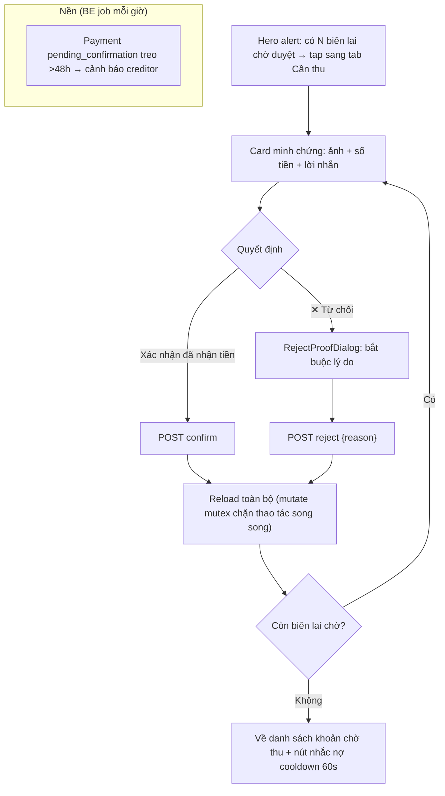
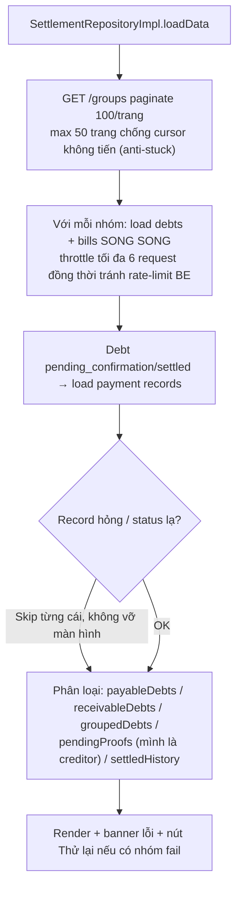

# 04 — Settlement: Công nợ & Thanh toán VietQR

> **Phạm vi**: BE module `settlement` (routes dưới `/api/v1/groups/{groupId}/...`) ↔ FE màn hình Settlement (4 tab) + DynamicVietQrSheet + Proof Review.
>
> Code tham chiếu chính: `PaySplit-BE/internal/modules/settlement/**`, `PaySplit-FE/lib/features/settlement/**`.

---

## 1. Tổng quan mô hình

### 1.1 State machine — Payment



- Mỗi chuyển trạng thái bị ràng buộc bởi **DB CHECK matrix** `chk_payments_state_matrix` (mỗi trạng thái khóa bộ cột timestamp/bank snapshot/rejection reason) — không thể tồn tại trạng thái "nửa vời".
- Chỉ **duy nhất 1 payment `pending_proof` mỗi cặp debtor→creditor trong nhóm** (partial unique `uq_payments_pending_proof_pair`).
- Debts: `awaiting → pending_confirmation → settled`; chỉ payment ở `confirmed` mới settled debts.

### 1.2 Idempotency phía FE

| Thao tác | Key (UUIDv5 deterministic) | Ý nghĩa |
|---|---|---|
| Tạo QR | `qr:{groupId}:{creditorId}:{sortedDebtIds}` | Bấm lại nút trả → replay kết quả cũ, không tạo QR trùng |
| Nộp biên lai | `proof:{groupId}:{paymentId}` | Retry sau crash giữa upload/submit được resume |
| Confirm | `confirm:{...}` | |
| Reject | `reject:{...}:{reason}` | Lý do nằm **trong** key — đổi lý do = request khác |
| Nhắc nợ | **UUIDv4 random mỗi lần** | Nhắc nợ là thao tác lặp chủ đích |

---

## 2. Endpoint & màn hình

### BE endpoints (tất cả `liveAuth`, mount `/api/v1/groups`; thao tác ghi đều **bắt buộc Idempotency-Key**)

| Method + Path | Chức năng |
|---|---|
| GET `/{groupId}/expenses/me` | Tổng quan chi tiêu bản thân + summary (total owed/settled/receivable/net) + debt matrix |
| GET `/{groupId}/debts` | Danh sách nợ (filter debtor/creditor/status whitelist `awaiting\|pending_confirmation\|settled`; cursor; limit 1–100) |
| POST `/{groupId}/payments/qr` | Tạo Dynamic VietQR cho 1–100 debts của mình |
| GET `/{groupId}/payments/{paymentId}` | Chi tiết payment |
| POST `/{groupId}/payments/{paymentId}/proof` | Nộp biên lai (multipart ảnh + note ≤500 ký tự) |
| POST `/{groupId}/payments/{paymentId}/confirm` | Creditor xác nhận đã nhận tiền |
| POST `/{groupId}/payments/{paymentId}/reject` | Creditor từ chối (+ reason 1–500) |
| POST `/{groupId}/debts/{debtId}/remind` | Nhắc nợ (creditor hoặc Captain) |

### BE background jobs (`settlement_scan` — chạy mỗi giờ + RunOnStart)

| Job con | Điều kiện | Hành động |
|---|---|---|
| Automated reminders | Debt `awaiting`, quá `REMINDER_STALE_AGE` (72h), reminder_count < 3, lần nhắc cuối ≥24h | Claim `FOR UPDATE SKIP LOCKED LIMIT 100` → count++ (actor_kind=system) → notify debtor |
| Stalled payments | Payment `pending_confirmation` > 48h chưa alerted | Đánh dấu `stalled_alerted_at` → activity + notify creditor "kiểm tra biên lai" |

### FE màn hình (SettlementPage — `/settlement` hoặc `/bills` cùng page, extra `SettlementTab`)

| Tab | Nội dung |
|---|---|
| Cần trả (payable) | Khoản nợ của mình; trả từng khoản hoặc batch sheet (gom theo groupId+creditorId); mở DynamicVietQrSheet |
| Cần thu (receivable) | Khoản cho vay + hàng minh chứng chờ duyệt (Xác nhận / Từ chối + lý do); nút nhắc nợ cooldown 60s |
| Hóa đơn | Danh sách bill các nhóm |
| Lịch sử | Payments confirmed → xem lại biên lai |

---

## 3. Sequence Diagrams

### 3.1 Tạo Dynamic VietQR (GeneratePayment)



### 3.2 Nộp biên lai (SubmitProof — 2 pha có compensation)

```mermaid
sequenceDiagram
    autonumber
    actor U as Debtor
    participant FE as DynamicVietQrSheet
    participant BE as Settlement API
    participant CDN as Cloudinary
    participant DB as PostgreSQL

    U->>FE: "Tải ảnh biên lai" → chọn từ gallery
    FE->>FE: Validate client: 1 byte–10MB, CHỈ JPEG/PNG/HEIC
    U->>FE: (tùy chọn) lời nhắn ≤500 ký tự → Submit
    Note over FE: Idempotency-Key = UUIDv5(proof:groupId:paymentId)
    
    rect rgb(240, 240, 245)
        Note over BE: PHA 1 — PrepareProof (reserve idempotency)
        BE->>DB: Check: caller là debtor, payment còn pending_proof, creditor bank vẫn hợp lệ
        BE-->>FE: 400 PAYMENT_NOT_PENDING_PROOF nếu sai trạng thái
    end
    BE->>CDN: Upload ảnh → payments/{pid}/proofs/{opId}
    BE->>BE: Sniff MAGIC BYTES độc lập với multipart header (JPEG/PNG/HEIC ≤10MB)
    alt Ảnh giả / quá lớn
        BE-->>FE: 400 INVALID_IMAGE
    end

    rect rgb(240, 240, 245)
        Note over BE: PHA 2 — SubmitProof (resume idempotency, commit DB)
        BE->>DB: Re-check TOÀN BỘ debts vẫn awaiting (check RowsAffected == số debt)
        alt Có debt đã bị xử lý nơi khác (voided/settled...)
            BE->>DB: Rollback → ResetProofAttempt(replaceOperation=false)
            BE-->>FE: 409 DEBTS_NOT_AWAITING
        else OK
            BE->>DB: payment → pending_confirmation; debts → pending_confirmation<br/>+ activity + notify creditor 'payment_submitted'
            BE-->>FE: 200
            FE->>U: Pop sheet + snackbar "Đã nộp biên lai, chờ xác nhận"
        end
    end

    alt Upload CDN OK nhưng commit DB fail
        BE->>CDN: Xóa object vừa upload (fallback queue media_cleanup bền vững)
        BE->>DB: Reset attempt với operation ID mới → retry không kẹt key
    else Upload CDN fail
        BE->>DB: ResetProofAttempt(false)
    end
```

### 3.3 Creditor xác nhận / từ chối

```mermaid
sequenceDiagram
    autonumber
    actor C as Creditor
    participant FE as ReceivableProofsTab / RejectProofDialog
    participant BE as Settlement API
    participant DB as PostgreSQL

    C->>FE: Xem card minh chứng chờ duyệt
    alt Xác nhận đã nhận tiền
        FE->>BE: POST .../payments/{id}/confirm (key deterministic)
        BE->>DB: Lock debts FOR UPDATE + verify mọi debt pending_confirmation + trỏ đúng payment này
        BE->>DB: payment='confirmed'; debts='settled' (settled_at); activity + notify debtor 'payment_confirmed'
        BE-->>FE: 200 → reload dữ liệu + snackbar
    else ✕ Từ chối
        FE->>FE: RejectProofDialog bắt buộc nhập lý do
        FE->>BE: POST .../payments/{id}/reject {reason 1–500} (reason nằm trong idempotency key)
        BE->>DB: payment='rejected'; debts QUAY LẠI 'awaiting', payment_id=NULL<br/>+ activity + notify debtor 'payment_rejected'
        BE-->>FE: 200 → debtor có thể tạo QR lại từ đầu
    end
    Note over BE: Race confirm/reject song song: lock debts + check payment_id khớp + RowsAffected → chỉ một bên thắng
```

### 3.4 Nhắc nợ (thủ công + tự động dùng chung hạn mức)



## 4. Activity Diagrams

### 4.1 Luồng thanh toán tổng thể (góc nhìn Debtor)



### 4.2 Luồng Creditor duyệt biên lai



### 4.3 Aggregation dữ liệu đa nhóm (FE repository — điểm đặc biệt)



---

## 5. Edge Cases

| # | Tình huống | Xử lý hệ thống | Mã lỗi / phản hồi | Vị trí code (tham chiếu) |
|---|---|---|---|---|
| 1 | Batch QR chứa 1 debt đã bị xử lý nơi khác | Toàn bộ batch hủy — không tạo payment nửa vời | `409 DEBTS_NOT_AWAITING` | `settlement/repository/postgres/repository.go` GeneratePayment lock debts |
| 2 | Tạo QR thứ 2 cùng cặp debtor→creditor | Cùng tập debt → replay QR cũ (200); khác tập → QR cũ `superseded` | `200`/`201` | `repository.go:414-441` + partial unique `uq_payments_pending_proof_pair` |
| 3 | Creditor chưa cài STK / bank lạ | Chặn trước khi sinh QR; FE ưu tiên message từ controller | `422 BANK_ACCOUNT_REQUIRED` / `ERR_CREDITOR_NOT_FOUND` | `usecase/service.go:83-108` |
| 4 | Debtor ≠ người gọi API | Caller buộc phải là debtor | `403 FORBIDDEN` | như trên |
| 5 | Nộp biên lai khi payment không còn pending_proof (đã superseded/bị reject...) | Chặn ở PrepareProof trước khi upload tốn kém | `400 PAYMENT_NOT_PENDING_PROOF` | `SubmitProof` 2-pha |
| 6 | Giữa lúc nộp, 1 debt bị void bill | Submit re-check toàn bộ debts vẫn awaiting (RowsAffected == số debt) → rollback + reset attempt | `409 DEBTS_NOT_AWAITING` | `repository.go:971-974` |
| 7 | File biên lai giả (đổi đuôi) | Sniff magic bytes JPEG/PNG/HEIC **độc lập** multipart header; FE validate thêm trước | `400 INVALID_IMAGE` | `service.go:184-220` |
| 8 | Biên lai >10MB | Chặn cả 2 lớp FE/BE | `400 INVALID_IMAGE` | như trên |
| 9 | Crash giữa upload CDN và commit DB | Compensation: xóa object (fail thì queue cleanup bền vững) + reset idempotency với operation mới → retry được | — | `service.go:158-170` |
| 10 | Bấm Confirm/Reject đồng thời 2 thiết bị | Lock debts FOR UPDATE + verify payment_id khớp + RowsAffected → chỉ một thắng, bên kia lỗi trạng thái | `PAYMENT_NOT_PENDING_CONFIRMATION` | `repository.go:1051-1088` |
| 11 | Confirm khi có debt không trỏ đúng payment | Từ chối toàn bộ | `409` | như trên |
| 12 | Reject không có lý do / lý do quá dài | BE bắt buộc 1–500 ký tự; reason nằm trong idempotency key (đổi lý do ≠ replay) | `400 INVALID_INPUT` | `service.go:227-258` |
| 13 | Spam nhắc nợ | Max 3 lời nhắc/debt + cách nhau ≥24h — enforced bằng DB CHECK **và** logic; manual + automated **dùng chung** counter | `429 REMINDER_RATE_LIMITED` | `repository.go:1229-1231` |
| 14 | Nhắc debt không awaiting / không phải creditor-captain | Từ chối | `DEBT_NOT_AWAITING` / `FORBIDDEN` | `service.go:262-269` |
| 15 | Idempotency key tái sử dụng payload khác | So canonical hash (payload + image sha256) | `409 IDEMPOTENCY_CONFLICT` | `beginIdempotency` |
| 16 | Request in_progress bị crash giữa chừng | FE key deterministic UUIDv5 → gửi lại được resume thay vì kẹt 409 mãi | `IDEMPOTENCY_IN_PROGRESS` rồi resume | `PrepareProof:616-626` |
| 17 | Payment treo ở pending_confirmation mãi (creditor quên duyệt) | Job 48h đánh dấu `stalled_alerted_at` + notify creditor (chỉ alert 1 lần) | — | `ProcessStalledPayments` |
| 18 | Trạng thái payment/debt lạ từ DB (version skew khi BE mới hơn FE) | FE map an toàn về `voided/superseded`, field mới thiếu hiển thị '—' — skip record hỏng từng cái | — | `settlement_repository_impl.dart:430-474` |
| 19 | User thuộc rất nhiều nhóm → aggregation chậm/rate-limit | FE throttle 6 request đồng thời, max 50 trang groups, lỗi từng nhóm bỏ qua riêng + banner Thử lại | — | `settlement_repository_impl.dart:17-57` |
| 20 | Snapshot bank của payment lệch thời điểm | CHECK `submitted_at IS NULL ⇔ recipient_bank_* IS NULL` — bank snapshot chốt tại lúc tạo QR | — | migration 000009 state matrix |
