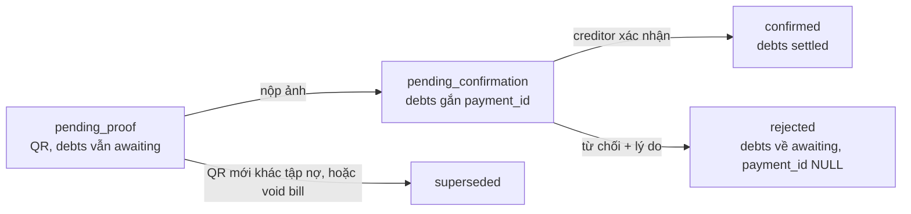
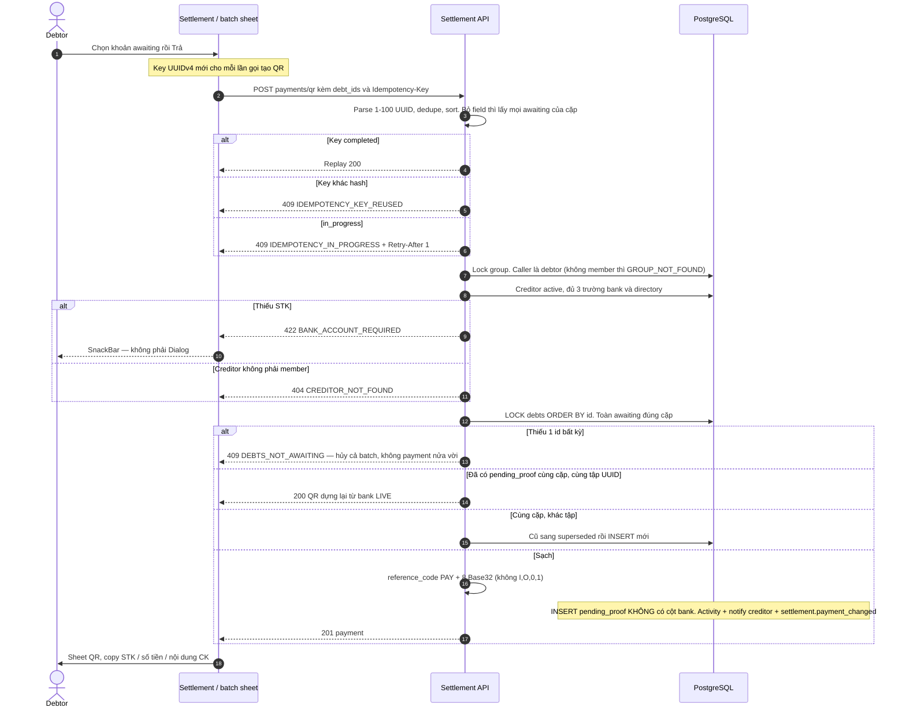
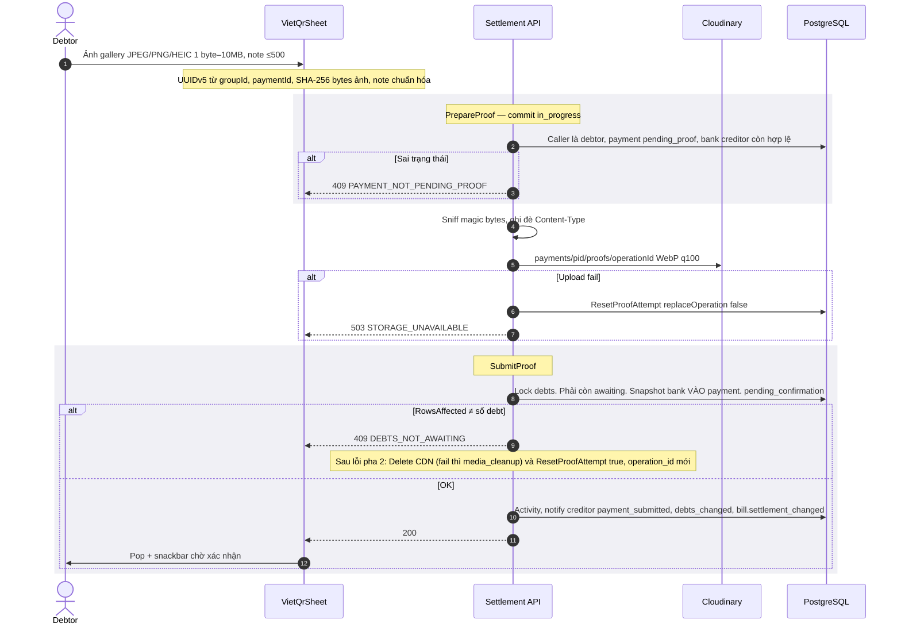
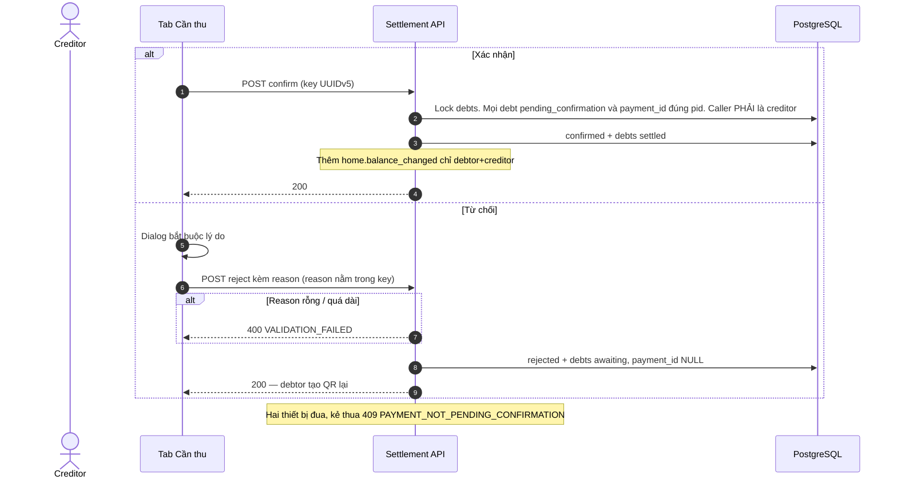
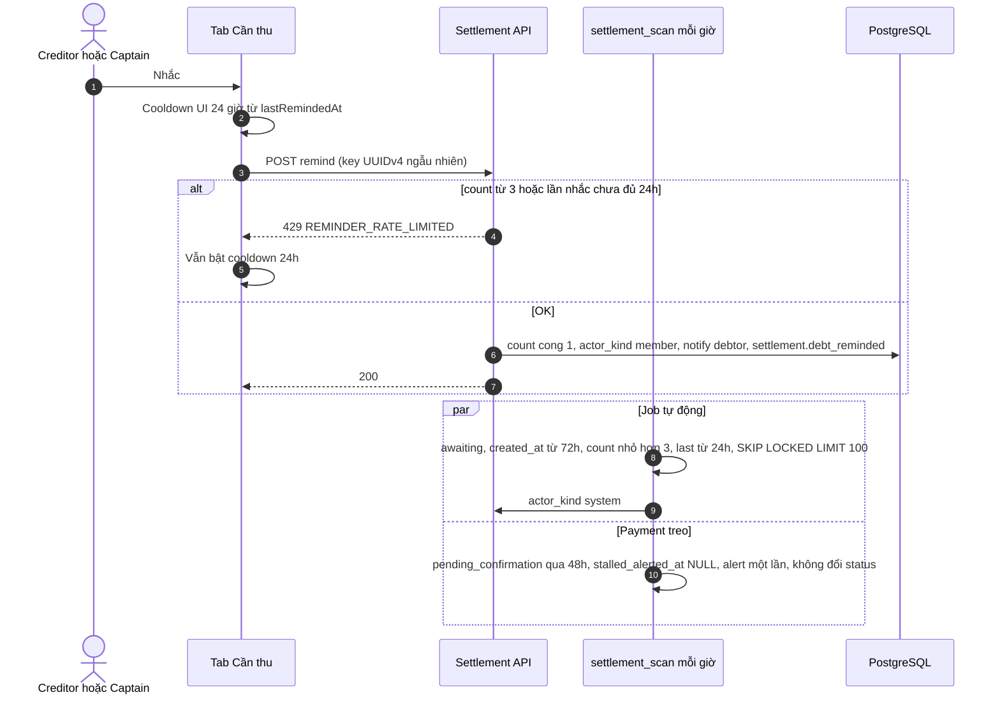
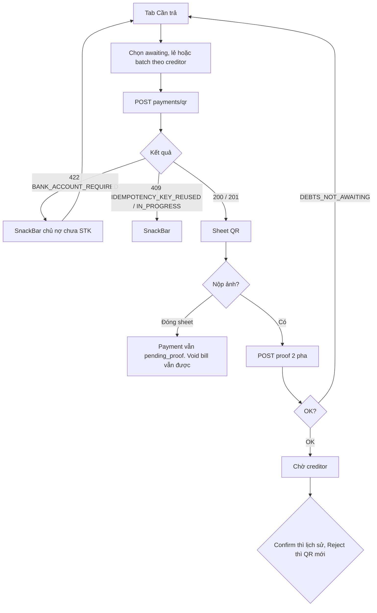
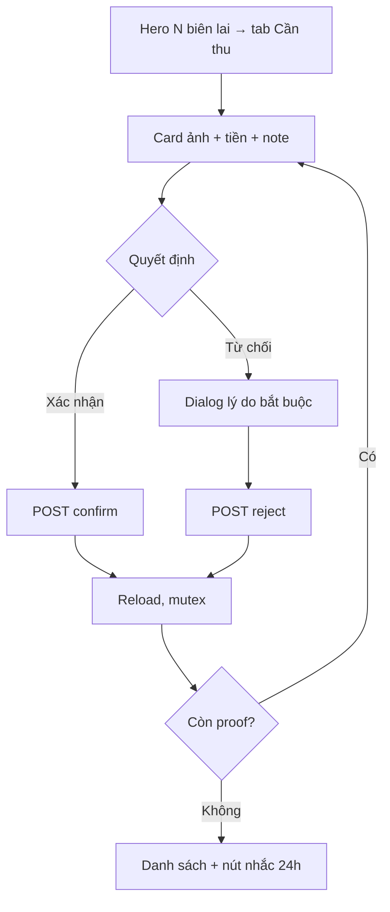
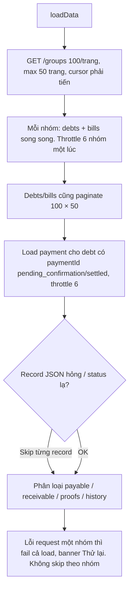

# 04 — Settlement: điều phối trả nợ, không cầm tiền

> Đối chiếu mã nguồn local ngày **06/09/2026** — BE `7f2b2a7`, FE `fb0cf0b`. [Phạm vi, bằng chứng và kiểm chứng](reports/2026-09-06-flow-sync.md). Các ghi chú AC/runtime cũ không có nghĩa đã chạy lại E2E trong lần này.

> **Phạm vi**: BE module `settlement` (`/api/v1/groups/{groupId}/...`) ↔ FE Settlement 4 tab + DynamicVietQrSheet + Proof Review.
>
> Code tham chiếu chính: `PaySplit-BE/internal/modules/settlement/**`, `PaySplit-FE/lib/features/settlement/**`.
>
> Đọc cùng: [`03-bill.md`](03-bill.md) mục 6.4 (void vs QR intent), [`08-realtime.md`](08-realtime.md) (`settlement.*`, `home.balance_changed`), [`05-notification.md`](05-notification.md).

---

## 1. Vấn đề, và ý tưởng để giải quyết

### 1.1 App không phải cổng thanh toán

Người nợ chuyển tiền **ngoài app** (VietQR / ngân hàng). App chỉ: chỉ đúng STK, nhận ảnh biên lai, để người cho vay bấm đã nhận hoặc chưa.

> PaySplit **không** giữ tiền, không hoàn tiền, không đối soát NAPAS. Sai trạng thái trong DB thì tiền ngoài đời vẫn đã chuyển — nên mọi bước ghi phải idempotent và không được tạo payment "nửa vời".

### 1.2 QR là ý định, không phải giữ chỗ nợ

Đây là chỗ dễ hiểu nhầm nhất:

> Tạo QR **không** đụng bảng `debts`. Nợ vẫn `awaiting`, `payment_id` vẫn NULL. Captain vẫn void hóa đơn được; payment `pending_proof` bị `superseded`. Chỉ khi **nộp biên lai** nợ mới nhảy `pending_confirmation` và gắn `payment_id`. Lúc đó void thua với `409 PAYMENT_ALREADY_STARTED`.

DB CHECK `debts_check1`: `awaiting`/`voided` ⇔ `payment_id IS NULL`. QR không thể "ghim" nợ dù muốn.

### 1.3 Snapshot ngân hàng chốt lúc nộp proof, không lúc tạo QR

CHECK `chk_payments_state_matrix` **cấm** cột `recipient_bank_*` khi status `pending_proof`. GetPayment / replay QR **dựng lại** ảnh từ hồ sơ creditor **hiện tại**. Creditor đổi STK giữa lúc hiện QR và lúc nộp ảnh → snapshot theo STK mới.

---

## 2. Bảng tổng quan

| Khái niệm | Giá trị |
|---|---|
| Payment | `pending_proof` → `pending_confirmation` → `confirmed` \| `rejected`. Nhánh `superseded` từ `pending_proof` |
| Unique | Đúng 1 `pending_proof` / cặp debtor→creditor trong nhóm |
| Debts dùng | `awaiting` → `pending_confirmation` → `settled` (+ `voided` từ bill) |
| Khóa | group → debts UUID ASC → payment. Cùng thứ tự với void bill |
| Trần QR | 1–100 debt ids; omit/null = **mọi** awaiting của cặp. Mảng rỗng = `VALIDATION_FAILED` |
| Idempotency | Bảng `payment_idempotency_keys`, TTL 24h. Mọi ghi **bắt buộc** header |
| Key FE | QR và nhắc nợ: **UUIDv4 mỗi lần gọi**. Proof: UUIDv5 theo group/payment + hash ảnh + note. Confirm/reject: UUIDv5 ổn định (reject chứa reason) |
| Mã 409 key | **`IDEMPOTENCY_KEY_REUSED`** (không có `IDEMPOTENCY_CONFLICT` trên HTTP) |
| Nhắc nợ | Max 3, cách ≥24h, chung counter với job. FE cooldown **24 giờ**, không phải 60 giây |
| Job | `settlement_scan` mỗi giờ + RunOnStart (72h stale, 48h stalled). `settlement_cleanup` mỗi 24h |

---

## 3. State machine

Cách đọc:

Năm trạng thái, ba trạng thái cuối (`confirmed`, `rejected`, `superseded`) không đi tiếp. DB CHECK `chk_payments_state_matrix` khóa bộ cột theo từng status: `pending_proof` **cấm** có ảnh, cấm có snapshot bank, cấm lý do từ chối. Không tồn tại payment "nửa vời".

Mũi tên đặc "nộp ảnh" mới đổi nợ: `awaiting` → `pending_confirmation` và gắn `payment_id`. Trước đó QR chỉ là ý định. CHECK `debts_check1`: awaiting/voided ⇔ `payment_id` NULL, nên QR **không thể** ghim nợ dù muốn.

`superseded` khi tạo QR mới **khác tập nợ** cùng cặp debtor-creditor, hoặc Captain void bill lúc QR còn treo. `confirmed` mới `settled` nợ. `rejected` đưa nợ về `awaiting`, `payment_id` NULL, debtor tạo QR lại từ đầu.

`chk_payments_state_matrix` khóa bộ cột theo status — không tồn tại trạng thái nửa vời. `confirmed`/`rejected`/`superseded` là cuối.

Ai được xem payment: debtor, creditor, hoặc **Captain**. Confirm/reject: **chỉ creditor** (Captain không thế). Remind: creditor **hoặc** Captain.

---

## 4. Endpoint và màn hình

Mount `/api/v1/groups`, `liveAuth`. Ghi bắt buộc `Idempotency-Key`.

| Method + Path | Việc | Thành công |
|---|---|---|
| GET `/{id}/expenses/me` | Tổng quan + matrix | FE **không gọi** |
| GET `/{id}/debts` | Filter debtor/creditor/status whitelist; cursor; limit 1–100 | |
| POST `/{id}/payments/qr` | Tạo / replay VietQR | **200** replay / **201** mới. Body `{payment}` — `qr_image_url` **nằm trong** payment |
| GET `/{id}/payments/{pid}` | Chi tiết; pending_proof rebuild QR live | |
| POST `/{id}/payments/{pid}/proof` | Multipart `image` + `note` ≤500 rune | 200 `{payment}` |
| POST `/{id}/payments/{pid}/confirm` | | 200 `{payment, settled_debts}` |
| POST `/{id}/payments/{pid}/reject` | `{reason}` 1–500 | 200 `{payment, reset_debts}` |
| POST `/{id}/debts/{did}/remind` | | 200 `{debt_id, reminder_count, reminded_at}` |

FE: `/bills` và `/settlement` **cùng** `SettlementPage`, extra chọn tab. `/bills` mặc định tab Hóa đơn, `/settlement` mặc định Cần trả.

| Tab | Nội dung |
|---|---|
| Cần trả | Nợ mình awaiting + pending_confirmation. Trả chỉ awaiting. Batch gom `groupId+creditorId`; khoản chờ xác nhận mở lại biên lai ở chế độ chỉ xem |
| Cần thu | Proof chờ duyệt + khoản cho vay + nhắc (cooldown 24h, hiện Xh/Xp/Xs) |
| Hóa đơn | Bill đa nhóm + search |
| Lịch sử | Payment `confirmed` |

---

## 5. Sequence Diagrams

### 5.1 Tạo QR

Cách đọc:

Key FE là **UUIDv4 mới cho mỗi lần gọi tạo QR**. Sau khi payment bị từ chối, cùng tập nợ phải lấy payment mới, tránh replay payment `rejected` từ key cũ trong TTL 24h. Nếu vẫn còn `pending_proof` cho cùng cặp và cùng tập nợ, BE tự tái sử dụng payment đó dù key mới; mở lại QR không mặc nhiên tạo thêm payment.

Idempotency **trước** check bank: bản ghi đã `completed` vẫn 200 dù creditor xóa STK sau đó. Key khác hash payload → `409 IDEMPOTENCY_KEY_REUSED` (không có mã HTTP `IDEMPOTENCY_CONFLICT`). Key đang chạy → `IN_PROGRESS` + `Retry-After: 1`.

Caller **là** debtor (membership của người gọi). Không phải member → `404 GROUP_NOT_FOUND`, không 403. Thiếu 3 trường bank hoặc bank lạ → `422 BANK_ACCOUNT_REQUIRED`, UI SnackBar không phải Dialog. Creditor không còn trong nhóm → `404 CREDITOR_NOT_FOUND`.

Lock debts theo id tăng. Gửi 5 id mà 1 id không còn awaiting → hủy **cả batch**, `409 DEBTS_NOT_AWAITING`, không tạo payment 4/5. Cùng cặp đã có `pending_proof`: cùng tập UUID thì 200 QR dựng lại từ bank **live**; khác tập thì QR cũ `superseded` rồi INSERT mới.

`reference_code` = `PAY` + 8 ký tự alphabet loại I, O, 0, 1 (tránh nhầm khi đọc STK). INSERT `pending_proof` **không** ghi cột bank (CHECK cấm). `qr_image_url` nằm **trong** object payment, không phải field anh em.

Idempotency **trước** check bank: replay bản completed vẫn 200 dù creditor đã xóa STK sau đó.

### 5.2 Nộp biên lai — hai pha

Cách đọc:

Hai pha vì upload CDN không nằm trong transaction Postgres. Phải chốt ý định trước, upload sau, ghi DB sau.

FE trim note, quy chuỗi rỗng thành `null`, rồi sinh UUIDv5 từ `proof:` + JSON `[groupId, paymentId, sha256(image.bytes), normalizedNote]`. Tên file không tham gia key. Cùng nội dung gửi lại sau timeout giữ key; thay ảnh, note hoặc payment đổi key. BE replay key completed trước kiểm tra `pending_proof`, nên retry sau khi server đã commit vẫn thành công trong thời gian key còn hiệu lực. Sheet giữ ảnh khi lỗi và đóng sau khi request thành công. Bản sửa `59a5aaa` đã xử lý hồi quy của `42fc8be`; xem [báo cáo đối chiếu](reports/2026-09-06-flow-sync.md).

**Pha 1 PrepareProof:** lock nhóm, reserve key, caller phải là debtor, payment còn `pending_proof`, bank creditor còn hợp lệ. Commit `in_progress` + `operation_id` (UUIDv7). Sai trạng thái → `409 PAYMENT_NOT_PENDING_PROOF` (không phải 400), **trước** khi tốn CDN.

Rồi sniff magic bytes JPEG/PNG/HEIC (không tin header multipart), upload `payments/pid/proofs/operationId`. Upload fail: `ResetProofAttempt(false)` giữ operation, `503 STORAGE_UNAVAILABLE`.

**Pha 2 SubmitProof:** lock debts, mọi hàng phải còn awaiting, snapshot bank **lúc này** vào payment, status `pending_confirmation`, `RowsAffected` phải đúng số debt. Sai: 409, xóa object CDN (fail thì `media_cleanup`), `ResetProofAttempt(true)` = **operation_id mới** để retry không đè key CDN cũ.

Hai `replaceOperation` khác nhau là chủ đích. Đừng gộp thành một.

### 5.3 Confirm / Reject

Cách đọc:

Hai nhánh `alt` cùng hàm `finishPayment`. Lock debts tăng dần, mọi debt phải `pending_confirmation` **và** `payment_id` đúng payment này. Caller **phải là creditor**. Captain xem được payment nhưng bấm xác nhận vẫn `403 FORBIDDEN`.

Xác nhận: payment `confirmed`, debts `settled`, realtime thêm `home.balance_changed` **chỉ** cho đúng cặp debtor+creditor (không broadcast cả nhóm). Từ chối: lý do 1–500 rune, `VALIDATION_FAILED` nếu thiếu. Debts về `awaiting`, `payment_id` NULL. Reason nằm trong idempotency key: đổi lý do = request khác, không replay nhầm.

Hai thiết bị đua confirm/reject: một thắng nhờ lock + check state. Kẻ thua `409 PAYMENT_NOT_PENDING_CONFIRMATION`. FE còn mutex `mutate` chặn bấm đôi trên **một** máy.

FE `mutate` mutex chặn bấm đôi trên một máy.

### 5.4 Nhắc nợ — tay và máy dùng chung 3 lần

Cách đọc:

Nút Nhắc: creditor hoặc Captain, debt phải `awaiting`. Trần **3** lần/khoản, cách nhau tối thiểu 24 giờ, DB CHECK 0..3. Tay (`actor_kind=member`) và job (`system`) **cộng chung** một `reminder_count`. Không thì user bấm 3 lần rồi job vẫn spam thêm.

Key nhắc là **UUIDv4 mỗi lần**. Nếu UUIDv5 deterministic, lần 2 thành replay im lặng, count không tăng, người nợ không nhận tin. FE cooldown UI **24 giờ**, seed từ `lastRemindedAt`. 429 cũng bật cooldown 24 giờ. Khi `reminderCount >= 3`, nút bị khóa kể cả đã hết cooldown. Timer chọn nhịp theo thời gian còn lại; state dùng Equatable để hạn chế dựng lại UI.

Job `settlement_scan` mỗi giờ + lúc process start: quét awaiting quá 72 giờ, count < 3, lần cuối ≥ 24 giờ, `SKIP LOCKED LIMIT 100` (đa instance an toàn). Nhánh kia: `pending_confirmation` quá 48 giờ chưa `stalled_alerted_at` → cảnh báo creditor **một lần**, không đổi status payment.

---

## 6. Activity Diagrams

### 6.1 Góc debtor

Cách đọc:

Tab Cần trả: chọn từng khoản hoặc batch gom theo `groupId + creditorId` (chỉ `awaiting`). POST tạo QR.

422 thiếu STK chủ nợ → SnackBar, không Dialog, không tự chuyển tab. 409 key → SnackBar, thử lại sau. 200/201 mở sheet QR (ảnh, copy STK / số tiền / nội dung CK).

Người dùng chuyển tiền **ngoài app**. Đóng sheet không nộp ảnh: payment còn `pending_proof`, nợ còn `awaiting`, Captain **vẫn void bill được**. Đó là hệ quả của "QR không ghim nợ". Nộp ảnh xong mới chờ confirm. Reject thì về đầu, tạo QR mới.

### 6.2 Góc creditor

Cách đọc:

Hero trên đầu màn: có N biên lai chờ thì tap sang tab Cần thu. Card gồm ảnh, số tiền, lời nhắn.

Xác nhận đi thẳng POST. Từ chối bắt buộc dialog lý do rồi POST. Cả hai đi qua mutex `mutate` (một thao tác ghi tại một thời điểm trên máy này), rồi reload. Còn proof thì lặp card. Hết thì về danh sách khoản chờ thu, nút nhắc đếm 24 giờ.

Nền (không vẽ trên diagram chính): job 48 giờ cảnh báo proof treo, không đổi trạng thái giúp creditor quên duyệt.

### 6.3 Gom dữ liệu đa nhóm

Cách đọc:

Màn Settlement **không** gọi `GET /expenses/me`. Nó tự gom: `GET /groups` 100/trang, tối đa 50 trang, cursor phải tiến (chống vòng lặp cursor hỏng).

Mỗi nhóm: `listDebts` + `listBills` song song. Giữa các nhóm throttle **6** request một lúc, tránh 429 limiter IP. Debts/bills cũng paginate 100 × 50. Rồi load payment cho những debt có `paymentId` (pending_confirmation/settled), cũng throttle 6.

JSON một **record** hỏng: skip record đó, map status lạ về `voided`/`superseded`. HTTP **một nhóm** fail: fail **cả** `loadData`, banner Thử lại toàn trang. Tài liệu cũ nói "bỏ qua từng nhóm" là sai so với code.

Kết quả chia: payable, receivable, pendingProofs (mình là creditor), submittedProofs (mình là debtor, đang chờ xác nhận), lịch sử confirmed.

**Làm mới theo nhóm:** `loadSettlement(onlyGroupId: ...)` vẫn gọi lại danh sách nhóm, chỉ nạp debts/bills/payments của nhóm đổi và nhóm chưa cache; nhóm khác dùng cache. Lượt nạp đầy đủ bỏ qua cache. Repository gắn với `sessionRevisionProvider`, dựng lại khi bắt đầu phiên mới. Realtime dùng `patchGroup`; controller giữ dữ liệu cũ với `isRefreshing` và thanh tiến trình, không thay cả màn bằng spinner.

Tên ngân hàng trả về từ BE ưu tiên `ShortName`, fallback `Name` ở bootstrap. Snapshot payment đã nộp proof giữ tên đã lưu; FE giới hạn hiển thị tên dài để tránh tràn.

---

## 7. Realtime

| Type | Khi | FE đánh thức |
|---|---|---|
| `bill.created` / `bill.content_changed` / `bill.reviewed` | tạo/sửa/gửi đối soát | `settlement.overview` để cập nhật tab Hóa đơn |
| `settlement.payment_changed` | tạo QR, proof, confirm, reject, stalled | `settlement.overview` |
| `settlement.debt_reminded` | nhắc tay + job | `settlement.overview` + `group.debts` |
| `group.debts_changed` | proof, confirm, reject — **không** tạo QR, **không** nhắc | `group.debts` + `group.detail` |
| `bill.settlement_changed` | proof/confirm/reject theo từng bill | `bill.detail`, `group.bills` |
| `group.activity_changed` | hầu hết mutation trên | `group.activities`, `home.activities` |
| `home.balance_changed` | **chỉ confirm**, audience debtor+creditor | `settlement.overview` + hai list nhóm |

Tạo QR không `group.debts_changed` vì nợ vẫn awaiting.

---

## 8. Edge Cases

| # | Tình huống | Xử lý | Mã |
|---|---|---|---|
| 1 | Batch QR thiếu 1 debt | Hủy cả batch | `409 DEBTS_NOT_AWAITING` |
| 2 | QR 2 cùng cặp | Cùng tập → 200 live QR; khác tập → superseded | 200 / 201 |
| 3 | Creditor thiếu STK | | `422 BANK_ACCOUNT_REQUIRED` — không ghép 404 |
| 4 | Không phải member | | `404 GROUP_NOT_FOUND` |
| 5 | Debt ids không khớp cặp | Lock filter thiếu hàng | `409 DEBTS_NOT_AWAITING` — không 403 |
| 6 | Proof khi không còn pending_proof | Trước upload | `409 PAYMENT_NOT_PENDING_PROOF` — không 400 |
| 7 | Void thắng giữa proof | RowsAffected | `409 DEBTS_NOT_AWAITING` + reset operation mới |
| 8 | Ảnh giả / >10MB | Magic bytes | `400 INVALID_IMAGE` |
| 9 | CDN OK, DB fail | Delete + cleanup + operation_id mới | retry được |
| 10 | Confirm/reject đua | Lock + state check | `409 PAYMENT_NOT_PENDING_CONFIRMATION` |
| 11 | Reject không lý do | | `400 VALIDATION_FAILED` |
| 12 | Spam nhắc | 3 lần, 24h, tay+máy chung | `429 REMINDER_RATE_LIMITED` |
| 13 | Nhắc không awaiting / không creditor-captain | | `409 DEBT_NOT_AWAITING` / `403 FORBIDDEN` |
| 14 | Key khác payload | Canonical hash (proof gồm image sha256) | `409 IDEMPOTENCY_KEY_REUSED` |
| 15 | Crash giữa Prepare và Submit | in_progress + retry_after; FE key deterministic resume | `IN_PROGRESS` rồi resume |
| 16 | Proof treo >48h | Alert một lần, không đổi status | |
| 17 | Status lạ (skew version) | FE map debt→voided, payment→superseded; skip record hỏng | |
| 18 | Nhiều nhóm | Throttle 6, max 50 trang; **lỗi nhóm fail cả màn** | |
| 19 | Đóng sheet không nộp | Nợ không bị giữ; void được | |
| 20 | Creditor đổi STK sau QR | Get/replay/proof dùng bank **live**; snapshot lúc SubmitProof | |
| 21 | Confirm không phải creditor (Captain) | | `403 FORBIDDEN` |
| 22 | GetPayment outsider | | `403 FORBIDDEN` |
| 23 | CDN down lúc upload | | `503 STORAGE_UNAVAILABLE` |
| 24 | `expenses/me` | BE có, FE không dùng; màn gom từ list groups | |
| 25 | Server đã lưu proof nhưng client timeout | Cùng bytes/note/payment giữ key để replay; tên file thay đổi không đổi key | 200 replay trong TTL |
| 26 | Payment rejected rồi trả lại cùng nợ | Tạo QR key mới, BE tạo pending_proof mới | Không replay payment rejected |

---

## 9. Cấu hình

| Biến | Mặc định | Ý nghĩa |
|---|---|---|
| `PAYMENT_REMINDER_STALE_HOURS` | `72` | Job nhắc |
| `STALLED_CONFIRMATION_HOURS` | `48` | Alert proof treo |
| `PAYMENT_REMINDER_MAX_COUNT` | `3` | Trần, khớp DB CHECK |
| VietQR img | `https://img.vietqr.io/image` template `compact` | Dựng URL, không gọi API ngân hàng |
| Proof signed URL | 5 phút | Cloudinary private |

---

## 10. Ghi chú triển khai đáng chú ý

1. **HTTP không có `IDEMPOTENCY_CONFLICT`.** Domain `ErrIdempotencyConflict` map `IDEMPOTENCY_KEY_REUSED`. Client bắt tên domain sẽ miss.

2. **`PAYMENT_NOT_PENDING_PROOF` là 409.** Chuẩn bị proof trước upload — đừng tốn CDN rồi mới biết QR đã superseded.

3. **Pha 2 fail → `replaceOperation=true`.** Operation cũ đã gắn object CDN. Giữ id cũ = upload đè hoặc 409 kẹt. Upload fail mới `false`.

4. **Canonical QR sort UUID phía BE.** Cùng key và cùng tập khác thứ tự có cùng hash. FE dùng UUIDv4 cho mỗi lượt QR; tái sử dụng pending intent dựa trên tập nợ ở BE.

5. **Reject: lý do nằm trong key.** Đổi lý do ≠ replay. Đúng: người ta không confirm nhầm reason.

6. **Remind FE UUIDv4.** Deterministic sẽ biến lần 2 thành replay im lặng, không tăng count.

7. **`home.balance_changed` chỉ lúc confirm.** Tạo QR / proof chưa đổi net balance.

8. **Lock order giống void bill.** Đổi một bên = deadlock.

9. **`reference_code` alphabet loại I/O/0/1.** Người đọc nhầm chữ số khi chuyển khoản.

10. **Gom FE: lỗi một nhóm hạ cả màn.** Chỉ skip JSON hỏng từng record. Banner Thử lại là page-level.

11. **Log không chứa STK, payload QR, ảnh proof, danh sách debt id.** 

---

## 11. Trạng thái hiện tại

| Hạng mục | Trạng thái | Ghi chú |
|---|---|---|
| QR / proof / confirm / reject / nhắc | ✅ | Idempotency, lock debts |
| Job 72h / 48h | ✅ | SKIP LOCKED đa instance |
| Realtime overview | ⚠️ AC-22 một phần | Khóa nộp đã kiểm runtime; ma trận payment chưa đủ |
| `GET expenses/me` | ✅ BE | FE chưa dùng |
| Cooldown nhắc UI | ✅ 24h | Khớp BE, không còn 60s |
