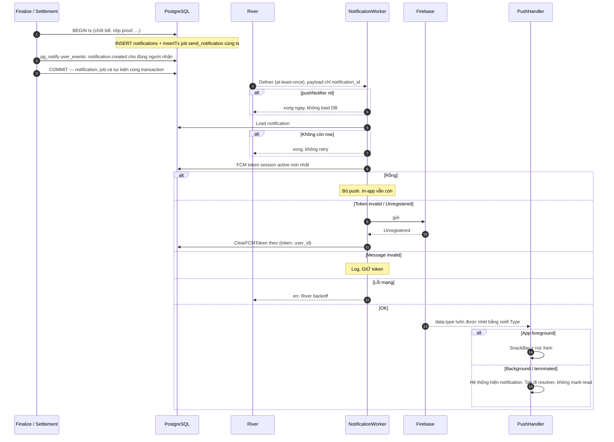
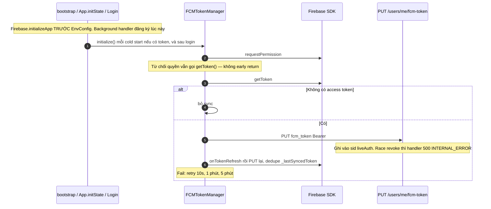
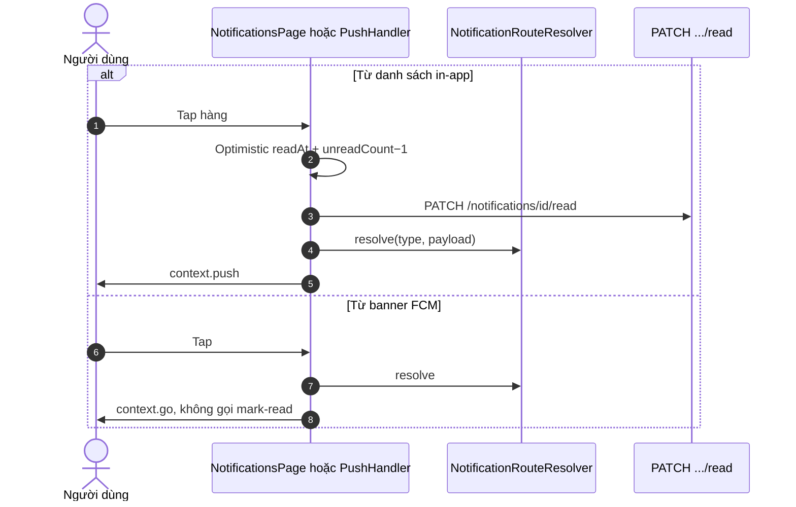
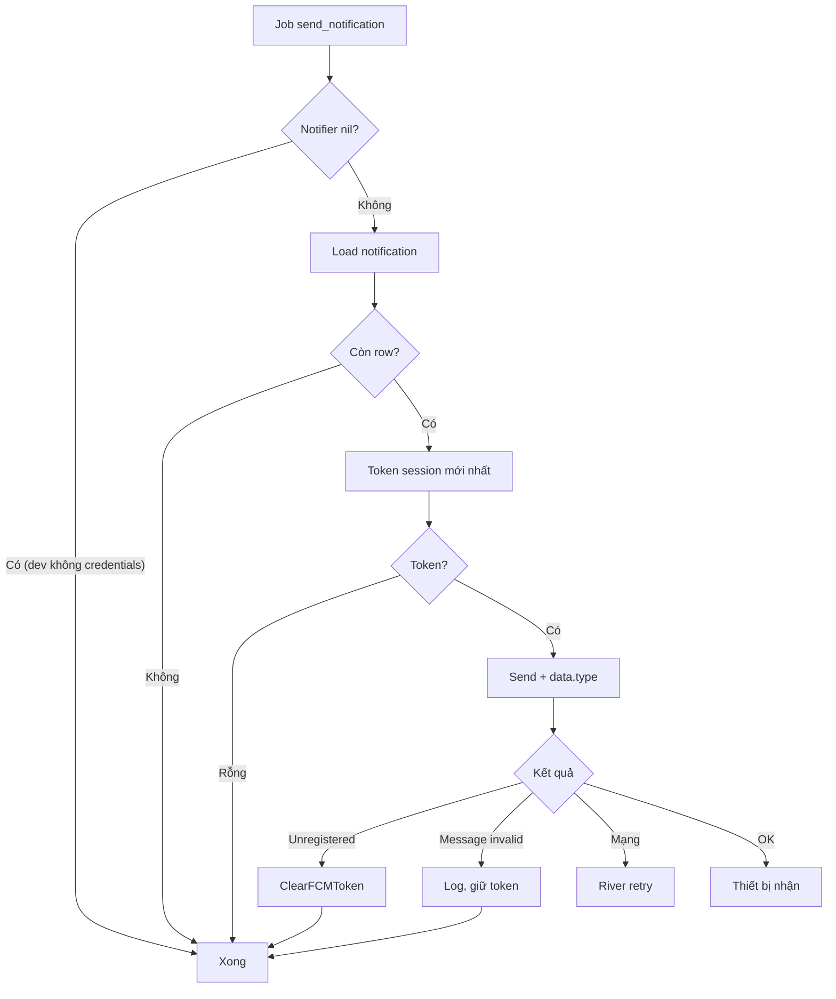
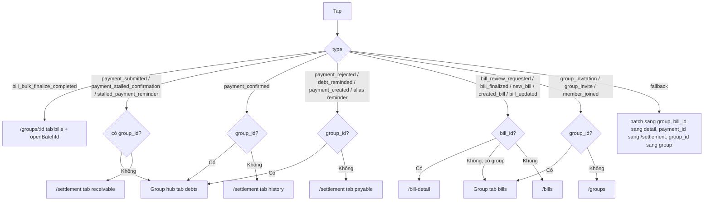

# 05 — Notification: chuông trong app và đẩy lúc điện thoại tắt

> Đối chiếu mã nguồn local ngày **06/09/2026** — BE `7f2b2a7`, FE `fb0cf0b`. [Phạm vi, bằng chứng và kiểm chứng](reports/2026-09-06-flow-sync.md). Các ghi chú AC/runtime cũ không có nghĩa đã chạy lại E2E trong lần này.

> **Phạm vi**: BE module `notification` (`/api/v1/notifications`) + producer trong bill/settlement ↔ FE `FCMTokenManager`, `PushNotificationHandler`, `NotificationRouteResolver`, màn Notifications + chấm chuông Home.
>
> Code tham chiếu chính: `PaySplit-BE/internal/modules/notification/**`, `PaySplit-BE/internal/platform/notification/fcm/**`, `PaySplit-FE/lib/core/network/fcm_token_manager.dart`, `push_notification_handler.dart`, `lib/app/router/notification_route_resolver.dart`, `lib/features/notifications/**`.
>
> Đọc cùng: [`01-auth.md`](01-auth.md) (PUT FCM, session), [`07-app-startup-network.md`](07-app-startup-network.md) (init Firebase), [`08-realtime.md`](08-realtime.md) (SSE không thay push).

---

## 1. Vấn đề, và ý tưởng để giải quyết

### 1.1 Hai đường, một bản ghi

Người dùng mở app thì thấy danh sách. Người dùng tắt app thì cần FCM. Nếu ghi DB xong mới enqueue, process chết giữa chừng = có chuông trong app nhưng không bao giờ đẩy. Nếu enqueue trước commit, rollback = đẩy tin ma.

> Bản ghi `notifications` và job `send_notification` ra đời **trong cùng transaction nghiệp vụ** (finalize, proof, confirm…). Không có record mồ côi, không có job trùng. Job chỉ mang `notification_id`; worker đọc lại DB.

### 1.2 Push là phụ, in-app là chính

Chưa cấp quyền thông báo, chưa có token, chưa cấu hình Firebase credentials: **server vẫn chạy**, chuông trong app vẫn đủ. Worker không có notifier → return ngay, không retry vô ích.

### 1.3 SSE không thay notification

Realtime chỉ nói "dữ liệu bẩn, hãy GET lại". Notification nói "có chuyện xảy ra, hãy mở đúng màn". Hai kênh khác việc. Đừng định hướng từ frame `invalidate`.

---

## 2. Bảng tổng quan

| Khái niệm | Giá trị |
|---|---|
| Tạo | Insert + enqueue **trong tx producer** (bill BeforeCommit, settlement `NotifyTx`). `SendToUser` có sẵn nhưng **không producer nào gọi** |
| Push | FCM. Token = session active mới nhất `ORDER BY issued_at DESC` |
| Gắn token | Login body `fcm_token?` + `PUT /users/me/fcm-token` sau `initialize()`. Cold start cũng `initialize()` nếu đã có access token |
| Truncate | Chỉ `SendToUser` (rune + `...`). Producer viết câu ngắn, dựa CHECK `type≤60 title≤255 body≤1000` |
| Foreground | **SnackBar** Material, nút Xem — không phải system heads-up |
| Push tap | `context.go` theo resolver, **không** mark-read |
| In-app tap | Optimistic mark-read rồi `context.push` |
| Badge Home | Chấm đỏ, không hiện số. Nguồn `notificationsProvider.unreadCount` |

Sự kiện `notification.created` dùng scope `notification`, chỉ gửi tới user vừa nhận bản ghi, trong transaction của bill review/finalize/bulk-complete và settlement notification. Nó không chứa nội dung thông báo, không thay FCM, và không phải sự kiện mark-read.

Domain constants như `payment_reminder`, `group_invitation` chưa có producer trong luồng đã kiểm tra. **`new_bill` đã được sinh khi gửi đối soát** cho thành viên được gán món. Resolver FE vẫn hiểu một số alias phòng payload cũ.

---

## 3. Loại thật sự được sinh

| Type | Producer | Người nhận | Payload |
|---|---|---|---|
| `bill_review_requested` | Gửi đối soát | Captain, trừ khi chính Captain gửi | `bill_id`, `group_id`, `total` |
| `new_bill` | Gửi đối soát | Thành viên active được gán món; dedupe member, bỏ creditor, người gửi và Captain | `bill_id`, `group_id`, `total` |
| `bill_finalized` | Finalize (kể cả bulk item thành công) | Từng member có user id; Captain/creditor nhận câu tổng, người khác nhận phần mình | `bill_id`, `group_id`, `amount` |
| `bill_bulk_finalize_completed` | Batch xong | Captain | `batch_id`, `group_id`, counts |
| `payment_created` | Tạo QR | **Creditor** | `group_id`, `payment_id` |
| `payment_submitted` | Nộp proof | Creditor | `group_id`, `payment_id` |
| `payment_confirmed` / `payment_rejected` | Confirm / Reject | **Debtor** | `group_id`, `payment_id` |
| `debt_reminded` | Remind tay + job 72h | Debtor | `group_id`, `debt_id` |
| `payment_stalled_confirmation` | Job 48h | Creditor | `group_id`, `payment_id` |

---

## 4. Endpoint và màn hình

| Method + Path | Việc |
|---|---|
| GET `/notifications?page&page_size` | Offset pager `{items, meta}` |
| GET `/notifications/unread-count` | `{unread_count}` — FE gọi song song với list trang 1 khi load/refresh |
| PATCH `/notifications/read-all` | |
| PATCH `/notifications/{id}/read` | `WHERE id AND user_id`; 0 hàng → `404 NOT_FOUND` |
| PUT `/users/me/fcm-token` | Gắn vào **sid hiện tại**. Rỗng → `400 INVALID_FCM_TOKEN` |

Auth fail trên notification handler: `UNAUTHORIZED` (không phải `AUTHENTICATION_REQUIRED`).

FE `/notifications` full-screen: tab Tất cả / Chưa đọc (lọc client), nhóm Hôm nay / Trước đó, skeleton, empty, infinite scroll ≤200px đáy, pull-to-refresh giữ list cũ + SnackBar khi mất mạng.

---

## 5. Sequence Diagrams

### 5.1 Sinh trong tx nghiệp vụ rồi mới đẩy

Cách đọc:

Producer (finalize bill, nộp proof, confirm...) **BEGIN** transaction nghiệp vụ. Trong cùng tx: INSERT hàng `notifications` và `InsertTx` job River `send_notification` chỉ mang `notification_id`. COMMIT thì cả hai sống. Rollback thì cả hai mất. Không có chuông trong app mà không có job, cũng không có job đẩy tin ma.

Worker nhận job at-least-once. `pushNotifier == nil` (dev không cấu hình Firebase) return ngay, **không** load DB, không retry. Có notifier thì load lại row theo id. Row đã xóa → xong, không retry vô hạn.

Token FCM lấy session active mới nhất (`issued_at DESC`). Rỗng: bỏ push, in-app vẫn còn. Gửi FCM luôn nhét `data.type = notif.Type` dù producer quên.

Unregistered / invalid token: `ClearFCMToken` theo cặp `(token, user_id)` — không xóa mọi token của user, tránh cướp máy mới lúc rotate. Message invalid (payload lỗi): log, **giữ** token. Lỗi mạng: trả err, River backoff. Thành công: foreground hiện SnackBar (không phải heads-up hệ thống), nền/tắt máy hiện notification hệ thống.

### 5.2 Đăng ký token

Cách đọc:

`Firebase.initializeApp` và background handler đăng ký **trước** `EnvConfig.init` trong bootstrap. Isolate nền không đọc flavor. Sai thứ tự = FCM lúc app tắt mất.

`initialize()` chạy mỗi cold start (nếu storage còn access token) **và** sau login. `requestPermission` (alert, badge, sound). Từ chối quyền OS **không** early return: vẫn `getToken()`, vì một số máy vẫn cấp token.

Chưa có access token: bỏ `PUT`, không 401 sớm. Có token: PUT gắn vào **sid hiện tại** (liveAuth). Race session vừa revoke: handler nuốt thành 500, xem [`01-auth.md`](01-auth.md). `onTokenRefresh` của Firebase tự PUT lại, dedupe `_lastSyncedToken`. Fail: retry 10 giây, 1 phút, 5 phút.

Login body có thể đã gửi `fcm_token` nếu SDK kịp. PUT sau đó bù cho trường hợp Firebase chưa kịp lúc bấm Đăng nhập. Logout: hủy sub, tăng `_sessionEpoch`, `deleteToken()`, rồi mới xóa storage.

Login còn gửi `fcm_token` trên `POST /auth/sign-in` nếu SDK đã có sẵn. Logout: `onLogout` hủy sub, tăng `_sessionEpoch`, `deleteToken()`, rồi mới clear storage.

### 5.3 Chạm thông báo

Cách đọc:

Hai nguồn tap, hai hành vi **cố ý khác nhau**.

Từ danh sách in-app: optimistic `readAt = now()`, `unreadCount - 1`, rồi `PATCH /notifications/id/read` (WHERE id **và** user_id, đọc hộ người khác 404). Rồi `NotificationRouteResolver.resolve` → `context.push` (chồng lên stack, Back về list).

Từ banner FCM (nền hoặc terminated `getInitialMessage`): **không** mark-read. `context.go` thay stack. Chủ đích: user mở app vẫn thấy chấm chuông chưa đọc, tự quyết. Đừng "đồng bộ" hai nhánh.

Resolver nhận `type` + payload (`bill_id`, `group_id`, `payment_id`...). Chi tiết nhánh: diagram 6.2.

---

## 6. Activity Diagrams

### 6.1 Worker

Cách đọc:

Đây là quyết định của **worker**, sau khi job đã được giao. In-app row đã nằm trong DB từ lúc COMMIT nghiệp vụ. Push chỉ là lớp phụ.

Không credentials / notifier nil → xong. Không còn row → xong. Không token → xong (user chưa cấp quyền, lần mở app sẽ thấy chuông). Có token thì gửi.

Ba kết quả gửi: Unregistered = máy gỡ app hoặc rotate, xóa đúng token đó. Message invalid = nội dung lỗi, **giữ** token kẻo xóa nhầm máy tốt. Mạng = River thử lại. Thành công = thiết bị hiện thông báo.

Badge Home và danh sách tự cập nhật qua **SSE `notification.created`** khi user stream hoạt động. `notificationsProvider` đăng ký surface `notifications`; handler chỉ gọi `refresh()` của surface này, không gọi lại list nhóm. `refresh()` gọi song song list trang 1 và unread-count, giữ nội dung trong lúc chờ; sau thành công reset phân trang về trang 1. FCM foreground vẫn chỉ hiện SnackBar, không trực tiếp đổi badge. Khi user stream tắt/legacy, cần refresh hoặc mở lại màn để lấy dữ liệu mới.

### 6.2 Resolver — type trước, không phải bill_id trước

Producer luôn gửi `group_id`, nên hầu hết payment **mở Group Detail tab Công nợ**, không phải tab Settlement.

Cách đọc:

Code `NotificationRouteResolver.resolve` xét **type trước**, không phải "có `bill_id` thì luôn bill-detail". `bill_bulk_finalize_completed` có `group_id` nhưng phải mở Group tab Hóa đơn + `openBatchId`, không phải chi tiết một bill.

Producer hiện tại **luôn** gửi `group_id`. Vì thế hầu hết payment (`payment_submitted`, `payment_created`, `debt_reminded`...) đi nhánh "có group_id" → **Group Detail tab Công nợ**, không phải `/settlement` tab Cần thu/Cần trả như tài liệu cũ. Nhánh `/settlement` chỉ khi payload thiếu `group_id` (alias cũ, test).

`payment_confirmed` không group → tab Lịch sử. `bill_finalized` có `bill_id` → `/bill-detail`. Fallback cuối: batch → group, bill_id → detail, payment_id → `/settlement`, group_id → group.

`payment_created` trên giấy là tin cho **creditor**, alias không group đi tab payable. Với producer thật luôn có group nên vào group debts.

`payment_created` → **payable** (người nhận tin là creditor, nhưng alias đi nhánh payable khi không có group — với producer hiện tại luôn có `group_id` nên vào group debts).

---

## 7. Edge Cases

| # | Tình huống | Xử lý | Chỗ |
|---|---|---|---|
| 1 | Tx rollback | Job không commit | producer tx |
| 2 | River giao trùng | Worker load theo id, không nhân bản row | `send_notification.go` |
| 3 | Row bị xóa trước worker | Job xong, không retry | |
| 4 | Gỡ app / token chết | Unregistered → ClearFCMToken `(token, user_id)` | không xóa nhầm user khác cùng lúc rotate |
| 5 | Title dài (nếu đi SendToUser) | Truncate rune | producer thật không truncate |
| 6 | Đọc hộ người khác | WHERE user_id | 404 |
| 7 | Payload JSONB null | Worker nhét `type`; FCM data map nil-safe | |
| 8 | Không credentials | `fcm.New` nil; bootstrap tránh typed-nil; worker no-op | `bootstrap/app.go` |
| 9 | Pull-to-refresh mất mạng | Giữ list + SnackBar | `notifications_notifier.dart` |
| 10 | Badge lệch | unreadCount lấy bằng request riêng cùng lượt refresh list; optimistic ±1, rollback khi PATCH fail | không file `unread_notification_count_provider.dart` |
| 11 | Terminated | `getInitialMessage` + post-frame `context.go` | không mark-read |
| 12 | Background isolate | Chỉ log | không UI |
| 13 | Foreground FCM | SnackBar; badge/list cập nhật độc lập qua `notification.created` | nếu user stream đang hoạt động |
| 14 | Từ chối quyền OS | Vẫn getToken; in-app đủ | |
| 15 | PUT FCM lúc session vừa revoke | liveAuth 401; race → 500 | [`01`](01-auth.md) |
| 16 | Login chưa có token FCM | Body bỏ trống; initialize sau bù PUT | |

---

## 8. Ghi chú triển khai đáng chú ý

1. **Đừng gọi `SendToUser` rồi tưởng producer đang dùng.** Finalize tự build row; settlement `NotifyTx`. Sửa truncate ở `SendToUser` không bảo vệ câu finalize.

2. **Resolver type-first.** Viết "nếu có bill_id thì luôn bill-detail" là sai với `bill_bulk_finalize_completed`.

3. **Push tap không mark-read.** Chủ đích: user có thể thấy chuông chưa đọc khi vào app. Đừng "đồng bộ" với in-app tap.

4. **Foreground không phải heads-up.** SnackBar có thể bị che bởi sheet. Đó là UX hiện tại.

5. **Token lấy session mới nhất.** Single-session khiến điều này trùng sid đang sống. Nếu một ngày nới nhiều session, push chỉ tới máy login sau cùng.

6. **`data.type` luôn được worker nhét.** Dù producer quên. Resolver sống nhờ field này.

7. **ClearFCMToken theo cặp (token, user).** Xóa theo user không điều kiện sẽ cướp token máy mới nếu rotate chậm.

8. **Không log title/body/token/payload.** 

---

## 9. Trạng thái hiện tại

| Hạng mục | Trạng thái | Ghi chú |
|---|---|---|
| In-app list / read / badge | ✅ | |
| FCM worker + register | ✅ | Dev không credentials vẫn boot |
| Route từ in-app và push | ✅ | Ưu tiên Group Detail khi có `group_id` |
| Badge/list realtime | ✅ Có code BE + FE | `notification.created` → surface `notifications` → refresh list + unread-count |
