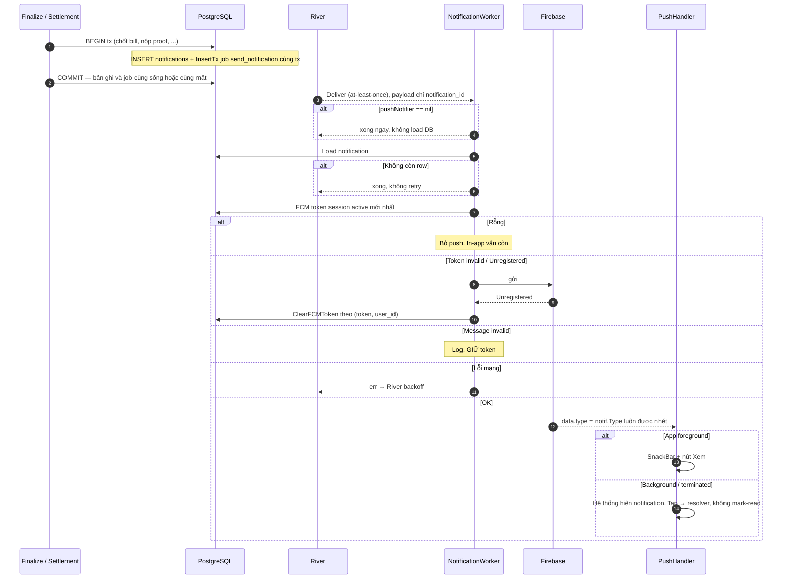
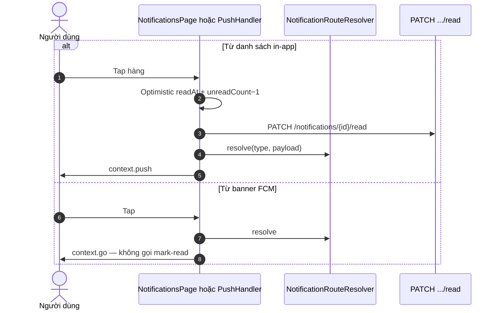
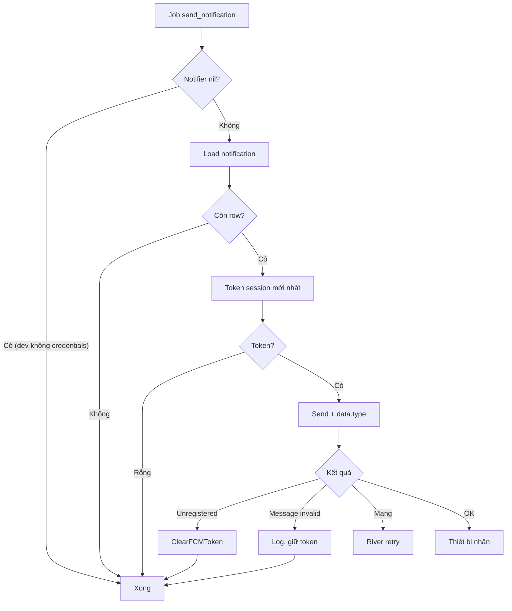
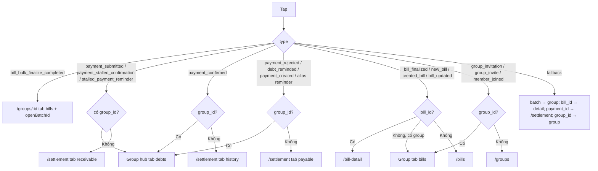

# 05 — Notification: chuông trong app và đẩy lúc điện thoại tắt

> **Phạm vi**: BE module `notification` (`/api/v1/notifications`) + producer trong bill/settlement ↔ FE `FCMTokenManager`, `PushNotificationHandler`, `NotificationRouteResolver`, màn Notifications + chấm chuông Home.
>
> Code tham chiếu chính: `PaySplit-BE/internal/modules/notification/**`, `PaySplit-BE/internal/platform/notification/fcm/**`, `PaySplit-FE/lib/core/network/fcm_token_manager.dart`, `push_notification_handler.dart`, `lib/app/router/notification_route_resolver.dart`, `lib/features/notifications/**`.
>
> Đọc cùng: [`01-auth.md`](01-auth.md) (PUT FCM, session), [`07-app-startup-network.md`](07-app-startup-network.md) (init Firebase), [`08-realtime.md`](08-realtime.md) (SSE không thay push).

---

## 1. Vấn đề, và ý tưởng để giải quyết

### 1.1 Hai đường, một bản ghi

Người dùng mở app thì thấy danh sách. Người dùng tắt app thì cần FCM. Nếu ghi DB xong mới enqueue, process chết giữa chừng = có chuông trong app nhưng không bao giờ đẩy. Nếu enqueue trước commit, rollback = đẩy tin ma.

> Bản ghi `notifications` và job `send_notification` ra đời **trong cùng transaction nghiệp vụ** (finalize, proof, confirm…). Không có record mồ côi, không có job trùng. Job chỉ mang `notification_id`; worker đọc lại DB.

### 1.2 Push là phụ, in-app là chính

Chưa cấp quyền thông báo, chưa có token, chưa cấu hình Firebase credentials: **server vẫn chạy**, chuông trong app vẫn đủ. Worker không có notifier → return ngay, không retry vô ích.

### 1.3 SSE không thay notification

Realtime chỉ nói "dữ liệu bẩn, hãy GET lại". Notification nói "có chuyện xảy ra, hãy mở đúng màn". Hai kênh khác việc. Đừng định hướng từ frame `invalidate`.

---

## 2. Bảng tổng quan

| Khái niệm | Giá trị |
|---|---|
| Tạo | Insert + enqueue **trong tx producer** (bill BeforeCommit, settlement `NotifyTx`). `SendToUser` có sẵn nhưng **không producer nào gọi** |
| Push | FCM. Token = session active mới nhất `ORDER BY issued_at DESC` |
| Gắn token | Login body `fcm_token?` + `PUT /users/me/fcm-token` sau `initialize()`. Cold start cũng `initialize()` nếu đã có access token |
| Truncate | Chỉ `SendToUser` (rune + `...`). Producer viết câu ngắn, dựa CHECK `type≤60 title≤255 body≤1000` |
| Foreground | **SnackBar** Material, nút Xem — không phải system heads-up |
| Push tap | `context.go` theo resolver, **không** mark-read |
| In-app tap | Optimistic mark-read rồi `context.push` |
| Badge Home | Chấm đỏ, không hiện số. Nguồn `notificationsProvider.unreadCount` |

Domain constants `payment_reminder`, `new_bill`, `group_invitation`… **không** được producer dùng. Resolver FE vẫn hiểu một số alias phòng payload cũ.

---

## 3. Loại thật sự được sinh

| Type | Producer | Người nhận | Payload |
|---|---|---|---|
| `bill_finalized` | Finalize (kể cả bulk item thành công) | Từng member có user id; Captain/creditor nhận câu tổng, người khác nhận phần mình | `bill_id`, `group_id`, `amount` |
| `bill_bulk_finalize_completed` | Batch xong | Captain | `batch_id`, `group_id`, counts |
| `payment_created` | Tạo QR | **Creditor** | `group_id`, `payment_id` |
| `payment_submitted` | Nộp proof | Creditor | `group_id`, `payment_id` |
| `payment_confirmed` / `payment_rejected` | Confirm / Reject | **Debtor** | `group_id`, `payment_id` |
| `debt_reminded` | Remind tay + job 72h | Debtor | `group_id`, `debt_id` |
| `payment_stalled_confirmation` | Job 48h | Creditor | `group_id`, `payment_id` |

---

## 4. Endpoint và màn hình

| Method + Path | Việc |
|---|---|
| GET `/notifications?page&page_size` | Offset pager `{items, meta}` |
| GET `/notifications/unread-count` | `{unread_count}` — FE list đã lấy kèm, ít gọi lẻ |
| PATCH `/notifications/read-all` | |
| PATCH `/notifications/{id}/read` | `WHERE id AND user_id`; 0 hàng → `404 NOT_FOUND` |
| PUT `/users/me/fcm-token` | Gắn vào **sid hiện tại**. Rỗng → `400 INVALID_FCM_TOKEN` |

Auth fail trên notification handler: `UNAUTHORIZED` (không phải `AUTHENTICATION_REQUIRED`).

FE `/notifications` full-screen: tab Tất cả / Chưa đọc (lọc client), nhóm Hôm nay / Trước đó, skeleton, empty, infinite scroll ≤200px đáy, pull-to-refresh giữ list cũ + SnackBar khi mất mạng.

---

## 5. Sequence Diagrams

### 5.1 Sinh trong tx nghiệp vụ rồi mới đẩy



### 5.2 Đăng ký token

```mermaid
sequenceDiagram
    autonumber
    participant App as bootstrap / App.initState / Login
    participant FTM as FCMTokenManager
    participant FCM as Firebase SDK
    participant BE as PUT /users/me/fcm-token

    Note over App: Firebase.initializeApp TRƯỚC EnvConfig. Background handler đăng ký lúc này
    App->>FTM: initialize() (mỗi cold start nếu có token; và sau login)
    FTM->>FCM: requestPermission
    Note over FTM: Từ chối quyền vẫn gọi getToken() — không early return
    FTM->>FCM: getToken
    alt Không có access token
        FTM->>FTM: bỏ sync
    else Có
        FTM->>BE: PUT {fcm_token} Bearer
        Note over BE: Ghi vào sid liveAuth. Race revoke → handler 500 INTERNAL_ERROR
        FTM->>FCM: onTokenRefresh → PUT lại, dedupe _lastSyncedToken
        Note over FTM: Fail: retry 10s, 1 phút, 5 phút
    end
```

Login còn gửi `fcm_token` trên `POST /auth/sign-in` nếu SDK đã có sẵn. Logout: `onLogout` hủy sub, tăng `_sessionEpoch`, `deleteToken()`, rồi mới clear storage.

### 5.3 Chạm thông báo



---

## 6. Activity Diagrams

### 6.1 Worker



### 6.2 Resolver — type trước, không phải bill_id trước

Producer luôn gửi `group_id`, nên hầu hết payment **mở Group Detail tab Công nợ**, không phải tab Settlement.



`payment_created` → **payable** (người nhận tin là creditor, nhưng alias đi nhánh payable khi không có group — với producer hiện tại luôn có `group_id` nên vào group debts).

---

## 7. Edge Cases

| # | Tình huống | Xử lý | Chỗ |
|---|---|---|---|
| 1 | Tx rollback | Job không commit | producer tx |
| 2 | River giao trùng | Worker load theo id, không nhân bản row | `send_notification.go` |
| 3 | Row bị xóa trước worker | Job xong, không retry | |
| 4 | Gỡ app / token chết | Unregistered → ClearFCMToken `(token, user_id)` | không xóa nhầm user khác cùng lúc rotate |
| 5 | Title dài (nếu đi SendToUser) | Truncate rune | producer thật không truncate |
| 6 | Đọc hộ người khác | WHERE user_id | 404 |
| 7 | Payload JSONB null | Worker nhét `type`; FCM data map nil-safe | |
| 8 | Không credentials | `fcm.New` nil; bootstrap tránh typed-nil; worker no-op | `bootstrap/app.go` |
| 9 | Pull-to-refresh mất mạng | Giữ list + SnackBar | `notifications_notifier.dart` |
| 10 | Badge lệch | unreadCount đi cùng list; optimistic ±1, rollback khi PATCH fail | không file `unread_notification_count_provider.dart` |
| 11 | Terminated | `getInitialMessage` + post-frame `context.go` | không mark-read |
| 12 | Background isolate | Chỉ log | không UI |
| 13 | Foreground FCM | SnackBar, **không** refresh badge | phải mở màn / pull |
| 14 | Từ chối quyền OS | Vẫn getToken; in-app đủ | |
| 15 | PUT FCM lúc session vừa revoke | liveAuth 401; race → 500 | [`01`](01-auth.md) |
| 16 | Login chưa có token FCM | Body bỏ trống; initialize sau bù PUT | |

---

## 8. Ghi chú triển khai đáng chú ý

1. **Đừng gọi `SendToUser` rồi tưởng producer đang dùng.** Finalize tự build row; settlement `NotifyTx`. Sửa truncate ở `SendToUser` không bảo vệ câu finalize.

2. **Resolver type-first.** Viết "nếu có bill_id thì luôn bill-detail" là sai với `bill_bulk_finalize_completed`.

3. **Push tap không mark-read.** Chủ đích: user có thể thấy chuông chưa đọc khi vào app. Đừng "đồng bộ" với in-app tap.

4. **Foreground không phải heads-up.** SnackBar có thể bị che bởi sheet. Đó là UX hiện tại.

5. **Token lấy session mới nhất.** Single-session khiến điều này trùng sid đang sống. Nếu một ngày nới nhiều session, push chỉ tới máy login sau cùng.

6. **`data.type` luôn được worker nhét.** Dù producer quên. Resolver sống nhờ field này.

7. **ClearFCMToken theo cặp (token, user).** Xóa theo user không điều kiện sẽ cướp token máy mới nếu rotate chậm.

8. **Không log title/body/token/payload.** 

---

## 9. Trạng thái hiện tại

| Hạng mục | Trạng thái | Ghi chú |
|---|---|---|
| In-app list / read / badge | ✅ | |
| FCM worker + register | ✅ | Dev không credentials vẫn boot |
| Route từ in-app và push | ✅ | Ưu tiên Group Detail khi có `group_id` |
| Badge realtime khi đang mở Home | ⏸ | Foreground FCM không đụng unreadCount; SSE cũng không |
