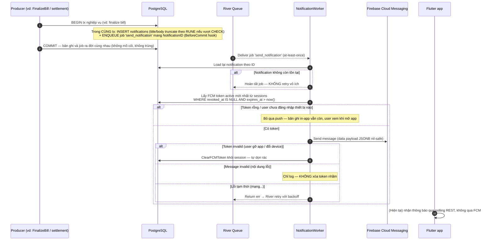
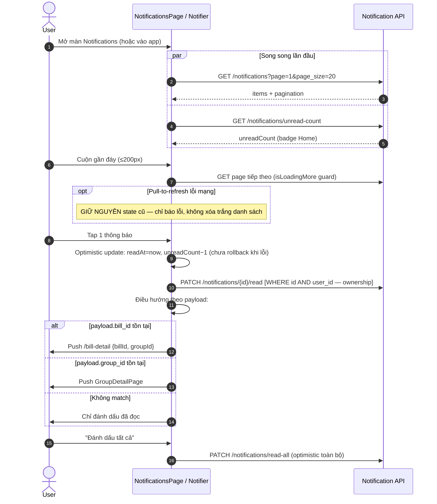
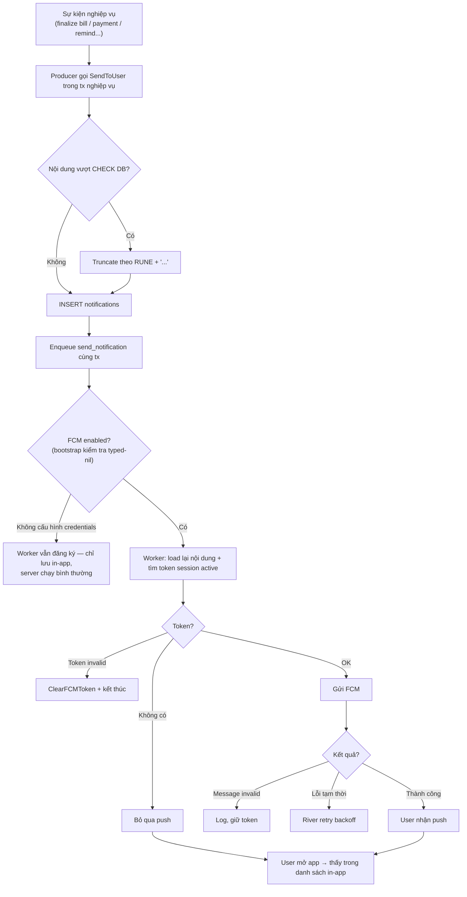
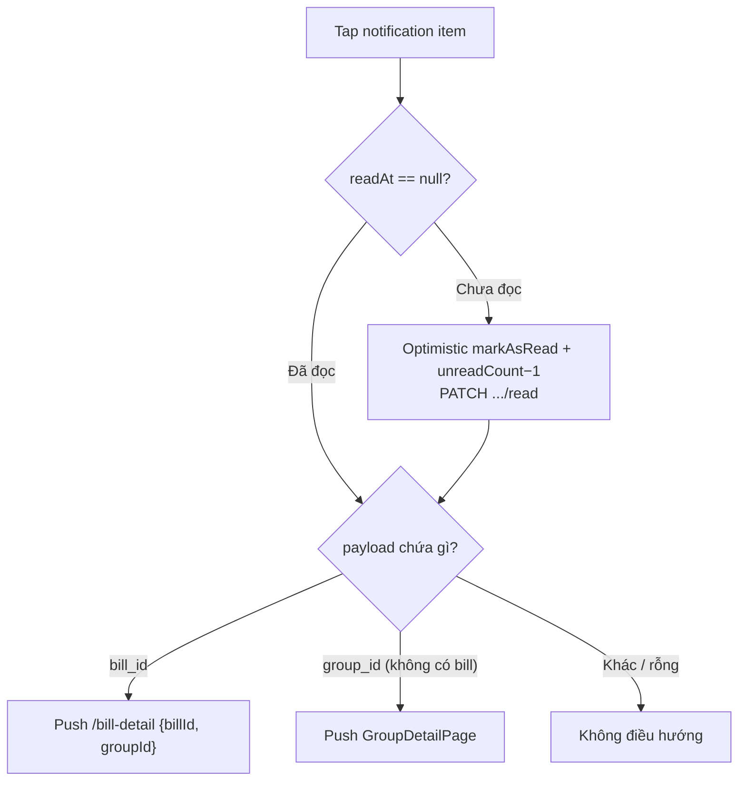

# 05 — Notification: Thông báo In-app & Push FCM

> **Phạm vi**: BE module `notification` (`/api/v1/notifications`) + các điểm producer trong bill/settlement ↔ FE màn hình Notifications + badge ở Home.
>
> Code tham chiếu chính: `PaySplit-BE/internal/modules/notification/**`, `PaySplit-FE/lib/features/notifications/**`.

---

## 1. Tổng quan mô hình

| Khái niệm | Giá trị |
|---|---|
| Tạo thông báo | **Atomic in-app + push**: ghi bản ghi `notifications` và enqueue River job `send_notification` **trong cùng transaction** → không có record mồ côi, không có job trùng |
| Push | Firebase FCM; token lấy từ session active mới nhất của user |
| Giới hạn nội dung | type ≤60, title ≤255, body ≤1000 ký tự (CHECK DB) — BE tự truncate theo RUNE thêm "..." thay vì trả 500 |
| FE hiện tại | ⚠️ **Chưa tích hợp FCM** (không có firebase_messaging trong pubspec) — thông báo chỉ hiển thị qua REST polling in-app. BE push đi đâu khi không có token FE? Token rỗng → worker bỏ qua |

### Các loại notification thực tế có producer

| Type | Producer | Người nhận |
|---|---|---|
| `bill_finalized` | FinalizeBill (cả bulk) | Từng member (phần tiền mình), Captain (tổng) |
| `payment_created` | GeneratePayment | Creditor |
| `payment_submitted` | SubmitProof | Creditor |
| `payment_confirmed` / `payment_rejected` | Confirm/Reject | Debtor |
| `debt_reminded` | RemindDebt thủ công + automated job | Debtor |
| `payment_stalled_confirmation` | Job quét payment treo >48h | Creditor |
| `bill_bulk_finalize_completed` | Batch finalize-all xong | Captain |

Khai báo sẵn nhưng **chưa có producer**: `payment_reminder`, `new_bill`, `group_invitation`, `bill_updated`, `system_announcement`.

## 2. Endpoint & màn hình

### BE endpoints (tất cả `liveAuth`, mount `/api/v1/notifications`)

| Method + Path | Chức năng |
|---|---|
| GET `/notifications?page&page_size` | Danh sách (offset pager) |
| GET `/notifications/unread-count` | Số chưa đọc (badge) |
| PATCH `/notifications/read-all` | Đánh dấu tất cả đã đọc |
| PATCH `/notifications/{id}/read` | Đánh dấu 1 thông báo đã đọc |

### FE màn hình (`/notifications`, full-screen ngoài shell)

- Filter tabs **Tất cả / Chưa đọc** (filter client-side).
- Gom nhóm theo ngày "Hôm nay" / "Trước đó".
- Skeleton loading + empty state.
- Infinite scroll trigger khi cách đáy ≤200px.
- Badge dot đỏ trên chuông ở Home (watch `unreadNotificationCountProvider`).

---

## 3. Sequence Diagrams

### 3.1 Tạo & gửi thông báo (producer → worker → FCM)

### 3.2 FE đọc danh sách & đánh dấu đã đọc

## 4. Activity Diagrams

### 4.1 Vòng đời một notification (từ sự kiện đến người dùng)

### 4.2 Điều hướng khi tap notification (FE)

---

## 5. Edge Cases

| # | Tình huống | Xử lý hệ thống | Vị trí code (tham chiếu) |
|---|---|---|---|
| 1 | Tx nghiệp vụ commit thành công nhưng enqueue job fail | Không thể xảy ra — enqueue trong cùng tx (BeforeCommit); cả hai hoặc không | `usecase/service.go:54-132` |
| 2 | River giao job trùng (at-least-once) | Job chỉ mang ID; load lại từ DB; gửi push lặp là chấp nhận được, không tạo bản ghi trùng | `jobs/send_notification.go:57-98` |
| 3 | Notification bị xóa trước khi worker xử lý | Worker hoàn tất job, không retry | như trên |
| 4 | User gỡ app → FCM token chết | Invalid token → ClearFCMToken; message invalid (lỗi nội dung) thì **không** xóa nhầm token | queries/notification.sql:41 |
| 5 | Title/body quá dài làm vỡ INSERT (CHECK DB) | Truncate theo RUNE (khớp `char_length` Postgres) + "..." thay vì trả 500 | `service.go:136-146` |
| 6 | Đánh dấu đã read hộ người khác | Query `WHERE id=$1 AND user_id=$2` — ownership bắt buộc | repository MarkAsRead |
| 7 | Payload JSONB null/sai shape | Map nil-safe sang `map[string]string` cho FCM data | worker |
| 8 | FCM credentials chưa cấu hình (dev env) | Bootstrap kiểm tra typed-nil notifier cẩn thận — server vẫn chạy, chỉ mất push | `bootstrap/app.go:123-160` |
| 9 | FE optimistic markAsRead nhưng PATCH lỗi | Hiện tại **chưa rollback** (ghi chú trong code) — trạng thái lệch tạm thời đến khi reload | `notifications_notifier.dart:234-250` |
| 10 | Pull-to-refresh lỗi mạng | Giữ nguyên state cũ, không xóa danh sách | `notifications_notifier.dart:185-187` |
| 11 | Badge Home sai số | unread-count fetch riêng song song với list; optimistic giảm local | provider |
| 12 | FE chưa có FCM → push BE vô đích | Worker thấy token rỗng → bỏ qua; thông báo vẫn nằm chờ trong in-app list | khoảng trống đã biết |

---

## 6. Việc cần làm khi tích hợp FCM phía FE (checklist tham khảo)

1. Thêm `firebase_core` + `firebase_messaging`; cấu hình `google-services.json` / `GoogleService-Info.plist`.
2. Sau login: xin quyền notification → lấy FCM token → `PUT /users/me/fcm-token` (gắn vào session hiện tại).
3. Đăng ký `onMessage` (foreground), `onBackgroundMessage` (cần handler top-level), `onMessageOpenedApp` (tap → điều hướng theo payload giống mục 4.2).
4. Khi logout/session chết: token gắn session sẽ hết hiệu lực phía BE; cân nhắc clear token cục bộ.
