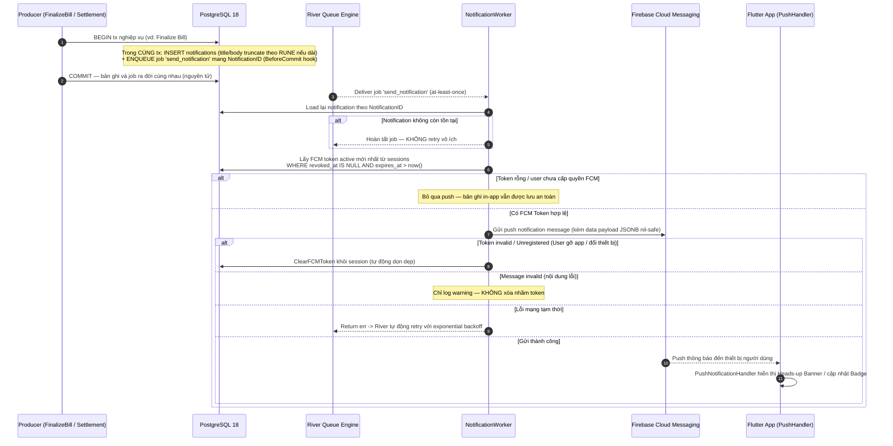
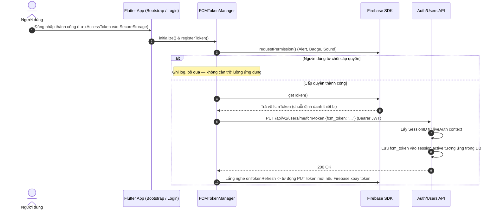
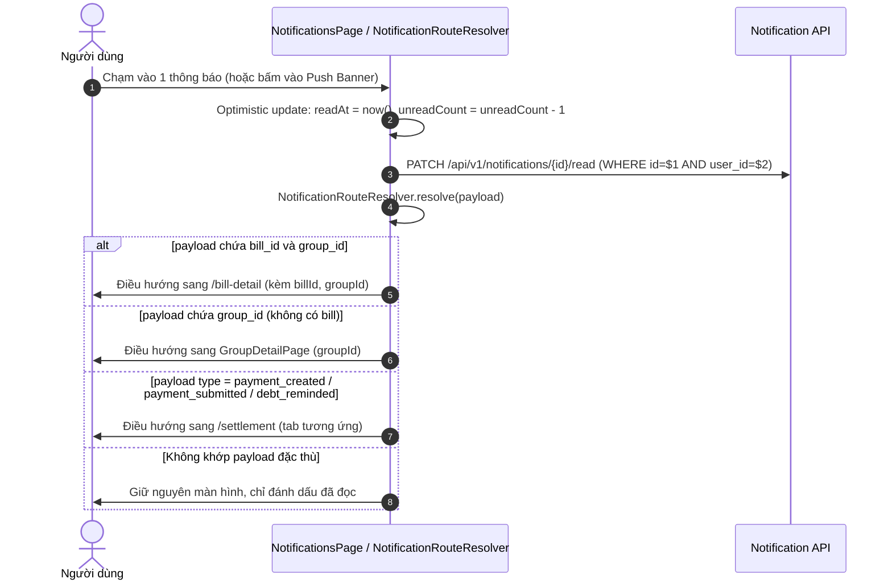
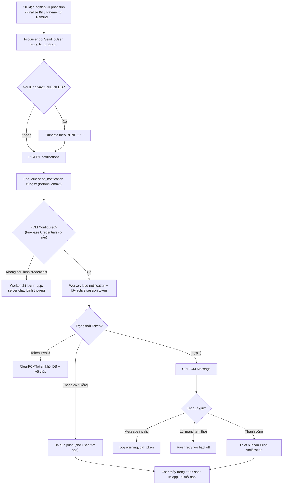
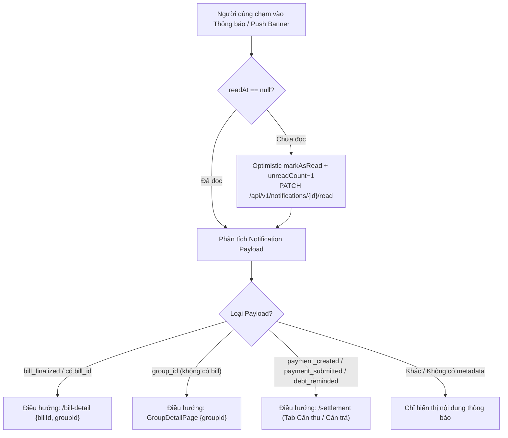

# 05 — Notification: Thông báo In-app & Push Notification (FCM)

> **Phạm vi**: 
> - Backend module `notification` (`/api/v1/notifications`) + các điểm producer trong `bill`/`settlement`.
> - Frontend Mobile App (`PaySplit-FE`): Quản lý FCM Token (`FCMTokenManager`), Lắng nghe Push (`PushNotificationHandler`), Điều hướng tự động (`NotificationRouteResolver`), Màn hình Notifications & Badge chuông tại Home.
>
> Code tham chiếu chính: 
> - Backend: `PaySplit-BE/internal/modules/notification/**`, `PaySplit-BE/internal/platform/notification/fcm/**`.
> - Frontend: `PaySplit-FE/lib/core/network/fcm_token_manager.dart`, `PaySplit-FE/lib/core/network/push_notification_handler.dart`, `PaySplit-FE/lib/app/router/notification_route_resolver.dart`, `PaySplit-FE/lib/features/notifications/**`.

---

## 1. Tổng quan mô hình

| Khái niệm | Giá trị |
|---|---|
| Tạo thông báo | **Atomic in-app + push**: ghi bản ghi `notifications` và enqueue River job `send_notification` **trong cùng transaction** (BeforeCommit hook) → không có record mồ côi, không có job trùng |
| Push Hub | Firebase Cloud Messaging (FCM); Token lấy từ session active mới nhất của user |
| Gắn Token FE | `FCMTokenManager` xin quyền notification sau khi login → lấy FCM Token → gọi `PUT /users/me/fcm-token` gắn vào session hiện tại |
| Giới hạn nội dung | type ≤60, title ≤255, body ≤1000 ký tự (CHECK DB) — BE tự truncate theo RUNE thêm "..." thay vì trả 500 |
| Lắng nghe Push FE | `PushNotificationHandler` (Foreground / Background / Terminated state) |
| Điều hướng Push FE | `NotificationRouteResolver` phân tích payload (`bill_id`, `group_id`, `type`) để mở đúng màn hình chi tiết |

### Các loại notification thực tế có producer

| Type | Producer | Người nhận | Hành động điều hướng trên Mobile App |
|---|---|---|---|
| `bill_finalized` | FinalizeBill (cả bulk) | Từng member (phần tiền), Captain (tổng) | Mở `/bill-detail` (kèm `billId`, `groupId`) |
| `payment_created` | GeneratePayment | Creditor | Mở `/settlement` tab Cần thu |
| `payment_submitted` | SubmitProof | Creditor | Mở `/settlement` tab Cần thu & cuộn đến hàng minh chứng |
| `payment_confirmed` / `payment_rejected` | Confirm / Reject | Debtor | Mở `/settlement` tab Cần trả / Lịch sử |
| `debt_reminded` | RemindDebt thủ công + automated job | Debtor | Mở `/settlement` tab Cần trả |
| `payment_stalled_confirmation` | Job quét payment treo >48h | Creditor | Mở `/settlement` tab Cần thu |
| `bill_bulk_finalize_completed` | Batch finalize-all xong | Captain | Mở `GroupDetailPage` |

---

## 2. Endpoint & Màn hình

### 2.1 BE Endpoints (Tất cả `liveAuth`, mount `/api/v1/notifications` và `/api/v1/users`)

| Method + Path | Chức năng |
|---|---|
| GET `/notifications?page&page_size` | Danh sách thông báo (phân trang offset pager) |
| GET `/notifications/unread-count` | Số lượng thông báo chưa đọc (hiển thị badge) |
| PATCH `/notifications/read-all` | Đánh dấu tất cả thông báo đã đọc |
| PATCH `/notifications/{id}/read` | Đánh dấu 1 thông báo đã đọc |
| PUT `/users/me/fcm-token` | Đăng ký / cập nhật FCM Device Token gắn với Session ID hiện tại |

### 2.2 FE Màn hình (`/notifications`, full-screen ngoài shell)

- Filter tabs **Tất cả / Chưa đọc** (lọc client-side nhanh chóng).
- Gom nhóm theo mốc thời gian: "Hôm nay" / "Trước đó".
- Skeleton loading + Empty state thân thiện.
- Infinite scroll trigger khi cuộn cách đáy danh sách ≤200px.
- Badge dot đỏ trên icon chuông tại AppBar màn hình Home (`unreadNotificationCountProvider`).

---

## 3. Sequence Diagrams

### 3.1 Luồng Sản sinh, Enqueue & Bắn Push FCM

### 3.2 Đăng ký FCM Token khi Khởi động & Đăng nhập

### 3.3 Đọc danh sách & Điều hướng khi chạm vào thông báo

---

## 4. Activity Diagrams

### 4.1 Vòng đời tạo & gửi thông báo

### 4.2 Điều hướng thông minh theo Payload (`NotificationRouteResolver`)

---

## 5. Bảng Edge Cases & Cơ Chế Xử Lý

| # | Tình huống | Xử lý hệ thống | Vị trí code tham chiếu |
|---|---|---|---|
| 1 | Tx nghiệp vụ commit thành công nhưng enqueue job thất bại | Không thể xảy ra — Enqueue trong cùng tx (`BeforeCommit`); cả hai cùng commit hoặc cùng rollback | `usecase/service.go:54-132` |
| 2 | River giao job lặp (at-least-once) | Job chỉ mang ID; worker query lại DB; nếu đã xử lý thì kết thúc an toàn, không sinh thông báo trùng | `jobs/send_notification.go:57-98` |
| 3 | Notification bị xóa trước khi worker xử lý | Worker hoàn tất job an toàn, không retry lặp vô hạn | `jobs/send_notification.go` |
| 4 | User gỡ app → FCM token không còn hiệu lực | Firebase trả lỗi Invalid/Unregistered Token → Worker tự động `ClearFCMToken` dọn rác session | `queries/notification.sql:41` |
| 5 | Title/Body quá dài làm vỡ ràng buộc DB (CHECK) | Backend tự động truncate theo số lượng RUNE + "..." thay vì trả lỗi 500 | `service.go:136-146` |
| 6 | Đánh dấu đã đọc hộ người khác | Query ràng buộc `WHERE id=$1 AND user_id=$2` — bắt buộc đúng ownership | `repository/postgres/repository.go` |
| 7 | Payload JSONB null / sai cấu trúc | Tầng handler map nil-safe sang `map[string]string` phục vụ FCM data payload | `platform/notification/fcm/client.go` |
| 8 | Chưa cấu hình Firebase credentials (môi trường dev) | `bootstrap/app.go` kiểm tra typed-nil client — server vẫn khởi động bình thường, lưu in-app đầy đủ | `bootstrap/app.go:123-160` |
| 9 | Pull-to-refresh danh sách thông báo khi mất mạng | Giữ nguyên dữ liệu cũ trên giao diện, chỉ hiển thị SnackBar báo lỗi kết nối | `notifications_notifier.dart:185-187` |
| 10 | Badge đếm chưa đọc bị lệch khi thao tác nhanh | `unread-count` được query độc lập song song; tự động trừ local khi đọc từng item | `unread_notification_count_provider.dart` |
| 11 | Người dùng chạm vào thông báo khi app đang tắt (Terminated state) | `FirebaseMessaging.instance.getInitialMessage()` đón payload khi mở app và điều hướng qua `NotificationRouteResolver` | `push_notification_handler.dart` |
