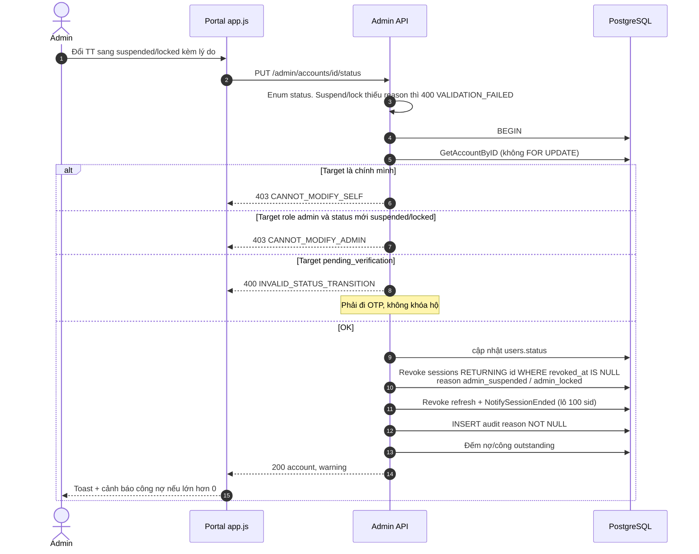
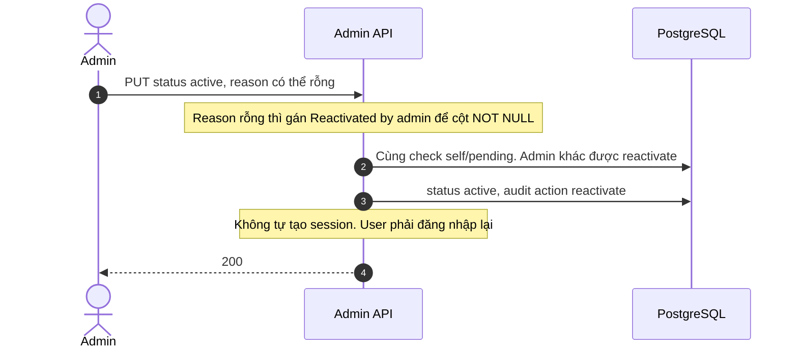
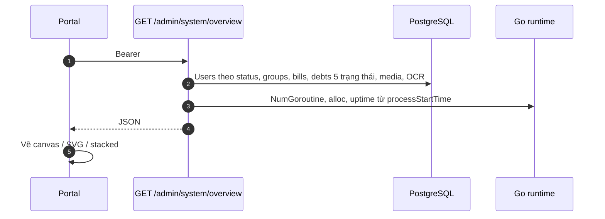
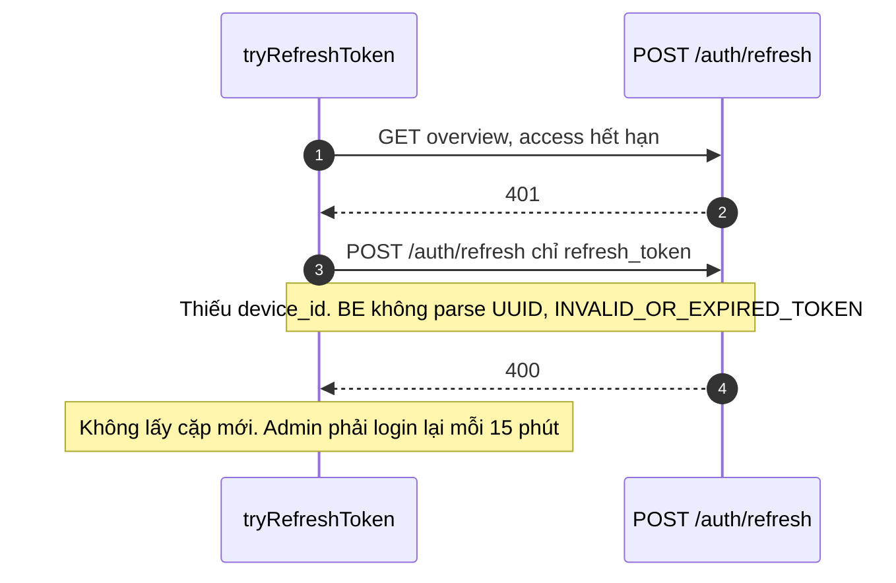
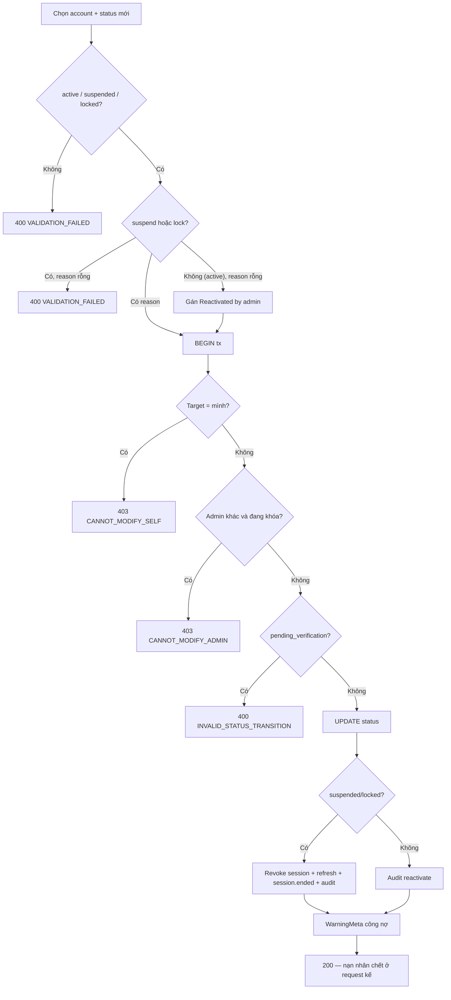

# 06 — Admin: khóa tài khoản là khóa phiên, không phải đợi JWT chết

> Đối chiếu mã nguồn local ngày **06/09/2026** — BE `7f2b2a7`, FE `fb0cf0b`. [Phạm vi, bằng chứng và kiểm chứng](reports/2026-09-06-flow-sync.md). Các ghi chú AC/runtime cũ không có nghĩa đã chạy lại E2E trong lần này.

> **Phạm vi**: BE module `admin` (`/api/v1/admin`, `liveAuth` + `RequireRole("admin")`) ↔ Web Admin Portal nhúng `//go:embed` tại `/admin-portal/`.
>
> Code tham chiếu chính: `PaySplit-BE/internal/modules/admin/**`, `PaySplit-BE/web/admin/**`, `PaySplit-BE/web/web.go`, `PaySplit-BE/cmd/seedadmin/**`.
>
> Đọc cùng: [`01-auth.md`](01-auth.md) (session, `ACCOUNT_UNAVAILABLE`), [`08-realtime.md`](08-realtime.md) mục 5.3 (`session.ended`).

---

## 1. Vấn đề, và ý tưởng để giải quyết

### 1.1 JWT 15 phút không phải công tắc

Suspend mà chỉ sửa `users.status` thì máy nạn nhân vẫn gọi API đến hết hạn access. Admin tưởng đã khóa, người kia vẫn chốt hóa đơn.

> Trong **cùng transaction**: đổi status, `UPDATE sessions SET revoked_at=now() ... RETURNING id` với `revoked_at IS NULL`, thu hồi refresh, `NotifySessionEnded`. Request kế của nạn nhân: `liveAuth` thấy sid chết → `401 AUTHENTICATION_REQUIRED`. Không chờ 15 phút.

### 1.2 Admin không khóa admin

Không tự khóa mình (`CANNOT_MODIFY_SELF`). Không suspend/lock admin khác (`CANNOT_MODIFY_ADMIN`). **Reactivate admin khác thì được** — để cứu tài khoản bị gán nhầm role. Check nằm **trong tx** sau khi đọc account, không phải middleware đoán id.

### 1.3 Portal là file tĩnh trong binary

Không SPA build riêng, không CDN. `web/web.go` embed `admin/*`, router mount `/admin-portal/`. Sửa HTML/JS là sửa repo BE, deploy lại API.

---

## 2. Bảng tổng quan

| Khái niệm | Giá trị |
|---|---|
| Quyền | JWT hợp lệ **và** `role=admin`. Thiếu role context → 401; sai role → `403 INSUFFICIENT_PERMISSIONS` |
| Status user | `pending_verification`, `active`, `suspended`, `locked`. PUT chỉ nhận active/suspended/locked |
| Audit | `admin_audit_logs`, action enum `suspend`/`lock`/`reactivate`, `reason NOT NULL` |
| Bank | Mask `******` + 4 số cuối (≤4 thì hiện hết) ở repository detail |
| Warning | Suspend/lock vẫn cho phép; trả `unsettled_debts_count`, `unsettled_credits_count` |
| Token portal | localStorage. Sign-in `device_name: Admin Web Portal` |
| Refresh portal | `POST /auth/refresh` **chỉ** `{refresh_token}` — BE đòi `device_id` UUID → **coi như gãy sau 15 phút** |
| Realtime admin | Không có. Chỉ nạn nhân nhận `session.ended` |
| Unlock account | **Không** có endpoint. Unlock submissions là việc Captain trên nhóm |

`GetAccountByID` **không** `FOR UPDATE`. Chống đua chủ yếu nhờ check-in-tx + unique một session. Hai admin sửa cùng user vẫn có cửa hẹp.

---

## 3. Endpoint và portal

| Method + Path | Việc |
|---|---|
| GET `/admin/accounts` | Search email/name/phone; filter status/role; sort whitelist `created_at`/`display_name`/`email` asc/desc; page mặc định 1, limit 20 clamp ≤100 |
| GET `/admin/accounts/{id}` | SafeUser + `failed_login_count`, `login_blocked_until`, bank mask, số session active, nhóm, financials, 10 audit mới |
| PUT `/admin/accounts/{id}/status` | `{status, reason}` |
| GET `/admin/system/overview` | Users theo status, groups, bills, debts 5 trạng thái, media cleanup, OCR jobs, goroutine/RAM/uptime |

Ngoài `/admin`: `GET /health`, `/health/live`, `/health/ready` (ready ping DB 3s, down → 503 raw `{status:degraded,database:down}` — **không** envelope), `GET /metrics`.

Portal tabs:

1. **Tổng quan** — thẻ số, canvas RAM/goroutine, donut nợ, stacked River/OCR, thanh user/bill, auto-refresh 15s.
2. **Tài khoản** — pill đếm, lọc, bảng 10/20/50/100, modal chi tiết, modal đổi status (lý do bắt buộc, cảnh báo công nợ).
3. **Giám sát** — 4 thẻ Postgres/River/FCM/SMTP **luôn chữ Active (tĩnh)**, nút probe `/health*`, latency + JSON thô, link `/metrics`.

---

## 4. Sequence Diagrams

### 4.1 Suspend / Lock

Cách đọc:

Admin chọn user, status mới (`suspended`/`locked`), lý do bắt buộc. Thiếu reason → `400 VALIDATION_FAILED` (không có mã `REASON_REQUIRED`).

Một transaction, thứ tự trong hình: đọc account (**không** `FOR UPDATE` hàng user — hai admin đua vẫn có cửa hẹp), rồi các cửa:
- Chính mình → `403 CANNOT_MODIFY_SELF` (không phải 400).
- Target role admin **và** đang khóa/suspend → `403 CANNOT_MODIFY_ADMIN`. Reactivate admin khác **được**.
- `pending_verification` → `400 INVALID_STATUS_TRANSITION` (không phải 409). Phải đi OTP, không khóa hộ tài khoản chưa kích hoạt.

Hợp lệ: đổi `users.status`, `UPDATE sessions ... RETURNING id WHERE revoked_at IS NULL` (lý do `admin_suspended` / `admin_locked`), thu hồi refresh, `NotifySessionEnded` chia lô 100 sid, INSERT audit (`reason NOT NULL`), đếm nợ/công outstanding trả về `warning`.

Nạn nhân: JWT còn hạn nhưng `liveAuth` 401. Refresh thấy session chết → `INVALID_OR_EXPIRED_TOKEN` → app `endSession`. SSE (nếu bật) `close: session_ended` — app đóng stream, gọi `endSession` ngay và về Login có cảnh báo. REST 401 là đường dự phòng khi không có user stream. Xem [`01-auth.md`](01-auth.md) mục 4.

### 4.2 Reactivate

Cách đọc:

Status `active`, reason có thể để trống. Backend tự gán câu `"Reactivated by admin"` để cột audit `reason NOT NULL` không vỡ.

Cùng các cửa self / pending như lúc khóa. Khác một điểm: **được** reactivate admin khác (cửa `CANNOT_MODIFY_ADMIN` chỉ chặn suspend/lock).

Không INSERT session mới, không cấp JWT. Mọi sid đã chết lúc khóa. User phải đăng nhập lại trên app hoặc portal. Toast + refresh bảng.

### 4.3 Overview 15 giây

Cách đọc:

Tab Tổng quan (hoặc timer 15 giây) gọi `GET /admin/system/overview` Bearer. Handler **không** `par` trong Go: query users theo status, groups, bills, debts 5 trạng thái (kể cả `stalled_confirmation`/`rejected` ít dùng), media cleanup, OCR jobs, rồi `runtime.ReadMemStats` / `NumGoroutine` / uptime từ `processStartTime`.

JSON về portal: vẽ canvas RAM + goroutine, donut nợ, stacked River/OCR, thanh user/bill. Số trên thẻ và góc SVG đều tính phía browser, không có endpoint chart riêng.

`/health/ready` là probe khác (tab Giám sát), không nằm trong overview.

Query **tuần tự**, không `par` trong Go. Portal vẽ song song.

### 4.4 Auto refresh portal — chỗ đang gãy

Cách đọc:

Access JWT portal cũng 15 phút. `app.js` bắt 401, gọi `tryRefreshToken`: `POST /auth/refresh` body **chỉ** `refresh_token`. BE `Refresh` đòi `device_id` là UUID hợp lệ, thiếu → `400 INVALID_OR_EXPIRED_TOKEN`. Portal không lấy cặp mới. Admin phải login lại mỗi 15 phút.

Đây **không** phải chi tiết implement. Mobile (`SessionRefresher`) gửi đủ `{refresh_token, device_id}` và chạy đúng. Portal quên field. Đừng ghi "đã có auto-refresh" như thể đã chạy.

Sign-in portal có gửi `device_id` + `device_name: Admin Web Portal`. Chỉ bước refresh thiếu.

Mobile gửi đủ `{refresh_token, device_id}`. Portal quên. Đừng ghi "đã có auto-refresh" như thể đã chạy.

---

## 5. Activity Diagram: đổi status

Cách đọc:

Hình là toàn bộ cửa đổi status, đọc từ trên xuống.

Status ngoài `active` / `suspended` / `locked` → 400. Khóa/suspend thiếu reason → 400 `VALIDATION_FAILED`. Reactivate thiếu reason → tự điền câu mặc định rồi vào tx.

Trong tx: mình → 403. Admin khác đang bị khóa (suspend/lock) → 403. `pending_verification` → 400. Rồi UPDATE. Nhánh khóa thì revoke session + audit. Nhánh active thì chỉ audit reactivate. Cuối cùng luôn tính WarningMeta công nợ — **không chặn** khóa user còn nợ, chỉ cảnh báo admin biết hệ quả.

Nạn nhân chết ở request HTTP kế, không chờ JWT hết hạn.

---

## 6. Edge Cases

| # | Tình huống | Xử lý | Mã |
|---|---|---|---|
| 1 | Tự khóa mình | Check trong tx | `403 CANNOT_MODIFY_SELF` — không 400 |
| 2 | Khóa admin khác | | `403 CANNOT_MODIFY_ADMIN` |
| 3 | Reactivate admin khác | Cho phép | 200 |
| 4 | Suspend user chưa verify | | `400 INVALID_STATUS_TRANSITION` — không 409 |
| 5 | Suspend/lock thiếu reason | | `400 VALIDATION_FAILED` — không `REASON_REQUIRED` |
| 6 | Reactivate không reason | Tự điền câu mặc định | 200 |
| 7 | Còn nợ/công | Vẫn khóa, kèm warning | |
| 8 | Sort/filter lạ | Whitelist; limit ≤100 | `400 VALIDATION_FAILED` |
| 9 | Xem STK | Mask 4 số cuối | |
| 10 | Non-admin | Middleware | `403 INSUFFICIENT_PERMISSIONS` |
| 11 | JWT nạn nhân còn hạn | liveAuth sid chết | `401 AUTHENTICATION_REQUIRED` |
| 12 | Portal 15 phút | Refresh thiếu device_id | phải login lại |
| 13 | Hai admin đua status | Không row lock; last writer | cửa hẹp |
| 14 | Probe FCM/SMTP trên tab 3 | Badge tĩnh, không ping thật | chỉ `/health*` là đo |
| 15 | `/health/ready` listener SSE đứt | 503 degraded | [`08`](08-realtime.md) |

---

## 7. seedadmin

`go run ./cmd/seedadmin`. Cần `DATABASE_URL`.

| Env | Mặc định trong code |
|---|---|
| `ADMIN_SEED_EMAIL` | `admin@paysplit.app` |
| `ADMIN_SEED_PASSWORD` | `Admin@123456` |
| `ADMIN_SEED_NAME` | **`PaySplit Admin`** |
| `ADMIN_SEED_PHONE` | **`+84999999999`** |

**Không skip-if-exists.** Email đã có → **UPDATE** hash, name, `role=admin`, `status=active`, `email_verified_at`. bcrypt `DefaultCost` (10). In mật khẩu plaintext ra stdout. Idempotent theo nghĩa "chạy hai lần vẫn là admin", không phải no-op.

---

## 8. Ghi chú triển khai đáng chú ý

1. **`RETURNING id` phải `revoked_at IS NULL`.** Cùng bẫy [`08-realtime.md`](08-realtime.md) mục 5.3: sid chết chiếm lô, phiên sống sót.

2. **Mã lỗi public khác tài liệu cũ.** Self = 403, pending = 400, reason = `VALIDATION_FAILED`. Sửa portal toast theo code, không theo tên domain `ErrReasonRequired`.

3. **Portal refresh thiếu `device_id` là bug thật**, không phải "chi tiết implement". Mobile đã làm đúng.

4. **Không `FOR UPDATE` account row.** Nếu cần chống hai admin, thêm khóa — đừng giả vẽ đã có.

5. **Reactivate không cấp token.** User tự login. Session cũ đã chết lúc lock.

6. **Mask ở repository, không ở JS.** View-source portal không thấy số TK đủ.

7. **Health không envelope.** Portal parse JSON thô. Đừng bọc `success/data` mà quên probe.

8. **Log audit reason được; log STK / session id / mật khẩu seed trên production thì không.** seedadmin in password — chỉ dùng local.

---

## 9. Trạng thái hiện tại

| Hạng mục | Trạng thái | Ghi chú |
|---|---|---|
| CRUD status + audit + mask + warning | ✅ | |
| Overview + vẽ chart | ✅ | Query tuần tự đủ cho admin |
| Portal nhúng | ✅ | |
| Auto-refresh token portal | ❌ Gãy | Thiếu `device_id` |
| Probe FCM/SMTP sống | ⏸ Badge tĩnh | |
| Admin SSE / unlock account | — | Không có, đúng thiết kế |
