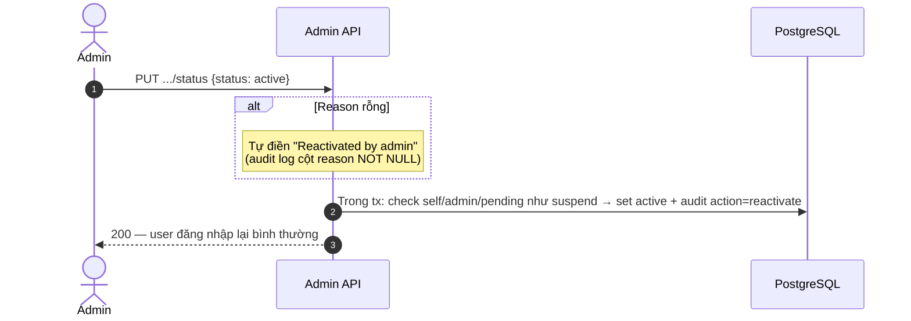
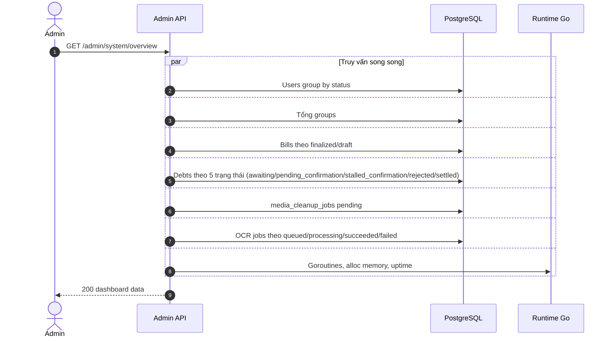
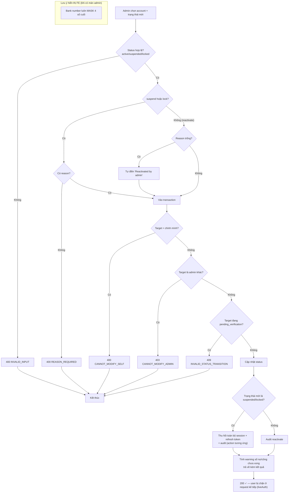

# 06 — Admin: Quản trị tài khoản & Thống kê hệ thống

> **Phạm vi**: BE module `admin` (`/api/v1/admin`, middleware `liveAuth` + `RequireRole("admin")`). Hiện chưa có màn hình Admin trên FE Flutter (chỉ API).
>
> Code tham chiếu chính: `PaySplit-BE/internal/modules/admin/**`.

---

## 1. Tổng quan mô hình

| Khái niệm | Giá trị |
|---|---|
| Phân quyền | Mọi endpoint yêu cầu JWT hợp lệ **và** `role = 'admin'`; fail → `403 INSUFFICIENT_PERMISSIONS` |
| Trạng thái tài khoản | `pending_verification`, `active`, `suspended`, `locked` |
| Audit | Mọi thay đổi trạng thái ghi `admin_audit_logs` (enum action: `suspend` / `lock` / `reactivate`, reason **NOT NULL**) |
| Nguyên tắc an toàn | Anti-TOCTOU: các check tự-sửa/khóa-admin được thực hiện **bên trong transaction**, không phải trước đó |
| Che giấu dữ liệu nhạy cảm | Số tài khoản ngân hàng luôn **mask** chỉ hiện 4 số cuối |

## 2. Endpoint

| Method + Path | Chức năng |
|---|---|
| GET `/admin/accounts` | Danh sách tài khoản — search (email/name/phone), filter status/role, sort whitelist (`created_at`/`display_name`/`email` asc/desc), page/limit clamp ≤100, offset + total pages |
| GET `/admin/accounts/{id}` | Chi tiết: SafeUser + `failed_login_count`, `login_blocked_until`, bank snapshot đã mask, số session active, danh sách nhóm, financials (nợ/công outstanding), audit logs gần đây |
| PUT `/admin/accounts/{id}/status` | Đổi trạng thái active/suspended/locked |
| GET `/admin/system/overview` | Thống kê toàn hệ thống |

---

## 3. Sequence Diagrams

### 3.1 Suspend / Lock tài khoản (thu hồi phiên + audit)

```mermaid
sequenceDiagram
    autonumber
    actor A as Admin
    participant FE as Admin tool (API client)
    participant BE as Admin API
    participant DB as PostgreSQL

    A->>FE: PUT /admin/accounts/{id}/status {status: suspended, reason}
    BE->>BE: Validate status enum; suspend/lock → reason BẮT BUỘC
    
    rect rgb(240, 240, 245)
        Note over DB: MỘT transaction — anti-TOCTOU: mọi check bên trong tx
        BE->>DB: SELECT target FOR UPDATE
        alt Target là CHÍNH admin đang gọi
            BE-->>FE: 400 CANNOT_MODIFY_SELF
        else Target là admin KHÁC
            BE-->>FE: 403 CANNOT_MODIFY_ADMIN
        else Target đang pending_verification
            Note over BE: Không cho chuyển trạng thái qua API này<br/>(phải qua luồng verify email)
            BE-->>FE: 409 INVALID_STATUS_TRANSITION
        else OK
            BE->>DB: users.status = suspended/locked
            BE->>DB: THU HỒI toàn bộ sessions + refresh tokens<br/>(reason: admin_suspended / admin_locked)
            BE->>DB: INSERT admin_audit_logs {action, reason NOT NULL}
            BE->>DB: Tính WarningMeta: unsettled_debts_count, unsettled_credits_count
        end
    end
    BE-->>FE: 200 {account, warning: {nghĩa vụ tài chính chưa xong}}
    
    Note over FE: Request tiếp theo của user bị khóa:<br/>liveAuth thấy status ≠ active → 401/403;<br/>JWT cũ chứa sid đã bị revoke
```

### 3.2 Reactivate (mở lại tài khoản)



### 3.3 Thống kê hệ thống (System Overview)



## 4. Activity Diagrams

### 4.1 Quyết định đổi trạng thái tài khoản



---

## 5. Edge Cases

| # | Tình huống | Xử lý hệ thống | Mã lỗi | Vị trí code (tham chiếu) |
|---|---|---|---|---|
| 1 | Admin tự khóa/suspend chính mình | Check **bên trong tx** (anti-TOCTOU) — không thể bị race vượt qua bằng 2 request song song | `400 CANNOT_MODIFY_SELF` | `admin/repository/postgres/repository.go:251-274` |
| 2 | Admin khóa một admin khác | Chặn — chỉ user role mới bị tác động | `403 CANNOT_MODIFY_ADMIN` | như trên |
| 3 | Suspend user chưa verify email | Chặn — trạng thái pending phải đi luồng OTP riêng | `409 INVALID_STATUS_TRANSITION` | như trên |
| 4 | Suspend/Lock thiếu reason | Từ chối — audit log bắt buộc có reason NOT NULL ≠ '' | `400 REASON_REQUIRED` | `usecase/service.go:144-173` |
| 5 | Reactivate không nhập reason | Tự điền "Reactivated by admin" để vẫn thỏa NOT NULL | `200` | như trên |
| 6 | User đang có nợ/công chưa xong bị suspend | Vẫn cho suspend, nhưng trả `WarningMeta{unsettled_debts_count, unsettled_credits_count}` để admin biết hệ quả | warning trong response | `repository.go:276-354` |
| 7 | Sort/filter field lạ từ query param | Whitelist sort fields/orders; status/role validate enum; limit clamp ≤100 | `400 INVALID_INPUT` | `usecase/service.go:53-133` |
| 8 | Xem số tài khoản ngân hàng của user | Luôn mask chỉ 4 số cuối ngay tầng repository | — | `MaskBankAccount` repo:434-441 |
| 9 | Non-admin gọi API admin | RequireRole chặn trước khi vào usecase | `403 INSUFFICIENT_PERMISSIONS` | `transport/http/middleware/auth.go:94-113` |
| 10 | Access token của user vừa bị suspend còn hạn 15 phút | liveAuth kiểm tra session + user status mỗi request → request kế tiếp bị chặn ngay, không đợi hết hạn JWT | `401` | `middleware/auth.go` + `ValidateSession` |

---

## 6. Ghi chú

- Đây là module thuần BE hiện tại — FE chưa có trang quản trị; thao tác thường qua REST client/dashboard riêng.
- Suspend/lock là cơ chế "cứng": kết hợp với single-session auth (01-auth), việc thu hồi phiên diễn ra tức thời ở lần request kế tiếp.
