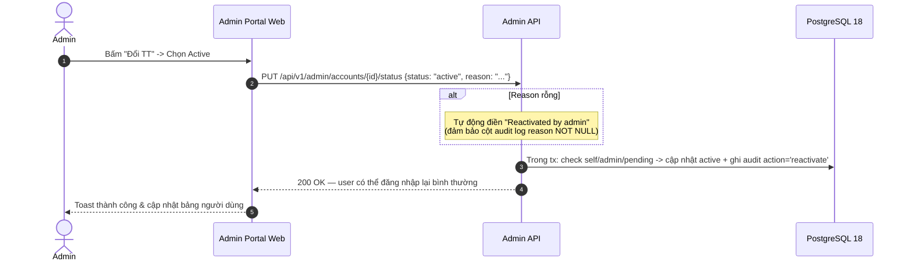
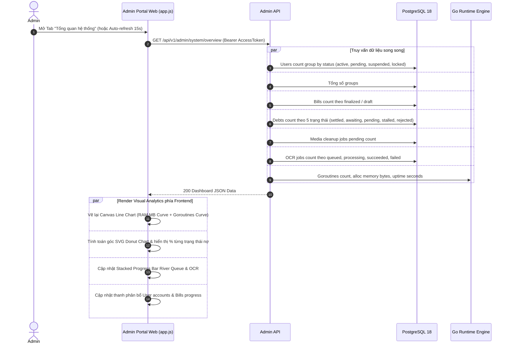
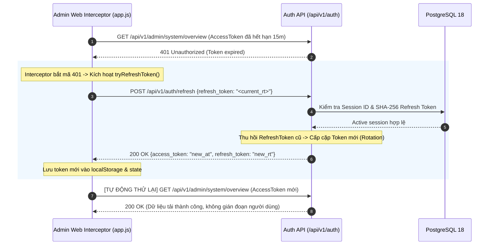
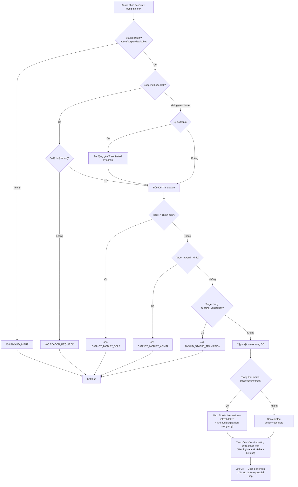

# 06 — Admin: Quản trị tài khoản, Thống kê hệ thống & Web Admin Portal

> **Phạm vi**: 
> - Backend module `admin` (`/api/v1/admin`, middleware `liveAuth` + `RequireRole("admin")`).
> - **PaySplit Admin Portal Web App**: Giao diện quản trị nhúng tĩnh qua Go `//go:embed` tại đường dẫn `/admin-portal/` (thiết kế theo phong cách Utilitarian Warm Editorial — Tally x Hallmark).
>
> Code tham chiếu chính: `PaySplit-BE/internal/modules/admin/**`, `PaySplit-BE/web/admin/**`, `PaySplit-BE/cmd/seedadmin/**`.

---

## 1. Tổng quan mô hình

| Khái niệm | Giá trị |
|---|---|
| Phân quyền | Mọi endpoint yêu cầu JWT hợp lệ **và** `role = 'admin'`; fail → `403 INSUFFICIENT_PERMISSIONS` |
| Trạng thái tài khoản | `pending_verification`, `active`, `suspended`, `locked` |
| Audit | Mọi thay đổi trạng thái ghi `admin_audit_logs` (enum action: `suspend` / `lock` / `reactivate`, reason **NOT NULL**) |
| Nguyên tắc an toàn | Anti-TOCTOU: các check tự-sửa / khóa-admin được thực hiện **bên trong transaction**, không phải trước đó |
| Che giấu dữ liệu nhạy cảm | Số tài khoản ngân hàng luôn **mask** chỉ hiện 4 số cuối |
| Giao diện Web Admin | Nhúng trực tiếp trong Go Binary qua `web/web.go` (`embed.FS`), truy cập tại `/admin-portal/` |
| Tự động xoay vòng Token | Frontend Admin tự động bắt `401 Unauthorized` và gọi `POST /api/v1/auth/refresh` để duy trì phiên làm việc |

---

## 2. Danh mục Endpoints & Web Admin Portal

### 2.1 Backend REST Endpoints

| Method + Path | Chức năng |
|---|---|
| GET `/admin/accounts` | Danh sách tài khoản — search (email/name/phone), filter status/role, sort whitelist (`created_at`/`display_name`/`email` asc/desc), page/limit clamp ≤100, offset + total pages |
| GET `/admin/accounts/{id}` | Chi tiết: SafeUser + `failed_login_count`, `login_blocked_until`, bank snapshot đã mask, số session active, danh sách nhóm, financials (nợ/công outstanding), audit logs gần đây |
| PUT `/admin/accounts/{id}/status` | Đổi trạng thái active/suspended/locked |
| GET `/admin/system/overview` | Thống kê toàn hệ thống (Users, Groups, Bills, Debts, Jobs, Runtime) |
| GET `/health`, `/health/live`, `/health/ready` | Probes kiểm tra liveness và readiness (PostgreSQL pool) |
| GET `/metrics` | Prometheus Metrics text exposition |

### 2.2 Các Tab Màn Hình trên Web Admin Portal (`/admin-portal/`)

```text
Admin Portal
├── Màn hình Đăng nhập (Sign-in form an toàn, kết nối API Config linh hoạt)
├── Tab 1: Tổng Quan Hệ Thống (System Overview)
│   ├── Metric Cards: Users, Groups, Bills, Debts, Jobs
│   ├── Biểu đồ Live Canvas: RAM tiêu thụ (MB) & Goroutines theo thời gian thực
│   ├── Biểu đồ SVG Donut: Ma trận quyết toán công nợ (Settled, Awaiting, Pending, Stalled, Rejected)
│   ├── Thanh Stacked Progress: Tỷ lệ hoàn tất River Queue & OCR Jobs
│   ├── Thanh Phân bổ: Trạng thái Người dùng & Tiến độ Hóa đơn
│   └── Go Runtime & Server Health: Uptime, Memory, Auto-refresh timer (15s)
├── Tab 2: Quản Lý Người Dùng & Tài Khoản (Accounts Management)
│   ├── Summary Pills: Đếm số lượng Hoạt động / Chờ duyệt / Đình chỉ / Đã khóa
│   ├── Bộ lọc & Tìm kiếm: Theo từ khóa, trạng thái, vai trò, sắp xếp
│   ├── Bảng dữ liệu người dùng & Phân trang: limit 10/20/50/100
│   ├── Modal Chi tiết Tài khoản (AC-2): Hero Net Balance card, Masked VietQR Bank tile, Danh sách nhóm, Audit logs
│   └── Modal Đổi Trạng thái (AC-3, AC-4): Nhập lý do bắt buộc, Cảnh báo nghĩa vụ tài chính chưa hoàn tất
└── Tab 3: Giám Sát Hạ Tầng & Probes (Monitoring & Infrastructure)
    ├── Ma trận 4 Dịch vụ Cốt lõi: PostgreSQL Pool, River Workers, FCM Hub, Gmail SMTP
    ├── Bộ Test Probe Thời gian thực: Đo độ trễ mili-giây (ms) & hiển thị JSON
    └── Liên kết xem trực tiếp Prometheus Metrics (/metrics)
```

---

## 3. Sequence Diagrams

### 3.1 Suspend / Lock tài khoản (thu hồi phiên + audit)

```mermaid
sequenceDiagram
    autonumber
    actor A as Admin
    participant FE as Admin Portal Web (app.js)
    participant BE as Admin API (Go)
    participant DB as PostgreSQL 18

    A->>FE: Chọn User -> Bấm "Đổi TT" -> Chọn Suspended/Locked + Nhập lý do
    FE->>BE: PUT /api/v1/admin/accounts/{id}/status {status: "suspended", reason: "..."}
    BE->>BE: Validate status enum; suspend/lock -> reason BẮT BUỘC
    
    rect rgb(240, 240, 245)
        Note over DB: MỘT transaction — anti-TOCTOU: mọi check bên trong tx
        BE->>DB: SELECT target FOR UPDATE
        alt Target là CHÍNH admin đang gọi
            BE-->>FE: 400 CANNOT_MODIFY_SELF
        else Target là admin KHÁC
            BE-->>FE: 403 CANNOT_MODIFY_ADMIN
        else Target đang pending_verification
            Note over BE: Không cho chuyển trạng thái qua API này<br/>(phải qua luồng verify email)
            BE-->>FE: 409 INVALID_STATUS_TRANSITION
        else Hợp lệ
            BE->>DB: users.status = suspended/locked
            BE->>DB: THU HỒI toàn bộ sessions + refresh tokens<br/>(reason: admin_suspended / admin_locked)
            BE->>DB: INSERT admin_audit_logs {action, reason NOT NULL}
            BE->>DB: Tính WarningMeta: unsettled_debts_count, unsettled_credits_count
        end
    end
    BE-->>FE: 200 {account, warning: {unsettled_debts_count, unsettled_credits_count}}
    FE-->>A: Hiển thị Toast thành công + cảnh báo công nợ tồn đọng (nếu có)
    
    Note over FE,BE: User bị khóa ở request tiếp theo:<br/>liveAuth thấy status ≠ active -> 401/403;<br/>JWT cũ chứa sid đã bị thu hồi tức thì
```

### 3.2 Reactivate (Mở lại tài khoản)



### 3.3 Thống kê hệ thống & Vẽ Biểu đồ Live (System Overview Analytics)



### 3.4 Tự động gia hạn Token phiên làm việc (Auto Token Refresh)



---

## 4. Activity Diagrams

### 4.1 Quy trình ra quyết định đổi trạng thái tài khoản



---

## 5. Bảng Edge Cases & Cơ Chế Xử Lý

| # | Tình huống | Xử lý hệ thống | Mã lỗi | Vị trí code tham chiếu |
|---|---|---|---|---|
| 1 | Admin tự khóa/suspend chính mình | Kiểm tra **bên trong tx** (anti-TOCTOU) — ngăn chặn triệt để race condition từ 2 request song song | `400 CANNOT_MODIFY_SELF` | `admin/repository/postgres/repository.go:251-274` |
| 2 | Admin khóa một admin khác | Chặn — chỉ user thông thường mới được phép thay đổi trạng thái | `403 CANNOT_MODIFY_ADMIN` | như trên |
| 3 | Suspend user chưa verify email | Chặn — trạng thái pending bắt buộc phải hoàn thành kích hoạt OTP | `409 INVALID_STATUS_TRANSITION` | như trên |
| 4 | Suspend/Lock thiếu reason | Từ chối — audit log bắt buộc cột reason NOT NULL và không rỗng | `400 REASON_REQUIRED` | `usecase/service.go:144-173` |
| 5 | Reactivate không nhập reason | Hệ thống tự điền "Reactivated by admin" để bảo đảm toàn vẹn dữ liệu | `200 OK` | `usecase/service.go` |
| 6 | User đang có nợ/công chưa xong bị suspend | Cho phép suspend, nhưng tính toán và trả về `WarningMeta{unsettled_debts_count, unsettled_credits_count}` để admin nắm hệ quả | Warning payload | `repository.go:276-354` |
| 7 | Sort/filter field lạ từ query param | Whitelist sort fields/orders; status/role validate enum; limit clamp ≤100 | `400 INVALID_INPUT` | `usecase/service.go:53-133` |
| 8 | Xem số tài khoản ngân hàng của user | Luôn che (mask) chỉ hiển thị 4 số cuối ở tầng repository | — | `MaskBankAccount` repo:434-441 |
| 9 | Non-admin gọi API admin | Middleware RequireRole chặn trước khi vào usecase | `403 INSUFFICIENT_PERMISSIONS` | `transport/http/middleware/auth.go:94-113` |
| 10 | Access token của user vừa bị suspend còn hạn 15 phút | `liveAuth` kiểm tra session status trong PostgreSQL mỗi request → request kế tiếp bị chặn ngay lập tức | `401 AUTHENTICATION_REQUIRED` | `middleware/auth.go` + `ValidateSession` |
| 11 | Phiên admin web hết hạn token sau 15 phút | `app.js` tự động bắt `401`, gọi `POST /api/v1/auth/refresh`, hoán đổi token mới và thử lại request trong suốt | `200 OK` | `web/admin/app.js` (`tryRefreshToken`) |

---

## 6. Công cụ Khởi tạo Quản trị viên (`cmd/seedadmin`)

Để khởi tạo tài khoản quản trị viên ban đầu một cách an toàn và tự động:
- Lệnh chạy: `go run ./cmd/seedadmin`
- Các biến môi trường hỗ trợ:
  - `ADMIN_SEED_EMAIL`: Email admin (Mặc định: `admin@paysplit.app`)
  - `ADMIN_SEED_PASSWORD`: Mật khẩu admin (Mặc định: `Admin@123456`)
  - `ADMIN_SEED_NAME`: Tên hiển thị (Mặc định: `System Admin`)
  - `ADMIN_SEED_PHONE`: Số điện thoại (Mặc định: `0900000001`)
- Cơ chế an toàn: Tự động kiểm tra nếu tài khoản admin đã tồn tại thì bỏ qua (Idempotent seed).
