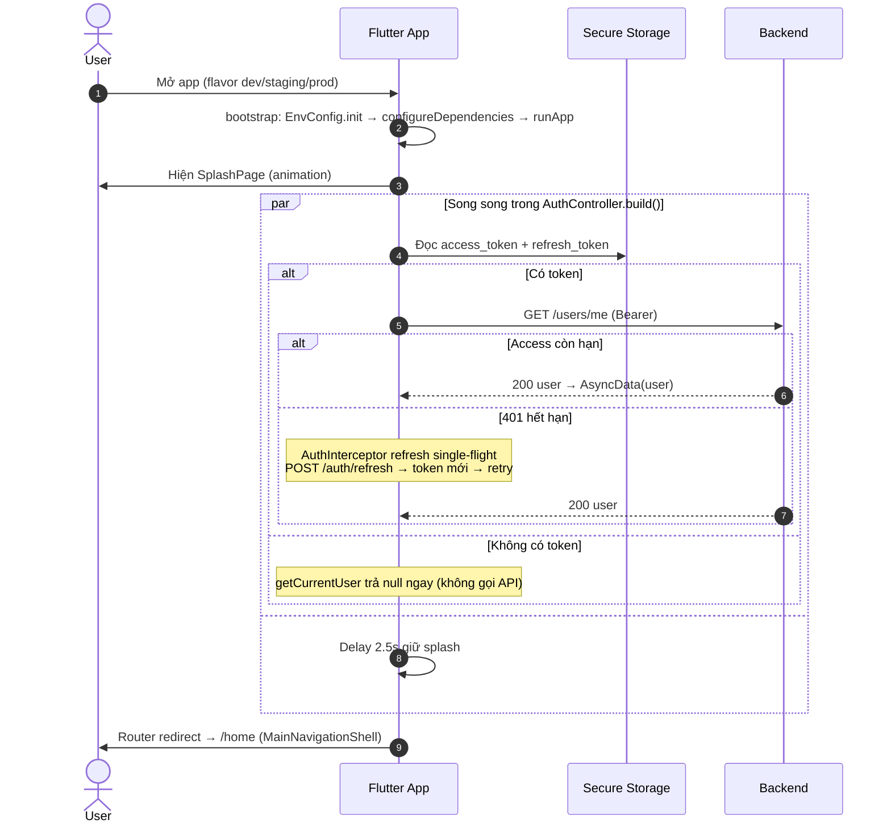
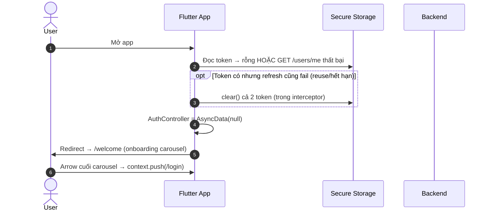
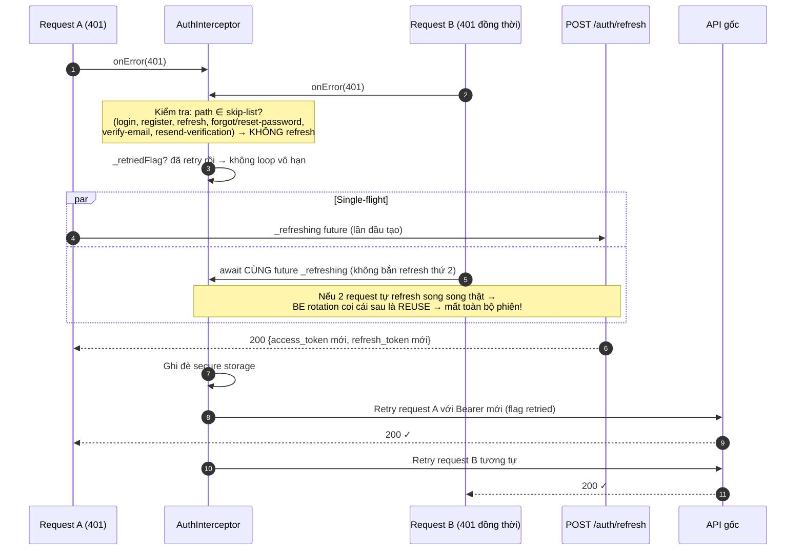
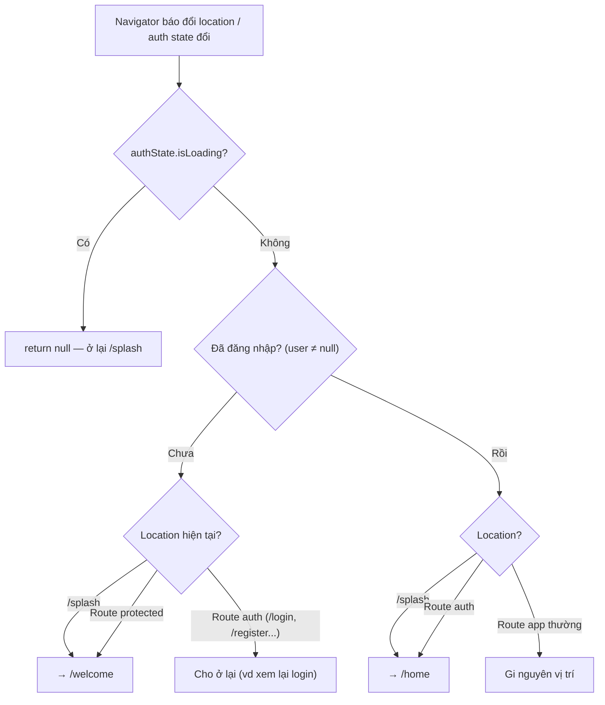
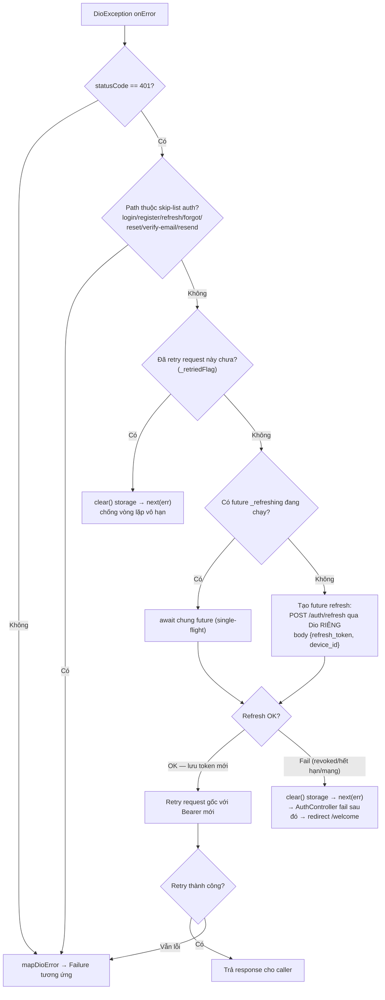

# 07 — App Startup, Routing Guards & Network Layer (FE)

> **Phạm vi**: `bootstrap.dart`, Splash, GoRouter (redirect guards), Dio + `AuthInterceptor`, error mapping — lớp nền quyết định "ai được vào đâu" và "hết token thì sao".
>
> Code tham chiếu chính: `PaySplit-FE/lib/bootstrap.dart`, `lib/app/router/**`, `lib/core/network/**`, `lib/features/splash/**`, `lib/features/auth/presentation/providers/auth_controller.dart`.

---

## 1. Tổng quan

| Thành phần | Vai trò |
|---|---|
| `bootstrap()` | `ensureInitialized` → `EnvConfig.init(flavor, apiBaseUrl)` → `configureDependencies()` (get_it/injectable) → `ProviderScope(App())`. **Không check token ở đây** |
| SplashPage | **Chỉ là animation** (glow/shimmer) — mọi logic điều hướng nằm ở router redirect + `AuthController.build()` |
| `AuthController.build()` | Chạy song song: `GetCurrentUserUseCase` (GET `/users/me` với token trong secure storage) **và** delay 2.5s (giữ splash đủ lâu). Kết quả: `UserEntity?` |
| Global redirect | Quyết định duy nhất điều hướng splash ↔ auth ↔ home |
| `AuthInterceptor` | Gắn Bearer; khi 401 → refresh single-flight → retry 1 lần; fail → clear token |

## 2. Bảng routing & guard

### Path → Page (`app_routes.dart`, `app_router.dart`)

| Path | Page | Vùng |
|---|---|---|
| `/splash` | SplashPage | ngoài shell |
| `/welcome` | WelcomePage | ngoài shell |
| `/login` (extra: resetSuccess) · `/register` · `/verify-otp` (extra: email) · `/forgot-password` · `/reset-password` (extra: email) | Auth pages | ngoài shell |
| `/home` · `/groups` · `/bills`, `/settlement` (extra tab) · `/profile`, `/edit-profile`, `/bank-settings`, `/change-password` | MainNavigationShell (4 branch, giữ state từng tab) | bottom nav |
| `/groups/:groupId` (extra GroupEntity) · `/groups/:groupId/add-members` | GroupDetail / AddMembers | full-screen |
| `/scan-bill` (extra {groupId, groupName}) | BillCapturePage | redirect về `/bills` nếu thiếu groupId |
| `/bill-detail` (extra BillDetailEntity hoặc Map{bill/billId/...}) | BillDetailPage (`autoStartOcr` nếu có photos, không items) | validate extra kỹ |
| `/notifications` | NotificationsPage | full-screen |

### Guard: chỉ MỘT global redirect (không guard riêng theo route con)

| Điều kiện tại thời điểm redirect | Hành động |
|---|---|
| `authState.isLoading` | `return null` — ở lại `/splash` chờ `/users/me` trả lời |
| Chưa auth + đang ở `/splash` | → `/welcome` |
| Chưa auth + route protected bất kỳ | → `/welcome` |
| Đã auth + đang ở `/splash` hoặc route auth | → `/home` |

> Router lắng nghe thay đổi auth qua `_GoRouterRefreshNotifier` → mỗi lần state AuthController đổi, redirect chạy lại.
>
> ⚠️ **Không có deep link/app link**: AndroidManifest chỉ MAIN/LAUNCHER; link mời phải dán tay.

---

## 3. Sequence Diagrams

### 3.1 Cold start — người dùng ĐÃ đăng nhập



### 3.2 Cold start — khách / token chết



### 3.3 Request lifecycle khi gặp 401 giữa phiên (single-flight refresh)



### 3.4 Logout & phiên chết giữa chừng

```mermaid
sequenceDiagram
    autonumber
    actor U as User
    participant FE as ProfilePage / Interceptor
    participant SS as Secure Storage
    participant Router as GoRouter

    alt Logout chủ động
        U->>FE: Dialog xác nhận "Đăng xuất?"
        FE->>SS: clear() access + refresh
        Note over FE: ⚠️ CHƯA gọi POST /auth/sign-out —<br/>session BE còn sống đến hết hạn (khoảng trống)
        FE->>FE: AuthController = AsyncData(null)
        FE-->>Router: refreshListenable kích hoạt
        Router-->>U: Redirect → /welcome
    else Phiên bị revoke (đăng nhập máy khác / admin khóa / reuse detection)
        FE->>FE: Refresh nhận SESSION_REVOKED → clear storage
        Note over FE: KHÔNG force-navigate tức thời từ interceptor;<br/>logout hiển thị khi AuthController build/read tiếp theo fail
        Router-->>U: Redirect → /welcome (ở lần chuyển màn/khởi động kế)
    end
```

## 4. Activity Diagrams

### 4.1 Global redirect logic (GoRouter)



### 4.2 Decision tree của AuthInterceptor



---

## 5. Edge Cases

| # | Tình huống | Xử lý | Vị trí code (tham chiếu) |
|---|---|---|---|
| 1 | Nhiều request 401 đồng thời bắn refresh song song | Single-flight `_refreshing` Future chung — nếu để song song thật, BE reuse-detection sẽ hủy cả phiên | `auth_interceptor.dart:25-30` |
| 2 | Request đến chính endpoint refresh bị 401 | Skip-list `_skipRefreshPaths` — không tự refresh chính nó | `:38-46` |
| 3 | Retry xong vẫn 401 (token vừa cấp đã chết) | Flag `_retried` chặn vòng lặp; clear storage | `:34`, `:66-71` |
| 4 | Refresh trả SESSION_REVOKED (máy khác đăng nhập / admin khóa) | Clear cả 2 token → AuthController fail → router về `/welcome` ở lần build kế | `:77-81` |
| 5 | Logout chủ động nhưng quên gọi sign-out API | Session BE sống đến hết hạn tự nhiên — khoảng trống đã biết | `auth_repository_impl.dart:216-219` |
| 6 | Mất mạng lúc mở app (splash treo?) | `/users/me` connectionTimeout 90s → map `NetworkFailure`; AuthController resolve null/user-lỗi → vẫn thoát splash về welcome/home tương ứng; Home providers swallow lỗi → empty state thân thiện | `dio_failure_mapper.dart:59-111` |
| 7 | Server trả 2xx nhưng body sai shape | `ApiResponse<T>` parse khoan dung: thiếu key `success` coi nguyên body là data; sai hẳn → `invalidResponseFailure` | `api_response.dart:14-37` |
| 8 | Timeout 90s quá dài với UX? | Cả connect/send/receive đều 90s (config chung); lỗi timeout map `NetworkFailure` message tiếng Việt | `dio_client.dart:12-30` |
| 9 | `NetworkInfo` (connectivity) đã DI nhưng không ai dùng | Offline detection thực tế dựa trên `DioException.connectionError` | khoảng trống đã biết |
| 10 | Route `/bill-detail` thiếu/giá trị extra sai kiểu | Validate kỹ từng trường hợp extra; fallback an toàn thay vì crash | `app_router.dart:232-293` |
| 11 | Route `/scan-bill` thiếu groupId | Redirect về `/bills` | `:215-222` |
| 12 | GroupDetail thiếu extra GroupEntity | Fallback group placeholder "Đang tải..." | `:187-212` |
| 13 | Đổi tab bottom nav | StatefulShellRoute giữ Stack + AnimatedOpacity từng branch → không rebuild/mất state tab cũ | `main_navigation_shell.dart` |
| 14 | PrettyDioLogger in token ở production | Logger tắt khi `EnvConfig.isProduction` | env_config |
| 15 | Device ID cần cho sign-in/refresh | `getOrCreateDeviceId()` UUIDv4 lưu secure storage lần đầu | `token_storage.dart:18-26` |
| 16 | Flavor sai API_BASE_URL | dart-define `API_BASE_URL`, default `http://localhost:8080/api/v1`; staging thường truyền `http://<IP-LAN>:8080` | main_*.dart |
