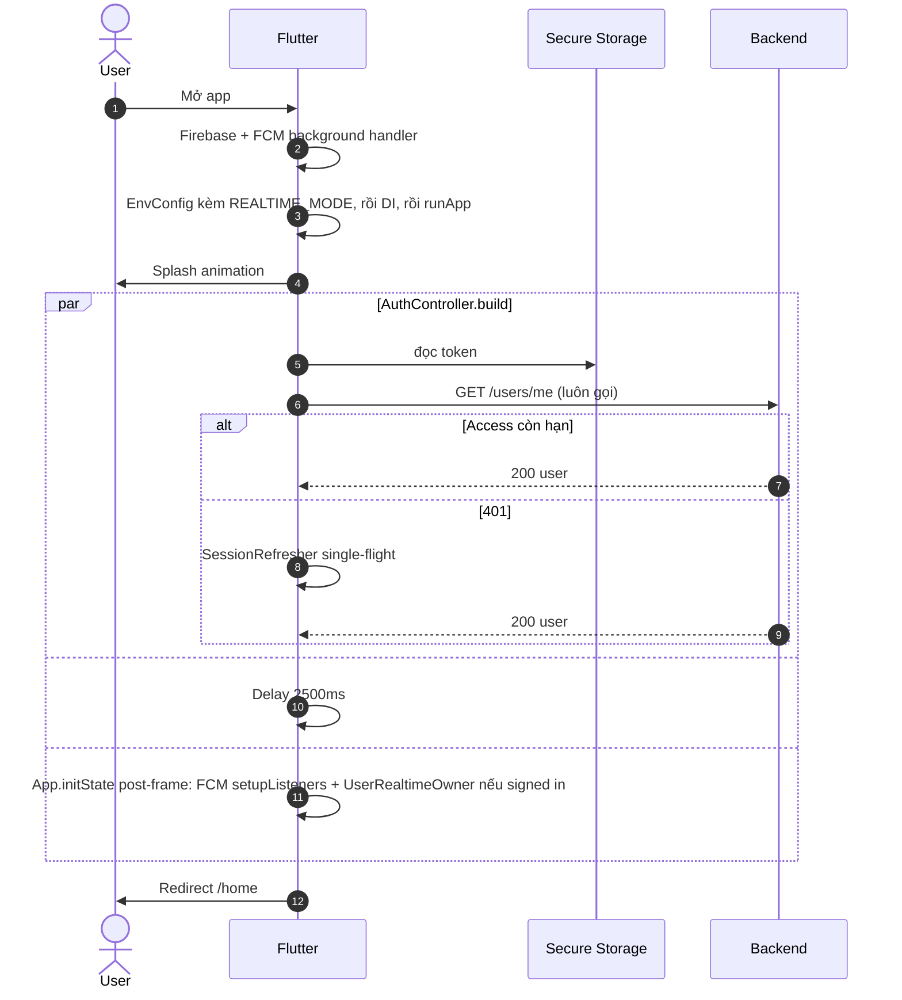
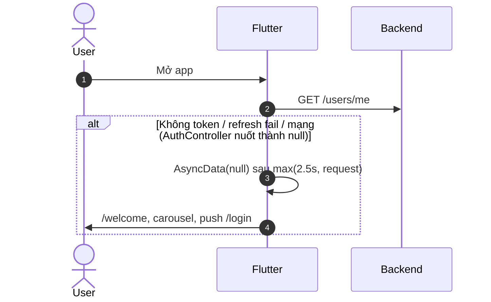
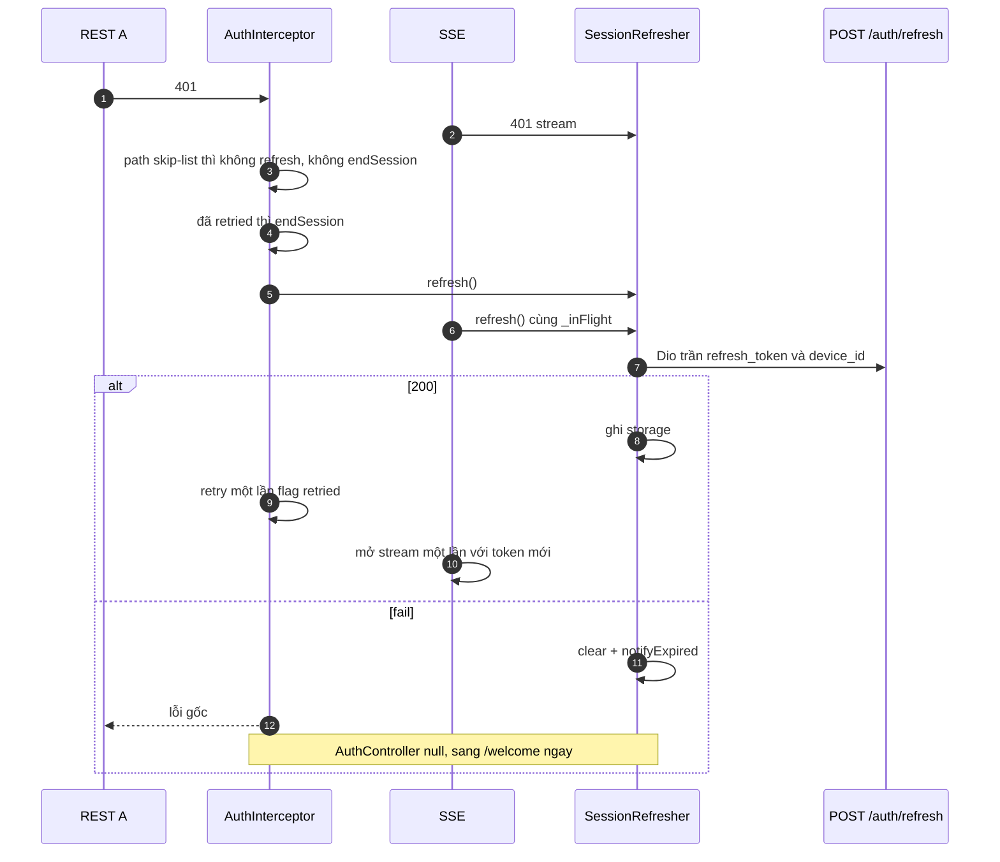
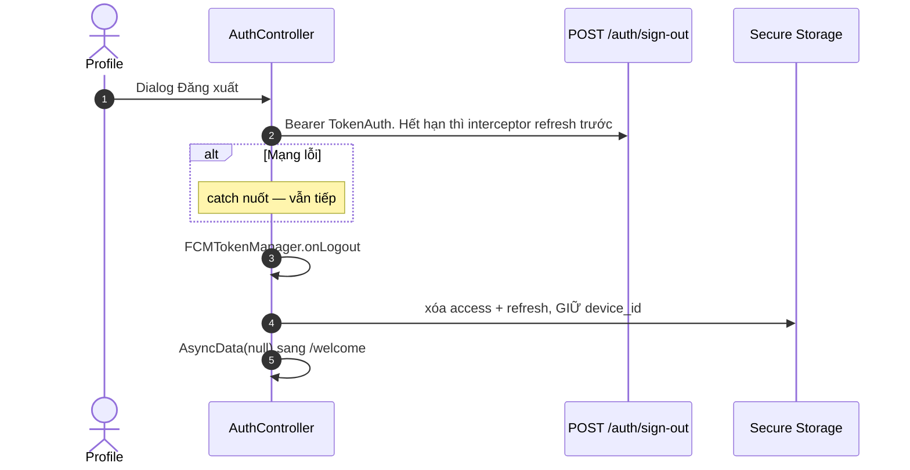
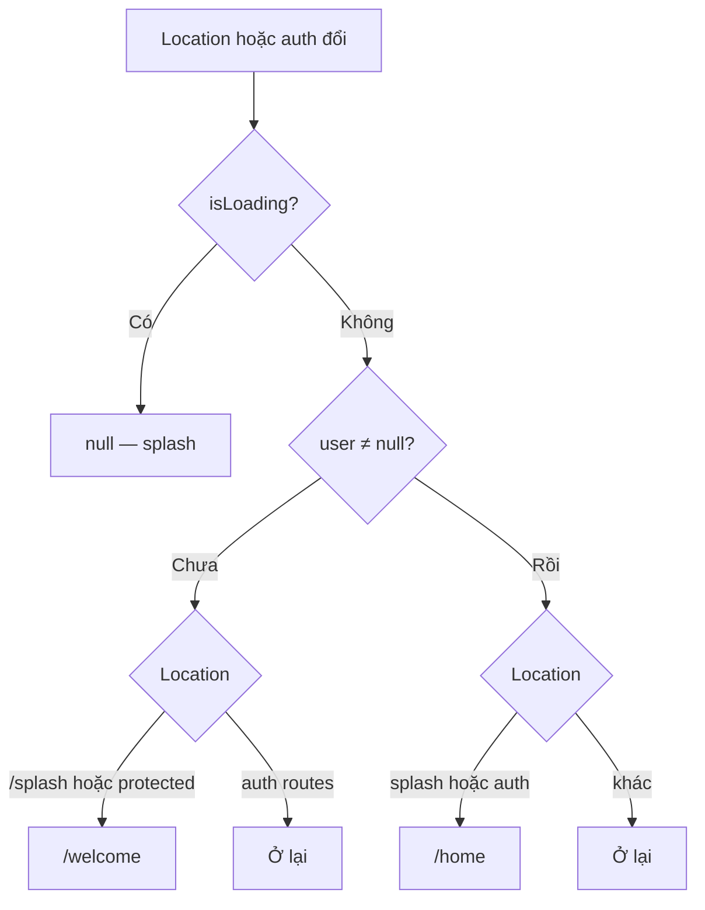
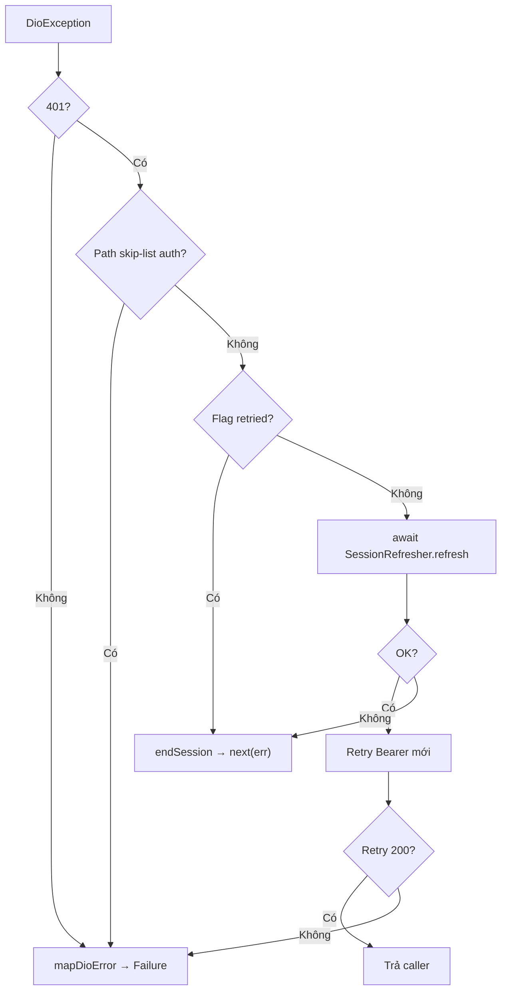

# 07 — Khởi động app: ai được vào đâu, và 401 đi chung một cửa refresh

> **Phạm vi**: `bootstrap.dart`, Splash, GoRouter redirect, Dio + `AuthInterceptor` + `SessionRefresher`, map lỗi — lớp nền của mọi màn hình.
>
> Code tham chiếu chính: `PaySplit-FE/lib/bootstrap.dart`, `lib/app/router/**`, `lib/app/app.dart`, `lib/core/network/**`, `lib/features/splash/**`, `lib/features/auth/presentation/providers/auth_controller.dart`.
>
> Đọc cùng: [`01-auth.md`](01-auth.md) mục 5.3 (rotation), [`08-realtime.md`](08-realtime.md) mục 5.5 (SSE dùng cùng refresher), [`05-notification.md`](05-notification.md) (Firebase trước EnvConfig).

---

## 1. Vấn đề, và ý tưởng để giải quyết

### 1.1 Splash không được chứa điều hướng

Animation 2.5 giây và "đã có user chưa" là hai việc. Nhét redirect vào SplashPage thì mỗi flavor, mỗi deep link sau này phải copy. 

> Splash **chỉ vẽ**. `AuthController.build()` hỏi `/users/me` **song song** với delay 2500ms. GoRouter **một** hàm redirect nghe `authState`. Hết.

### 1.2 Mọi 401 phải đi một cửa

Interceptor REST và SSE cùng hết hạn cùng lúc. Hai lần `POST /auth/refresh` = reuse detection = mất phiên. Xem [`01-auth.md`](01-auth.md).

> Một `@lazySingleton SessionRefresher` với `_inFlight`. Interceptor **không** còn field `_refreshing`. SSE gọi cùng `refresh()`. Fail → `endSession()` → `SessionEvents.notifyExpired` → `AuthController = null` → redirect `/welcome` **ngay**, không chờ lần build sau.

### 1.3 Không có token vẫn gọi `/users/me`

`getCurrentUser` **không** short-circuit. Storage trống → request không Bearer → 401 → refresh fail (không có refresh) → `endSession` → user null. Một đường, không nhánh "nếu trống thì skip".

---

## 2. Bảng tổng quan

| Thành phần | Việc |
|---|---|
| `bootstrap()` | Binding → (dev/staging) TLS override → **Firebase + background FCM** → `EnvConfig.init(flavor, apiBaseUrl, appName, realtimeMode)` → GetIt → `ProviderScope` (override `realtimeSignedInProvider`) |
| SplashPage | Animation glow/shimmer. **Không** check token, **không** `context.go` |
| `AuthController.build()` | Subscribe `SessionEvents.onExpired`; `Future.wait([GetCurrentUser, delay 2500])`; **mọi** failure → `null` (Welcome), không kẹt splash |
| Redirect | Một hàm. `isLoading` → ở lại (thường `/splash`) |
| `AuthInterceptor` | Gắn Bearer; 401 → `SessionRefresher.refresh()`; flag retried một lần |
| `SessionRefresher` | Dio trần, body `{refresh_token, device_id}` path `/auth/refresh` |
| Timeout Dio | Connect/send/receive **90s** |
| Logger | `PrettyDioLogger` khi **không** production |
| `NetworkInfo` | Có trong GetIt, **không feature nào gọi**. Offline = `DioException.connectionError` / timeout |
| Device id | UUIDv4 secure storage, **sống sót** `clear()` (chỉ xóa access/refresh) |
| Logout | `POST /auth/sign-out` (nuốt lỗi) → FCM `onLogout` → `clear()` |
| Deep link | **Chưa có**. Manifest chỉ LAUNCHER |

---

## 3. Flavor và URL

| Entry | API mặc định | REALTIME_MODE |
|---|---|---|
| `main.dart` / development | `http://localhost:8080/api/v1` | dart-define `auto` |
| staging / production | `https://paysplitbe.vercel.app/api/v1` | `auto` |

Override: `--dart-define=API_BASE_URL=...` và `REALTIME_MODE=legacy|user`. Staging LAN thường `http://<IP>:8080/api/v1`.

Dev/staging: `_DevHttpOverrides` chấp nhận chứng chỉ xấu (máy local). Production không.

---

## 4. Routing

### Path

| Path | Page | Vùng |
|---|---|---|
| `/splash` | SplashPage | ngoài shell |
| `/welcome` `/login` `/register` `/verify-otp` `/forgot-password` `/reset-password` | Auth | ngoài shell |
| `/home` `/groups` `/bills` `/settlement` `/profile`… | MainNavigationShell 4 nhánh, giữ state | bottom nav |
| `/groups/:groupId` | GroupDetail. Extra `GroupDetailRouteArgs` **hoặc** `GroupEntity`. Thiếu → tên `'Chi tiết nhóm'`, lastActivity `'Đang tải thông tin...'` | full-screen |
| `/groups/:groupId/add-members` | AddMembers | |
| `/scan-group-qr` | ScanQrJoinPage | **không có trong tài liệu cũ** |
| `/scan-bill` | BillCapture. Thiếu `groupId` → `/bills` | |
| `/bill-detail` | Extra entity hoặc Map; sai → `/bills` | |
| `/notifications` | NotificationsPage | full-screen |

`/bills` và `/settlement` **cùng** `SettlementPage`, extra tab khác nhau.

### Guard — chỉ một redirect

| Điều kiện | Hành động |
|---|---|
| `authState.isLoading` | `null` — ở lại, thường splash |
| Chưa auth + `/splash` hoặc route protected | `/welcome` |
| Chưa auth + route auth | ở lại |
| Đã auth + splash hoặc route auth | `/home` |
| Đã auth + chỗ khác | ở lại |

Route auth: welcome, login, register, verify-otp, forgot-password, reset-password.

`_GoRouterRefreshNotifier` lắng `AuthController`. `endSession` set `AsyncData(null)` → redirect chạy ngay.

---

## 5. Sequence Diagrams

### 5.1 Cold start đã từng đăng nhập

Cách đọc:

Mở app: `ensureInitialized` → (dev/staging) chấp nhận TLS tự ký → **Firebase + FCM background handler** → `EnvConfig` (flavor, URL, `REALTIME_MODE`) → GetIt → `runApp`. Splash **chỉ animation**, không `context.go`.

`AuthController.build` làm ba việc song song trong `Future.wait` / `par`:
1. **Luôn** `GET /users/me`. Không short-circuit khi storage trống. Trống → request không Bearer → 401 → refresh fail → user null.
2. Delay **2500 ms** giữ splash đủ lâu, kể cả `/users/me` về sớm.
3. `App.initState` post-frame: FCM `setupListeners` + realtime owner nếu đã signed in. Không đợi splash xong.

Access còn hạn: 200 user. Hết hạn: `SessionRefresher` xoay rồi retry, user vẫn vào. Cả hai xong → redirect `/home`. `/users/me` chậm hơn 2.5s thì splash dài hơn.

`Future.wait` đợi **cả hai**. User về sớm vẫn đứng splash đủ 2.5s. `/users/me` chậm hơn 2.5s thì splash dài hơn.

### 5.2 Cold start khách / token chết

Cách đọc:

Cùng bootstrap, nhưng `/users/me` fail (không token, refresh fail, mạng, 500). `AuthController` **nuốt mọi lỗi thành `null`**, chủ đích không kẹt splash. Giá: 500 lúc cold start cũng đẩy Welcome dù token còn tốt.

Timeout Dio 90 giây. Mất mạng lúc mở: splash có thể đứng ~90s rồi Welcome. Không hang vô hạn, cũng không vào Home khi chưa auth.

Welcome là carousel 3 slide, mũi tên cuối `push /login`. Không deep link. Token chết đã bị interceptor `clear()` trong lúc refresh fail.

Mất mạng lúc mở: timeout 90s. Splash có thể đứng ~90s rồi Welcome (vì failure → null). Home về sau không: chưa auth. Đó là trade-off đã biết.

### 5.3 401 giữa phiên

Cách đọc:

Giữa phiên, access hết hạn. Request REST A và stream SSE cùng 401.

Skip-list (login, register, refresh, forgot, reset, verify, resend): **không** refresh, **không** `endSession` — 401 ở đó là sai mật khẩu / OTP, không phải hết hạn. Đã gắn cờ `retried` mà vẫn 401: `endSession`, chống vòng lặp.

Còn lại: `SessionRefresher.refresh()`. REST và SSE await **cùng** `_inFlight`. Dio trần, không interceptor, body `refresh_token` + `device_id`. Thành công: ghi storage, REST retry một lần, SSE mở stream một lần. Fail: `clear` + `notifyExpired` → AuthController `null` **ngay** → redirect Welcome, không chờ lần build sau.

Vì sao chung một cửa: xem [`01-auth.md`](01-auth.md) mục 5.3 (reuse detection).

Skip-list (path **thật**): `/auth/sign-in`, sign-up/register, `/auth/refresh`, forgot, reset, verify-email, resend. **Không** có `/auth/login` hay `/auth/refresh-token`. **Không** có sign-out: logout lúc access hết hạn sẽ refresh rồi mới sign-out.

### 5.4 Logout chủ động

Cách đọc:

User xác nhận dialog. App gọi `POST /auth/sign-out` (TokenAuth: chỉ cần JWT còn chữ ký, không cần session sống). Access hết hạn lúc bấm: interceptor **refresh trước** rồi mới sign-out (`sign-out` không nằm skip-list).

Lỗi mạng bị `catch` nuốt: vẫn tiếp tục dọn local, không kẹt nút Đăng xuất. Rồi `FCMTokenManager.onLogout` (hủy sub, xóa token FCM máy), `clear()` access + refresh, **giữ** `device_id` (lần login/refresh sau vẫn cùng máy). `AsyncData(null)` → Welcome.

Máy bị đá / admin khóa không đi Profile: interceptor refresh fail → cùng `endSession`. Tài liệu cũ "logout không gọi API" đã sai.

Khác máy bị đá / admin khóa: không đi Profile. Interceptor refresh fail → cùng `endSession`.

---

## 6. Activity Diagrams

### 6.1 Redirect

Cách đọc:

**Một** hàm `redirect` trong `app_router.dart`, không guard từng route con. Chạy lại mỗi khi `AuthController` đổi (`refreshListenable`).

`isLoading` (đang `Future.wait` splash): `return null` = ở nguyên, thường `/splash`. Chưa xong mà đẩy Welcome/Home sẽ nháy màn.

Chưa đăng nhập (`user == null`): đang splash hoặc đang vào route protected (home, groups, bill...) → `/welcome`. Đang đứng sẵn `/login` `/register`... thì **ở lại** (xem form, không đá về welcome).

Đã đăng nhập: còn đứng splash hoặc form auth → `/home`. Đang ở `/groups/xyz` thì **ở lại**, không kéo về home mỗi lần rebuild.

Route auth gồm welcome, login, register, verify-otp, forgot, reset. `/scan-group-qr` là protected.

### 6.2 Interceptor

Cách đọc:

Mọi `DioException` vào đây. Không phải 401 → `mapDioError` (timeout/connection → `NetworkFailure`, 5xx → `ServerFailure`, ...).

401: path thuộc skip-list auth → coi như lỗi nghiệp vụ, **không** xóa phiên. Không skip: đã retry request này chưa? Rồi → `endSession` (token mới cấp đã chết, đừng lặp). Chưa → `await SessionRefresher.refresh()`. OK thì gắn Bearer mới, retry. Fail thì `endSession`. Retry xong vẫn lỗi khác 401 thì lại `mapDioError`.

`endSession` xóa token + `SessionEvents` → AuthController null → redirect Welcome **ngay**.

---

## 7. Map lỗi mạng

| Tín hiệu | Failure | Message hướng user |
|---|---|---|
| `connectionError` / timeout | `NetworkFailure` | Không thể kết nối tới máy chủ |
| 5xx | `ServerFailure` | |
| 2xx sai shape | `invalidResponseFailure` | `ApiResponse` khoan dung: thiếu `success` thì coi cả body là data |
| 401 sau refresh | session hết → Welcome | |
| `RATE_LIMITED` | parse `Retry-After` vào message | LoginPage **bỏ qua**, khóa 900s — [`01`](01-auth.md) |

Envelope chuẩn: [`README.md`](README.md).

---

## 8. Realtime lúc khởi động

`realtimeSignedInProvider` override = `authController != null`. `UserRealtimeOwner` không mở stream khi signed out, khi app nền, khi `REALTIME_MODE=legacy`. Chi tiết vòng đời: [`08-realtime.md`](08-realtime.md) mục 8.

FCM listeners đăng ký post-frame **song song** splash — có thể PUT token trước khi `/users/me` xong nếu storage còn access. Manager bỏ sync khi chưa có access.

---

## 9. Edge Cases

| # | Tình huống | Xử lý | Chỗ |
|---|---|---|---|
| 1 | Nhiều 401 cùng lúc | Một `_inFlight` | `session_refresher.dart` |
| 2 | 401 đúng endpoint refresh | Skip-list | không tự refresh mình |
| 3 | Retry vẫn 401 | `endSession` | flag retried |
| 4 | `SESSION_REVOKED` / mọi refresh fail | `endSession` ngay | không đợi màn sau |
| 5 | Logout mạng chết | Vẫn clear local + FCM | `auth_repository_impl.dart` |
| 6 | Mất mạng lúc splash | Failure → null → Welcome sau timeout 90s | có thể đứng splash lâu |
| 7 | Body 2xx lệch | Parse khoan dung / `invalidResponseFailure` | `api_response.dart` |
| 8 | Timeout 90s | Chung connect/send/receive | `dio_client.dart` |
| 9 | `NetworkInfo` không ai dùng | Offline = Dio | khoảng trống đã biết |
| 10 | `/bill-detail` extra sai | `/bills` | `app_router.dart` |
| 11 | `/scan-bill` thiếu groupId | `/bills` | |
| 12 | GroupDetail thiếu extra | Placeholder copy mới (không còn "Đang tải...") | |
| 13 | Đổi tab bottom nav | StatefulShell giữ state | `main_navigation_shell.dart` |
| 14 | Logger token production | Tắt PrettyDioLogger | `EnvConfig.isProduction` |
| 15 | Device id | Tạo một lần, giữ lúc logout | refresh/sign-in cần |
| 16 | Flavor sai URL | dart-define | |
| 17 | SSE 401 | Cùng refresher, thử stream đúng một lần | [`08`](08-realtime.md) |
| 18 | `/scan-group-qr` | Route thật, không deep link OS | |

---

## 10. Ghi chú triển khai đáng chú ý

1. **`yield*` trong SSE không bắt 401.** Vòng retry phải `await for` trong `while`. Chi tiết [`08-realtime.md`](08-realtime.md) ghi chú 8.

2. **`clear()` không xóa `device_id`.** Đúng: refresh/sign-in sau logout vẫn cùng máy. Xóa nhầm = mọi refresh `INVALID_OR_EXPIRED_TOKEN`.

3. **Sign-out không skip interceptor.** Access chết lúc bấm Đăng xuất → refresh (session còn) rồi sign-out. Session đã chết → refresh fail → `endSession` — vẫn về Welcome, sign-out BE có thể chưa gọi. TokenAuth lẽ ra nhận JWT hết hạn? JWT hết `exp` thì Verify fail trước handler — nên refresh trước là hữu ích khi session còn.

4. **AuthController nuốt mọi lỗi `/users/me` thành null.** 500 lúc cold start = user bị đẩy Welcome dù token tốt. Có chủ đích "không kẹt splash", giá là false logout.

5. **Firebase trước EnvConfig.** Background isolate không đọc flavor. Sai order = FCM cold start mất.

6. **Không mở realtime trước khi signed in provider true.** Override ở `runApp` bám AuthController.

7. **Portal không dùng stack này.** `app.js` tự refresh (đang thiếu device_id). Đừng "thống nhất" bằng cách copy interceptor Dart sang JS mà quên body.

---

## 11. Trạng thái hiện tại

| Hạng mục | Trạng thái | Ghi chú |
|---|---|---|
| Splash + redirect + single-flight refresh | ✅ | Shared với SSE |
| Logout gọi sign-out | ✅ | Nuốt lỗi mạng |
| Deep link | ⏸ | Dán tay / QR |
| NetworkInfo | ⏸ Đăng ký không dùng | |
| Splash 90s khi offline | ⚠️ Đã biết | Failure → Welcome, không hang vô hạn |
