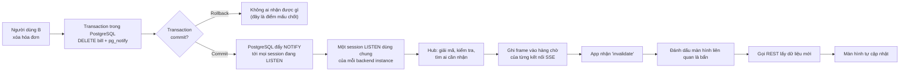
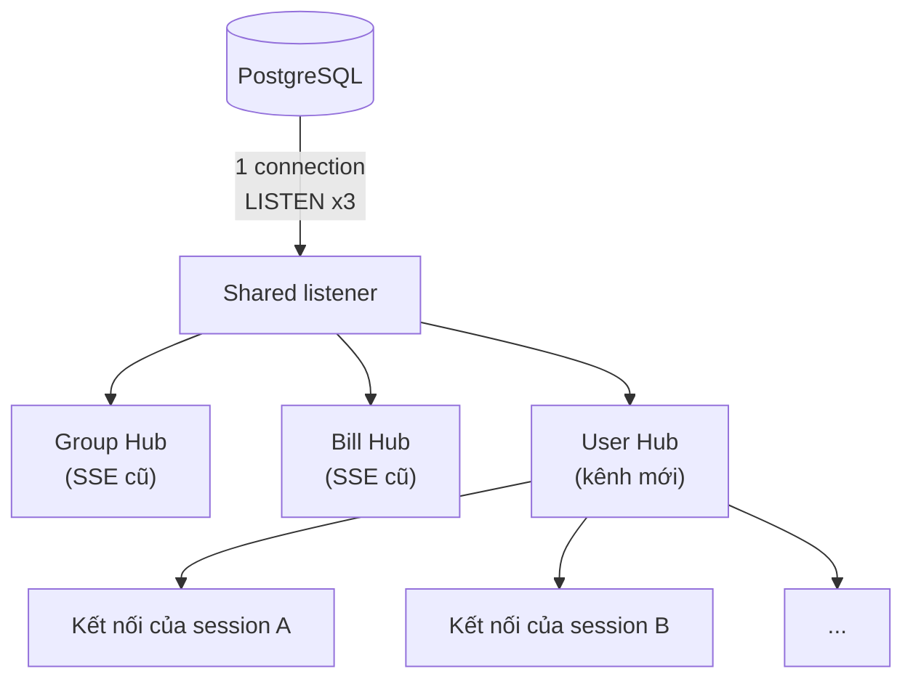
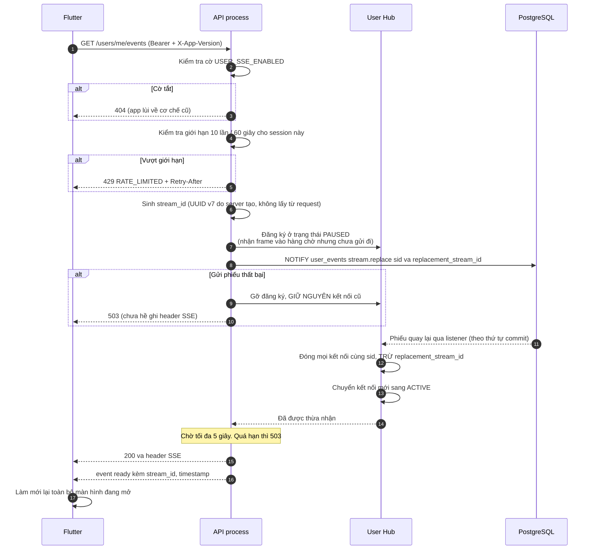
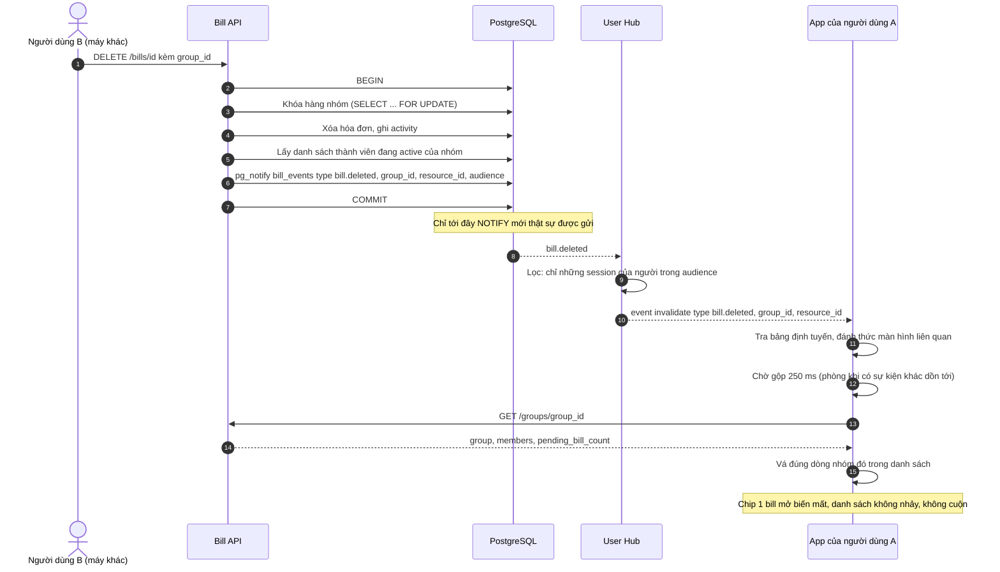
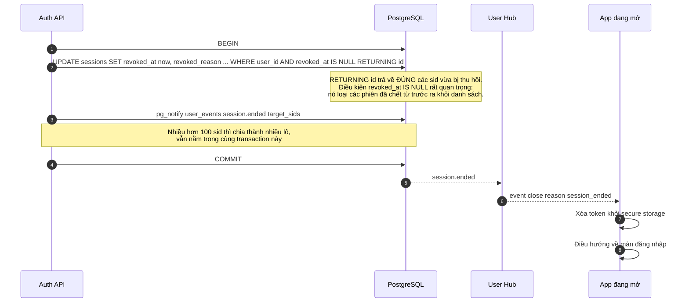
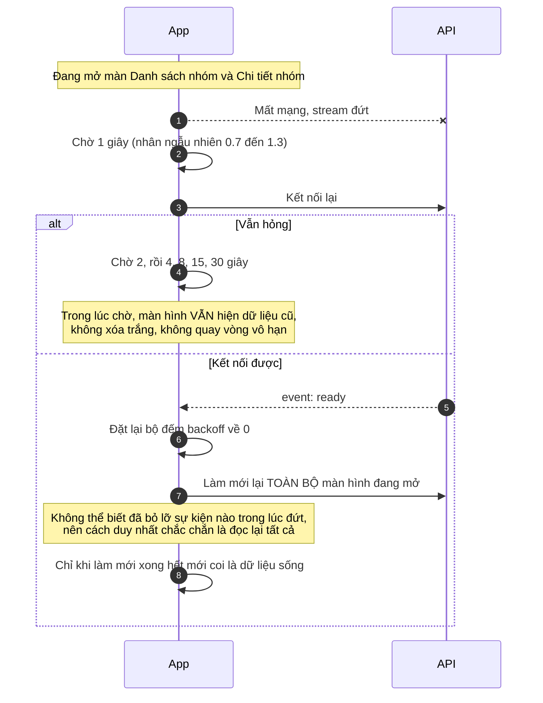
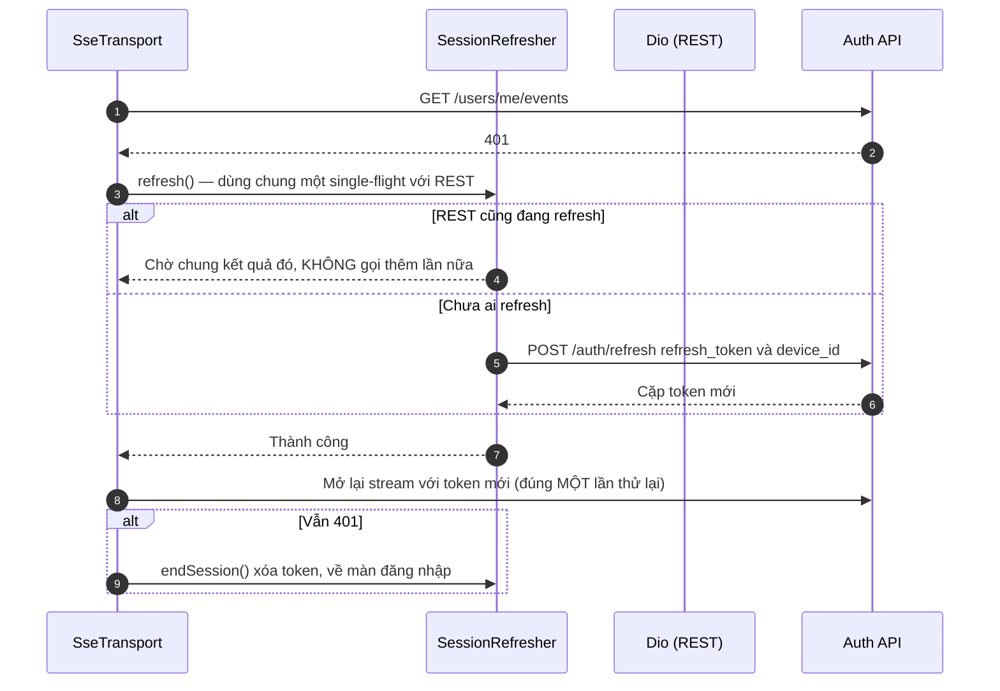
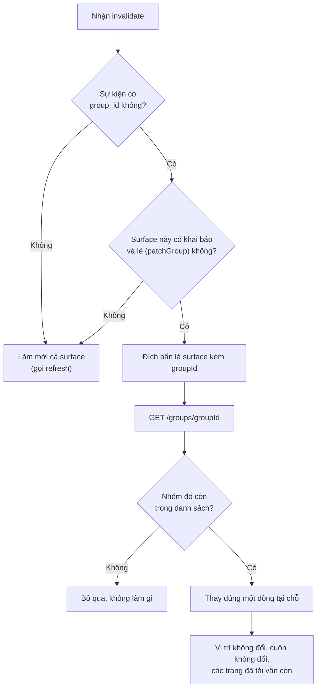

# 08 — Realtime: một kênh sự kiện duy nhất cho cả app

> Đối chiếu mã nguồn local ngày **06/09/2026** — BE `7f2b2a7`, FE `fb0cf0b`. [Phạm vi, bằng chứng và kiểm chứng](reports/2026-09-06-flow-sync.md). Các ghi chú AC/runtime cũ không có nghĩa đã chạy lại E2E trong lần này.

> **Phạm vi**: BE `GET /api/v1/users/me/events` + ba kênh PostgreSQL `LISTEN/NOTIFY` ↔ FE toàn bộ màn hình có dữ liệu sống (Trang chủ, Danh sách nhóm, Chi tiết nhóm, Chi tiết hóa đơn, Chờ OCR, Thanh toán).
>
> Code tham chiếu chính: `PaySplit-BE/internal/platform/realtime/**`, `PaySplit-BE/internal/platform/database/notification_listener.go`, `PaySplit-BE/internal/modules/auth/delivery/http/sse_hub.go` + `sse_handler.go`, `PaySplit-FE/lib/core/realtime/**`.
>
> Spec gốc: [`0009-group-realtime-sync-v1`](../PaySplit-BE/docs/specs/0009-group-realtime-sync-v1/index.md) (AC-13 đến AC-23), nối tiếp [`0010-connection-efficient-events`](../PaySplit-BE/docs/specs/0010-connection-efficient-events/index.md).

---

## 1. Vấn đề, và ý tưởng để giải quyết

### 1.1 Cách làm cũ tốn kết nối

Trước đây mỗi màn hình cần dữ liệu sống thì **tự mở một kết nối SSE riêng**: mở chi tiết nhóm thì một kết nối, mở chi tiết hóa đơn thì thêm một kết nối nữa. Một người dùng mở ba màn hình trên hai thiết bị là sáu kết nối. Một trăm người đang dùng app là vài trăm kết nối, mỗi kết nối chiếm một chỗ trong pool của PostgreSQL.

### 1.2 Cách làm mới: một người, một kết nối

Bây giờ mỗi **lần đăng nhập** (mỗi session) chỉ có **đúng một** kết nối SSE tới `GET /api/v1/users/me/events`. Người dùng mở bao nhiêu màn hình cũng không thêm kết nối nào.

Đổi lại, server phải biết "sự kiện này thì màn hình nào cần quan tâm". Đó là việc của **sổ đăng ký mối quan tâm** (interest registry) phía Flutter, mô tả ở mục 6.

### 1.3 Nguyên tắc quan trọng nhất: sự kiện chỉ báo tin, không chở dữ liệu

Đây là chỗ dễ hiểu nhầm nhất, nên nói thẳng:

> Server **không** gửi dữ liệu mới qua kênh realtime. Server chỉ gửi một mẩu tin rất ngắn kiểu "hóa đơn X trong nhóm Y vừa bị xóa". App nhận tin đó rồi **tự gọi REST API** để lấy dữ liệu mới.

Gọi là **invalidation nhỏ** (small invalidation). Lợi ích:

| Lý do | Giải thích |
|---|---|
| Không lộ dữ liệu nhầm người | Kênh chỉ chở id và loại sự kiện. Kể cả gửi nhầm địa chỉ thì người nhận cũng không đọc được gì, vì muốn xem nội dung vẫn phải gọi REST và vẫn bị kiểm tra quyền |
| Không cần đồng bộ hai đường | Nếu bơm dữ liệu qua kênh realtime thì sẽ có hai nguồn sự thật (REST và SSE) và chúng sẽ lệch nhau. Ở đây REST luôn là nguồn duy nhất |
| Payload nhỏ, không vỡ giới hạn | `pg_notify` của PostgreSQL giới hạn 8000 byte một lần. Chở id thì không bao giờ chạm trần |

Ngoại lệ duy nhất: **roster** (danh sách thành viên nhóm) có gửi kèm delta để áp thẳng, vì nó nhỏ và có đánh số phiên bản.

---

## 2. Bảng tổng quan

| Khái niệm | Giá trị |
|---|---|
| Endpoint | `GET /api/v1/users/me/events` (SSE, `text/event-stream`) |
| Số kết nối | **1 kết nối cho mỗi session**, không phụ thuộc số màn hình đang mở |
| Xác thực | JWT access token trong header `Authorization`, **và** session phải còn sống trong DB |
| Kênh PostgreSQL | `group_events`, `bill_events`, `user_events` — dùng chung **một** session `LISTEN` cho cả ba |
| Nhịp tim (heartbeat) | 15 giây một lần (`USER_SSE_HEARTBEAT_INTERVAL_SECONDS`) |
| Tuổi tối đa một kết nối | 15 phút, sau đó server chủ động đóng để client mở lại |
| Hàng chờ mỗi kết nối | 64 frame. Đầy hàng thì đóng kết nối với lý do `backpressure` |
| Giới hạn mở kết nối | 10 lần trong 60 giây cho mỗi session. Vượt → `429` kèm `Retry-After` |
| Trần người nhận mỗi sự kiện | 50 user (`MaxAudience`). Riêng thông báo kết thúc phiên chia lô 100 sid |
| Trần payload | 7000 byte (`MaxNotifyPayload`), dưới giới hạn 8000 của `pg_notify` |
| Gộp sự kiện trùng | Cửa sổ 250 ms |
| Backoff kết nối lại | 1, 2, 4, 8, 15, 30 giây, nhân hệ số ngẫu nhiên 0.7 đến 1.3 |
| Trần hàng chờ phía app | 256 đích cần làm mới, 64 frame roster mỗi nhóm |
| Cờ bật tắt | BE: `USER_SSE_ENABLED`. FE: `REALTIME_MODE` = `auto` (mặc định), `legacy`, `user` |

---

## 3. Các loại frame trên đường truyền

SSE là giao thức rất đơn giản: server gửi từng khối văn bản dạng `event: <tên>` rồi `data: <json>`. Dưới đây là toàn bộ các loại frame mà app có thể nhận.

| `event` | Khi nào gửi | Nội dung `data` | App làm gì |
|---|---|---|---|
| `ready` | Ngay sau khi kết nối được chấp nhận | `{stream_id, timestamp}` | **Làm mới lại toàn bộ** màn hình đang mở, rồi mới coi là dữ liệu sống |
| `invalidate` | Có thay đổi dữ liệu | `{scope, type, group_id, resource_id?, resource_version?}` | Đánh dấu các màn hình liên quan là "bẩn", rồi gọi REST lấy dữ liệu mới |
| `roster` | Danh sách thành viên nhóm đổi | delta thành viên kèm `version` | Áp thẳng vào danh sách, không cần gọi REST |
| `ocr.updated` | Job OCR đổi trạng thái | `{group_id, bill_id, job_id, status, attempts, error?, warnings, ...}` | Cập nhật màn chờ OCR và chi tiết hóa đơn |
| `heartbeat` | Mỗi 15 giây | `{timestamp}` | Không làm gì. Chỉ để giữ kết nối không bị proxy cắt |
| `close` | Server chủ động đóng | `{reason}` | Xử lý theo lý do, xem bảng dưới |

### Các lý do đóng kết nối

| `reason` | Nghĩa | App phản ứng |
|---|---|---|
| `replaced` | Có kết nối mới hơn của cùng session này thắng | Không kết nối lại. Kết nối mới đã lo |
| `session_ended` | Phiên bị thu hồi (đăng xuất, đổi mật khẩu, đăng nhập máy khác, admin khóa) | Xóa token, về màn đăng nhập |
| `max_connection_age` | Kết nối đã sống đủ 15 phút | Kết nối lại **ngay**, không chờ backoff |
| `backpressure` | Hàng chờ 64 frame đã đầy, app đọc không kịp | Kết nối lại theo backoff, `ready` sẽ hàn lại dữ liệu |
| `listener_reset` | Server mất kết nối `LISTEN` tới PostgreSQL | Kết nối lại theo backoff |
| `client_gone` | Chính app đã ngắt | Không làm gì |

### Ví dụ một frame thật

```
event: invalidate
data: {"scope":"bill","group_id":"01a068b7-...","resource_id":"01a068b8-...","resource_version":1,"type":"bill.deleted"}
```

Đọc là: "trong nhóm `01a068b7`, hóa đơn `01a068b8` vừa bị xóa". Không có tên quán, không có số tiền, không có gì khác.

---

## 4. Đường đi của một sự kiện, từ database tới màn hình

### 4.1 Sơ đồ tổng



Cách đọc:

Người B xóa hóa đơn. Backend **BEGIN**, khóa hàng nhóm, DELETE bill, ghi activity, lấy audience (thành viên active), gọi `pg_notify` **trong cùng tx**, rồi COMMIT.

Hình hỏi "commit?": Rollback → PostgreSQL **không** gửi NOTIFY. Không ai bị làm mới oan. Commit → mọi session `LISTEN` nhận payload. Mỗi backend instance chỉ có **một** connection nghe, Hub giải mã, lọc audience, nhét frame vào hàng chờ SSE (64 frame, đầy thì đóng `backpressure`).

App nhận `invalidate` rất ngắn: `scope`, `type`, `group_id`, `resource_id`. **Không** có tên quán, không có số tiền. App đánh dấu màn liên quan bẩn, gọi REST, UI tự cập nhật. REST vẫn kiểm tra quyền: gửi nhầm địa chỉ cũng không đọc được nội dung.

### 4.2 Vì sao `pg_notify` phải nằm **trong** transaction

Đây là chi tiết nhỏ nhưng quyết định tính đúng đắn của cả hệ thống.

PostgreSQL chỉ thật sự gửi `NOTIFY` đi **khi transaction commit thành công**. Nên khi ta gọi `pg_notify` ở ngay trong cùng transaction với phép ghi:

- Ghi thành công → sự kiện được gửi.
- Ghi thất bại và rollback → sự kiện **tự động biến mất**, không ai nhận được.

Nếu làm ngược lại, tức là ghi xong rồi mới gửi thông báo ở ngoài transaction, sẽ có hai lỗi kinh điển:

1. Ghi thất bại nhưng thông báo đã bay đi → app gọi REST và thấy dữ liệu **không hề đổi**, tự làm mới vô ích.
2. Ghi thành công nhưng process chết trước khi kịp gửi thông báo → app **không bao giờ biết** có thay đổi, dữ liệu đứng im mãi.

### 4.3 Một session `LISTEN` cho cả ba kênh

Mỗi backend instance giữ đúng **một** connection tới PostgreSQL chỉ để nghe (`internal/platform/database/notification_listener.go`), và trên connection đó chạy ba lệnh `LISTEN` cho ba kênh.



Cách đọc:

Trước đây mỗi Hub tự `LISTEN`, mỗi process giữ vài connection Postgres chỉ để nghe. Nay `notification_listener.go` giữ **một** connection, trên đó `LISTEN` ba kênh `group_events`, `bill_events`, `user_events`.

Shared listener đẩy raw notify cho ba Hub. Group/Bill Hub phục vụ SSE **cũ** (mỗi nhóm/hóa đơn một kết nối). User Hub phục vụ kênh mới (một kết nối/session). Hub không hỏi DB thêm, chỉ decode envelope, validate, publish vào hàng chờ local (buffer 16/32/64).

`/health/ready` chỉ 200 khi đã LISTEN đủ ba kênh. Mất connection → 503 `degraded`, đóng **mọi** SSE local, reconnect backoff. App kết nối lại, `ready` hàn dữ liệu. Không giả vờ khỏe khi tai nghe đã đứt.

- `/health/ready` chỉ trả `200` khi listener đã đăng ký đủ cả ba kênh. Mất connection → `503 degraded`.
- Listener đứt thì server **đóng mọi kết nối SSE**, không giả vờ khỏe. App kết nối lại và `ready` sẽ hàn lại dữ liệu.

---

## 5. Sequence Diagrams

### 5.1 Mở kết nối và bắt tay thay thế

Bài toán: cùng một session mà có hai lần subscribe gần như đồng thời (ví dụ app kết nối lại đúng lúc người dùng mở lại app). Phải chọn ra **đúng một** kết nối sống, và phải chọn được kể cả khi hai request rơi vào **hai process backend khác nhau**.

Cách giải: không process nào tự quyết. Cả hai cùng gửi một "phiếu thay thế" qua PostgreSQL, và **thứ tự commit của PostgreSQL** là trọng tài.



Cách đọc:

Bài toán: cùng một `sid` mở hai stream gần như cùng lúc (app resume đúng lúc reconnect), có thể rơi **hai process** backend. Không process nào tự quyết ai thắng.

Cờ `USER_SSE_ENABLED` tắt → 404, app lùi legacy. Quá 10 lần/60 giây/session → 429 + `Retry-After`. `stream_id` do server sinh (UUID v7), client không được chọn.

Đăng ký Hub trạng thái **PAUSED**: nhận frame vào hàng chờ nhưng **chưa ghi một byte** ra HTTP. Gửi phiếu `stream.replace` qua `pg_notify`. Gửi fail: gỡ đăng ký mới, **giữ** kết nối cũ, 503 trước header. Phiếu quay về theo **thứ tự commit Postgres** (trọng tài đa process): đóng mọi kết nối cùng sid trừ `replacement_stream_id`, chuyển mới sang ACTIVE. Chờ tối đa 5 giây, quá hạn 503.

Kẻ thắng: 200 + header SSE + `event: ready`. App làm mới **toàn bộ** màn đang mở rồi mới coi là dữ liệu sống. Kẻ thua: `close: replaced` hoặc 503 sạch, không phải stream mở rồi chết.

**Điểm cần nhớ**: kết nối mới **không ghi một byte nào** ra response cho tới khi phiếu của chính nó quay về. Nhờ vậy nếu nó thua, client nhận được `503` sạch sẽ chứ không phải một stream đã mở rồi bị đóng ngay.

### 5.2 Một thay đổi đi tới màn hình (ví dụ: xóa hóa đơn)



Cách đọc:

Ví dụ cụ thể của sơ đồ 4.1. Người B `DELETE /bills/id`. Trong tx: khóa nhóm, xóa bill, lấy audience, `pg_notify bill.deleted`. **Chỉ sau COMMIT** Hub mới nhận.

Hub lọc session của người trong audience (trần 50 user). `GROUP_MAX_ACTIVE_MEMBERS` hiện cấu hình được nhưng trần audience chưa tăng theo; nhóm >50 có nguy cơ thiếu invalidation cho một số người. App A nhận `invalidate` type `bill.deleted` kèm `group_id` + `resource_id`. Tra bảng định tuyến (mục 6): đánh thức `group.bills`, hai danh sách nhóm, `home.activities`, ... Chỉ surface **đang đăng ký** mới chạy.

Gộp 250 ms: chốt một hóa đơn có thể sinh vài invalidate liên tiếp. Gộp theo **đích làm mới**, không theo loại sự kiện. Rồi `GET /groups/id` (phải có `pending_bill_count`). Vá đúng một dòng trong list đã tải trang 3. Chip "1 bill mở" biến mất, vị trí cuộn không đổi. Không gọi lại trang 1 (sẽ tụt về 20 nhóm).

### 5.3 Thu hồi phiên: đăng xuất, đổi mật khẩu, đăng nhập máy khác



Cách đọc:

Đăng xuất, đổi/reset mật khẩu, login máy khác, admin khóa: `UPDATE sessions SET revoked_at = now() ... WHERE user_id AND revoked_at IS NULL RETURNING id`. Điều kiện `IS NULL` loại sid đã chết từ trước, không chiếm chỗ lô thông báo.

`pg_notify session.ended` với `target_sids`. Hơn 100 sid thì chia lô, **vẫn trong cùng tx**. Không dùng `NormalizeAudience` (cắt trần 50): sid là UUID v7, phiên sống nằm cuối danh sách đã sort, cắt 50 sẽ **bỏ sót đúng máy đang dùng**.

COMMIT → Hub → `event: close reason session_ended`. FE **đóng stream, gọi `SessionRefresher.endSession()`**, xóa token và phát sự kiện hết phiên nếu trước đó có token. Router chuyển tới Login kèm cảnh báo; không reconnect phiên đã bị thu hồi. Xem [`01-auth.md`](01-auth.md) mục 4.

Đoạn "Cái bẫy" ngay dưới là lịch sử cắt trần 50. Đã tách `NormalizeAudience` (có cắt) và `NormalizeSIDs` (không cắt).

> **Cái bẫy đã từng có ở đây**: hàm chuẩn hóa danh sách người nhận có cắt trần 50 phần tử. Nếu đem dùng luôn cho danh sách sid bị thu hồi, thì một tài khoản còn giữ hơn 50 phiên cũ sẽ bị cắt mất **đúng phiên đang sống** (vì sid là UUID v7, phiên mới nhất nằm cuối danh sách đã sắp xếp). Kết quả: đổi mật khẩu xong mà máy kia vẫn dùng được. Nay hai việc đã tách riêng: cắt trần chỉ áp cho người nhận, còn danh sách sid thì giữ nguyên và chia lô.

### 5.4 Mất kết nối rồi hàn lại



Cách đọc:

Stream đứt (mạng, proxy, server đóng). App **không** xóa trắng màn, không quay vòng vô hạn. Dữ liệu cũ vẫn hiện.

Backoff: 1, 2, 4, 8, 15, 30 giây, nhân ngẫu nhiên 0.7–1.3 (jitter) để trăm máy không đập cùng một nhịp. Trong lúc chờ, user vẫn cuộn list cũ.

Kết nối lại được: `event: ready` → reset bộ đếm backoff về 0 → làm mới **mọi** surface đang đăng ký. Không thể biết đã miss invalidate nào lúc đứt, cách chắc chắn duy nhất là đọc lại REST. Chỉ khi **mọi** refresh xong mới chuyển trạng thái `live`. Thất bại một surface thì đích đó còn bẩn, thử lại theo backoff (mục 9.2), không đánh dấu sống giả.

### 5.5 Access token hết hạn giữa chừng

Access token chỉ sống 15 phút, mà kết nối realtime thì mở lâu hơn thế. Nên chuyện gặp `401` là bình thường, không phải lỗi.



Cách đọc:

Kết nối SSE sống lâu hơn access token 15 phút, nên 401 giữa chừng là bình thường.

`SseTransport` gặp 401 gọi `SessionRefresher.refresh()`, **cùng** singleton REST đang dùng. Nếu interceptor cũng đang refresh: chờ chung, không gọi lần nữa. Chưa ai refresh: `POST /auth/refresh` trên Dio trần.

Thành công: mở lại `GET /users/me/events` với token mới, **đúng một lần**. Vẫn 401: `endSession()` xóa token, về login. Không treo "đang kết nối".

Đoạn "Vì sao phải dùng chung" ngay dưới: hai vòng rotation = reuse detection = đá phiên. Chi tiết [`01-auth.md`](01-auth.md) mục 5.3.

> **Vì sao phải dùng chung một chỗ refresh**: backend có cơ chế phát hiện refresh token bị dùng lại. Nếu REST và SSE cùng lúc mỗi bên xoay một vòng refresh token, thì vòng thứ hai sẽ dùng lại token mà vòng thứ nhất vừa tiêu thụ. Backend hiểu đó là dấu hiệu gian lận và **thu hồi cả phiên**. Người dùng bị đăng xuất mà không hiểu vì sao. Xem thêm [`01-auth.md`](01-auth.md) mục 3.3.

---

## 6. Sổ đăng ký mối quan tâm và bảng định tuyến

### 6.1 Ý tưởng

Mỗi màn hình khi mở ra thì **tự khai báo** nó quan tâm tới cái gì, và khi đóng lại thì tự hủy khai báo. Khai báo đó gồm một khóa (`surface`) và một hàm để gọi khi cần làm mới.

Ví dụ màn Chi tiết nhóm của nhóm `G1` khai báo bốn khóa: `group.detail:G1`, `group.roster:G1`, `group.bills:G1`, `group.debts:G1`.

Khi sự kiện tới, app tra bảng định tuyến để biết những khóa nào cần đánh thức, rồi chỉ gọi hàm làm mới của những khóa **đang thật sự được đăng ký**. Màn hình không mở thì không tốn một lời gọi mạng nào.

### 6.2 Danh sách surface

| Khóa | Màn hình / provider |
|---|---|
| `home.groups` | Danh sách nhóm rút gọn trên Trang chủ |
| `home.activities` | Hoạt động gần đây trên Trang chủ |
| `groups.index` | Màn Danh sách nhóm đầy đủ |
| `settlement.overview` | Màn Thanh toán, tổng quan công nợ |
| `group.detail:<gid>` | Thông tin chung của một nhóm |
| `group.roster:<gid>` | Danh sách thành viên nhóm |
| `group.bills:<gid>` | Danh sách hóa đơn trong nhóm |
| `group.debts:<gid>` | Công nợ trong nhóm |
| `group.activities:<gid>` | Nhật ký hoạt động của nhóm |
| `bill.detail:<gid>:<bid>` | Chi tiết một hóa đơn |
| `notifications` | Danh sách thông báo và badge Home; gọi refresh list + unread-count |

### 6.3 Bảng định tuyến đầy đủ

Nguồn: `PaySplit-FE/lib/core/realtime/user_realtime_owner.dart`, hàm `targetsFor`.

| Loại sự kiện | Các surface được đánh thức |
|---|---|
| `bill.created`, `bill.content_changed`, `bill.reviewed` | `bill.detail`, `group.bills`, `settlement.overview`, **hai danh sách nhóm**, `home.activities` |
| `bill.deleted`, `bill.finalized`, `bill.voided` | `bill.detail`, `group.bills`, `group.debts`, `group.detail`, `settlement.overview`, **hai danh sách nhóm**, `home.activities` |
| `bill.settlement_changed` | `bill.detail`, `group.bills` |
| `group.bill_submission_locked` | `group.detail`, `group.roster`, **hai danh sách nhóm** |
| `group.debts_changed` | `group.debts`, `group.detail` |
| `group.activity_changed` | `group.activities`, `home.activities` |
| `home.balance_changed` | `settlement.overview`, **hai danh sách nhóm** |
| `settlement.payment_changed` | `settlement.overview` |
| `settlement.debt_reminded` | `settlement.overview`, `group.debts` |
| `ocr.updated` | `bill.detail` (đúng group/bill) + `group.bills` của nhóm để cập nhật OCR status |
| `notification.created` | Chỉ `notifications`, không làm mới danh sách nhóm |
| Loại chưa biết | **Hai danh sách nhóm** (phòng hờ an toàn) |

> **"Hai danh sách nhóm" luôn đi cùng nhau.** `home.groups` và `groups.index` gọi **cùng một** `GET /groups` và hiển thị **cùng một** dữ liệu, chỉ khác `limit`. Nếu chỉ làm mới một cái mà quên cái kia, sẽ có tình huống Trang chủ đã đúng còn màn Danh sách nhóm vẫn hiện "1 bill mở" của một hóa đơn đã bị xóa. Trong code chúng được gộp vào một hàm dùng chung để không thể quên.

---

**Chặn event cũ ở Bill Detail:** interest cung cấp `resourceVersion`; event có `resource_version <=` version hiện tại không gọi lại chi tiết. `bill.deleted` và `bill.settlement_changed` luôn được xử lý vì thay đổi có thể không tăng bill version. Event thiếu version cũng không bị bỏ. OCR dùng nhánh riêng ở trên; không còn surface `ocr.waiter`.

**Thông báo mới:** BE dùng scope `notification`, type `notification.created`, audience là đúng user nhận notification, trong transaction ghi notification của bill/settlement. FE làm mới danh sách đa nhóm qua surface `notifications`. FCM độc lập với đường này.

**Settlement:** các mutation dùng cache audience theo group trong phạm vi transaction (`WithAudienceCache`) để tránh truy vấn lặp cho từng event. Đây là tối ưu đọc; không thay đổi người nhận từng loại event. FE `patchGroup` nạp lại đúng nhóm đổi và giữ dữ liệu các nhóm còn lại; xem [04](04-settlement.md).

## 7. Vá tại chỗ, thay vì tải lại cả danh sách

### 7.1 Vấn đề

Màn Danh sách nhóm cuộn vô hạn: bấm "Tải thêm nhóm" thì nối thêm 20 nhóm nữa. Nếu người dùng đã tải tới trang thứ ba (60 nhóm) rồi có sự kiện tới, mà app làm mới bằng cách gọi lại trang đầu, thì danh sách tụt về 20 nhóm và người dùng bị kéo về đầu. Rất khó chịu.

### 7.2 Cách xử lý



Cách đọc:

List nhóm cuộn vô hạn, đã tải trang 3 (60 nhóm). Invalidate mà gọi lại trang 1 thì list tụt 20 dòng, cuộn về đầu.

Có `group_id` **và** surface khai báo `patchGroup`: đích bẩn = (surface, groupId), `GET /groups/id`, nếu nhóm **còn trong list** thì thay đúng một dòng. Thứ tự list theo `created_at` (không đổi vì hoạt động) nên không cần chuyển vị trí. Nhóm không còn (đã rời) → bỏ qua, không chèn dòng lạ.

Không `group_id`, hoặc surface không vá lẻ được → refresh cả surface. `ready`, tràn 256 đích, user kéo tay: vẫn làm mới toàn bộ nhưng **giữ số trang đã tải**, neo đuôi theo id.

Chỉ gắn `groupId` vào đích bẩn khi surface thật sự vá được. Gắn vô điều kiện: hai nhóm đổi cùng lúc sinh hai đích, hai lần GET y hệt.

Nhờ vậy **mọi nhóm đã tải đều sống**, không riêng 20 nhóm đầu. Và vì thứ tự danh sách là theo `created_at` (không đổi theo hoạt động), nên vá tại chỗ luôn đúng: dòng đó không bao giờ cần chuyển vị trí.

### 7.3 Khi nào vẫn phải làm mới toàn bộ

| Tình huống | Vì sao |
|---|---|
| Nhận `ready` | Không biết đã bỏ lỡ gì trong lúc mất kết nối |
| Tràn 256 đích bẩn | Quá nhiều thay đổi dồn lại, đọc lại hết cho chắc |
| Sự kiện không kèm `group_id` | Không biết vá dòng nào |
| Người dùng chủ động kéo để làm mới | Đúng ý người dùng |

Riêng khi làm mới toàn bộ, app vẫn **giữ nguyên số trang đã tải** và neo phần đuôi theo id, nên danh sách không bị co lại.

---

## 8. Activity Diagram: vòng đời kết nối phía Flutter

```mermaid
flowchart TD
    A["App khởi động / đăng nhập xong"] --> B{"Đã đăng nhập?"}
    B -->|"Chưa"| Z["Không mở kết nối nào"]
    B -->|"Rồi"|     C{"REALTIME_MODE legacy?"}
    C -->|"Đúng"| Y["Dùng cơ chế SSE cũ theo từng nhóm/hóa đơn"]
    C -->|"Không"| D{"App đang chạy nền?"}
    D -->|"Đang nền"| E["Hoãn, chờ app quay lại"]
    D -->|"Đang mở"| F["Mở GET /users/me/events"]
    F --> G{"Kết quả?"}
    G -->|"200 + ready"| H["resyncing: làm mới mọi màn hình đang mở"]
    H --> I["live: dữ liệu đã sống"]
    G -->|"401"| J["Đã refresh 1 lần vẫn hỏng<br/>→ kết thúc phiên, về đăng nhập"]
    G -->|"404 hoặc 501, và CHƯA từng ready"| Y
    G -->|"429"| K["Chờ đúng Retry-After (chỉ cộng thêm jitter,<br/>không bao giờ trừ bớt) rồi thử lại"]
    G -->|"503 / timeout / đứt mạng"| L["Backoff 1,2,4,8,15,30 giây"]
    L --> F
    K --> F
    I --> M{"Nhận frame gì?"}
    M -->|"invalidate"| N["Đánh dấu bẩn → gộp 250ms → làm mới"]
    N --> I
    M -->|"roster"| O["Áp delta thẳng vào danh sách thành viên"]
    O --> I
    M -->|"heartbeat"| I
    M -->|"close: max_connection_age"| F
    M -->|"close: replaced"| Z
    M -->|"close: session_ended"| J
    M -->|"close: khác"| L
```

Cách đọc:

Vòng đời kết nối phía Flutter, đọc từ trên.

Chưa login: không mở gì. `REALTIME_MODE=legacy`: luôn SSE cũ từng nhóm/hóa đơn. App nền: hoãn, không mở kết nối mới (iOS/Android cắt). Mở lại app thì connect + resync.

Mở `GET /users/me/events`:
- 200 + `ready` → trạng thái `resyncing` (làm mới mọi surface) → `live`.
- 401 sau một lần refresh → `endSession`, login.
- 404/501 **và chưa từng ready**: lùi legacy. Đã từng ready rồi 503: **ở lại** kênh mới, backoff. Một lỗi thoáng qua không được đẩy app xuống đường cũ rồi ở lì.
- 429: chờ đúng `Retry-After`, jitter **chỉ cộng thêm**, không trừ (trừ sẽ thử sớm, ăn thêm 429).
- 503 / timeout / đứt: backoff 1..30s.

Đang `live`: `invalidate` → bẩn → gộp 250ms → REST. `roster` áp delta thẳng. `heartbeat` bỏ qua. `close: max_connection_age` kết nối lại **ngay**. `replaced` im. `session_ended` kết thúc phiên ngay, về Login kèm cảnh báo. `close` khác → backoff.

**Một quy tắc quan trọng ở nhánh `404/501`**: chỉ được lùi về cơ chế cũ khi **chưa từng** nhận `ready` trong phiên này. Đã từng chạy được rồi mà sau đó gặp lỗi thì đó là sự cố tạm thời, phải kiên nhẫn thử lại chứ không được đổi cơ chế. Nếu không, một lỗi thoáng qua sẽ làm app tụt về đường cũ và ở lì đó.

---

## 9. Chống mất và chống thừa

Hai nỗi lo đối nghịch nhau, và cách xử lý từng cái:

### 9.1 Chống thừa: gộp sự kiện

Chốt một hóa đơn có thể sinh ra vài sự kiện liên tiếp trong tích tắc. Nếu mỗi sự kiện gọi một lần REST thì lãng phí.

App **chờ 250 ms** kể từ sự kiện đầu tiên rồi mới xử lý một lượt. Các sự kiện trong cửa sổ đó gộp vào cùng một đợt. Quan trọng: gộp theo **đích cần làm mới**, không phải theo loại sự kiện. Ba sự kiện khác loại nhưng cùng đánh thức `group.bills:G1` thì chỉ tốn một lời gọi.

### 9.2 Chống mất: làm mới hỏng vẫn còn bẩn

Nếu lời gọi REST làm mới bị lỗi (mạng chập chờn, server 500), app **không** vứt bỏ nó. Đích đó vẫn ở trạng thái bẩn và được thử lại theo đúng backoff 1, 2, 4, 8, 15, 30 giây cho tới khi thành công. Trong lúc đó màn hình vẫn hiển thị dữ liệu tốt cuối cùng.

Nếu bỏ qua bước này, chỉ cần một lần mạng chập là màn hình sẽ hiển thị số liệu cũ **vĩnh viễn** mà kết nối realtime vẫn báo là khỏe. Đây là kiểu lỗi tệ nhất: im lặng và không ai phát hiện.

### 9.3 Tràn hàng chờ

| Trần | Khi vượt |
|---|---|
| 64 frame trong hàng chờ của server | Đóng kết nối với `backpressure`, app kết nối lại và `ready` hàn lại |
| 256 đích bẩn phía app | Chuyển sang làm mới toàn bộ, bỏ theo dõi lẻ |
| 64 frame roster mỗi nhóm | Đánh dấu nhóm đó phải gọi `/sync` để lấy lại từ đầu |

Triết lý chung: **thà đọc lại thừa còn hơn hiển thị sai**.

---

## 10. Giai đoạn chuyển đổi: hai cơ chế song song

Hai route SSE cũ (`/groups/{id}/events` và `/bills/{id}/events`) vẫn còn hoạt động. Chi tiết của chúng nằm ở [`02-group.md`](02-group.md) và [`03-bill.md`](03-bill.md).

| Chế độ `REALTIME_MODE` | Hành vi |
|---|---|
| `auto` (mặc định) | Thử kênh mới trước. Nếu `404` hoặc `501` trước khi kịp `ready` thì lùi về cơ chế cũ |
| `legacy` | Luôn dùng cơ chế cũ. Đây là đường lùi khi có sự cố |
| `user` | Bắt buộc dùng kênh mới, cấm lùi. Dùng để kiểm thử |

**Quy tắc bất di bất dịch: không bao giờ mở cả hai cơ chế cùng lúc.** Nếu mở cả hai, mỗi thay đổi sẽ kích hoạt hai lần làm mới và các con số sẽ nhấp nháy.

Hai route cũ hiện mới bị đánh dấu `deprecated` trong OpenAPI. Chúng chỉ chuyển sang trả `410 STREAM_REPLACED` sau khi phiên bản app tối thiểu đã dùng kênh mới **và** telemetry không ghi nhận request cũ nào trong 30 ngày liên tiếp.

---

## 11. Edge Cases

| # | Tình huống | Xử lý | Kết quả |
|---|---|---|---|
| 1 | Hai lần subscribe đồng thời cùng một session, khác process | Cả hai gửi phiếu `stream.replace`, thứ tự commit của PostgreSQL quyết định | Còn đúng một kết nối sống. Kẻ thua nhận `close: replaced` |
| 2 | Gửi phiếu thay thế thất bại | Gỡ đăng ký kết nối mới, **giữ nguyên** kết nối cũ | `503` trước khi ghi header. Người dùng vẫn có realtime |
| 3 | Chờ phiếu quá 5 giây | Bỏ cuộc, gỡ đăng ký | `503`, app thử lại theo backoff |
| 4 | Transaction ghi bị rollback | `NOTIFY` không bao giờ được gửi | Không ai bị làm mới oan |
| 5 | Listener mất kết nối tới PostgreSQL | Đóng mọi SSE, `/health/ready` trả `503`, reconnect có backoff | App kết nối lại, `ready` hàn lại dữ liệu |
| 6 | Payload `pg_notify` vượt 7000 byte | Bị chặn từ lúc mã hóa | Không làm vỡ giới hạn 8000 byte của PostgreSQL |
| 7 | Payload sai định dạng trên kênh | Bỏ qua frame đó, tăng bộ đếm lỗi, **không ghi payload thô vào log** | Kênh còn lại vẫn chạy bình thường |
| 8 | Người dùng có hơn 50 phiên cũ, đổi mật khẩu | Danh sách sid không bị cắt trần, chia lô 100 | Phiên đang sống chắc chắn bị đóng |
| 9 | Sự kiện có hơn 50 người nhận | Cắt còn 50 (`MaxAudience`) | Chấp nhận có ý thức. Người bị cắt sẽ thấy dữ liệu đúng ở lần `ready` kế tiếp |
| 10 | App bị đưa vào nền | Không mở kết nối mới, giữ nguyên trạng thái | Mở lại app thì kết nối lại và làm mới |
| 11 | Kết nối sống đủ 15 phút | Server đóng với `max_connection_age` | App kết nối lại **ngay**, không chờ backoff |
| 12 | App đọc frame không kịp, hàng chờ đầy 64 | Đóng với `backpressure` | Kết nối lại, `ready` hàn lại |
| 13 | Mở kết nối quá 10 lần trong 60 giây | `429` + `Retry-After` | App chờ đúng khoảng server yêu cầu. Jitter chỉ cộng thêm, không trừ bớt |
| 14 | Access token hết hạn | Refresh đúng một lần rồi mở lại | Người dùng không thấy gì bất thường |
| 15 | Refresh thất bại | Kết thúc phiên | Về màn đăng nhập, không treo ở trạng thái "đang kết nối" |
| 16 | Backend tắt `USER_SSE_ENABLED` | `404` trước khi kịp `ready` | App lùi về cơ chế cũ, mọi màn hình vẫn cập nhật |
| 17 | Gặp `503` **sau khi** đã từng `ready` | Ở lại chế độ mới, thử lại theo backoff | Không lùi về cơ chế cũ vì sự cố tạm thời |
| 18 | Làm mới REST thất bại | Đích vẫn bẩn, thử lại theo backoff | Không mất cập nhật. Dữ liệu cũ vẫn hiển thị trong lúc chờ |
| 19 | Quá 256 đích bẩn | Chuyển sang làm mới toàn bộ | Đọc lại thừa còn hơn hiển thị sai |
| 20 | Quá 64 frame roster của một nhóm | Đánh dấu nhóm đó phải `/sync` | Lấy lại danh sách thành viên từ đầu |
| 21 | Nhóm bị vá không còn trong danh sách (đã rời nhóm) | Bỏ qua lặng lẽ | Không lỗi, không dòng lạ xuất hiện |
| 22 | Sự kiện thuộc loại chưa biết | Làm mới hai danh sách nhóm | Phòng hờ an toàn, không bỏ sót |
| 23 | Tắt process backend | Đóng SSE trước, rồi HTTP, River, `UNLISTEN *`, cuối cùng mới đóng pool | Không sót goroutine hay connection giữ trạng thái session |

---

## 12. Cấu hình

### Backend

| Biến | Mặc định | Ý nghĩa |
|---|---|---|
| `USER_SSE_ENABLED` | `false` | Bật kênh sự kiện theo người dùng. Tắt thì route trả `404` |
| `USER_SSE_HEARTBEAT_INTERVAL_SECONDS` | `15` | Nhịp tim giữ kết nối |
| `USER_SSE_MAX_CONNECTION_AGE_MINUTES` | `15` | Tuổi tối đa một kết nối |
| `REALTIME_MIN_USER_STREAM_APP_VERSION` | rỗng | Phiên bản app tối thiểu để bật cổng `410` cho route cũ. Để rỗng là chấp nhận mọi bản |
| `DATABASE_LISTENER_URL` | rỗng | Chỉ cần khi `DATABASE_URL` trỏ tới Transaction Pooler. `LISTEN` đòi giữ trạng thái session nên phải dùng Direct hoặc Session Pooler |

### Frontend

| Dart define | Mặc định | Ý nghĩa |
|---|---|---|
| `REALTIME_MODE` | `auto` | `auto`, `legacy`, hoặc `user` |
| `API_BASE_URL` | `http://localhost:8080/api/v1` | Địa chỉ backend |

App gửi kèm header `X-App-Version` (lấy từ metadata của package, dạng `major.minor.patch+build`, không đọc được thì gửi `unknown`) trên cả kênh mới lẫn hai kênh cũ, để backend đo được còn bao nhiêu request đi đường cũ.

---

## 13. Ghi chú triển khai đáng chú ý

Những chỗ trông nhỏ nhưng nếu làm sai thì hỏng lặng lẽ:

1. **`pg_notify` phải nằm trong transaction của phép ghi.** Đây là điều kiện tiên quyết cho mọi thứ còn lại. Đặt ra ngoài là mất tính đúng đắn.

2. **Cắt trần người nhận và chuẩn hóa danh sách sid là hai việc khác nhau.** Dùng lẫn thì phiên đang sống có thể bị bỏ sót lúc thu hồi. Trong code là `NormalizeAudience` (có cắt) và `NormalizeSIDs` (không cắt).

3. **`UPDATE ... RETURNING id` phải kèm `WHERE revoked_at IS NULL`.** Thiếu điều kiện này thì các phiên đã chết từ trước cũng lọt vào danh sách và chiếm chỗ của phiên đang sống.

4. **Kết nối mới không ghi header cho tới khi được thừa nhận.** Nhờ đó kẻ thua nhận `503` sạch thay vì một stream mở rồi chết ngay.

5. **`GET /groups/{id}` phải trả `pending_bill_count`.** Trước đây chỉ danh sách nhóm mới có trường này. Client vá một dòng bằng dữ liệu từ endpoint chi tiết sẽ ghi đè số bill mở thành 0. Tệ hơn: khi xóa hóa đơn thì kết quả tình cờ **trông vẫn đúng**, nên lỗi rất khó phát hiện.

6. **Hàm gộp dữ liệu để vá phải khác hàm gộp để đổi tên.** Hàm gộp cũ cố ý giữ lại `pendingBillCount` và `myBalance` cũ (đúng cho luồng đổi tên tại chỗ). Đem dùng để vá thì nó vứt đi đúng con số vừa lấy về, tính năng chạy mà không đổi gì.

7. **Chỉ gắn `groupId` vào đích bẩn khi surface đó thật sự vá lẻ được.** Gắn vô điều kiện thì hai nhóm cùng đổi sẽ sinh hai đích và kéo theo hai lần làm mới y hệt nhau.

8. **Trong Dart, `yield*` bên trong `async*` để lọt lỗi ra ngoài.** Lỗi của stream được `yield*` đi thẳng ra controller bên ngoài, không bao giờ vào được `try/catch` bao quanh. Vòng thử lại 401 vì thế phải viết bằng `await for` bên trong `while`, nếu không nhánh xử lý 401 sẽ không bao giờ chạy.

9. **`Retry-After` là yêu cầu, không phải gợi ý.** Jitter chỉ được cộng thêm, không bao giờ trừ bớt, nếu không app sẽ thử lại sớm hơn cho phép và ăn tiếp một `429` nữa.

10. **Log không bao giờ chứa `sid`, danh sách người nhận, chuỗi kết nối database, thông tin ngân hàng, nội dung hóa đơn, hay thân sự kiện.** Lỗi từ nhà cung cấp OCR chỉ ghi mã lỗi đã phân loại và phần mô tả cắt ở 120 ký tự.

---

## 14. Trạng thái hiện tại

| Hạng mục | Trạng thái | Ghi chú |
|---|---|---|
| Kênh sự kiện theo người dùng | ✅ Đã chạy | Đã kiểm chứng khi chạy thật: `ready`, `invalidate`, thay thế kết nối, thu hồi phiên |
| Danh sách nhóm cập nhật tại chỗ | ✅ Đã chạy | Đã kiểm chứng: chip số bill mở tự hiện và tự mất, không cần thao tác |
| Listener dùng chung ba kênh | ✅ Đã chạy | Xem thêm spec 0010 |
| Ma trận thanh toán (AC-22) | ⚠️ Một phần | Mới kiểm chứng nhánh khóa nhận hóa đơn khi chạy thật |
| Luồng OCR (AC-21) | ⚠️ Chưa kiểm chứng runtime | Cần nhà cung cấp OCR thật. Hiện có unit test bao phủ |
| Ma trận HTTP chuyển đổi (AC-23) | ⚠️ Chưa kiểm chứng runtime | Hiện có unit test bao phủ |
| Cổng `410` cho route cũ | ⏸ Chưa bật | Chờ đủ điều kiện phiên bản app và 30 ngày telemetry sạch |
